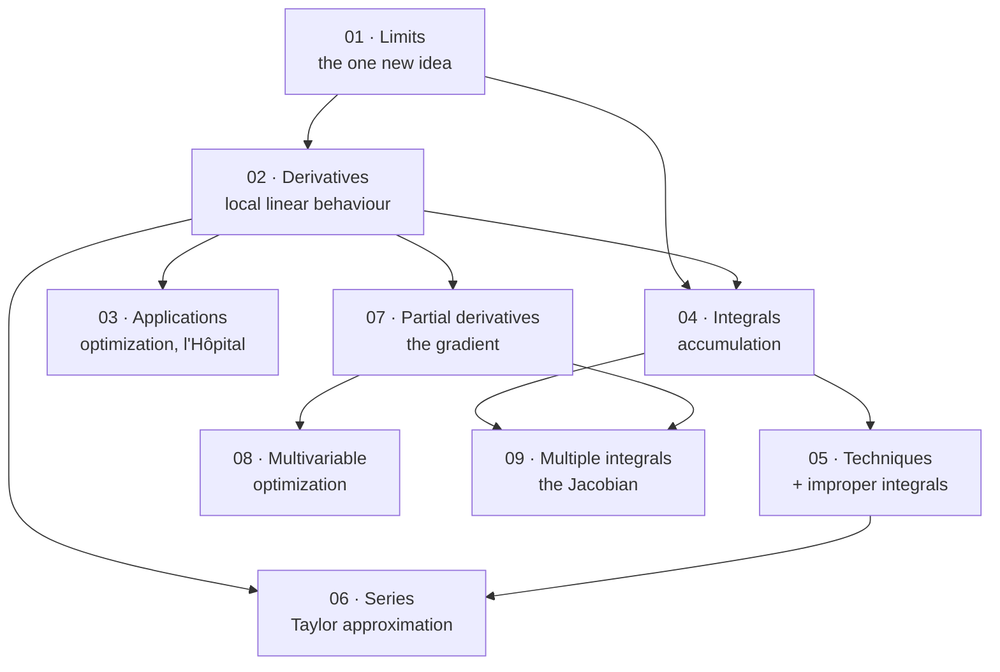

# Calculus — Map of Content

> [!warning] Read this first — the scope of these notes is my own editorial decision
> **There are no lecture slides for this subject.** The vault contains two textbooks — **Stewart, Clegg & Watson, *Calculus: Early Transcendentals* 9e** (17 chapters, 1421 pages) and the **Multivariable** volume, which is chapters 10–16 of the same book reprinted. **Nothing indicates which chapters the course covers.**
>
> **Stewart at full length is a two- or three-semester sequence.** Covering all 17 chapters would produce notes nobody reads, most of them on material a Data Science degree never uses again. **I have therefore scoped by *downstream necessity*: what do the other subjects in this vault actually require?**
>
> | Needed by | Calculus content |
> |---|---|
> | [[Probability Theory/contents/00-Index\|Probability]] | integration, **improper integrals**, series, **Jacobians and change of variables** |
> | [[Mathematical Statistics/contents/00-Index\|Math Stats]] | the same, plus Taylor expansion |
> | [[Optimization/contents/00-Index\|Optimization]] | **gradients, Hessians, Lagrange multipliers**, Newton's method |
> | [[Machine Learning/contents/00-Index\|Machine Learning]] | **the chain rule** (backpropagation), gradients, convexity |
> | [[Econometrics/contents/00-Index\|Econometrics]] | Taylor approximation, partial derivatives, elasticities |
>
> **That determines the nine chapters below.** See "What is not covered, and why" for the eight Stewart chapters left out and the reasons.
>
> **Confirm this against the real syllabus.**

---

## Chapters

| # | Chapter | Stewart | Status | One-line description |
|---|---|---|---|---|
| 01 | [[01 - Functions, Limits and Continuity]] | 1–2 | ✅ | Functions, inverses and logs, **the limit and why it ignores $f(a)$**, **why numerical tables lie**, limit laws, the squeeze theorem, $\varepsilon$–$\delta$, continuity and the **IVT**, limits at infinity |
| 02 | [[02 - Derivatives]] | 2.7–2.8, 3 | ✅ | The derivative as **linear approximation**, the rules, **the chain rule and backpropagation**, implicit and logarithmic differentiation, **differentials and error propagation**, differentiable vs $C^1$ |
| 03 | [[03 - Applications of Differentiation]] | 4 | ✅ | EVT → Fermat → Closed Interval Method, the **MVT** as the local-to-global bridge, concavity, **l'Hôpital and the growth hierarchy**, **optimization**, **Newton's method and quadratic convergence** |
| 04 | [[04 - Integrals]] | 5 | ✅ | Riemann sums, **signed** area, **both halves of the Fundamental Theorem**, indefinite integrals, the **Net Change Theorem**, average value, **substitution** |
| 05 | [[05 - Techniques of Integration]] | 7 | ✅ | **By parts** and LIATE, trigonometric substitution, **partial fractions**, strategy, **numerical integration and error exponents**, **improper integrals and the $p$-test** |
| 06 | [[06 - Sequences, Series and Taylor Approximation]] | 11 | ✅ | Convergence tests and why $a_n\to0$ is not enough, absolute vs conditional, power series, **the six standard Maclaurin series**, **Taylor's remainder** and why convergence to $f$ is a separate question |
| 07 | [[07 - Partial Derivatives and the Gradient]] | 14.1–14.6 | ✅ | Level curves, **path-dependent limits**, partials and **Clairaut**, tangent planes, **the chain rule as a Jacobian product (backpropagation)**, **the gradient**: steepest ascent and normal to level sets |
| 08 | [[08 - Multivariable Optimization]] | 14.7–14.8 | ✅ | Critical points, **saddle points** and why they dominate in high dimensions, the **second-derivative test as a Hessian eigenvalue test**, boundaries, **Lagrange multipliers** and $\lambda$ as a shadow price |
| 09 | [[09 - Multiple Integrals and Change of Variables]] | 15 | ✅ | Fubini and the **choice** of order, general regions, polar/cylindrical/spherical, **the Gaussian integral $\sqrt\pi$**, **the Jacobian**, joint densities and the multivariate normal's constant, **the curse of dimensionality** |

---

## How the subject fits together

**Four phases:**

1. **The limit (01).** One genuinely new idea; everything else in the subject is a limit wearing a costume.
2. **Differentiation (02–03).** The derivative is **local linear approximation**, and chapter 3 spends its whole length exploiting that.
3. **Integration and series (04–06).** Integration is accumulation; the **Fundamental Theorem** says it undoes differentiation. Taylor series then say a function *is* its derivatives.
4. **Several variables (07–09).** The same three ideas — limit, derivative, integral — with more than one input. **This is the half that data science actually uses.**

> [!tip] Where a data-science reader should spend the effort
> **§3.4 (chain rule), §11.10 (Taylor series), §14.6 (gradient), §14.7–14.8 (optimization and Lagrange) and §15.9 (Jacobian).** Those five sections are load-bearing for the rest of the degree. **Trigonometric substitution and curve sketching are not** — do enough to pass and move on.

---

## The three ideas the subject is really about

> [!important] 1. The derivative is a *linear approximation*, not a slope
> $$f(a+h)\approx f(a)+f'(a)h$$
>
> **"Slope of the tangent" is the picture; "best linear approximation near $a$" is the definition that generalises.** In several variables the slope picture fails entirely and this one survives:
> $$f(\mathbf a+\mathbf h)\approx f(\mathbf a)+\nabla f(\mathbf a)\cdot\mathbf h$$
>
> **Everything follows from this reading.** The chain rule is "compose the approximations"; Newton's method is "solve the approximation instead"; gradient descent is "step where the approximation says to"; Taylor series is "keep going past the linear term".

> [!important] 2. The Fundamental Theorem is genuinely surprising
> $$\frac{d}{dx}\int_a^x f(t)\,dt=f(x)\qquad\text{and}\qquad \int_a^b f(x)\,dx=F(b)-F(a)$$
>
> **Two problems that look unrelated — finding tangents and finding areas — turn out to be inverse to each other.** Nothing in either definition suggests this.
>
> **The practical consequence is the entire technique of integration:** to compute an area, *guess a function whose derivative is the integrand*. That is why chapter 5 is a list of tricks rather than an algorithm — differentiation is mechanical and its inverse is not.

> [!important] 3. Local information determines global behaviour — sometimes
> **Taylor's theorem says the derivatives at one point can reconstruct the function everywhere** (within the radius of convergence). **The Mean Value Theorem says the derivative controls the function's total change.**
>
> **But "sometimes" is doing work.** $f(x)=e^{-1/x^2}$ has *every* derivative zero at 0 and is not zero anywhere else — its Taylor series converges, to the wrong function. **Knowing when local determines global is most of what the theory is for.**

---

## Key results

$$\lim_{h\to0}\frac{f(a+h)-f(a)}{h}=f'(a)\qquad\qquad \frac{d}{dx}\big[f(g(x))\big]=f'(g(x))\,g'(x)$$

$$\boxed{\text{FTC: }\ \frac{d}{dx}\int_a^xf=f(x)\quad\text{and}\quad\int_a^bf=F(b)-F(a)}$$

$$\int u\,dv=uv-\int v\,du\qquad\qquad \int f(g(x))g'(x)\,dx=\int f(u)\,du$$

$$\boxed{f(x)=\sum_{n=0}^{\infty}\frac{f^{(n)}(a)}{n!}(x-a)^n}\qquad\qquad |R_n(x)|\le\frac{M}{(n+1)!}|x-a|^{n+1}$$

$$\nabla f=\left(\frac{\partial f}{\partial x_1},\dots,\frac{\partial f}{\partial x_n}\right)\qquad D_{\mathbf u}f=\nabla f\cdot\mathbf u\qquad \boxed{\nabla f=\lambda\nabla g}$$

$$\iint_R f(x,y)\,dA=\iint_S f\big(x(u,v),y(u,v)\big)\left|\frac{\partial(x,y)}{\partial(u,v)}\right|du\,dv$$

---

## The mistakes that cost the most marks

1. **Forgetting the chain rule's inner derivative.** $\frac{d}{dx}\sin(x^2)=2x\cos(x^2)$, not $\cos(x^2)$.
2. **Treating $\frac{dy}{dx}$ as a fraction** when it is not one — legitimate in separable ODEs and substitution, illegitimate almost everywhere else.
3. **Forgetting $+C$**, and forgetting to change the limits when substituting in a definite integral.
4. **Applying l'Hôpital to a form that is not indeterminate** — it gives wrong answers, not merely useless ones.
5. **Confusing "the series converges" with "the series converges to $f$".** Taylor series need a remainder estimate.
6. **Testing convergence with the wrong test**, especially using the $n$th-term test to prove convergence (it can only prove divergence).
7. **Assuming $f_{xy}=f_{yx}$ without noting that continuity is required** (Clairaut's theorem).
8. **Using the ordinary second-derivative test in several variables.** The test is on the *discriminant* $D=f_{xx}f_{yy}-f_{xy}^2$, and $D<0$ means a saddle, which has no single-variable analogue.
9. **Forgetting the absolute value on the Jacobian**, and inverting it the wrong way round.
10. **Reversing the order of integration without redrawing the region.** The new limits are almost never the old ones swapped.

---

## What is not covered, and why

| Stewart | Topic | Why excluded |
|---|---|---|
| **6** | Applications of Integration (volumes, work, arc length) | Geometry and physics; **no downstream subject in this vault uses them.** §6.1 (areas between curves) is covered inside ch. 04. |
| **8** | Further Applications (surface area, physics, economics) | Same. **§8.5 (Probability) *is* relevant but is done properly in [[Probability Theory/contents/05 - Continuous Random Variables\|Probability ch. 05]]**, so it is cross-linked rather than repeated. |
| **9, 17** | Differential Equations | A subject in its own right. **The one result a DS reader needs — that the solution space of a linear homogeneous ODE is a vector space of dimension $n$ — is in [[Linear Algebra/contents/06 - Vector Spaces\|Linear Algebra ch. 06]].** |
| **10** | Parametric Equations and Polar Coordinates | **Polar coordinates *are* covered**, inside ch. 09, because double integrals need them. The rest (Bézier curves, conic sections) is not used downstream. |
| **12–13** | Vectors, Vector Functions | **Fully covered by [[Linear Algebra/contents/04 - Vector Geometry\|Linear Algebra ch. 04]]** — dot and cross products, lines and planes. Repeating them here would be pure duplication. |
| **16** | Vector Calculus (Green, Stokes, divergence) | Beautiful and essential for physics and engineering; **used nowhere in a Data Science curriculum.** |

**Also omitted throughout:** Stewart's *Applied Projects*, *Discovery Projects*, *Writing Projects* and *Problems Plus*. **Two exceptions are folded into the notes** because they connect directly to other subjects: **the Gini index** (§6.1's project — see [[Probability Theory/contents/08 - Limit Theorems|Probability ch. 08]]) and **the Cobb–Douglas production function** (§14.3's project — see [[Microeconomics/contents/00-Index|Microeconomics]]).

---

## Cross-subject links

- [[Probability Theory/contents/00-Index|Probability Theory]] — **ch. 05 onward is applied integration**: densities integrate to 1, expectations are integrals, and **improper integrals are unavoidable** (every distribution on $(0,\infty)$ or $\mathbb{R}$). **The Jacobian of ch. 09 is the change-of-variables formula for densities** ([[Probability Theory/contents/06 - Jointly Distributed Random Variables|Probability ch. 06 §7]]), and **series are how the Poisson and geometric distributions sum to 1**.
- [[Mathematical Statistics/contents/00-Index|Mathematical Statistics]] — moment generating functions are power series; the delta method is a first-order Taylor expansion; maximum likelihood is ch. 03 and ch. 08 optimization.
- [[Optimization/contents/00-Index|Optimization]] — **ch. 08 is its first chapter.** Gradients, Hessians, definiteness and Lagrange multipliers are the entire foundation, and Newton's method (ch. 03) is the prototype iterative algorithm.
- [[Machine Learning/contents/00-Index|Machine Learning]] — **backpropagation is the chain rule** applied to a composition of hundreds of functions; gradient descent is $\mathbf x\leftarrow\mathbf x-\eta\nabla f$; a loss surface's curvature is its Hessian.
- [[Linear Algebra/contents/00-Index|Linear Algebra]] — **the Hessian is symmetric, hence orthogonally diagonalizable**, so its eigenvalues classify critical points; the Jacobian's determinant is the volume factor of [[Linear Algebra/contents/03 - Determinants and Diagonalization|Linear Algebra ch. 03]].
- [[Econometrics/contents/00-Index|Econometrics]] — elasticities are logarithmic derivatives; the log-linear model's interpretation is a first-order Taylor expansion; asymptotic theory is limits.
- [[Microeconomics/contents/00-Index|Microeconomics]] — marginal anything is a derivative; utility maximisation subject to a budget constraint **is** Lagrange multipliers, and $\lambda$ is the marginal utility of income.

---

## ⚠️ Source-material issues

> [!warning] Textbook only — no slides
> - **There are no lecture slides.** Chapter scope, emphasis and exercise choice are **all my own editorial decisions.**
> - **Every end-of-chapter exercise in these notes is my own construction**, built around results the text establishes. **All arithmetic has been independently verified.**

> [!warning] Two PDFs, one of them redundant
> **`Multivariable Calculus (2020)` is chapters 10–16 of the same book, reprinted as a separate volume.** It duplicates the second half of *Early Transcendentals* and adds nothing. **Page numbers differ between the two**, so a cross-reference from one will not resolve in the other. **These notes cite *Early Transcendentals* throughout.**

> [!warning] PDF extraction — **the mathematics is enciphered, and this is the worst extraction problem in the vault**
> **Stewart's maths font maps glyphs to the wrong codepoints, so every formula extracts as a substitution cipher.** This is not garbling — it is systematic, and once decoded the text is readable. **The key:**
>
> | Extracted | Actually means | Example |
> |---|---|---|
> | `s` … `d` | $(\ \dots\ )$ | `f sxd` $=f(x)$ |
> | `S` … `D` | large $(\ \dots\ )$ | `Sx2 2 2x D` |
> | `f` … `g` | $[\ \dots\ ]$ | `f21, 1g` $=[-1,1]$ |
> | **`−`** | **$=$** | `y − x2` is $y=x^2$ |
> | **` 1 `** (isolated, or as a superscript) | **$+$** | `x 1 4` is $x+4$; `x l 01` is $x\to0^+$ |
> | **` 2 `** (isolated, or as a superscript) | **$-$** | `x 2 1` is $x-1$; `x l 12` is $x\to1^-$ |
> | `l` | $\to$ | `x l a` |
> | `y` | $/$ (fraction) | `1ysx3 2 1d` is $\dfrac1{x^3-1}$ |
> | `<` | $\le$ | `0 < x < 5` |
> | `t` | the function **$t$** | *Stewart genuinely names his second function $t$, not $g$* |
> | `/H9266`, `/H9251`, … | $\pi$, $\alpha$, … | |
>
> > [!important]- The `1`/`2` ambiguity is the dangerous part
> > **Digits and the $+$/$-$ signs share codepoints, so `2` is sometimes the number two and sometimes a minus sign.** Spacing disambiguates: an **isolated** ` 2 ` between spaces is a minus, while `2x` or `x2` is a genuine digit or exponent.
> >
> > **Worked example.** `f sxd − x2 2 s2xy1000d` decodes as
> > $$f(x)=x^2-\frac{2^x}{1000}$$
> > — the first `2` is an exponent, the second is a minus, the third is a base. **Getting this wrong changes the answer, not just the notation.**
> >
> > **Consequence for these notes: nothing from this book is quoted without being recomputed.** Every worked example, limit, derivative, integral, series and critical point in these notes was independently evaluated before being written down.
>
> **Other failures:**
> - **Displayed formulas lose their fraction bars and exponents**, so $\frac{f(a+h)-f(a)}{h}$ arrives as three separate lines.
> - **Integral signs, limits of integration and $\sum$ bounds detach from their expressions.**
> - **Stewart is the most heavily illustrated book in this vault, and every figure is an image.** Graphs of functions, tangent-line pictures, Riemann-sum rectangles, contour maps, solids of revolution and every region of integration are **entirely lost**. **For a subject taught through pictures this is the most serious extraction problem in the vault** — I reconstruct the geometric content in prose and flag each place where a figure carried an argument.
> - **Marginal notes and the "Discovery/Applied Project" boxes interleave with the body text**, so the extraction mixes them into paragraphs mid-sentence.

> [!warning] Errata — defects found in the textbook
> **Every numeric claim in these notes was independently recomputed with `sympy`, `numpy` or exact rational arithmetic before being written down.**
>
> **The headline result is a negative one: across all nine chapters, no mathematical error was found in Stewart.** This is the cleanest textbook in the vault — compare the ten-plus genuine defects in [[Linear Algebra/contents/00-Index|Nicholson]] and the five in [[Probability Theory/contents/00-Index|Ross]]. **A 9th-edition, three-author, mass-market calculus text has been proofread very hard.**
>
> **What was found instead is entirely extraction damage**, and it is severe enough to be dangerous:
>
> | Where | What the extraction does | Consequence |
> |---|---|---|
> | **Everywhere** | The glyph cipher above; `1`/`2` are ambiguous between digits and signs | **Nothing can be quoted without recomputation** |
> | **ch. 09 (§15)** | Integral signs, their limits and the differentials all detach; stacked limits sometimes invert (§15.3 Example 4 prints its lower limit on top) | An iterated integral arrives as a column of loose numbers with no way to tell which limit belongs to which sign |
> | **ch. 09 (§15.9)** | The spherical-Jacobian expansion on p. 1115 shows a duplicated $\theta$ inside a $2\times2$ determinant | Artefact only — the printed result $-\rho^2\sin\varphi$ recomputes correctly |
> | **ch. 08 (§14.7)** | The second-derivative test's discriminant runs together into unbroken letters, and the isolated ` 2 ` is a minus | The formula had to be reconstructed from worked examples |
> | **All chapters** | **Every figure is an image and every one is lost** | For §15.3 (drawing regions) and §15.9 (the Jacobian derivation) **the figures *were* the argument** |
>
> **Two exercise sets cannot be attempted at all** because their data exists only inside images: §15.1's Colorado snowfall and temperature contour maps (Exercises 7–8, and Example 9), and the swimming-pool depth table (Exercise 6).

#calculus #index #moc
