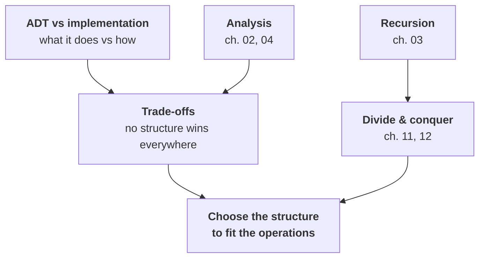

# Data Structures and Algorithms — Map of Content

> [!warning] Read this first — the scope of these notes is my own editorial decision
> **There are no lecture slides for this subject.** The vault contains **two textbooks**:
>
> | Book | Pages | Chapters | Role |
> |---|---|---|---|
> | **Goodrich, Tamassia & Goldwasser**, *Data Structures and Algorithms in Python* (2013) | 770 | 15 | **The spine.** More rigorous, far more complete, and the standard text |
> | **Lambert**, *Fundamentals of Python: Data Structures* 2e (2019) | 450 | 12 | Gentler, narrower — **but see the source note below: its code is the usable one** |
>
> **My scope decision: 13 chapters covering Goodrich 1–14, plus §15.3 (B-trees) folded into ch. 10.**
>
> **Excluded: Goodrich §§15.1–15.2 (memory management and the memory hierarchy) and Appendices A–B.** Reasons in the [[#What is not covered, and why|table below]].
>
> **Confirm this against the real syllabus.**

---

> [!note] The boundary with Discrete Mathematics — already settled, and load-bearing
> [[Discrete Mathematics/contents/00-Index|Discrete Mathematics]] is **complete**, and the two subjects were deliberately split:
>
> **Discrete Maths owns the mathematics. This subject owns the implementations.**
>
> | Topic | Theory lives in | Practice lives here |
> |---|---|---|
> | Big-O, $\Omega$, $\Theta$ | [[Discrete Mathematics/contents/04 - Algorithms and Their Analysis\|DM ch. 04]] — definitions, the $\exists C\forall n$ quantifier structure, proofs | ch. 02 — applying it, **and measuring it** |
> | Recurrences | [[Discrete Mathematics/contents/07 - Recurrence Relations\|DM ch. 07]] — iteration, characteristic equations, closed forms | ch. 03, 11 — reading them off code |
> | Induction & recursion | [[Discrete Mathematics/contents/02 - Proofs and Mathematical Induction\|DM ch. 02]] — proof technique, strong form | ch. 03 — writing and debugging recursive functions |
> | Trees, graphs | [[Discrete Mathematics/contents/08 - Graph Theory\|DM ch. 08]]–[[Discrete Mathematics/contents/09 - Trees\|09]] — Euler/Hamiltonian, planarity, isomorphism, **correctness proofs of Dijkstra, Prim, Kruskal** | ch. 07, 13 — adjacency lists, BFS/DFS, runnable implementations |
> | Sorting lower bound | [[Discrete Mathematics/contents/09 - Trees\|DM ch. 09]] §8 — **$\Omega(n\lg n)$ proved by decision trees** | ch. 11 — the algorithms that meet it |
> | Hash collisions | [[Discrete Mathematics/contents/06 - Counting Methods and the Pigeonhole Principle\|DM ch. 06]] — pigeonhole makes them inevitable | ch. 09 — **what to actually do about them** |
> | Max-flow, matching | [[Discrete Mathematics/contents/10 - Network Flows and Matching\|DM ch. 10]] — max-flow/min-cut, Hall's theorem | ch. 13 — only in passing |
>
> **So these notes cross-link rather than re-derive.** Where Goodrich proves something Discrete Maths already proved, this subject states the result, points there, and spends its space on the code instead. **Amortised analysis (ch. 04) is the one major analytical topic Discrete Maths does not cover**, so it is developed properly here.

---

## Chapters

| # | Chapter | Source | Status | One-line description |
|---|---|---|---|---|
| 01 | [[01 - Python and Object-Oriented Foundations]] | G1–2 | ✅ | Names vs objects and **aliasing**, the mutable-default and `[[0]*n]*m` traps, encapsulation by convention, **special methods** (and how `__len__`+`__getitem__` buy iteration for free), iterators vs **generators**, override vs extend, and **ADTs enforced by an ABC** |
| 02 | [[02 - Algorithm Analysis in Practice]] | G3 | ✅ | Experimental vs theoretical analysis, **the seven functions**, reading loop nests (depth is an upper bound), **the hidden-loop trap** (`sum(S[0:j])`), and **the doubling experiment** — ratios of 2/4/8 measured and confirmed |
| 03 | [[03 - Recursion]] | G4 | ✅ | Base case and progress, four recursion shapes, **the Fibonacci disaster** (29 051× speed-up; $\phi^2$ growth measured), **depth is space**, why Python has no tail-call optimisation, **memoisation as top-down DP** |
| 04 | [[04 - Array-Based Sequences and Amortised Analysis]] | G5 | ✅ | Referential vs compact arrays, **dynamic arrays and the doubling strategy**, **amortised analysis** (and the measured 5 084× spike proving it is *not* an average), why constant growth is $\Theta(n^2)$, and the measured cost of every list operation |
| 05 | [[05 - Stacks, Queues and Deques]] | G6 | ✅ | LIFO/FIFO/both-ends, delimiter matching, **why `list.pop(0)` is fatal**, **the circular buffer** and its three easy-to-miss details, `deque` vs `list` (46×→172×), and **BFS/DFS as one algorithm differing only by container** |
| 06 | [[06 - Linked Lists]] | G7 | ✅ | Singly and doubly linked structures, **`__slots__` (48 vs 344 bytes)**, tail-reference special cases, **sentinels remove every boundary case**, and **the trade-off measured in four dimensions** — including why the locality advantage is only ~15% in Python |
| 07 | [[07 - Trees and Traversals]] | G8 | ✅ | Terminology (depth up, height down), the linked representation, **four traversals as lazy generators**, choosing one by data flow, **expression trees** and why infix is ambiguous, the $O(n^2)$ height trap, and **why balance will matter** |
| 08 | [[08 - Priority Queues and Heaps]] | G9 | ✅ | The ADT and why both list versions are $O(n^2)$, **a tree with no pointers** (index arithmetic), sift up/down, **heapify is $O(n)$ — but measurement showed insertion winning on random data**, heapsort, and `heapq`'s two traps |
| 09 | [[09 - Maps, Hash Tables and Skip Lists]] | G10 | ✅ | How `dict` really works: **hash functions, collision handling, load factors and rehashing**; sorted maps and **skip lists** |
| 10 | [[10 - Search Trees]] | G11 + G15.3 | ✅ | BSTs and their degeneracy, **AVL, splay and red–black trees**, and **B-trees** — what a database index actually is |
| 11 | [[11 - Sorting and Selection]] | G12 | ✅ | Merge sort, quicksort and its pivot problem, **why the $\Omega(n\lg n)$ bound is met**, linear-time sorts that escape it, and quickselect |
| 12 | [[12 - Text Processing and Dynamic Programming]] | G13 | ✅ | Pattern matching (brute force, Boyer–Moore, KMP), **tries**, and **dynamic programming** — LCS and edit distance |
| 13 | [[13 - Graph Algorithms]] | G14 | ✅ | Adjacency lists vs matrices, **BFS/DFS as code**, topological sort, **Dijkstra**, and minimum spanning trees implemented |

---

## The five ideas the subject runs on



1. **Separate the ADT from the implementation.** A *stack* is a contract — push, pop, top. A *list-backed stack* is one way to honour it. Nearly every chapter is one ADT and two or three implementations, and **the interesting content is always the comparison**, not any single implementation.
2. **Every structure is a trade-off; none dominates.** Arrays give $O(1)$ indexing and $O(n)$ insertion; linked lists the reverse. Hash tables give $O(1)$ expected lookup and no ordering; balanced trees give $O(\log n)$ and full ordering. **The right question is never "which is best" but "which operations do I actually perform?"**
3. **Analysis is what makes the choice rational** — and it must be *measured* as well as derived, because constant factors and memory locality decide real performance ([[Discrete Mathematics/contents/04 - Algorithms and Their Analysis|DM ch. 04]] deliberately discards exactly the information that decides small cases).
4. **Amortised is not average.** A single `list.append` can cost $O(n)$; a sequence of $n$ of them costs $O(n)$ total. That is a worst-case guarantee about sequences, not a probabilistic claim — ch. 04.
5. **Recursion and divide-and-conquer are one technique** ([[Discrete Mathematics/contents/02 - Proofs and Mathematical Induction|DM ch. 02]]), and the recurrence that describes the recursion *is* the running time ([[Discrete Mathematics/contents/07 - Recurrence Relations|DM ch. 07]]).

---

## The comparison table the whole subject is building towards

*(Filled in as chapters are written; expected complexities, to be verified by measurement.)*

| Structure | Access | Search | Insert | Delete | Ordered? | Chapter |
|---|---|---|---|---|---|---|
| Dynamic array (`list`) | $O(1)$ | $O(n)$ | $O(1)^*$ amortised at end, $O(n)$ middle | $O(n)$ | by position | 04 |
| Linked list | $O(n)$ | $O(n)$ | $O(1)$ given the position | $O(1)$ given the position | by position | 06 |
| Stack / queue / deque | — | — | $O(1)$ | $O(1)$ | — | 05 |
| Binary heap | $O(1)$ min only | $O(n)$ | $O(\log n)$ | $O(\log n)$ min only | partial | 08 |
| Hash table (`dict`) | — | $O(1)$ expected, $O(n)$ worst | $O(1)$ expected | $O(1)$ expected | **no** | 09 |
| Skip list | — | $O(\log n)$ expected | $O(\log n)$ expected | $O(\log n)$ expected | **yes** | 09 |
| Balanced BST (AVL/red–black) | — | $O(\log n)$ worst | $O(\log n)$ worst | $O(\log n)$ worst | **yes** | 10 |
| B-tree | — | $O(\log_B n)$ **disk reads** | $O(\log_B n)$ | $O(\log_B n)$ | yes | 10 |

**The last row is the one that explains databases**, and it is why ch. 10 pulls B-trees forward from Goodrich's memory-management chapter.

---

## What is not covered, and why

| Source | Topic | Why excluded |
|---|---|---|
| **G §§15.1–15.2** | Memory management, the memory hierarchy, caching, external-memory algorithms | **Computer architecture, not data structures.** The one part with direct algorithmic consequence — **B-trees (§15.3)** — is kept and moved into ch. 10, where it belongs with the other search trees. The caching material is genuinely interesting for performance work; **flagged in ch. 02 as the reason measured times diverge from predicted ones.** |
| **G Appendix A** | Character strings in Python | Reference material, and ch. 01 covers what is needed. |
| **G Appendix B** | Useful mathematical facts (summations, logs, probability) | **Entirely owned by [[Discrete Mathematics/contents/00-Index\|Discrete Mathematics]]** (ch. 02, 04, 06, 07) and [[Probability Theory/contents/00-Index\|Probability Theory]]. |
| G ch. 1 (most) | The Python primer — expressions, control flow, files, exceptions, iterators, comprehensions, modules | **Compressed into ch. 01.** A Data Science major is assumed to have Python; ch. 01 keeps only what the *rest of this subject* needs — classes, special methods, iterators — plus the traps (mutable default arguments, aliasing) that bite when implementing data structures. **Note this is the only place in the vault that teaches core Python**, since `Programming for Data Science (Python)` is blocked for lack of material. |
| Lambert ch. 5–6 | Interfaces, implementations, inheritance and abstract classes as separate chapters | **Folded into ch. 01**, where the OOP machinery is introduced once and then used. |
| — | Goodrich's project/extension exercises | They assume a course infrastructure. Exercises here are my own, with verified answers and runnable code. |

---

## Cross-subject links

- **[[Discrete Mathematics/contents/00-Index|Discrete Mathematics]]** — the theory half of this subject. See the boundary table above; it is the most important cross-link in the vault.
- **[[Database Management Systems/contents/00-Index|Database Management Systems]]** — **ch. 10's B-trees are what a database index *is*.** Coronel & Morris is a business-school text and will not cover the internals, so this is where they live.
- **[[Data Preparation and Visualization/contents/01 - Getting Started with Pandas|Data Prep & Visualization]]** — assumes the Python fluency ch. 01 builds; and pandas' performance characteristics are ch. 04's dynamic arrays and ch. 09's hash tables underneath.
- **[[Optimization/contents/09 - Linear Programming and the Simplex Method|Optimization]]** — ch. 11's greedy and ch. 12's dynamic programming are the combinatorial cousins of the continuous methods there; **Optimization ch. 12 §9's mention of intractability is why ch. 13 stops where it does.**
- **[[Basic Programming (C++)/contents/00-Index|Basic Programming (C++)]]** — the same structures with manual memory management. **Cross-link where the language difference is the lesson**: pointers versus references, `delete` versus garbage collection, and why C++ `std::vector` is ch. 04's dynamic array by another name.
- **[[Machine Learning/contents/00-Index|Machine Learning]]** — ch. 07's trees and ch. 12's dynamic programming are the substrate for decision trees and for the DP in [[Machine Learning/contents/03 - Planning by Dynamic Programming|RL's value iteration]].

---

## Source notes

> [!warning] The decisive finding: **Goodrich's code cannot be transcribed — Lambert's can**
> This is the most consequential extraction discovery in the vault, because in this subject the code *is* the content.
>
> **Goodrich's Python is destroyed by extraction, in three compounding ways.** A Code Fragment arrives like this:
> ```
> 1 class GameEntry:
> 4 def  init  (self,n a m e ,s c o r e ) :
> 5 self.  name = name
> ```
> | Damage | Consequence |
> |---|---|
> | **All indentation is lost** | In Python this is not cosmetic — it is **syntactically fatal** and the block structure is unrecoverable without understanding the code |
> | **Double underscores render as spaces** | `__init__` → `init`, `_name` → `name`, `get_score` → `get score`. **The worst of the three, because the result looks plausible and is wrong** |
> | **Identifiers are space-separated** | `(self,n a m e ,s c o r e )`, and operators break up: `*=` → `=` |
>
> Line numbers *do* survive, which helps to see where lines begin.
>
> **Lambert's Python extracts perfectly.** The same kind of listing arrives as:
> ```python
> class SavingsAccount(object):
>     """This class represents a savings account
>     with the owner's name, PIN, and balance."""
>
>     def __init__(self, name, pin, balance = 0.0):
>         self.name = name
> ```
> **Indentation, dunders, docstrings and identifiers all intact.**
>
> **So the two books are used for different things:**
> - **Goodrich for structure, theory, analysis and coverage** — its *prose* extracts cleanly, and it is the more rigorous and complete book;
> - **Lambert for code**, wherever the two cover the same structure (it covers roughly Goodrich 1–8, 10, 14 — no heaps chapter, no balanced trees, no text processing);
> - **my own implementations everywhere else** — which is most of the advanced material: heaps, AVL/splay/red–black, skip lists, hash-table internals, B-trees, KMP, and dynamic programming.
>
> **Every code listing in these notes is therefore written from understanding and then RUN.** That is this subject's version of the vault's verify-every-number rule, and here it is not optional: reconstructed code that merely *looks* right is exactly the failure mode the extraction produces.

> [!note] Other extraction notes
> - **Goodrich's prose extracts well** — real text, no glyph cipher. Mathematical notation in the analysis chapters is generally intact.
> - **Lambert's table of contents is caps-mangled** (`cHAP te R 1 b asic Python Programming`) and every page carries a Cengage copyright banner that must be stripped. Its body text is fine.
> - **All figures in both books are images and are lost** — every diagram of a linked list, tree rotation, heap, hash table and graph. **This is severe for ch. 06–10, where the pictures usually carry the argument.** The notes compensate by showing the *state of the data structure* as printed output from running code, which is arguably better than a static diagram and is something only this subject can do.
> - Goodrich page $n$ = PDF page $n+22$ (approximately; the front matter is roman-numbered).

> [!warning] Errata and source problems
> *(Filled in as chapters are written. Every complexity claim is checked by measurement and every code listing is run before it goes in.)*
>
> | Where | Issue | Status |
> |---|---|---|
> | — | *nothing found yet* | — |

**A note on what makes this subject different.** Every other subject in this vault is verified by *recomputation* — a number is checked with `sympy` or `scipy`. Here the unit of verification is a **program**: does it run, does it produce the right answer on edge cases (empty, one element, duplicates), and does its measured running time follow the predicted curve? **A data-structures note whose code has not been executed is worth very little**, and the extraction damage described above makes that doubly true.

#dsa #data-structures #algorithms #index #moc
