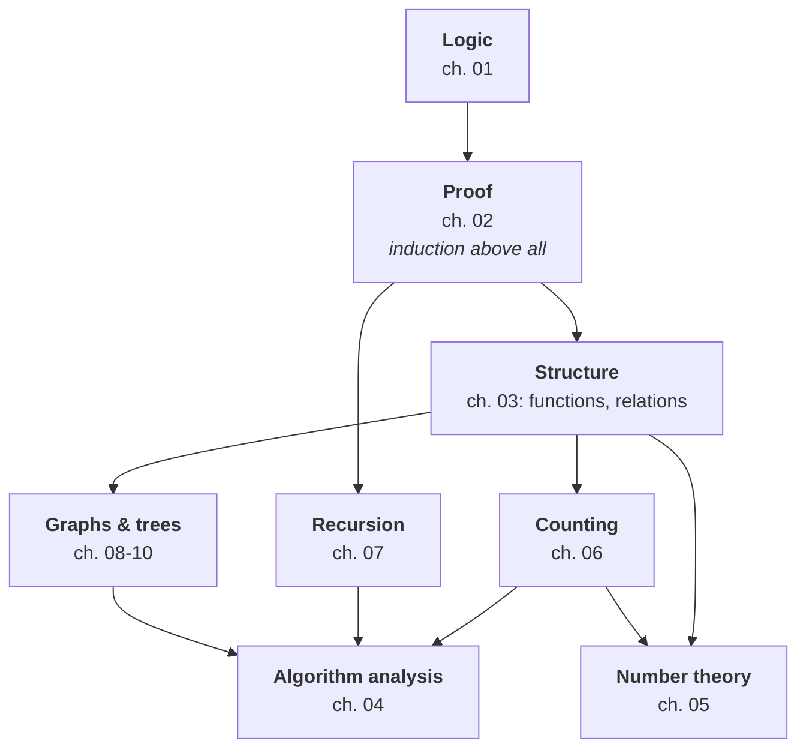

# Discrete Mathematics — Map of Content

> [!warning] Read this first — the scope of these notes is my own editorial decision
> **There are no lecture slides for this subject.** The vault contains **one textbook**: Johnsonbaugh, *Discrete Mathematics*, 8th edition — **773 pages, 12 chapters**. Nothing indicates which chapters the course covers.
>
> **My scope decision: Johnsonbaugh chapters 1–10, one note per chapter.** The mapping is 1:1, so note $n$ is book chapter $n$ — easy to hold in your head.
>
> **Excluded: chapters 11 (Boolean Algebras and Combinatorial Circuits) and 12 (Automata, Grammars, and Languages)**, with reasons in the [[#What is not covered, and why|table below]].
>
> **Why that cut.** Johnsonbaugh's own preface describes the book as supporting "a one- or two-term introductory course," and chapters 11–12 are where it stops being *discrete mathematics* and becomes *digital logic* and *theory of computation* — two distinct downstream subjects. Chapters 1–10 are the coherent mathematical core, and every one of them is load-bearing for a Data Science degree. It is also a natural stopping point: ch. 10 ends the graph-theoretic arc that ch. 8 begins.
>
> **Confirm this against the real syllabus.** If the course covers finite-state machines or circuit synthesis, these notes do not.

---

## Chapters

| # | Chapter | Book | Status | One-line description |
|---|---|---|---|---|
| 01 | [[01 - Sets and Logic]] | J1 | ✅ | Sets and their algebra, the two-inclusion proof, propositions, **the five phrasings of $p\to q$**, converse vs contrapositive, **$\lnot(p\to q)\equiv p\land\lnot q$**, validity vs truth, the seven rules of inference and two fallacies, **quantifiers and why $\forall x\exists y\ne\exists y\forall x$** |
| 02 | [[02 - Proofs and Mathematical Induction]] | J2 | ✅ | Mathematical systems, direct proof and its two failure modes, counterexamples, **contradiction vs contrapositive**, cases and equivalence, **induction** (sums, divisibility, counting, tilings, loop invariants), **the strong form and why it needs $p$ basis steps**, **well-ordering** and the Quotient–Remainder Theorem |
| 03 | [[03 - Functions, Sequences and Relations]] | J3 | ✅ | Functions, `mod`/floor/ceiling, **check digits, hashing and PRNGs**, injective/surjective/bijective, sequences and strings, relations and **the four properties** ("not symmetric" ≠ antisymmetric), partial orders and topological sort, **equivalence relations *are* partitions**, matrices of relations and **$(A^k)_{ij}$ counts walks** |
| 04 | [[04 - Algorithms and Their Analysis]] | J4 | ✅ | Algorithm properties and traces, text search and insertion sort, **big-O / Ω / Θ** and **why the quantifier order $\exists C\,\forall n$ is the whole definition**, case vs bound as independent axes, the growth hierarchy, **recursion = divide and conquer**, correctness by induction (strong form for halving), and recurrences as cost |
| 05 | [[05 - Number Theory and Cryptography]] | J5 | ✅ | Divisors and primes, **the $\sqrt n$ bound and why it is still exponential in input size**, unique factorization, infinitely many primes, base representations and **repeated squaring**, **the Euclidean algorithm with its Fibonacci worst case** (Lamé), Bézout and modular inverses, **RSA end to end** |
| 06 | [[06 - Counting Methods and the Pigeonhole Principle]] | J6 | ✅ | Multiplication/addition principles and inclusion–exclusion, **the four core counts** (ordered? repeats?), $P(n,r)=C(n,r)r!$ as "divide by the symmetries", multiset permutations, **stars and bars**, the **Binomial Theorem proved by counting**, identities by **double counting**, and **the pigeonhole principle in three forms** |
| 07 | [[07 - Recurrence Relations]] | J7 | ✅ | Setting up recurrences, **solving by iteration**, the **characteristic equation** (distinct and repeated roots), **Binet's formula and where $\phi$ comes from**, and exact analyses of selection sort $\Theta(n^2)$, binary search $\Theta(\lg n)$ and **merge sort $n\lg n-n+1$** |
| 08 | [[08 - Graph Theory]] | J8 | ✅ | Graphs, $K_n$, bipartite (**iff no odd cycle**), paths/cycles/components, **the handshaking lemma**, **Euler cycles iff all degrees even** (Königsberg), **Hamiltonian cycles are NP-complete** and independent of Euler, Gray codes, **Dijkstra**, **$(A^k)_{ij}$ counts walks**, isomorphism invariants, **Euler's formula, $e\le3v-6$, and Kuratowski** |
| 09 | [[09 - Trees]] | J9 | ✅ | Free and rooted trees, **Huffman codes**, the **four equivalent characterisations** ($n-1$ edges), spanning trees, **Prim and Kruskal with the exchange argument**, full binary trees, **$h\ge\lg t$**, traversals as **prefix/infix/postfix**, and **the $\Omega(n\lg n)$ sorting bound — merge sort is optimal** |
| 10 | [[10 - Network Flows and Matching]] | J10 | ✅ | Transport networks and conservation of flow, supersource/supersink, **augmenting paths** (and why improperly oriented edges matter), cuts, **weak duality then max-flow/min-cut**, the algorithm's **free optimality certificate**, matching, **Hall's theorem**, and **max-flow/min-cut *as* LP duality** |

---

## The four ideas the whole subject runs on

1. **Logic is the grammar of every later statement.** Chapter 01 is not a warm-up; the difference between $\forall x\exists y$ and $\exists y\forall x$ is the difference between two theorems, and misreading a conditional is how proofs go wrong.
2. **Induction and recursion are the same idea seen from two directions.** A recursive definition builds upward; an inductive proof verifies downward. Chapters 02, 07 and 09 are one continuous thought, and **the closed form of a recurrence is exactly the complexity of the algorithm that generates it** (ch. 04, 07).
3. **Counting *is* the analysis.** Every average-case running time, every probability, every "how many ways" question reduces to chapter 06 — and it is the same machinery that [[Probability Theory/contents/01 - Combinatorial Analysis|Probability Theory ch. 01]] builds on.
4. **Graphs are the universal data model.** A relation on a finite set (ch. 03) *is* a directed graph (ch. 08); a hierarchy is a tree (ch. 09); a bipartite matching is an assignment problem (ch. 10). Almost anything discrete becomes a graph question if you look at it long enough.

---

## Key results worth memorising

| Result | Statement | Chapter |
|---|---|---|
| De Morgan's laws | $\overline{X\cup Y}=\overline X\cap\overline Y$, and the dual | 01 |
| Contrapositive | $p\to q$ is equivalent to $\lnot q\to\lnot p$ — **but *not* to its converse $q\to p$** | 01 |
| Quantifier negation | $\lnot\forall x\,P(x)\equiv\exists x\,\lnot P(x)$ | 01 |
| Induction | $P(1)$ and $\big(P(n)\to P(n+1)\big)$ give $P(n)$ for all $n\ge1$ | 02 |
| Inclusion–exclusion | $\|X\cup Y\|=\|X\|+\|Y\|-\|X\cap Y\|$ | 01, 06 |
| Counting | $P(n,r)=\frac{n!}{(n-r)!}$, $\ \binom nr=\frac{n!}{r!(n-r)!}$ | 06 |
| Binomial theorem | $(a+b)^n=\sum_{k=0}^n\binom nk a^{n-k}b^k$ | 06 |
| Pigeonhole | $n$ items in $k<n$ boxes ⟹ some box holds $\ge\lceil n/k\rceil$ | 06 |
| Euclidean algorithm | $\gcd(a,b)=\gcd(b,a\bmod b)$; runs in $O(\log\min(a,b))$ | 05 |
| Handshaking | $\sum_{v}\deg(v)=2\|E\|$ — so the number of odd-degree vertices is **even** | 08 |
| Euler circuit | Exists iff the graph is connected and **every** degree is even | 08 |
| Euler's formula | For a connected planar graph, $v-e+f=2$ | 08 |
| Tree edge count | A tree on $n$ vertices has exactly $n-1$ edges | 09 |
| Sorting lower bound | Any comparison sort needs $\Omega(n\log n)$ comparisons | 09 |
| Max-flow/min-cut | Maximum flow value $=$ minimum cut capacity | 10 |

---

## What is not covered, and why

| Book | Topic | Why excluded |
|---|---|---|
| **J11** | Combinatorial circuits, properties of circuits, **Boolean algebras**, Boolean functions and circuit synthesis | **This is digital logic, not discrete mathematics.** Its mathematical content — Boolean algebra — is *propositional logic in algebraic dress*, and [[01 - Sets and Logic\|ch. 01]] already covers the laws (commutativity, associativity, distributivity, De Morgan, complement) in both their set and propositional forms. What is left is AND/OR/NOT gate synthesis and minimisation, which belongs to a computer-architecture course. **If your syllabus includes Karnaugh maps or circuit minimisation, this chapter is missing.** |
| **J12** | Sequential circuits and finite-state machines, finite-state automata, **languages and grammars**, nondeterministic automata, the automata–language correspondence | **This is theory of computation.** It is a genuinely beautiful subject and a genuinely separate one — it presupposes nothing from ch. 1–10 and leads nowhere within them. **One partial regret: §12.3–12.5 is where regular expressions come from**, and regex is a daily tool for a data scientist (tokenisation, log parsing, validation — see [[Data Preparation and Visualization/contents/05 - String Manipulation and Time Series Data\|DPV ch. 05]]). The *practical* skill is covered there; the *theory* (that regular expressions, NFAs and DFAs all describe exactly the regular languages) is not. |
| **J §3.6** | Relational databases | **Covered, but briefly and with a pointer.** Johnsonbaugh's four pages are a teaser; [[Database Management Systems/contents/00-Index\|Database Management Systems]] owns the subject properly. Ch. 03 states the relational-model connection because it is genuinely illuminating — a database table *is* an $n$-ary relation — and stops there. |
| **J §8.8** | Instant Insanity | A recreational puzzle. Charming, examinable nowhere. |
| **J §9.9** | Game trees, minimax, alpha–beta pruning | **Summarised in ch. 09 rather than developed**, because [[Machine Learning/contents/08 - Integrating Learning and Planning\|Machine Learning ch. 08]] and [[Machine Learning/contents/10 - Case Study - RL in Classic Games\|ch. 10]] already cover game tree search — including MCTS, which superseded alpha–beta for Go. |
| Appendices A–C | Matrices; algebra review; pseudocode | **A is fully covered by [[Linear Algebra/contents/02 - Matrix Algebra\|Linear Algebra ch. 02]]**; B is high-school algebra; C is a pseudocode convention, restated where ch. 04 needs it. |
| — | All "Computer Exercises" | They assume a general-purpose language and add nothing the written exercises do not. Where an algorithm is worth running, ch. 04–10 give **Python**. |

---

## Cross-subject links

This is the most heavily connected subject in the vault — it is the shared foundation of half the degree.

- **[[Probability Theory/contents/01 - Combinatorial Analysis|Probability Theory ch. 01–02]]** — ch. 06 is the same counting theory. Ross is deeper on probability, Johnsonbaugh cleaner on the combinatorial identities. **Ch. 06 defers all serious probability there.**
- **[[Data Structures and Algorithms/contents/00-Index|Data Structures and Algorithms]]** — the closest neighbour, and **the boundary is set deliberately: this subject owns the mathematics, DSA owns the implementations.** So: ch. 04 defines big-O and proves complexity bounds; DSA applies it to specific structures. Ch. 07 solves recurrences in closed form; DSA uses the results for mergesort and quicksort. Ch. 08–09 treat graphs and trees as *mathematical objects* (Euler circuits, planarity, isomorphism, counting); DSA treats them as *data structures* (adjacency lists, BFS/DFS code, BST operations). **Dijkstra, Prim and Kruskal appear here in ch. 08–09 as theorems with correctness proofs, and in DSA as code.** Recorded in both indexes.
- **[[Linear Algebra/contents/02 - Matrix Algebra|Linear Algebra ch. 02–03]]** — ch. 03's matrices of relations and ch. 08's adjacency matrices are matrix algebra; **the number of walks of length $k$ is an entry of $A^k$**, which is matrix multiplication doing combinatorics.
- **[[Optimization/contents/10 - Duality|Optimization ch. 10]]** — **ch. 10's max-flow/min-cut theorem is a duality theorem**, and Optimization explicitly deferred it here. Reading them together is worthwhile: the min cut *is* the optimal dual solution.
- **[[Optimization/contents/09 - Linear Programming and the Simplex Method|Optimization ch. 09]]** — bipartite matching and the assignment problem are linear programs with integral optima.
- **[[Machine Learning/contents/02 - Markov Decision Processes|Machine Learning ch. 02]]** — a Markov chain is a weighted directed graph; ch. 08's reachability is its communicating-class structure.
- **[[Database Management Systems/contents/00-Index|Database Management Systems]]** — ch. 03's relations, functional dependencies and closures are the mathematics under normalisation.
- **[[Calculus/contents/06 - Sequences, Series and Taylor Approximation|Calculus ch. 06]]** — ch. 03's sequences and ch. 07's generating-function-adjacent methods; the discrete/continuous contrast is instructive in both directions.

---

## Source notes

> [!note] Extraction quality — the best textbook in the vault
> **Johnsonbaugh's PDF is born-digital with real Unicode mathematics.** `∈`, `∪`, `∩`, `⊆`, `∅`, `∀`, `∃`, `≡`, `→`, `¬`, set-builder braces and subscripts **all survive extraction intact.** After [[Machine Learning/contents/00-Index|Silver's Beamer slides]] this is the cleanest source in the vault, and a welcome change from [[Calculus/contents/00-Index|Stewart's glyph cipher]] and [[Linear Algebra/contents/00-Index|Nicholson's destroyed matrices]].
>
> Book page $n$ = **PDF page $n+21$**.
>
> Four quirks to handle:
>
> | What you see | What it is |
> |---|---|
> | `Johnsonbaugh-50623 book February 3, 2017 13:58` and a `k / k k / k` block atop every page | Running header and registration marks — **strip both before reading** |
> | `thatx ∈ A`, `Solving forx`, `setsA and B`, `iscalledthe intersectionofX andY` | **Spaces are lost at italic/maths font transitions.** The commonest artefact by far, and it also affects ordinary prose (`calculusisnotrequired`). Harmless once expected, but it makes text search unreliable — **search for a distinctive fragment, not a phrase** |
> | `x =− 3`, `X ̸=Y`, `x /∈ Z` | Minus signs migrate leftwards onto the `=`; `≠` extracts as `̸=` (combining slash) and `∉` as `/∈`. All recoverable |
> | `24 23 22 21 0 1 2` on a number line; `!2` | **Inside figures, `2` is a minus sign and `!` is a radical** — so that reads $-4,-3,-2,-1,0,1,2$ and $\sqrt2$. Same class of bug as [[Econometrics/contents/00-Index\|Wooldridge]]. **Body text is unaffected**; this appears only in figure labels |
> | `/Omega1`, `/Theta1` (ch. 04 on) | $\Omega$ and $\Theta$. So Definition 4.3.2 extracts as `f(n) = /Omega1(g(n))`. Harmless once known |
> | `lg n` | **$\log_2 n$, not $\log_{10}$ or $\ln$.** Johnsonbaugh states this once and uses it throughout; misreading it changes every logarithmic figure by a factor of $\ln2$ |
> | `A ∪A = U`, `(A ∪B) = A ∩B`, `A = A` | **⚠️ The most dangerous quirk in this book: overlines are silently deleted.** Set complement $\overline A$ extracts as plain `A`, so the complement laws, De Morgan's laws and the involution law all extract as statements that are **false as written** rather than visibly garbled. Read them as $A\cup\overline A=U$, $\overline{A\cup B}=\overline A\cap\overline B$, $\overline{\overline A}=A$. **Every complement in these notes was restored by hand from context** — and the same loss affects $\overline p$ / $\lnot p$ notation in the logic sections and, later, complement graphs in ch. 08 |
>
> **All figures are images and are lost** — Venn diagrams, graph drawings, tree diagrams, flow networks. For chapters 08–10 this is significant, because graph theory is taught through pictures. Where a figure carries the argument, the notes describe the object precisely enough to redraw it (vertex set, edge set, degrees) rather than gesturing at a lost picture.

> [!warning] Errata and source problems
> *(Filled in as chapters are written. Every numeric claim in these notes is independently recomputed before it goes in — the standing rule from the root `CLAUDE.md`.)*
>
> | Where | Issue | Status |
> |---|---|---|
> | — | **No mathematical error was found anywhere in Johnsonbaugh ch. 1–10.** Every numeric claim, worked example and theorem was independently recomputed across all ten chapters, and the book was correct every time. | **This table is empty on purpose.** Johnsonbaugh is **the only textbook in this vault of which that is true** — contrast [[Linear Algebra/contents/00-Index\|Nicholson]] (10+ defects), [[Probability Theory/contents/00-Index\|Ross]] (5 genuine errors), [[Optimization/contents/00-Index\|Chong & Żak]] (3) and [[Econometrics/contents/00-Index\|Wooldridge]] (an unreconcilable table). **Do not go hunting for errata here** — every problem in this subject is extraction damage, not authorship |
> | J §10.4, Example 10.4.1 | Applicant $B$'s qualification list extracts as "jobs $J_2$, and $J_5$" with an item apparently dropped | **Extraction artefact, resolved.** Taking $B$'s set to be $\{J_2,J_5\}$ makes the book's own stated argument correct ("$A$, $B$ and $D$ are qualified for jobs $J_2$ and $J_5$"), and the conclusion verifies: maximum matching 3, no complete matching, deficient set $\{A,B,D\}$ |

**A note on this book's exercises.** Johnsonbaugh has *Hints and Solutions to Selected Exercises* on book pages 633–734 — **a hundred pages of worked answers**, which is unusually generous and makes it the best self-study source in the vault. Exercises in these notes are still my own construction with independently verified answers, but **if you want more practice, this book can supply it with solutions**, which almost none of the other textbooks can.

#discrete-mathematics #index #moc
