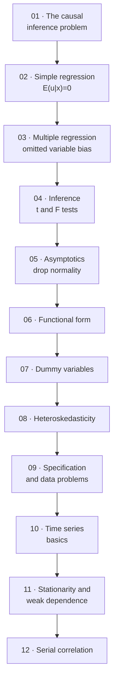

# Econometrics — Map of Content

> [!warning] Read this first — the scope of these notes is my own editorial decision
> **There are no lecture slides for this subject.** The vault contains only the textbook: **Wooldridge, *Introductory Econometrics: A Modern Approach*, 7th edition.** Nothing indicates which chapters the course actually covers.
>
> **I have scoped these notes to chapters 1–12 (Parts 1 and 2)** — the standard undergraduate one-semester sequence, which Wooldridge himself describes as the core. **Confirm this against the real syllabus**, and see §"What is not covered" below for what has been left out and why.

---

## Chapters

| # | Chapter | Status | One-line description |
|---|---|---|---|
| 01 | [[01 - The Nature of Econometrics and Economic Data]] | ✅ | Why causal inference from non-experimental data is the whole problem; the four data structures |
| 02 | [[02 - The Simple Regression Model]] | ✅ | OLS with one regressor: derivation, $R^2$, functional forms, unbiasedness, and why $\mathbb{E}(u\mid x)=0$ is everything |
| 03 | [[03 - Multiple Regression Analysis - Estimation]] | ✅ | Partialling out, **omitted variable bias**, the variance formula, multicollinearity, **Gauss–Markov** |
| 04 | [[04 - Multiple Regression Analysis - Inference]] | ✅ | $t$ tests, confidence intervals, $F$ tests, and statistical vs practical significance |
| 05 | [[05 - Multiple Regression Analysis - OLS Asymptotics]] | ✅ | Consistency and asymptotic normality — why normality of the errors is not needed in large samples |
| 06 | [[06 - Multiple Regression Analysis - Further Issues]] | ✅ | Scaling, beta coefficients, quadratics, interactions, adjusted $R^2$, prediction intervals |
| 07 | [[07 - Multiple Regression Analysis with Qualitative Information]] | ✅ | Dummy variables, base groups, the Chow test, the linear probability model, program evaluation |
| 08 | [[08 - Heteroskedasticity]] | ✅ | Robust standard errors and LM tests, Breusch–Pagan, White, WLS and feasible GLS |
| 09 | [[09 - More on Specification and Data Issues]] | ✅ | RESET, proxy variables, random slopes, measurement error, missing data, outliers, LAD |
| 10 | [[10 - Basic Regression Analysis with Time Series Data]] | ✅ | Static and distributed-lag models, the LRP, TS.1–TS.6, trends, spurious regression, seasonality |
| 11 | [[11 - Further Issues in Using OLS with Time Series Data]] | ✅ | Stationarity vs weak dependence, TS.1′–TS.5′, random walks and unit roots, I(0) vs I(1), dynamic completeness |
| 12 | [[12 - Serial Correlation and Heteroskedasticity in Time Series Regressions]] | ✅ | Consequences of serial correlation, **Newey–West/HAC**, Durbin–Watson and Breusch–Godfrey, Cochrane–Orcutt and Prais–Winsten, **ARCH** |

---

## How the subject fits together

**Three phases:**

1. **The core (01–04).** Set up the problem, derive OLS, establish when it is unbiased, and build the testing apparatus. **Nothing later makes sense without these.**
2. **Relaxing and extending (05–09).** Drop normality; enrich functional form; handle qualitative data; fix heteroskedasticity; confront misspecification and dirty data.
3. **Time series (10–12).** Redo the whole apparatus when observations are dependent — where the assumptions get much harder to state and spurious regression lurks.

---

## The single idea the subject is about

> [!important] Everything reduces to one question about the error term
> $$y = \beta_0+\beta_1x_1+\cdots+\beta_kx_k+u$$
>
> **Is $\mathbb{E}(u\mid x_1,\dots,x_k)=0$?**
>
> | If it fails because… | The chapter that addresses it |
> |---|---|
> | An omitted variable is correlated with a regressor | [[03 - Multiple Regression Analysis - Estimation\|03]] — include it, or sign the bias |
> | Functional form is wrong | [[06 - Multiple Regression Analysis - Further Issues\|06]], [[09 - More on Specification and Data Issues\|09]] |
> | A regressor is measured with error | [[09 - More on Specification and Data Issues\|09]] |
> | The sample is selected on the outcome | [[09 - More on Specification and Data Issues\|09]] |
> | The series is non-stationary | [[11 - Further Issues in Using OLS with Time Series Data\|11]] |
>
> **And the two problems that are *not* about $\mathbb{E}(u\mid x)$:**
> - **Heteroskedasticity** ([[08 - Heteroskedasticity|08]]) — $\mathrm{Var}(u\mid x)$ varies. **Coefficients stay unbiased; only inference breaks.**
> - **Serial correlation** ([[12 - Serial Correlation and Heteroskedasticity in Time Series Regressions|12]]) — $\mathrm{Corr}(u_t,u_s)\neq0$. **Same: an inference problem, not a bias problem.**
>
> **Keeping that distinction straight is worth more than any formula in the course.**

---

## Assumption reference

| | Cross-section (MLR) | Consequence if it fails |
|---|---|---|
| **1** | Linear in parameters | Model misspecified |
| **2** | Random sampling | Possible bias (selection) |
| **3** | No perfect collinearity | **OLS cannot be computed** |
| **4** | **Zero conditional mean** $\mathbb{E}(u\mid\mathbf{x})=0$ | **BIAS** — the assumption to worry about |
| **5** | Homoskedasticity $\mathrm{Var}(u\mid\mathbf{x})=\sigma^2$ | Still unbiased; **not BLUE**, standard errors invalid |
| **6** | Normality $u\sim N(0,\sigma^2)$ | Exact $t$/$F$ distributions lost; **fine in large samples** |

**MLR.1–5 = Gauss–Markov assumptions → OLS is BLUE.**
**MLR.1–6 = classical linear model assumptions → OLS is MVUE, and $t$/$F$ tests are exact.**

---

## Key formulas

$$
\hat\beta_1^{\text{simple}} = \frac{\sum(x_i-\bar x)(y_i-\bar y)}{\sum(x_i-\bar x)^2} = \hat\rho_{xy}\frac{\hat\sigma_y}{\hat\sigma_x}
\qquad
\hat\beta_0 = \bar y - \hat\beta_1\bar x
$$

$$
\text{SST} = \text{SSE}+\text{SSR}
\qquad
R^2 = \frac{\text{SSE}}{\text{SST}} = 1-\frac{\text{SSR}}{\text{SST}}
$$

$$
\boxed{\text{Omitted variable bias: } \mathrm{Bias}(\tilde\beta_1) = \beta_2\,\tilde\delta_1}
$$

$$
\boxed{\mathrm{Var}(\hat\beta_j) = \frac{\sigma^2}{\text{SST}_j(1-R_j^2)}}
\qquad
\hat\sigma^2 = \frac{\text{SSR}}{n-k-1}
\qquad
\mathrm{se}(\hat\beta_j) = \frac{\hat\sigma}{\sqrt{\text{SST}_j(1-R_j^2)}}
$$

$$
t = \frac{\hat\beta_j-a_j}{\mathrm{se}(\hat\beta_j)}\sim t_{n-k-1}
\qquad
\text{CI}_{95\%} = \hat\beta_j \pm c\cdot\mathrm{se}(\hat\beta_j)
$$

$$
\boxed{F = \frac{(\text{SSR}_r-\text{SSR}_{ur})/q}{\text{SSR}_{ur}/(n-k-1)} = \frac{(R_{ur}^2-R_r^2)/q}{(1-R_{ur}^2)/(n-k-1)} \sim F_{q,\,n-k-1}}
$$

**Functional forms:**

| Model | $\beta_1$ means |
|---|---|
| $y$ on $x$ | $\Delta y = \beta_1\Delta x$ |
| $y$ on $\log x$ | $\Delta y \approx (\beta_1/100)\%\Delta x$ |
| $\log y$ on $x$ | $\%\Delta y \approx 100\beta_1\Delta x$ (semi-elasticity) |
| $\log y$ on $\log x$ | $\%\Delta y = \beta_1\%\Delta x$ (elasticity) |

---

## The mistakes that cost the most marks

1. **Saying "the estimate is too high"** when the estimator is biased upward. **Bias is a property of the sampling distribution, not of your number.**
2. **Claiming a 95% probability that $\beta_j$ lies in the CI.** $\beta_j$ is fixed; the interval is random.
3. **Treating "insignificant" as "zero."** A wide CI is uninformative, not evidence of no effect.
4. **Choosing a one-sided alternative after seeing the sign.**
5. **Using $R^2$ to select variables.** It never falls when a regressor is added.
6. **Confusing $R^2$ with $R_j^2$** (the auxiliary-regression $R^2$ in the variance formula).
7. **Thinking heteroskedasticity biases the coefficients.** It does not.
8. **Reporting insignificant $t$'s without the joint $F$** when regressors are collinear.
9. **Dropping a collinear variable that belongs.** Trades variance for **bias**.
10. **Confusing statistical with practical significance** — everything is significant when $n$ is large.

---

## What is not covered, and why

**Part 3 (chapters 13–19)** is outside the scope chosen here:

| Chapter | Topic | Note |
|---|---|---|
| 13 | Pooling cross sections; simple panel data | *"Students with a good grasp of Chapters 1 through 8 will have little difficulty with Chapter 13."* Worth reading if panel data appears on the syllabus. |
| 14 | Advanced panel data | Wooldridge: *"would probably be covered only in a second course."* |
| 15 | Instrumental variables and 2SLS | *"A good way to end a course on cross-sectional methods."* **The main tool for endogeneity** — read this if MLR.4 failures are the course's focus. |
| 16 | Simultaneous equations | |
| 17 | Limited dependent variables (logit, probit, Tobit) | Relevant to a data-science degree. |
| 18 | Advanced time series | Overlaps heavily with [[Time-series Analysis/contents/00-Index\|Time-series Analysis]]. |
| 19 | Carrying out an empirical project | Useful for a term paper. |

**Also present in the book and not covered here:** Math Refreshers A–C (algebra, probability, statistics) and Advanced Treatments D–E (matrix algebra, the matrix form of OLS). **Math Refresher C overlaps substantially with [[Mathematical Statistics/contents/00-Index|Mathematical Statistics]].**

---

## ⚠️ Source-material issues

> [!warning] Textbook only — no slides, no data
> - **There are no lecture slides.** Chapter scope, emphasis and exercise choice are **all my own editorial decisions.**
> - **No data files are in the vault.** The book's exercises depend on `WAGE1`, `CEOSAL1`, `VOTE1`, `MEAP93`, `HPRICE`, and dozens more. **No reported regression in these notes can be re-estimated** — coefficients and $R^2$ values are **quoted as printed in the text.**
> - **Every end-of-chapter exercise in these notes is my own construction**, built around figures the text reports. All arithmetic has been independently verified.

> [!warning] PDF extraction artefacts
> The text extracts cleanly, but:
> - **All figures are images** — scatterplots, the PRF diagram, homoskedasticity/heteroskedasticity pictures, rejection-region plots, the $\mathrm{Var}(\hat\beta_1)$-vs-$R_1^2$ curve. Their content is described in the surrounding prose and reconstructed in the notes.
> - **All statistical tables ($t$, $F$, $\chi^2$) are images.** Critical values quoted in exercises are standard values I have supplied.
> - **Mathematical notation is mangled** by the PDF's two-column layout: `b^ j` for $\hat\beta_j$, `E1u0x2` for $\mathbb{E}(u\mid x)$, `g` for $\sum$, `R2 j` for $R_j^2$. **Every equation in these notes has been transcribed and checked by hand** against its numbered reference in the text.
> - **Several summary tables are images** — notably **Table 3.2** (the omitted-variable-bias sign table) and Table 2.3 (the functional-form summary). Both are reconstructed from the surrounding text, which states the cases explicitly.

---

## Cross-subject links

- [[Time-series Analysis/contents/00-Index|Time-series Analysis]] — chapters 10–12 here are the regression-side view of the same material; stationarity, spurious regression and serial correlation appear in both
- [[Mathematical Statistics/contents/00-Index|Mathematical Statistics]] — sampling distributions, estimation, hypothesis testing; Wooldridge's Math Refresher C covers the same ground
- [[Machine Learning/contents/00-Index|Machine Learning]] — the bias–variance trade-off appears here as the overspecify/underspecify decision of [[03 - Multiple Regression Analysis - Estimation|ch. 03]]
- [[Data Preparation and Visualization/contents/00-Index|Data Preparation & Visualization]] — the data structures of [[01 - The Nature of Econometrics and Economic Data|ch. 01]], and the missing-data and outlier problems of ch. 09

#econometrics #index #moc
