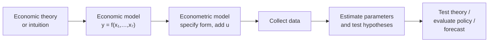

# The Nature of Econometrics and Economic Data

> [!abstract] Where this sits in the course
> This chapter contains **no estimation and no formulas** — and it is still the most important chapter in the book, because it defines the problem every later technique exists to solve.
>
> That problem is **causal inference from non-experimental data**. In a laboratory you can randomise; in economics you almost never can. Everything from [[02 - The Simple Regression Model|OLS]] to [[08 - Heteroskedasticity|robust standard errors]] to instrumental variables is a response to that single handicap.

---

## 📘 Main Knowledge

### 1. What is econometrics?

> **Econometrics is based upon the development of statistical methods for estimating economic relationships, testing economic theories, and evaluating and implementing government and business policy.**

Two motivating problems, both from the text's opening:

1. **A state government hires you to evaluate a publicly funded job training program.** The 20-week program teaches manufacturing workers to use computers, runs outside working hours, and **enrolment is voluntary**. What effect does it have on each worker's subsequent hourly wage?
2. **An investment bank asks you to study returns on strategies involving short-term US Treasury bills** to decide whether they comply with implied economic theories.

A common application is **forecasting** macroeconomic variables — interest rates, inflation, GDP. But econometric methods reach far beyond that: the effect of **campaign expenditures on voting outcomes**, of **school spending on student performance**, and so on.

> [!important] Why econometrics is a separate discipline from mathematical statistics
> **Econometrics has evolved as a separate discipline because it focuses on the problems inherent in collecting and analysing NON-EXPERIMENTAL economic data.**
>
> | | **Experimental data** | **Non-experimental data** |
> |---|---|---|
> | Also called | — | **Observational** or **retrospective** data |
> | How obtained | Controlled experiments, typically in the natural sciences | The researcher is a **passive collector** |
> | Who assigns treatment | The researcher, at random | The world — for reasons correlated with the outcome |
>
> **Although some social experiments can be devised, it is often impossible, prohibitively expensive, or morally repugnant to conduct the kinds of controlled experiments that would be needed to address economic issues.**
>
> **The method of multiple regression analysis is the mainstay in both fields, but its focus and interpretation can differ markedly.** Statisticians often ask "what is the best prediction of $y$?"; econometricians ask "what would happen to $y$ if we changed $x$?" **Those are not the same question**, and the difference drives the entire book.

> [!note] Note the trap already hidden in the job-training example
> **Enrolment is voluntary.** So the workers who sign up are not a random subset — they are plausibly the more motivated, more ambitious, or the ones whose jobs are most at risk. Comparing trainees' later wages with non-trainees' therefore mixes the **effect of the programme** with the **effect of being the sort of person who enrols.**
>
> This is **selection bias**, and recognising it in the first two paragraphs of the course is the point of the example.

---

### 2. Steps in empirical economic analysis

**Econometric methods come into play either when we have an economic theory to test, or when we have a relationship in mind that has some importance for business decisions or policy analysis.** An empirical analysis uses data to test a theory or estimate a relationship.

#### From economic model to econometric model

> **Example 1.1 — Economic model of crime.** Nobel laureate **Gary Becker** postulated a utility-maximisation framework for participation in crime. Certain crimes have clear economic rewards, but most criminal behaviour has costs: **the opportunity cost of not working legally**, plus **the costs of being caught, convicted and incarcerated.** From Becker's perspective, the decision to undertake illegal activity is **one of resource allocation**, with the benefits and costs of competing activities taken into account.
>
> $$y = f(x_1,x_2,x_3,x_4,x_5,x_6,x_7) \tag{1.1}$$
>
> | | |
> |---|---|
> | $y$ | hours spent in criminal activities |
> | $x_1$ | "wage" for an hour spent in criminal activity |
> | $x_2$ | hourly wage in legal employment |
> | $x_3$ | income other than from crime or employment |
> | $x_4$ | probability of getting caught |
> | $x_5$ | probability of being convicted if caught |
> | $x_6$ | expected sentence if convicted |
> | $x_7$ | age |
>
> **As is common in economic theory, we have not been specific about the function $f(\cdot)$.** It depends on an underlying utility function, which is rarely known. Nevertheless we can use theory — or introspection — to **predict the sign of each effect.**

> **Formal economic modelling is sometimes the starting point, but it is more common to use economic theory less formally, or even to rely entirely on intuition.** The determinants in (1.1) are reasonable on common sense alone. **Although there are cases in which formal derivations provide insights that intuition can overlook.**

**Turning (1.1) into something estimable requires resolving two ambiguities:**

1. **The functional form $f(\cdot)$ must be specified.**
2. **Some variables cannot reasonably be observed.** The wage a person could earn *in criminal activity* is well defined in principle but essentially unobservable. The probability of arrest for a *given individual* is likewise unobservable — **though we can observe arrest statistics and derive an approximating variable.**

The resulting **econometric model**:

$$
\text{crime} = \beta_0 + \beta_1\text{wage} + \beta_2\text{othinc} + \beta_3\text{freqarr} + \beta_4\text{freqconv} + \beta_5\text{avgsen} + \beta_6\text{age} + u \tag{1.3}
$$

| Variable | Meaning |
|---|---|
| $\text{crime}$ | some measure of the frequency of criminal activity |
| $\text{wage}$ | the wage that can be earned in legal employment |
| $\text{othinc}$ | income from other sources (assets, inheritance, …) |
| $\text{freqarr}$ | frequency of arrests for prior infractions — **approximating the probability of arrest** |
| $\text{freqconv}$ | frequency of conviction |
| $\text{avgsen}$ | average sentence length after conviction |

> [!important] The error term $u$ is the heart of the subject
> **$u$ contains unobserved factors** — the wage for criminal activity, moral character, family background, and **errors in measuring things like criminal activity and the probability of arrest.**
>
> **We could add family background variables — number of siblings, parents' education — but we can never eliminate $u$ entirely.**
>
> > **In fact, dealing with this error term or disturbance term is perhaps the most important component of any econometric analysis.**
>
> Every major topic in this book is a statement about $u$:
> - **[[03 - Multiple Regression Analysis - Estimation|Omitted variable bias]]** — what if $u$ is correlated with an included $x$?
> - **[[08 - Heteroskedasticity|Heteroskedasticity]]** — what if $\mathrm{Var}(u)$ depends on $x$?
> - **[[12 - Serial Correlation and Heteroskedasticity in Time Series Regressions|Serial correlation]]** — what if $u_t$ is correlated with $u_{t-1}$?
> - **[[09 - More on Specification and Data Issues|Measurement error]]** — what if the mismeasurement lives in $u$?
>
> **The $\beta$'s are the parameters** — they **describe the directions and strengths of the relationship** between crime and its determinants.

**The steps, in order:**

---

### 3. The structure of economic data

**Some econometric methods apply with little modification to many kinds of data set; the special features of others must be accounted for or exploited.** Four structures.

#### 3.1 Cross-sectional data

> **A sample of individuals, households, firms, cities, states, countries, or other units, taken at a given point in time.**

Timing need not be exactly simultaneous — **families surveyed during different weeks of the same year still constitute a cross section**, and a variable can even refer to a *different period* from the others. In De Long and Summers' (1991) growth data, `gpcrgdp` is average growth **1960–1985** while `govcons60` and `second60` are measured **in 1960** — and this **does not lead to any special problems in treating the information as cross-sectional.**

> [!important] The defining property: **ordering does not matter**
> **It does not matter which person is labelled observation 1.** The `obsno` column is assigned by the software and **is not a characteristic of the individual.**
>
> **The fact that the ordering of the data does not matter is a key feature of cross-sectional data sets obtained by random sampling** — and it is exactly what fails for time series (§3.2).

**An important feature is that we can often assume the data were obtained by random sampling.** Randomly drawing 500 people from the working population gives a random sample of all working people. **Random sampling is the sampling scheme covered in introductory statistics courses, and it simplifies the analysis** — see [[Mathematical Statistics/contents/04 - Sampling Distributions|sampling distributions]].

> [!warning] But random sampling is not always a safe assumption
> Suppose we study the accumulation of family wealth. We survey a random sample of families, **but some refuse to report their wealth.** **If wealthier families are less likely to disclose, the resulting sample on wealth is not a random sample from the population.**
>
> This is **non-random sampling / sample selection**, treated in [[09 - More on Specification and Data Issues]]. It is a different problem from the causal-inference problem of §4, and it is easy to overlook because the *survey* was random.

*Example (a subset of `WAGE1`, 1976):* variables `wage` (dollars per hour), `educ` (years), `exper` (years of potential experience), `female` and `married`. **The last two are binary (zero–one)** and indicate qualitative features — the subject of [[07 - Multiple Regression Analysis with Qualitative Information]].

#### 3.2 Time series data

> **Observations on a variable or several variables over time.** Stock prices, money supply, the consumer price index, GDP, annual homicide rates, automobile sales.

> [!important] Two properties that make time series harder
> **1. The chronological ordering conveys potentially important information.** *"Because past events can influence future events and lags in behaviour are prevalent in the social sciences, time is an important dimension."* Unlike a cross section, **you may not shuffle the rows.**
>
> **2. Observations can rarely, if ever, be assumed independent across time.** *"Most economic and other time series are related, often strongly related, to their recent histories."* Knowing last quarter's GDP tells you a great deal about this quarter's.
>
> **Consequence:** *"more needs to be done in specifying econometric models for time series data before standard econometric methods can be justified."* This is why Wooldridge postpones time series to Part 2 — see §3.5.

**Data frequency** requires attention: **daily, weekly, monthly, quarterly, annually.** Stock prices are daily (excluding weekends); the US money supply is weekly; inflation and unemployment are monthly; many macro series are quarterly.

**Data should be stored in chronological order**, oldest first.

> [!note] Connection to [[Time-series Analysis/contents/00-Index|Time-series Analysis]]
> The trending and persistence problems Wooldridge flags here are exactly what that subject develops in full: [[Time-series Analysis/contents/03 - Stationarity and Difference Equations|stationarity]], [[Time-series Analysis/contents/05 - ACF, PACF and the Box-Jenkins Methodology|unit-root testing]], and the spurious-regression problem. **This course approaches the same material from the regression side**; [[10 - Basic Regression Analysis with Time Series Data|chapter 10]] is where the two meet.

#### 3.3 Pooled cross sections

> **Some data sets have both cross-sectional and time series features.** Two independent household surveys, one in 1985 and one in 1990, each a fresh random sample. **To increase our sample size, we can form a pooled cross section by combining the two years.**

> **Pooling cross sections from different years is often an effective way of analysing the effects of a new government policy.** The idea is to **collect data from the years before and after a key policy change** — for example house prices in 1993 and 1995, either side of a 1994 property-tax reduction.

**A pooled cross section is analysed much like a standard cross section, except that we often need to account for secular differences in the variables across time.** In addition to increasing sample size, **the point is often to see how a key relationship has changed over time.** **Keeping track of the year for each observation is usually very important** — hence `year` as a separate variable.

#### 3.4 Panel (longitudinal) data

> **A panel data set consists of a time series for each cross-sectional member.** Wage, education and employment history for a set of individuals followed over 10 years; investment and financial data for the same firms over five years; immigration, tax rates and expenditures for the same US counties in 1980, 1985 and 1990.

> [!important] Panel vs pooled cross section — the distinction that matters
> **The key feature of panel data is that the SAME cross-sectional units are followed over time.**
>
> The housing data of §3.3 is **not** a panel: *"the houses sold are likely to be different in 1993 and 1995; if there are any duplicates, the number is likely to be so small as to be unimportant."*
>
> A two-year panel on 150 cities has **300 observations** and any package will read it as such — **but the panel structure lets you answer questions a pooled cross section cannot.**

**Storage convention:** *"we place the two years of data for each city adjacent to one another, with the first year coming before the second in all cases. For just about every practical purpose, this is the preferred way for ordering panel data sets."* **The ordering across cities is irrelevant**, as in any cross section.

**Two advantages of panel data:**

1. **Multiple observations on the same units allows us to control for certain unobserved characteristics** of individuals, firms and so on. *"The use of more than one observation can facilitate causal inference in situations where inferring causality would be very difficult if only a single cross section were available."*
2. **They often allow us to study the importance of lags in behaviour or the result of decision making** — significant because *"many economic policies can be expected to have an impact only after some time has passed."*

> [!important] Advantage 1 is the reason panel data matter so much
> If a city's unobserved "culture" affects its crime rate and is roughly **constant over time**, then looking at how crime *changes* within that city **differences the culture away** — you no longer need to observe it.
>
> **This is a way of solving the omitted-variable problem without measuring the omitted variable**, and it is why *"economists now recognise that some questions are difficult, if not impossible, to answer satisfactorily without panel data."* Developed in **Wooldridge ch. 13** *(outside this vault's scope — see [[00-Index]])*.

#### 3.5 Why the book is ordered this way

| Part | Data structure | Why here |
|---|---|---|
| **Part 1** (ch. 2–9) | Cross-sectional | *"Poses the fewest conceptual and technical difficulties. At the same time, it illustrates most of the key themes."* |
| **Part 2** (ch. 10–12) | Time series | *"More complicated because of the trending, highly persistent nature of many economic time series."* |
| **Part 3** (ch. 13+) | Pooled cross sections and panel | Straightforward extensions, but deferred |

> [!warning] Wooldridge's warning about traditional time-series teaching
> *"Examples that have been traditionally used to illustrate the manner in which econometric methods can be applied to time series data are now widely believed to be flawed. It makes little sense to use such examples initially, because this practice will only reinforce poor econometric practice."*
>
> He means **spurious regressions** — running OLS on two trending series and finding a large $R^2$ that means nothing. Regressing US GDP on Bangladeshi rainfall will "work" beautifully. **This is why time series waits until Part 2** and why [[11 - Further Issues in Using OLS with Time Series Data]] spends so long on stationarity.

---

### 4. Causality, ceteris paribus and counterfactual reasoning

> **In most tests of economic theory, and certainly for evaluating public policy, the economist's goal is to infer that one variable has a CAUSAL effect on another.**

Simply finding an association is rarely enough. **The notion of *ceteris paribus* — "other (relevant) factors being equal" — plays an important role in causal analysis.**

> **In most serious applications, the number of factors that can affect the variable of interest is immense, and the isolation of any particular variable may seem like a hopeless effort. However, when carefully applied, econometric methods can simulate a ceteris paribus experiment.**

#### Counterfactual reasoning

> **The notion of ceteris paribus can also be described through counterfactual reasoning, which has become an organising theme in analysing interventions such as policy changes.**
>
> **The idea is to imagine an economic unit in two or more different states of the world.** For a job training programme, imagine each worker's subsequent earnings under two states: **having participated, and having not participated.**
>
> **By considering these counterfactual outcomes (also called potential outcomes) we easily "hold other factors fixed", because the counterfactual thought experiment applies to each individual separately.** Causality then means **the outcome differs between the two states of the world for at least some individuals.**

> [!important] The fundamental problem of causal inference
> > **The fact that we will eventually observe each worker in only ONE state of the world raises important problems of estimation — but that is a separate issue from the issue of what we mean by causality.**
>
> This sentence is worth reading twice. It cleanly separates two things students constantly conflate:
>
> | | Question | Status |
> |---|---|---|
> | **Definition** | What *is* a causal effect? | **Solved** — the difference between potential outcomes |
> | **Estimation** | How do we *measure* it when we see only one outcome per unit? | **The whole rest of the book** |
>
> Notation (formally introduced in [[02 - The Simple Regression Model|chapter 2]]): each unit has potential outcomes $y(0)$ and $y(1)$, and the individual treatment effect is $y(1)-y(0)$. **We never observe both.** Randomisation solves the estimation problem *on average*; econometrics is what you do when you cannot randomise.

#### Why experiments are usually impossible

> **Example 1.4 — Measuring the return to education.** *"If a person is chosen from the population and given another year of education, by how much will his or her wage increase?"*
>
> This is a ceteris paribus question with an obvious counterfactual: **we can imagine each individual's wage at different levels of education.** But *"we obtain data on each worker in only one state of the world: the education level they actually wound up with, through perhaps a complicated process of intellectual ability, motivation for learning, parental input, and societal influences."*
>
> **The ideal experiment:** a social planner **randomly assigns** each person an amount of education — eighth grade to some, high school to others, two years of college to others — then measures wages. *"The people here are like the plots in the fertilizer example, where education plays the role of fertilizer and wage rate plays the role of soybean yield."*
>
> **If levels of education are assigned independently of other characteristics that affect productivity (such as experience and innate ability), then an analysis that ignores these other factors will yield useful results.**
>
> **But the experiment is unfeasible.** *"The ethical issues, not to mention the economic costs, associated with randomly determining education levels for a group of individuals are obvious. As a logistical matter, we could not give someone only an eighth-grade education if he or she already has a college degree."*

> [!important] Why random assignment is the gold standard
> Randomisation makes treatment **independent of everything else** — observed and unobserved. So any later difference in outcomes must be caused by treatment, and **you do not even need to know what the other factors are.**
>
> **In observational data, whatever determined treatment is generally also correlated with the outcome.** People who get more education are plausibly more able, and ability also raises wages. So a simple education–wage comparison mixes the return to education with the return to ability. **Ability is in $u$, and it is correlated with $educ$** — which is precisely the assumption OLS needs and does not have.
>
> **This single example motivates: [[03 - Multiple Regression Analysis - Estimation|multiple regression]]** (control for what you *can* observe), ****panel methods** *(Wooldridge ch. 13, outside scope)*** (difference out what is constant), **and instrumental variables** (find something that shifts education for reasons unrelated to ability).

---

## ✏️ Exercises

> [!note] The textbook's own end-of-chapter problems are mostly computer exercises requiring data files not present in the vault. The exercises below are constructed to test the chapter's concepts.

### Exercise 1 — Classify the data structure

For each, name the data structure and say what analytical possibility it opens or forecloses.

(a) Household income and expenditure for 3,000 Vietnamese households surveyed in June 2024.
(b) Monthly Vietnamese CPI, January 2000 – December 2024.
(c) A survey of 2,000 firms in 2019 and a *different* random sample of 2,200 firms in 2023.
(d) Annual revenue, employment and R&D spending for the same 400 firms, 2015–2024.
(e) Daily closing prices of 50 VN-Index stocks over 2024.

> [!example]- Solution
> | | Structure | What it opens or forecloses |
> |---|---|---|
> | (a) | **Cross-sectional** | Ordering irrelevant; random sampling plausible. **Cannot** study change over time or control for unobserved household traits. |
> | (b) | **Time series** | Ordering essential; observations dependent. Must worry about trends, seasonality (monthly!), persistence. |
> | (c) | **Pooled cross section** | Larger sample; can compare the 2019 and 2023 *relationships*. **Cannot** follow a firm — different firms each year. |
> | (d) | **Panel** | **Can difference out time-constant unobservables** (management quality, industry) and study lags. The most powerful structure here. |
> | (e) | **Panel** — 50 units × ~250 days | Both dimensions substantial. Often analysed with panel methods *and* time-series tools (volatility, [[Time-series Analysis/contents/09 - ARCH, GARCH and Extensions\|GARCH]]). |
>
> **The distinction that carries the most weight is (c) vs (d).** Both have two dimensions; only (d) follows the *same* units. **That is what makes unobserved-effect methods possible**, and it is why Wooldridge separates chapters 13 and 14.
>
> **A subtlety in (e):** with 250 time periods per stock this is a "long" panel where time-series concerns dominate; with 2 periods it would be a "short" panel where cross-sectional concerns dominate. **The methods differ accordingly.**

---

### Exercise 2 — Specify an econometric model

Following Example 1.1, write an econometric model for **the effect of class size on student test scores**. State (a) the equation, (b) at least four factors that would sit in $u$, and (c) for each, whether you expect it to be correlated with class size and in which direction.

> [!example]- Solution
> **(a) A plausible model:**
> $$\text{score}_i = \beta_0 + \beta_1\text{classize}_i + \beta_2\text{teachexp}_i + \beta_3\text{expend}_i + \beta_4\text{lunch}_i + u_i$$
> where `score` is an average test score, `classize` is students per class, `teachexp` is teacher experience, `expend` is spending per pupil, and `lunch` is the percentage eligible for free lunch (a standard poverty proxy).
>
> **(b) and (c) — what is left in $u$, and why it matters:**
>
> | Unobserved factor | Correlated with class size? | Direction of the resulting bias on $\hat\beta_1$ |
> |---|---|---|
> | **Parental income and education** | **Yes** — wealthier districts fund smaller classes | Wealth ↑ scores, wealth ↓ class size ⇒ **$\hat\beta_1$ too negative** (overstates the benefit) |
> | **Teacher quality** (beyond experience) | **Yes, ambiguous** — good schools may attract better teachers *and* have smaller classes; or the best teachers may be given the largest classes | **Sign uncertain** |
> | **Student innate ability / prior attainment** | **Yes** — struggling students are often *deliberately* placed in smaller classes | Ability ↑ scores, ability ↑ class size ⇒ **$\hat\beta_1$ too positive** (understates or reverses the benefit) |
> | **Peer effects, school culture, principal quality** | **Plausibly yes** | Sign uncertain |
> | **Measurement error in `score`** | Probably not | Adds noise; see [[09 - More on Specification and Data Issues]] |
>
> **The third row is the interesting one.** Remedial placement means small classes contain weaker students, so a naive regression can find that **smaller classes *lower* scores** — the opposite of the true causal effect. This is not a hypothetical; it is a well-documented feature of observational class-size studies.
>
> **What the ideal experiment would be:** randomly assign students to class sizes. **Tennessee's Project STAR actually did this** — which is precisely why it is the most cited class-size study in economics. **When you cannot randomise, you must either observe the confounders (multiple regression) or find a source of variation in class size unrelated to them.**

---

### Exercise 3 — Experimental vs non-experimental

For each question, describe the ideal experiment, then explain why the available data fall short.

(a) Does a minimum-wage increase reduce teenage employment?
(b) Does taking a statistics course improve performance in econometrics?
(c) Does foreign direct investment raise a country's growth rate?

> [!example]- Solution
> **(a) Minimum wage and teenage employment.**
>
> *Ideal experiment:* **randomly assign different minimum wages** to otherwise-identical labour markets and compare teenage employment after a suitable interval.
>
> *Why observational data fall short:* **minimum wages are not set randomly.** Governments raise them when the economy is strong, when labour is scarce, or when political conditions favour it — **all of which independently affect employment.** A national time series confounds the policy with the business cycle entirely.
>
> *What researchers actually do:* exploit **differences across states or provinces** that raise their minimum wage at different times, comparing changes in a treated area against changes in a neighbouring untreated one. **That is a pooled-cross-section / panel design** (**Wooldridge ch. 13**, outside scope) and the closest thing to the experiment available.
>
> **(b) Statistics course and econometrics performance.**
>
> *Ideal experiment:* **randomly require** half of an incoming cohort to take statistics first and forbid it to the other half, then compare econometrics marks.
>
> *Why observational data fall short:* **students choose.** Those who take statistics first are plausibly more quantitatively inclined, better organised, or more committed — **and all of those raise econometrics marks directly.** Comparing the two groups mixes the course effect with the selection effect. This is exactly the **voluntary-enrolment** problem of the job-training example in §1.
>
> *Note this one is genuinely feasible* — universities could randomise course sequencing — which makes it a rare case where the experiment is neither unethical nor impossible, merely inconvenient.
>
> **(c) FDI and growth.**
>
> *Ideal experiment:* **randomly assign FDI inflows to countries.** Manifestly absurd, which is the point.
>
> *Why observational data fall short — and here the problem is worse than selection:* **reverse causality.** Investors put money into countries they expect to grow. So high growth *causes* FDI at least as plausibly as FDI causes growth. Add confounders — institutional quality, rule of law, education, infrastructure — **all of which attract FDI *and* raise growth independently.**
>
> **This is simultaneity**, a distinct problem from omitted variables and one that no amount of controlling can fix. It requires instrumental variables or a genuine natural experiment.
>
> ---
> **The general lesson:** in every case, **whatever determined the "treatment" is also correlated with the outcome.** Naming that mechanism — selection, reverse causality, confounding — is the first step in any applied project, and it determines which method you need.

---

### Exercise 4 — Reading a regression as a counterfactual

A researcher reports, from a cross section of 526 workers:
$$\widehat{\log(wage)} = 0.584 + 0.083\,educ$$
(a) State the counterfactual claim this *appears* to make. (b) State what it actually establishes. (c) What would have to be true for (a) and (b) to coincide?

> [!example]- Solution
> **(a) The apparent claim.** For any given worker, **had they received one more year of education, holding everything else about them fixed**, their wage would have been about **8.3% higher**.
>
> Formally, in potential-outcomes notation: $\mathbb{E}[y(e+1) - y(e)] \approx 0.083$ in log points.
>
> **(b) What it actually establishes.** A **descriptive association**: comparing two workers in this sample who differ by one year of education, the one with more education earns on average about 8.3% more.
>
> **These are different workers, not the same worker in two states of the world.** The higher-education worker may also differ in ability, family background, motivation and region — **none of which is held fixed.**
>
> **(c) What would make them coincide.** Education would have to be **uncorrelated with everything else in $u$ that affects wages.** Formally (anticipating [[02 - The Simple Regression Model|ch. 2]]):
> $$\mathbb{E}(u \mid educ) = 0$$
>
> That is exactly what **random assignment** would guarantee — and exactly what Example 1.4 says is unfeasible.
>
> **Two directions the bias can run:**
> - **Ability bias (upward).** More able people get more education *and* earn more regardless. The 8.3% overstates the causal return.
> - **Compensating differentials (downward).** People who expect low returns to schooling may stop early and enter high-paying manual trades, pulling the estimate down.
>
> **The consensus is that upward ability bias dominates**, and the literature's central task for forty years has been finding credible ways to remove it.
>
> **The practical takeaway:** a regression coefficient is *always* a valid description of the sample. **Whether it is a causal effect depends entirely on an assumption about $u$ that the data cannot verify.** Stating that assumption explicitly is what separates econometrics from curve-fitting.

---

## 📝 Summary

- **Econometrics develops statistical methods for estimating economic relationships, testing theories, and evaluating policy.** It is separate from mathematical statistics because it confronts **non-experimental (observational) data**, where the researcher is a passive collector and cannot randomise.
- **Empirical work runs: theory or intuition → economic model → econometric model → data → estimation and testing.** Turning an economic model into an econometric one requires **specifying the functional form** and **dealing with unobservable variables.**
- **The error term $u$ collects everything unobserved**, and *"dealing with this error term is perhaps the most important component of any econometric analysis."* Every major topic later in the book is a statement about $u$.
- **Four data structures:**
  - **Cross-sectional** — units at one point in time; **ordering irrelevant**; random sampling usually assumed.
  - **Time series** — one or more variables over time; **ordering essential**; observations **dependent**; frequency and trends matter.
  - **Pooled cross sections** — independent random samples from different years, combined; good for before-and-after policy analysis.
  - **Panel/longitudinal** — the **same units** followed over time; permits controlling for unobserved time-constant characteristics and studying lags.
- **The economist's goal is usually a *causal* effect, requiring *ceteris paribus* comparison.** **Counterfactual (potential) outcomes** define causality cleanly: the difference in a unit's outcome across two states of the world.
- **The fundamental problem is that each unit is observed in only one state.** Randomisation would solve it; in economics randomisation is usually **impossible, prohibitively expensive, or morally repugnant** — so econometric methods must **simulate** the ceteris paribus experiment.

---

## ⚠️ Important Notes

> [!warning] Correlation is the finding; causation is an assumption
> A regression coefficient always describes an **association** in the data. Calling it a **causal effect** requires an assumption about the error term that **no dataset can verify**. State the assumption; do not smuggle it in.

> [!important] Ask "what is the ideal experiment?" before anything else
> For every applied question in this course, the productive first move is: **what experiment would settle this, and why can't I run it?** The answer identifies the specific obstacle — **selection, omitted variables, reverse causality, measurement error** — and the obstacle determines the method.

> [!tip] Panel data ≠ pooled cross section
> Both stack years. **Only a panel follows the same units**, and that is what allows unobserved fixed characteristics to be differenced away. If a question describes "a new random sample each year", it is **pooled**, and the panel toolkit does not apply.

> [!note] Why time series is deferred
> Trending, persistent series produce **spurious regressions** — impressive $R^2$ between unrelated variables. Wooldridge deliberately delays time series so students do not learn bad habits on flawed examples. See [[Time-series Analysis/contents/01 - What is a Time Series]] for the same warning from the other direction.

> [!warning] Source-material note
> This chapter is written from the **PDF of Wooldridge 7th edition** (pp. 1–18), which extracts cleanly. **Two limitations:**
> - **Tables 1.1–1.5 and all figures are partially garbled** by the PDF's two-column layout; the illustrative data values above are reproduced where legible and described where not.
> - **The end-of-chapter problems and computer exercises require data files** (`WAGE1`, `COUNTYMURDERS`, and others) that are **not in the vault** — only the textbook PDF is present. All exercises above are my own construction.
>
> **There are no lecture slides for this subject.** The chapter scope for these notes (Wooldridge chapters 1–12) is **my own editorial decision**, based on the standard undergraduate sequence — **confirm it against the actual syllabus.** See [[00-Index]].

---

**Next:** [[02 - The Simple Regression Model]] · **Index:** [[00-Index]]

#econometrics #causality #ceteris-paribus #counterfactual #data-structures #panel-data
