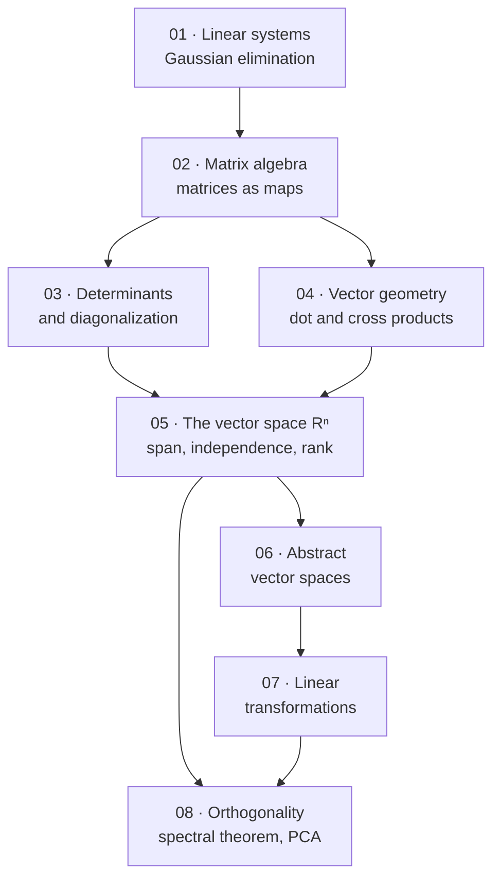

# Linear Algebra — Map of Content

> [!warning] Read this first — the scope of these notes is my own editorial decision
> **There are no lecture slides for this subject.** The vault contains only the textbook: **W. Keith Nicholson, *Linear Algebra with Applications*, 7th edition (2013).** Nothing indicates which chapters the course actually covers.
>
> **I have scoped these notes to chapters 1–8.** The reasoning:
> - **Chapters 1–5** are what Nicholson himself calls a self-contained matrix-oriented course — *"Chapters 1–5 could serve as a solid introduction to linear algebra for students not requiring abstract theory."*
> - **Chapters 6–7** (abstract vector spaces, general linear transformations) are the standard second half, and are what make "dimension", "rank" and "basis" mean something rather than being recipes.
> - **Chapter 8 is non-negotiable for a Data Science degree.** It contains orthogonal diagonalization, the **spectral theorem**, positive definite matrices, **QR-factorization**, and §8.10 — **Statistical Principal Component Analysis.** Nothing in chapters 1–7 gets you to PCA.
>
> **Chapters 9–11 are excluded**, with reasons given in "What is not covered, and why" below.
>
> **Confirm this against the real syllabus.**

> [!important] The most important gap is in the textbook, not in these notes
> **Nicholson never covers the singular value decomposition.** It is not in the table of contents, not in the index, and not developed anywhere in the book's 593 pages.
>
> **For a data-science reader this is the single largest omission**, because the SVD is what generalises the spectral theorem to non-square, non-symmetric matrices — and therefore what actually underlies PCA on a data matrix, low-rank approximation, latent semantic analysis, recommender systems, and the pseudo-inverse. **§8.10 derives PCA via the eigendecomposition of the covariance matrix, which is correct but is the numerically inferior route.**
>
> **I flag this at every point where the SVD would naturally appear** (ch. 5 rank, ch. 5 least squares, ch. 8 orthogonal diagonalization, ch. 8 PCA) rather than silently teaching around it. **You will need to pick it up elsewhere** — Strang's *Introduction to Linear Algebra* ch. 7, or Trefethen & Bau, are the standard references.

---

## Chapters

| # | Chapter | Status | One-line description |
|---|---|---|---|
| 01 | [[01 - Systems of Linear Equations]] | ✅ | Elementary row operations and why reversibility matters, **Gaussian elimination**, row-echelon form, **rank and the $n-r$ parameter count**, homogeneous systems, **basic solutions** as column dependencies |
| 02 | [[02 - Matrix Algebra]] | ✅ | Matrix arithmetic and the transpose, **$A\mathbf x$ as a combination of columns**, **multiplication as composition**, block multiplication and path counting, **inverses and the Inverse Theorem**, elementary matrices, **linear transformations**, **LU-factorization**, Markov chains |
| 03 | [[03 - Determinants and Diagonalization]] | ✅ | Cofactor expansion and why to row-reduce instead, $\det(AB)=\det A\det B$, **$\det A\ne0\iff$ invertible**, **eigenvalues and eigenvectors**, **diagonalization** and the two ways it fails, **$A^k$ and dynamical systems**, linear recurrences |
| 04 | [[04 - Vector Geometry]] | ✅ | Length and direction, **dot product** and $\cos\theta$, **the projection formula**, lines and planes, **cross product**, areas and volumes, projection/reflection matrices, **Cauchy–Schwarz** |
| 05 | [[05 - The Vector Space Rn]] | ✅ | **Subspaces, span, independence, basis, dimension** and the Invariance Theorem; orthogonal bases and the **Expansion Theorem**; **row rank $=$ column rank** and **rank–nullity**; similarity; **least squares and the normal equations** |
| 06 | [[06 - Vector Spaces]] | ✅ | **The ten axioms** and what they omit, abstract examples ($\mathbf M_{mn}$, $\mathbf P_n$, $\mathbf F[a,b]$), the deferred proofs of ch. 5, basis extension, **$\dim(U+W)$ and direct sums** |
| 07 | [[07 - Linear Transformations]] | ✅ | General linear maps, **$T$ determined freely on a basis**, **kernel and image**, one-to-one $\iff\ker=\{\mathbf 0\}$, the **dimension theorem**, **isomorphism $\iff$ equal dimension** |
| 08 | [[08 - Orthogonality]] | ✅ | Orthogonal complements and projections, **Gram–Schmidt**, **the Principal Axis / spectral theorem**, **positive definite matrices and Cholesky**, **QR-factorization**, **Principal Component Analysis** |

---

## How the subject fits together

**Four phases:**

1. **Computation (01–02).** Solve systems, then discover that the bookkeeping *is* an algebra. **Chapter 2's real idea is that a matrix is a function**, and that matrix multiplication is composition of functions.
2. **Structure (03–04).** Determinants measure volume and detect invertibility; eigenvectors find the directions a matrix does not rotate. **Chapter 4 supplies the geometry that makes chapters 5 and 8 pictures rather than formulas.**
3. **Abstraction (05–07).** Chapter 5 is the pivot — **span, independence, basis, dimension, rank, all in $\mathbb{R}^n$ where you can still compute.** Chapters 6–7 then say those ideas never needed $\mathbb{R}^n$ at all.
4. **Orthogonality (08).** The payoff chapter: **symmetric matrices are orthogonally diagonalizable**, which gives principal axes, positive-definiteness, and PCA.

> [!tip] Where a data-science reader should spend the effort
> **§5.4 (rank), §5.6 (least squares), §8.2 (spectral theorem) and §8.10 (PCA) are the four sections everything downstream depends on.** If time is short, understand those cold and treat determinants and the cross product as supporting material.

---

## The three ideas the subject is really about

> [!important] 1. A matrix is a function, and matrix multiplication is composition
> $$A\mathbf{x}\ \text{ is what }A\text{ does to }\mathbf{x};\qquad (AB)\mathbf{x}=A(B\mathbf{x})$$
>
> **Nicholson builds the whole book on this** — he defines $AB$ by $AB=[A\mathbf b_1\ A\mathbf b_2\ \cdots\ A\mathbf b_n]$ precisely so that it *is* "do $B$, then do $A$". **Associativity then takes four lines instead of three pages of index-juggling.**
>
> **Everything follows:** $A^{-1}$ is the inverse *function*; $AB\ne BA$ because doing two things in the other order is a different thing; the rank is the dimension of the image; the null space is what gets sent to zero.

> [!important] 2. Independence, spanning and dimension are one idea seen three ways
> $$\text{spanning} = \text{enough vectors} \qquad \text{independent} = \text{no wasted vectors} \qquad \text{basis} = \text{exactly right}$$
>
> **Dimension is well defined** — every basis of a space has the same size — and that single theorem is what makes rank, nullity and the dimension theorem possible. **Chapter 5 does this in $\mathbb{R}^n$ and chapter 6 repeats it abstractly**; the repetition is deliberate, and Nicholson says so.

> [!important] 3. Orthogonality turns hard problems into easy ones
> **In an orthonormal basis, coordinates are just dot products:**
> $$\mathbf{v}=\sum_i(\mathbf v\cdot\mathbf e_i)\,\mathbf e_i$$
> — no system to solve. **Projection onto a subspace becomes a formula**, least squares becomes a projection, and the spectral theorem says a symmetric matrix *has* such a basis made of its own eigenvectors.
>
> **This is why $A^{\mathsf T}A$ appears everywhere in statistics**, and why PCA is an eigenvector problem.

---

## Key results

$$\text{rank}(A)+\dim(\text{null}(A))=n \qquad\qquad \dim(\ker T)+\dim(\operatorname{im}T)=\dim V$$

$$\boxed{A\text{ invertible} \iff \det A\ne0 \iff \text{rank}(A)=n \iff \text{columns independent} \iff A\mathbf x=\mathbf 0\text{ only for }\mathbf x=\mathbf 0}$$

$$\det(AB)=\det A\,\det B \qquad A^{-1}=\frac1{\det A}\operatorname{adj}A \qquad A\mathbf x=\lambda\mathbf x$$

$$A=PDP^{-1}\ \text{(diagonalizable)}\qquad\qquad \boxed{A=A^{\mathsf T}\ \Longrightarrow\ A=PDP^{\mathsf T},\ P\text{ orthogonal}}$$

$$\text{proj}_{\mathbf d}(\mathbf v)=\frac{\mathbf v\cdot\mathbf d}{\|\mathbf d\|^2}\,\mathbf d \qquad\qquad \boxed{\text{least squares: } A^{\mathsf T}A\hat{\mathbf x}=A^{\mathsf T}\mathbf b}$$

---

## The mistakes that cost the most marks

1. **Assuming $AB=BA$.** Matrix multiplication is composition, and order matters.
2. **Assuming $AB=0$ implies $A=0$ or $B=0$.** Non-zero matrices can annihilate each other.
3. **Cancelling: $AB=AC$ does *not* give $B=C$** unless $A$ is invertible.
4. **$(AB)^{-1}=B^{-1}A^{-1}$ and $(AB)^{\mathsf T}=B^{\mathsf T}A^{\mathsf T}$** — the order reverses.
5. **Confusing "the rows are independent" with "the columns are independent."** For a square matrix they coincide; for a rectangular one they generally do not — though **row rank always equals column rank**, which is the surprising theorem of ch. 5.
6. **Forgetting that row operations change the column space** (though not the row space, nor which columns are independent).
7. **Treating eigenvalues of $A+B$ as $\lambda_A+\lambda_B$.** They are not, unless the matrices share eigenvectors.
8. **Assuming every matrix is diagonalizable.** It needs $n$ independent eigenvectors — repeated eigenvalues are where it fails.
9. **Forgetting the $\det$ of a triangular matrix is the product of the diagonal** — the fastest computation in the subject, and the reason row-reduction beats cofactor expansion.
10. **Normalising eigenvectors but forgetting that $P$ must be orthogonal ($P^{-1}=P^{\mathsf T}$) in the spectral theorem** — that is exactly what "orthogonal diagonalization" adds.

---

## What is not covered, and why

| Chapter | Topic | Why excluded |
|---|---|---|
| **9** | Change of basis | Conceptually valuable (it is what similarity *means*), but computationally it adds nothing beyond ch. 3 and 8. **Excluded reluctantly** — read §9.1–9.2 if the syllabus includes it. |
| **10** | Inner product spaces | Generalises ch. 8 to abstract spaces with arbitrary inner products. **Adds no technique a data-science reader needs** that ch. 8 has not already supplied in $\mathbb{R}^n$. |
| **11** | Canonical forms (Jordan) | Genuinely graduate-level, and the Jordan form is numerically unstable and almost never computed in practice. |

**Also skipped: most of Nicholson's 18 optional "applications" sections** (network flow, electrical networks, chemical reactions, computer graphics, linear codes over finite fields, Fourier approximation). **Four are kept and integrated into the chapter notes** because they are directly relevant: **Markov chains** (§2.9, links to [[Probability Theory/contents/09 - Additional Topics in Probability|Probability ch. 09]]), **linear recurrences and dynamical systems** (§3.4–3.5), **correlation and variance** (§5.7), and **statistical PCA** (§8.10).

**Present in the book and worth knowing about:** *Selected Answers* (p. 550) for self-checking, and Appendices A–D (complex numbers, methods of proof, induction, polynomials) at high-school level.

---

## Cross-subject links

- [[Probability Theory/contents/00-Index|Probability Theory]] — **covariance matrices are symmetric positive semi-definite**, which is exactly ch. 8's subject; $\mathrm{Var}(\mathbf a^{\mathsf T}\mathbf X)=\mathbf a^{\mathsf T}\Sigma\mathbf a\ge0$ *is* the definition of positive semi-definite. **Markov chains ([[Probability Theory/contents/09 - Additional Topics in Probability|ch. 09]]) are matrix powers**, and the stationary distribution is a left eigenvector.
- [[Econometrics/contents/00-Index|Econometrics]] — **OLS is least squares in matrix form**: $\hat{\boldsymbol\beta}=(X^{\mathsf T}X)^{-1}X^{\mathsf T}\mathbf y$ is ch. 5 §6 verbatim. **Perfect multicollinearity is exactly "the columns of $X$ are dependent"**, and near-multicollinearity is $X^{\mathsf T}X$ being near-singular.
- [[Machine Learning/contents/00-Index|Machine Learning]] — **PCA is ch. 8**; gradient descent moves in $\mathbb{R}^n$; every neural network layer is an affine map $\mathbf x\mapsto W\mathbf x+\mathbf b$ followed by a non-linearity, so **ch. 2 and ch. 7 are the substrate.**
- [[Optimization/contents/00-Index|Optimization]] — **positive definiteness of the Hessian is the second-order condition** for a minimum; quadratic forms (§8.8) and constrained optimization (§8.9) are the bridge.
- [[Calculus/contents/00-Index|Calculus]] — the Jacobian is a matrix and its determinant is a volume scaling factor; the Hessian is symmetric, hence orthogonally diagonalizable.
- [[Mathematical Statistics/contents/00-Index|Mathematical Statistics]] — the multivariate normal is specified entirely by a mean vector and a covariance matrix; **§5.7's correlation and variance is where that starts.**
- [[Data Structures and Algorithms/contents/00-Index|Data Structures and Algorithms]] — Gaussian elimination is $O(n^3)$, and the reason LU-factorization (§2.7) exists is to avoid redoing it for each new right-hand side.

---

## ⚠️ Source-material issues

> [!warning] Textbook only — no slides
> - **There are no lecture slides.** Chapter scope, emphasis and exercise choice are **all my own editorial decisions.**
> - **Every end-of-chapter exercise in these notes is my own construction**, built around results the text establishes. **All arithmetic has been independently verified.**

> [!warning] PDF extraction — matrices are the problem
> This source extracts **worse than Ross** in the one way that matters most: **matrix layout is destroyed.**
> - **A matrix loses all its brackets and row structure.** The augmented matrix $\left[\begin{smallmatrix}3&4&1&|&1\\2&3&0&|&0\\4&3&-1&|&-2\end{smallmatrix}\right]$ extracts as the bare text `34 1 1 / 23 0 0 / 43 1 2−−`, **with the minus signs migrated to the end of the row.** Every matrix in these notes has therefore been **reconstructed by hand from the surrounding prose and verified by recomputing the worked example's answer.**
> - **Fractions extract as numerator-newline-denominator**, and negative fractions put the sign on a separate line again.
> - **Large delimiters extract as stray letters:** `S … T` is a large column-vector bracket, and `e`/`u` at the start of a display is a large brace grouping a system of equations.
> - **`/bbR` is $\mathbb{R}$, `/bbC` is $\mathbb{C}$, `/cdots` is $\cdots$, `/vdots` is $\vdots$, `/uni25ba.001` is the ▶ that marks the start of a solution, `/a51.001` is the marker for "answer at the back".**
> - **Figures are all images** — the geometric pictures of chapter 4 (parallelogram law, projections, planes, the cross product) carry a large share of that chapter's content and **cannot be extracted at all.**

> [!warning] Errata and defects found in the textbook
> *(Filled in as chapters are written. Every numeric claim is independently recomputed before it goes into these notes.)*
>
> | Where | Defect |
> |---|---|
> | **§2.2, Definition 2.5** | **The definition of $A\mathbf x$ is printed wrongly** as "$x_1\mathbf a_1+x_1\mathbf a_2+x_1\mathbf a_n$" — every coefficient is $x_1$ and the $\cdots$ is missing. **This is the book's central definition.** |
> | **§4.2, Example 2** | $\|\mathbf v\|^2-6(\mathbf v\cdot\mathbf w)+9\|\mathbf v\|^2$ — the last term must be $9\|\mathbf w\|^2$; the printed arithmetic only works with the correction. |
> | **§4.2, after Example 3** | "obtuse $(\pi/2<\theta\le0)$" — the interval as printed is empty; should be $\pi/2<\theta\le\pi$. |
> | **§5.6, Example 3** | The normal equations are printed with `=` where the matrix product belongs, making the displayed equation nonsense. |
> | §2.4 | "Observe that **Corollary 2** is false if $A$ and $C$ are not square" — it is Corollary 1 under discussion. |
> | §2.2 (Thm 2 proof) | $A+B=[\mathbf a_1+\mathbf b_1\ \ \mathbf a_2+\mathbf b_1\ \cdots]$ — should be $\mathbf a_2+\mathbf b_2$. |
> | §2.1 | $k(A+B-C)=kA+kC-kC$ — should be $kA+kB-kC$. |
> | §7.2 (Dim. Thm proof) | "$T(\mathbf v)$ lies in $\operatorname{im}V$" — $\operatorname{im}T$ is meant; $\operatorname{im}V$ is undefined. |
> | §5.4 | Corollary 4's proof states $\operatorname{row}(BA)\subseteq\operatorname{row}A$ where $\operatorname{row}(AB)\subseteq\operatorname{row}B$ is needed. |
> | §10.9 (Problem 10.9-analogue) | §1.2 Example 5's matrix is **printed inconsistently on one page** — rows `2 1 0 3` and `2 1 3 0`; only the latter gives the stated rank 2. |
> | List of Applications (p. x) | "**Constrianed** Optimization" — typo for *Constrained*. |
> | Preface, Highlights | "There is a complete Solution Manual **is** available" — stray verb. |
> | Preface, Exercises | The count is given as "**over 1200**" on p. vi and "**nearly 1175**" on p. vii — the two figures contradict each other. |
>
> **No computational error was found anywhere in chapters 1–8.** Every worked example's numbers were independently recomputed and all agree with the text; the defects above are typographical or bibliographic.
>
> **Two data objects had to be reconstructed because they are images:** the $4\times4$ matrix of §3.1 Example 10 (**not recoverable** — the printed intermediate arithmetic is verified instead) and the five data points of §5.6 Example 3 (**recovered** as $(1,1),(3,2),(4,3),(6,4),(7,5)$, which reproduce all four printed sums, the determinant 114 and the answer $\tfrac1{38}(9,25)$ exactly).

#linear-algebra #index #moc
