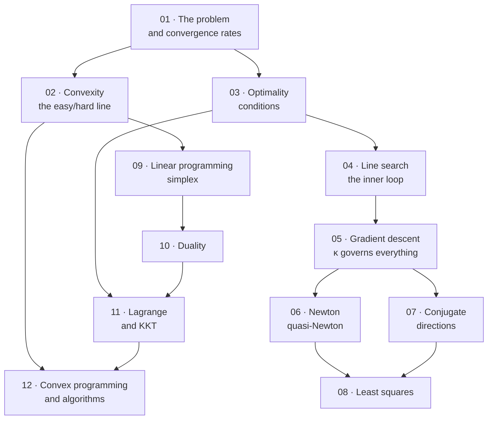

# Optimization — Map of Content

> [!warning] Read this first — the scope of these notes is my own editorial decision
> **There are no lecture slides for this subject.** The vault contains **four textbooks totalling 2,162 pages**, spanning three different courses at two different levels. **Nothing indicates which of them the course follows, or which chapters.**
>
> | Book | Pages | What it is | Level | Usable? |
> |---|---|---|---|---|
> | **Chong & Żak**, *An Introduction to Optimization* 4e | 642 | Senior-undergraduate survey: all of unconstrained, LP and nonlinear constrained | **Undergraduate** | **Yes — prose extracts, formulas do not** |
> | **Luenberger & Ye**, *Linear and Nonlinear Programming* 4e | 547 | The classic graduate text; the same territory with real proofs | Graduate | **Yes — cleanest source in the folder** |
> | **Bertsimas & Tsitsiklis**, *Introduction to Linear Optimization* | 606 | Linear programming only, in depth | Graduate | **Partly — bad OCR, and some boxed theorems are lost** |
> | **Léonard & Long**, *Optimal Control … in Economics* | 367 | Optimal control and dynamic optimization for economists | Graduate | **No — the PDF has no text layer at all** |
>
> **My scope decision: Chong & Żak is the spine, Luenberger & Ye is the authority, Bertsimas & Tsitsiklis is the depth reserve for linear programming, and Léonard & Long is out of scope.**
>
> **Why that spine.** Chong & Żak is the only one of the four written for undergraduates, it is the only one covering *both* linear and nonlinear programming at a single level, and its chapter 13 (neural network training) and chapter 14 (randomized search) are the two chapters closest to what a Data Science degree actually needs. **Where its OCR destroys a formula — which is often — the statement is taken from Luenberger & Ye and verified.**
>
> **Why Léonard & Long is excluded.** **The file is 367 pages of scanned images with no extractable text whatsoever** — not degraded text, *no* text. It cannot be read by any means available here. Its subject (**optimal control, Hamiltonians, the maximum principle, dynamic programming in continuous time**) is also the one genuinely different topic in the folder: it belongs to dynamic economics, not to the static optimization the other three books teach. **If the course covers optimal control, these notes do not, and you will need a readable copy.**
>
> **Confirm this against the real syllabus.**

---

## Chapters

| # | Chapter | Sources | Status | One-line description |
|---|---|---|---|---|
| 01 | [[01 - The Optimization Problem]] | C&Ż 1–5, L&Y 1 | ✅ | The standard form, minimizers, **Weierstrass and coercivity**, the taxonomy of problems, iterative algorithms, **order of convergence and why the ratio matters as much as the order** |
| 02 | [[02 - Convex Sets and Convex Functions]] | C&Ż 4, 22.1–22.3; L&Y 7 | ✅ | Convex sets, hyperplanes and polyhedra, the epigraph, **the Hessian test and the calculus of convexity**, strict convexity and uniqueness, **local $\Rightarrow$ global** |
| 03 | [[03 - Unconstrained Optimality Conditions]] | C&Ż 6 | ✅ | Feasible directions, **FONC, SONC, SOSC**, **why $\nabla f=\mathbf 0$ is only the interior corollary**, the two opposite ways FONC fails, and why the conditions are not an algorithm |
| 04 | [[04 - One-Dimensional Search Methods]] | C&Ż 7; L&Y 8.1 | ✅ | Golden section and the ratio $\rho$, Fibonacci's optimality, bisection, **Newton and secant as quadratic fits**, and **why real methods use Armijo backtracking instead of an exact line search** |
| 05 | [[05 - Gradient Methods]] | C&Ż 8; L&Y 8.2–8.4 | ✅ | Steepest descent and orthogonal steps, **$0<\alpha<2/\lambda_{\max}$**, **Kantorovich's sharp rate $\left(\frac{\kappa-1}{\kappa+1}\right)^2$ and the $3.45\kappa$ iteration count**, the zig-zag, **preconditioning — and the SGD/Adam material no book here contains** |
| 06 | [[06 - Newton and Quasi-Newton Methods]] | C&Ż 9, 11; L&Y 8.5, 10 | ✅ | **Quadratic convergence and the invertibility hypothesis nobody checks**, Levenberg–Marquardt as a dial from Newton to gradient descent, **the secant condition, DFP and BFGS**, L-BFGS, and the $O(n^3)$ cost that decided everything |
| 07 | [[07 - Conjugate Direction Methods]] | C&Ż 10; L&Y 9 | ✅ | $Q$-conjugacy, **exact termination in $n$ steps**, the expanding subspace theorem, **CG's two-term recurrence**, Fletcher–Reeves/Polak–Ribière/Hestenes–Stiefel, **the $O(\sqrt\kappa)$ rate**, and CG as the standard large-sparse solver |
| 08 | [[08 - Least Squares and Linear Equations]] | C&Ż 12 | ✅ | The normal equations as orthogonal projection, **the pseudoinverse** and minimum-norm solutions, **why $\kappa(A^{\mathsf T}A)=\kappa(A)^2$ means never forming them**, **RLS as online learning and Kaczmarz as SGD** |
| 09 | [[09 - Linear Programming and the Simplex Method]] | C&Ż 15–16; L&Y 2–3; B&T 1–3 | ✅ | Standard form, **vertex = extreme point = basic feasible solution**, the fundamental theorem, **the simplex algorithm** and the ratio test, two-phase, degeneracy and cycling, **Klee–Minty vs practice** |
| 10 | [[10 - Duality]] | C&Ż 17; L&Y 4; B&T 4 | ✅ | Where the dual comes from, the dualisation recipe, **weak duality as a verifiable certificate**, strong duality two ways, the four states (**both can be infeasible**), **complementary slackness**, **shadow prices and their range of validity**, and **Farkas' lemma** |
| 11 | [[11 - Constrained Optimization - Lagrange and KKT]] | C&Ż 20–21; L&Y 11 | ✅ | Tangent and normal spaces, **the Lagrange condition**, why regularity is not a technicality, the Lagrangian as a saddle point, second-order conditions **on a subspace**, **the Rayleigh quotient as PCA**, **the KKT conditions**, $T$ vs $\tilde T$, sensitivity, and **KKT ⟹ the LP dual** |
| 12 | [[12 - Convex Programming and Constrained Algorithms]] | C&Ż 22–23 (+ 14, 24); L&Y 12–13, §5.5 | ✅ | **When KKT becomes sufficient and global**, when the **duality gap** closes (Slater), semidefinite programming, **projections and projected gradient**, primal–dual methods, **penalty and barrier methods**, the **central path** and interior point, **and the modern ML optimizers none of these books contain** (FISTA, ADMM, mirror descent, SQP) |

---

## How the subject fits together

**Four phases:**

1. **Setting up (01–03).** What a minimizer is, what makes a problem tractable, and what conditions a solution must satisfy. **Chapter 02 is the one that decides everything else** — convex or not is the real dividing line in this subject, not linear or nonlinear.
2. **Unconstrained algorithms (04–08).** Every one of them has the same shape — *pick a direction, pick a step size, repeat* — and they differ only in how much curvature information they use. **Chapter 05's condition number is the quantity all of them are fighting.**
3. **Linear programming (09–10).** A self-contained world with its own geometry and its own algorithm, and **the cleanest duality theory in mathematics.**
4. **Constrained nonlinear (11–12).** Lagrange generalises to inequalities as **KKT**, and convexity turns those necessary conditions into sufficient ones.

> [!tip] Where a data-science reader should spend the effort
> **Chapters 02, 05, 11 and 12.** Convexity, gradient descent and its condition number, KKT, and the boundary of what is solvable. **Chapters 04, 07 and 09 are classical and beautiful and you will use them rarely** — golden-section search and the simplex tableau are not part of a modern ML workflow, though the ideas underneath them (inexact line search, vertex optimality) are.

---

## The three ideas the subject is really about

> [!important] 1. Every algorithm in the book is the same algorithm
> $$\mathbf x_{k+1}=\mathbf x_k+\alpha_k\mathbf d_k$$
>
> **Choose a direction $\mathbf d_k$, choose a step length $\alpha_k$, repeat.** That is *all* of chapters 04–08 and most of 12. The methods differ only in the answer to one question: **how much do you know about the curvature, and how much are you willing to pay to know it?**
>
> | Method | $\mathbf d_k$ | Curvature used | Cost per step |
> |---|---|---|---|
> | Steepest descent | $-\nabla f$ | none | $O(n)$ |
> | Conjugate gradient | $-\nabla f+\beta_k\mathbf d_{k-1}$ | implicit, accumulated | $O(n)$ |
> | Quasi-Newton (BFGS) | $-H_k\nabla f$ | approximated from past gradients | $O(n^2)$ |
> | Newton | $-[\nabla^2f]^{-1}\nabla f$ | exact | $O(n^3)$ |
>
> **Read the table downward and you are trading arithmetic per step against number of steps.** Which end wins depends entirely on $n$ — and in machine learning $n$ is in the millions, which is why the top row won.

> [!important] 2. The dividing line is convexity, not linearity
> **For a convex problem, every local minimum is global, and the first-order conditions are *sufficient*.** For a non-convex problem, no algorithm can certify that what it found is the best — it can only certify that it is stationary.
>
> **This is the real content of the subject.** "Linear programming is easy and nonlinear programming is hard" is the folk version and it is wrong: **convex quadratic programming is easy, and integer *linear* programming is NP-hard.**
>
> **The uncomfortable corollary for data science:** training a neural network is a non-convex problem, so **nothing in this subject can promise the trained weights are optimal.** That the practice works anyway is an empirical fact, not a theorem.

> [!important] 3. Duality turns a minimisation into a maximisation, and the gap is the certificate
> **Every minimisation problem has a shadow — a maximisation whose value never exceeds it (weak duality), and under mild conditions equals it (strong duality).**
>
> **Three payoffs, and they recur across the whole degree:**
> 1. **A feasible dual solution is a *proof* of a lower bound.** You can stop an algorithm and say how far from optimal you are. Nothing else in optimization gives you that.
> 2. **The multipliers are prices.** $\lambda_i$ is the rate at which the optimum improves per unit of relaxation in constraint $i$ — the marginal value of a resource. Economics is built on this reading.
> 3. **The dual is sometimes the easier problem.** SVMs are trained in the dual; the kernel trick only exists there.

---

## Key results

$$\text{FONC: } \nabla f(\mathbf x^*)=\mathbf 0 \qquad\qquad \text{SOSC: } \nabla f(\mathbf x^*)=\mathbf 0\ \text{ and }\ \nabla^2 f(\mathbf x^*)\succ0$$

$$\boxed{\mathbf x_{k+1}=\mathbf x_k-\alpha_k\nabla f(\mathbf x_k)}\qquad\qquad \boxed{\mathbf x_{k+1}=\mathbf x_k-\left[\nabla^2f(\mathbf x_k)\right]^{-1}\nabla f(\mathbf x_k)}$$

$$\text{steepest descent on a quadratic: } \frac{f(\mathbf x_{k+1})-f^*}{f(\mathbf x_k)-f^*}\le\left(\frac{\kappa-1}{\kappa+1}\right)^{2},\qquad \kappa=\frac{\lambda_{\max}}{\lambda_{\min}}$$

$$\text{LP: }\min \mathbf c^{\mathsf T}\mathbf x \text{ s.t. } A\mathbf x=\mathbf b,\ \mathbf x\ge\mathbf 0 \qquad\longleftrightarrow\qquad \text{dual: }\max \boldsymbol\lambda^{\mathsf T}\mathbf b \text{ s.t. } \boldsymbol\lambda^{\mathsf T}A\le\mathbf c^{\mathsf T}$$

$$\boxed{\text{KKT: }\ \nabla f+\sum_i\lambda_i\nabla h_i+\sum_j\mu_j\nabla g_j=\mathbf 0,\quad \mu_j\ge0,\quad \mu_jg_j=0}$$

---

## The mistakes that cost the most marks

1. **Treating $\nabla f=\mathbf 0$ as sufficient.** It is necessary and nothing more — saddle points and maxima satisfy it too.
2. **Forgetting that the first-order condition is different on a boundary.** With a set constraint the condition is $\mathbf d^{\mathsf T}\nabla f(\mathbf x^*)\ge0$ for all *feasible* directions, and it reduces to $\nabla f=\mathbf 0$ only in the interior.
3. **Getting the sign of the KKT multiplier wrong.** Equality multipliers are free in sign; **inequality multipliers must be $\ge0$**, and the sign convention flips if you write $g(\mathbf x)\ge0$ instead of $\le0$.
4. **Forgetting complementary slackness.** $\mu_jg_j(\mathbf x^*)=0$ — either the constraint is active or its multiplier is zero. It is the condition that makes KKT solvable by case analysis.
5. **Confusing "positive definite" with "positive entries."** $\begin{psmallmatrix}1&2\\2&1\end{psmallmatrix}$ has all-positive entries and eigenvalues $3,-1$.
6. **Checking convexity of a *function* by looking at its level sets.** Convex level sets mean *quasi*convex, which is weaker and does not give you the local-implies-global theorem.
7. **Using the simplex method without converting to standard form first** — equalities, non-negativity, and $b\ge0$.
8. **Misreading a degenerate LP vertex** as a bug in the algorithm.
9. **Applying a convergence-rate result to a non-quadratic function** as if it were exact. Those rates are asymptotic and local.
10. **Assuming a small gradient means you are near a minimum.** In an ill-conditioned problem the gradient can be tiny while the function value is far from optimal — this is exactly what $\kappa$ measures.

---

## What is not covered, and why

| Source | Topic | Why excluded |
|---|---|---|
| **Léonard & Long, all 367 pp.** | **Optimal control, Hamiltonians, Pontryagin's maximum principle, continuous-time dynamic programming** | **The PDF has no text layer — it cannot be read at all.** This is a hard technical block, not a judgement about relevance. **Flag to the lecturer if the course covers optimal control.** |
| C&Ż 1–3 | Methods of proof; vector spaces; eigenvalues, quadratic forms, matrix norms | **Fully covered by [[Linear Algebra/contents/00-Index\|Linear Algebra]]** ch. 03, 05–08. Only the pieces used directly — definiteness and the condition number — are restated, in ch. 02 and 05. |
| C&Ż 5 | Sequences, limits, differentiability, gradients, Taylor series | **Fully covered by [[Calculus/contents/00-Index\|Calculus]]** ch. 01, 06, 07. |
| C&Ż 13 | Unconstrained optimization and neural networks | **Covered as [[Machine Learning/contents/00-Index\|Machine Learning]] material**, and its treatment (a single sigmoid neuron, batch backpropagation) is 2013-vintage. **Its one durable point — that backprop *is* the chain rule — is in [[Calculus/contents/07 - Partial Derivatives and the Gradient\|Calculus ch. 07]].** |
| C&Ż 14 | Global search: Nelder–Mead, simulated annealing, particle swarm, genetic algorithms | **Summarised in ch. 12** rather than given a chapter. These are heuristics with no convergence guarantees; in practice a DS reader meets them only as hyperparameter search, where random search and Bayesian optimization have displaced them. |
| C&Ż 18–19 | Khachiyan, affine scaling, Karmarkar; integer LP and Gomory cuts | **Interior-point methods are summarised in ch. 12**; the specific 1980s algorithms are of historical interest. **Integer programming is a different subject** (combinatorial optimization) and cannot be done justice in a section. |
| C&Ż §20.6, Example 20.10 | Minimizing $\tfrac12\mathbf x^{\mathsf T}Q\mathbf x$ subject to $A\mathbf x=\mathbf b$ in closed form, $\mathbf x^\star=Q^{-1}A^{\mathsf T}(AQ^{-1}A^{\mathsf T})^{-1}\mathbf b$; and its discrete-time optimal-control application | **The $Q=I$ case is already [[08 - Least Squares and Linear Equations\|ch. 08]] §5's minimum-norm solution.** The general $Q$ adds a weighting and no new idea; the control example needs the state-space machinery of [[Time-series Analysis/contents/06 - The Kalman Filter and State-Space Models\|Time-series ch. 06]]. Worth knowing that this is the **equality-constrained QP** solved inside every SQP method. |
| L&Y §11.4 (hanging chain); §11.6 beyond the projected Hessian test | Equilibrium shape of a chain; eigenvalue theory in the tangent subspace | The chain is a physics application with no DS analogue. The eigenvalue theory is graduate material; **the projected Hessian test, which is the usable part, is in ch. 11 §6.** |
| C&Ż 24 | Multiobjective optimization, Pareto fronts | **Genuinely relevant** (precision–recall trade-offs, fairness constraints) **but out of scope at this length**; noted in ch. 12's closing section. |
| L&Y 5–6 | Interior-point methods; conic linear programming, SDP | Graduate material. **SDP appears in ch. 12** because Chong & Żak §22.4 covers it and it is the natural endpoint of convex programming. |
| L&Y 3.7–3.8, 4.5 | Transportation problems, decomposition, max-flow/min-cut | **Network optimization is its own subject**, and the max-flow/min-cut theorem is now covered as [[Discrete Mathematics/contents/10 - Network Flows and Matching\|Discrete Mathematics ch. 10]] (Johnsonbaugh ch. 10), where it belongs — with the graph theory it needs. **The most attractive omission in this table**; L&Y calls max-flow/min-cut "one of the most exemplary pairs of primal and dual problems" and it is worth reading if graphs interest you. |
| L&Y 4.6–4.7; C&Ż's forward reference in §17.1 | The **dual simplex method** and the **primal–dual algorithm** | Computational refinements of the simplex method rather than new theory. The primal simplex of ch. 09 plus the duality theory of ch. 10 is the right stopping point; the dual simplex matters in practice mainly for **warm-starting after a right-hand-side change**, which is exactly the sensitivity setting of ch. 10 §9. |
| B&T 6–11 | Large-scale LP, network flows, complexity, integer programming, robust LP | Beyond the scope of a first course, and **the OCR of this book is too poor to work from at length** (see below). |

**Also omitted:** all MATLAB exercises. Chong & Żak assumes MATLAB throughout; **these notes use Python, and the algorithms are described in a form you can implement in NumPy.**

---

## Cross-subject links

- [[Calculus/contents/08 - Multivariable Optimization|Calculus ch. 08]] — **this subject begins exactly where that chapter ends.** Gradients, Hessians, the second-derivative test and Lagrange multipliers with one equality constraint are its prerequisites; **ch. 03 and ch. 11 here are the general versions.**
- [[Linear Algebra/contents/00-Index|Linear Algebra]] — **eigenvalues are the subject's central diagnostic.** Definiteness classifies critical points (ch. 03); the **condition number $\kappa=\lambda_{\max}/\lambda_{\min}$ governs every first-order method's speed** (ch. 05); the normal equations and pseudoinverse are ch. 08; **and the absent SVD** ([[Linear Algebra/contents/00-Index|flagged there]]) is what least squares really wants.
- [[Machine Learning/contents/00-Index|Machine Learning]] — **training a model *is* an optimization problem.** Loss minimisation is ch. 05; regularisation is a penalty method (ch. 12); the SVM is a convex QP solved in its dual (ch. 10); and **the non-convexity of deep networks is why nothing here comes with a guarantee.**
- [[Mathematical Statistics/contents/00-Index|Mathematical Statistics]] — **maximum likelihood is minimisation of $-\ell(\theta)$.** Fisher scoring is Newton's method; the EM algorithm is a majorise–minimise scheme; and the **information matrix is a Hessian.**
- [[Econometrics/contents/00-Index|Econometrics]] — OLS is the least-squares problem of ch. 08 solved in closed form; GMM, MLE and NLS are all iterative optimizations; **multicollinearity is ill-conditioning**, i.e. a large $\kappa$.
- [[Microeconomics/contents/00-Index|Microeconomics]] — **utility maximisation subject to a budget constraint is the KKT problem of ch. 11**, and the multiplier is the marginal utility of income. **Duality here is the same duality as in cost/expenditure functions.**
- [[Probability Theory/contents/00-Index|Probability Theory]] — the randomized methods of ch. 12 (simulated annealing, genetic algorithms) are Markov chains; **entropy maximisation subject to moment constraints is a Lagrange problem** whose solution is the exponential family.

---

## ⚠️ Source-material issues

> [!warning] Textbook only — no slides, and **four textbooks disagreeing about the level**
> - **There are no lecture slides.** Chapter scope, ordering, emphasis and every exercise are **my own editorial decisions.**
> - **Two of the four books are graduate texts and one is undergraduate**, so the same theorem appears at three different levels of rigour. **These notes take Chong & Żak's level and Luenberger & Ye's statements.**
> - **Every end-of-chapter exercise in these notes is my own construction**, and **all arithmetic is independently verified** before it is written down.

> [!warning] **Léonard & Long is unreadable — 367 pages with no text layer**
> **This is not degraded text. There is none.** `pypdf` returns the empty string for every page sampled across the whole document; the file is a pure image scan and no OCR is available in this environment.
>
> **What is lost:** the entire treatment of **optimal control** — Hamiltonians, costate variables, Pontryagin's maximum principle, transversality conditions, continuous-time dynamic programming and the Hamilton–Jacobi–Bellman equation — as applied to economic growth, resource extraction and investment.
>
> **This matters more than a page count suggests**, because it is the only topic in the folder the other three books do not also cover, and because **dynamic programming is the conceptual root of reinforcement learning** ([[Machine Learning/contents/00-Index|Machine Learning]], which is Silver's RL course). **If the syllabus includes optimal control, ask for a text-searchable copy.**

> [!warning] Chong & Żak — the spine, and it is OCR'd
> **Prose extracts well; displayed mathematics does not.** The book is a scan run through OCR, and the failure is systematic:
>
> | Extracted | Means | | Extracted | Means |
> |---|---|---|---|---|
> | `G`, `£` | $\in$ | | `V/` | $\nabla f$ |
> | `—►`, `->` | $\to$ | | `£>/`, `D f` | $Df$ |
> | `φ` | $\ne$ | | `#i`, `x\|` | $x_i$ |
> | `\\x\\` | $\lVert x\rVert$ | | `/` (standalone) | the function $f$ |
> | `Λ`, `Χ`, `ο` | Latin letters read as Greek | | `Ω` | correct — the constraint set |
>
> **The serious loss is structural: every displayed matrix and every multi-line equation collapses into unordered fragments.** The Hessian on p. 83 extracts as a scatter of `d2f`, `dx„dx\`, `Sw` with no rows, no brackets and no order. **Nothing matrix-shaped in this book can be read; it must be reconstructed and checked against Luenberger & Ye.**

> [!warning] Bertsimas & Tsitsiklis — the worst OCR in the vault, and it fails *silently*
> **Word-internal scrambling is constant:** `Tisll1aJlizing` for "visualizing", `cOllstraints` for "constraints", `ort;hogo'rralto` for "orthogonal to", `dirrlem;ion` for "dimension". Symbols: `2:` and `~` both for $\ge$, `:::;` for $\le$, `~n` for $\mathbb R^n$, `E` for $\in$, `'` for transpose, and **`=` is dropped entirely** — `Ax b` means $A\mathbf x=\mathbf b$.
>
> **The dangerous failure is different, though.** The book sets its definitions and theorems in ruled boxes, and **some of those boxes have no text layer at all.** The surrounding prose extracts perfectly and reads as if nothing is missing:
>
> > *"The next definition deals with polyhedra determined by a single linear constraint."* … *"Note that a hyperplane is the boundary of a corresponding halfspace."*
>
> — with **the definition of a hyperplane, which sits between those two sentences, simply absent.** Roughly a third of numbered statements are affected; the rest extract normally.
>
> **Consequence: this book is used only as a depth reserve for ch. 09–10, and nothing is taken from it that Luenberger & Ye does not independently state.**

> [!note] Luenberger & Ye — clean, and therefore load-bearing
> **This is a born-digital PDF and it extracts almost perfectly**, including displayed equations, $\geqslant$ symbols and numbered results. **Where the other two books' formulas are unreadable, the statement in these notes is Luenberger & Ye's.** Its only quirk is that page numbers in the table of contents extract digit-spaced (`1 1` for 11).

> [!warning] **A gap none of the four books can fill**
> **Not one of these textbooks covers stochastic gradient descent, mini-batching, momentum, Adam, or any optimizer actually used to train a modern model.** The newest of the four is 2016 and its algorithms are deterministic and full-batch.
>
> **This is a real hole for a Data Science major, not a stylistic complaint** — the entire practice of the field runs on methods this subject does not mention. **Chapter 12 closes it explicitly**, deriving the modern methods as modifications of ch. 05's steepest descent and stating plainly which results survive the change from deterministic to stochastic gradients. **That section is my own addition and is flagged as such in the note.**

> [!warning] Errata and notation clashes
> *(Filled in as chapters are written; every numeric claim is independently recomputed before it goes into these notes.)*
>
> | Where | Issue | Status |
> |---|---|---|
> | **C&Ż §4.5 vs B&T §2.1** | **"Polytope" and "polyhedron" are defined in *opposite* senses by the two books.** C&Ż: a *polytope* is an intersection of finitely many halfspaces and a *polyhedron* is a bounded one. B&T (and all modern usage): the reverse. | **Genuine clash.** These notes use the modern convention and flag it at first use in [[02 - Convex Sets and Convex Functions\|ch. 02]] |
> | C&Ż §22.2, Example 22.5 | $Q$ for $f=x_1x_2$ extracts as $\begin{psmallmatrix}0&1\\1&0\end{psmallmatrix}$, which gives $2x_1x_2$ | **Extraction artefact, not a book error** — the printed answer $-1$ is correct only with the lost factor $\tfrac12$ |
> | L&Y p. 2, 4 | Displayed constraint subscripts print as $j$ where the running index is $i$ (`h j(x) = 0, i = 1,…,m`); an ellipsis is dropped in `j = 1, 2, p` | **Extraction artefact** — the prose has it right |
> | **C&Ż §7.5, Example 7.5** | **Arithmetic error.** $12-\frac{102.6}{146.65}$ is printed as $11.33$; it is $11.3004$. **The wrong value is carried forward** — the next step's $14.73/116.11$ are $g$ and $g'$ evaluated at $11.33$, not $11.30$. The printed $x^{(2)}=11.21$ should be $11.20$. | **Genuine book error.** Correct iteration: $11.3004\to11.2019$; the true root is exactly $11.2$ |
> | **C&Ż §7.6, Example 7.6** | **Wrong points used.** The second secant step prints $x^{(2)}=11.25$; the correct recursion on the two most recent iterates $(12,\ 11.4016)$ gives $11.2272$. The printed value is exactly what pairing the *stale* $x^{(-1)}=13$ with $x^{(1)}$ produces | **Genuine book error** — and it violates the definition of the method |
>
> | **C&Ż Thm 8.4 vs L&Y Thm 2 (§8.2)** | **The two books give different convergence bounds for steepest descent.** C&Ż: $\left(1-\frac1\kappa\right)$, from Rayleigh's inequality. L&Y: $\left(\frac{\kappa-1}{\kappa+1}\right)^2$, from **Kantorovich's inequality**, which C&Ż never state. At $\kappa=10$ these are $0.900$ and $0.669$ | **Neither is wrong** — both are valid upper bounds. **Only L&Y's is attained** (verified). These notes use L&Y's and flag the difference in [[05 - Gradient Methods\|ch. 05]] |
> | L&Y §8.2 example | The $4\times4$ $Q$ has exact $r=1.8077$ and ratio $0.0828$; the book prints $1.8$ and $0.081$ | **Rounding, not an error** |
> | **C&Ż §9.3, the Powell showcase** | The book's flagship Newton example **converges only linearly**, with ratio exactly $(2/3)^4$, because $\nabla^2f(\mathbf 0)$ has eigenvalues $\{202,20,0,0\}$ — so it **violates Theorem 9.1's own invertibility hypothesis**, which the book never remarks on | **Not an error, but a significant omission.** Made the point of [[06 - Newton and Quasi-Newton Methods\|ch. 06]] Exercise 2 |
> | **C&Ż §23.5, Example 23.3(c)** | **Wrong value.** Prints $\|\mathbf x_\gamma\|^2-1=-\lambda_{\max}/(2\gamma)$; the correct value is $-\lambda_\gamma/(2\gamma)$, and for a **minimization** problem $\lambda_\gamma\to\lambda_{\min}$. The *bound* $\le\lambda_{\max}/(2\gamma)$ is fine; the *equality* is not. Verified at $\gamma=10^4$ with $Q=\operatorname{tridiag}(1,3,1)$: true $-7.929\times10^{-5}$ vs printed $-2.207\times10^{-4}$ | **Genuine book error** — wrong by the factor $\kappa=\lambda_{\max}/\lambda_{\min}$, hence **unbounded across problems**. Only the $O(1/\gamma)$ conclusion survives. Corrected in [[12 - Convex Programming and Constrained Algorithms\|ch. 12]] §7 |
>
> **All three C&Ż errors are in worked examples, not in any theorem**, and each was confirmed by independent recomputation. They cluster in the **numerical-methods chapters** (7, 23) — **no error was found in the theory chapters (4, 6, 15–17, 20–22) or anywhere in Luenberger & Ye or Bertsimas & Tsitsiklis.**

#optimization #index #moc
