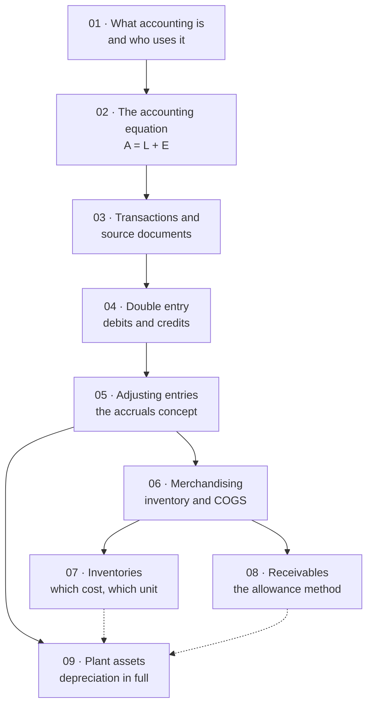

# Principle of Accounting — Map of Content

> [!info] Course information
> **Instructor:** Doan Thuy Duong, School of Advanced Education Programs (SAA)
> **Assessment:** 10% attendance and homework · 20% progress test 1 · 20% progress test 2 · 50% final exam
> **Textbook:** Weygandt, Kimmel & Kieso, *Accounting Principles*, 13th edition (in `documents/`)

---

## Chapters

| # | Chapter | One-line description |
|---|---|---|
| 01 | [[01 - Introduction to Accounting]] | What accounting is for, who uses it, the five financial statements, GAAP/IFRS, and the eight concepts that govern preparation |
| 02 | [[02 - The Accounting Equation]] | Why $A = L + E$ can never fail, what capital really is, and how profit links the two statements |
| 03 | [[03 - Accounting Transactions and Documents]] | The four transaction types, source documents and the audit trail, the imprest system, and payroll |
| 04 | [[04 - Ledger Accounting and Double Entry]] | Debits and credits, DEAD CLIC, and the double entry for every transaction type — including discounts and VAT |
| 05 | [[05 - Adjusting Entries]] | Making the accruals concept work: deferrals, accruals, depreciation, and the adjusted trial balance |
| 06 | [[06 - Accounting for Merchandising Operations]] | Buying and selling goods: perpetual vs periodic, cost of goods sold, FOB terms, and the two income statement formats |
| 07 | [[07 - Inventories]] | Which cost belongs to the units sold: FIFO, LIFO, average-cost, inventory errors, and LCNRV |
| 08 | [[08 - Accounting for Receivables]] | Estimating a loss you cannot yet identify: the allowance method, aging, factoring, and notes receivable |
| 09 | [[09 - Plant Assets, Natural Resources and Intangible Assets]] | Depreciation in full, plus depletion and amortisation — three names for one principle |

> [!warning] Chapter numbers here run one ahead of the deck filenames from ch. 05
> The deck `ch04 adjusting entry (cont).pptx` is a **separate topic** (Weygandt Ch. 3), not a continuation of the ledger chapter. Treating it as its own chapter puts these notes one number ahead of the source files thereafter:
>
> | Deck filename | Chapter here |
> |---|---|
> | `ch01`–`ch03` | 01–03 |
> | `ch04. Ledger accounting…` | **04** |
> | `ch04 adjusting entry (cont)` | **05** |
> | `ch05.pptx` | **06** |
> | `ch06.pptx` | **07** |
> | `ch07.pptx` | **08** |
> | `ch08.pptx` | **09** |
>
> The decks also carry Weygandt's own chapter numbers internally (the receivables deck says "Illustration 9-x", plant assets "10-x"), which match neither sequence.

---

## How the subject fits together

**Three phases:**

1. **Foundations (01–04)** — *how does recording work?* Concepts, the equation, paperwork, and the debit/credit mechanics. Nothing here is optional; every later chapter assumes it.
2. **The accruals problem (05)** — *how do you cut a continuous business into periods?* The pivot of the whole subject.
3. **Applying it to the major balance-sheet items (06–09)** — inventory, receivables, and long-lived assets. Each takes one line of the balance sheet and asks how to measure it.

---

## The five ideas that recur everywhere

> [!important] Internalise these and the individual rules follow
> **1. The business is separate from its owner.** The **business entity concept** explains why capital is a liability, why drawings are not an expense, and why the owner's holiday is not a business cost. First stated in [[01 - Introduction to Accounting|ch. 01]], applied constantly.
>
> **2. Revenue leads; expenses follow.** The **matching principle** is why we have adjusting entries ([[05 - Adjusting Entries|ch. 05]]), the two-entry sale ([[06 - Accounting for Merchandising Operations|ch. 06]]), the allowance method ([[08 - Accounting for Receivables|ch. 08]]), and depreciation ([[09 - Plant Assets, Natural Resources and Intangible Assets|ch. 09]]).
>
> **3. Cash timing is irrelevant to profit.** A sale is revenue when the goods transfer, not when cash arrives. This creates receivables, payables, prepayments and accruals — **every complication in the subject lives in that gap.**
>
> **4. Use a contra account whenever both the gross figure and the deduction carry information.** Accumulated Depreciation, Allowance for Doubtful Accounts, Sales Returns and Allowances, Sales Discounts. **Netting destroys information.**
>
> **5. Totals are fixed; only the allocation between periods is a matter of assumption.** FIFO vs LIFO ([[07 - Inventories|ch. 07]]) and straight-line vs declining-balance ([[09 - Plant Assets, Natural Resources and Intangible Assets|ch. 09]]) never change the lifetime total — **they change which year bears it.** This is the clearest evidence that accounting numbers rest on judgement, not just fact.

---

## Quick reference

### The debit/credit rules

$$
\textbf{DEAD}\ \text{— \textbf{D}ebit increases \textbf{E}xpenses, \textbf{A}ssets, \textbf{D}rawings}
$$
$$
\textbf{CLIC}\ \text{— \textbf{C}redit increases \textbf{L}iabilities, \textbf{I}ncome, \textbf{C}apital}
$$

### The four adjusting entries

| Type | Cash moved? | Entry |
|---|---|---|
| **Prepaid expense** | First (paid) | Dr Expense / Cr Asset |
| **Unearned revenue** | First (received) | Dr Liability / Cr Revenue |
| **Accrued revenue** | Not yet | Dr Asset / Cr Revenue |
| **Accrued expense** | Not yet | Dr Expense / Cr Liability |

**Every adjusting entry has one income-statement account and one balance-sheet account — and never touches Cash.**

### Key formulas

$$
C_{\text{closing}} = C_{\text{opening}} + \text{Profit} + \text{Injections} - \text{Drawings}
$$
$$
\text{COGS} = \text{Beginning inventory} + \text{Net purchases} - \text{Ending inventory}
$$
$$
\text{Cash realisable value} = \text{Accounts receivable} - \text{Allowance for doubtful accounts}
$$
$$
\text{Book value} = \text{Cost} - \text{Accumulated depreciation}
$$
$$
\text{Straight-line depreciation} = \frac{\text{Cost} - \text{Salvage value}}{\text{Useful life}}
\qquad
\text{DDB} = \text{Book value} \times \frac{2}{\text{Useful life}}
$$
$$
\text{Revised depreciation} = \frac{\text{Current NBV} - \text{New salvage}}{\text{Remaining life}}
$$
$$
\text{Interest} = \text{Principal} \times \text{Annual rate} \times \frac{\text{Time}}{12 \text{ or } 360}
$$

### Ratios

| Ratio | Formula | Chapter |
|---|---|---|
| Gross profit rate | Gross profit ÷ **Net** sales | [[06 - Accounting for Merchandising Operations\|06]] |
| Inventory turnover | COGS ÷ Average inventory | [[07 - Inventories\|07]] |
| Days in inventory | 365 ÷ Inventory turnover | [[07 - Inventories\|07]] |
| Receivables turnover | Net credit sales ÷ Average net AR | [[08 - Accounting for Receivables\|08]] |
| Average collection period | 365 ÷ Receivables turnover | [[08 - Accounting for Receivables\|08]] |

---

## The ten mistakes that cost the most marks

1. **Treating drawings as an expense.** Both reduce capital; only expenses reduce profit. ([[02 - The Accounting Equation|02]])
2. **Treating a payment as an expense.** Settling a payable, buying an asset and taking drawings all move cash without creating an expense. ([[04 - Ledger Accounting and Double Entry|04]])
3. **Confusing "on hand" with "used up"** in an adjusting entry. One is the asset remaining; the other is the expense. ([[05 - Adjusting Entries|05]])
4. **Putting Cash in an adjusting entry.** If Cash appears, it is not an adjusting entry. ([[05 - Adjusting Entries|05]])
5. **Forgetting the second entry on a sale** (Dr COGS / Cr Inventory) under a perpetual system. ([[06 - Accounting for Merchandising Operations|06]])
6. **Computing a settlement discount before deducting returns.** ([[06 - Accounting for Merchandising Operations|06]])
7. **Swapping beginning and ending inventory** in the COGS formula. Beginning is added, ending subtracted. ([[07 - Inventories|07]])
8. **Ignoring the existing allowance balance** under percentage-of-receivables — and forgetting that a *debit* balance makes the entry **larger**. ([[08 - Accounting for Receivables|08]])
9. **Applying declining-balance to depreciable cost** instead of book value. DDB ignores salvage until the final year. ([[09 - Plant Assets, Natural Resources and Intangible Assets|09]])
10. **Forgetting to bring depreciation up to the date of disposal** — it can flip a gain into a loss. ([[09 - Plant Assets, Natural Resources and Intangible Assets|09]])

---

## ⚠️ Source-material issues — read before relying on these notes

> [!warning] The systematic problem: **every illustration in every deck is an image**
> The decks are Weygandt's own PowerPoint sets. **Slide *text* extracts cleanly, but every numbered illustration — the diagrams, formula boxes, schedules and summary tables — is a picture with no extractable content.**
>
> The practical consequences:
> - **Every formula box is lost.** Formulas in these notes are **reconstructed** from the worked examples that use them. Wherever a worked example's numbers survive in slide text, **I have re-derived and verified them independently** — the land cost, the truck cost, all three depreciation schedules, the $685 declining-balance adjustment, the $19,375 revision, the depletion, the Wal-Mart and Cisco ratios, and the Celine's closing entries all check out exactly.
> - **Every comparison table is lost.** The FIFO/LIFO comparative effects (ch. 07), the depreciation method comparison (ch. 09), and the bases-for-estimating-uncollectibles comparison (ch. 08) — the three most examinable summaries in the course — are all images. Those tables here are reconstructions.
> - **Two entire appendices are image-only:** perpetual-system cost flow methods and inventory estimation (both ch. 07).

> [!warning] Chapters 01–03 are unusually thin
> The first three decks (20, 22 and 12 slides) are the instructor's own rather than Weygandt's, and several sections are **headings with no content**:
> - **Ch. 01 slide 17** ("Qualitative characteristics of useful financial information") — **title only**.
> - **Ch. 01 slide 18** — eight accounting concepts as bare bullet points, no definitions.
> - **Ch. 01 slides 19–20** — "Ethical considerations", **duplicated and both empty**.
> - **Ch. 02 slides 15, 17, 19** — image-only.
> - **Ch. 03 slide 4** — bare section heading; **slides 11–12** — the lecture's own questions, image-only.
>
> Everything in those sections of these notes is **reconstructed from the IASB Conceptual Framework and Weygandt**, and should be **checked against the lecturer's own material** before the exam.

> [!warning] Topics named but never taught
> Worth raising with the lecturer if they may be examinable:
> - **Company equity** — share capital, share premium, reserves. Ch. 02 defers this to "chapter 9"; **no such deck exists** (the decks stop at ch08).
> - **The statement of cash flows and the statement of changes in equity** are listed among the five financial statements in both ch. 01 and ch. 02 and **never explained**.
> - **The trial balance** is never introduced, though [[05 - Adjusting Entries|ch. 05]] presupposes it and [[04 - Ledger Accounting and Double Entry|ch. 04]]'s Question 2 requires balancing a T-account.
> - **Control accounts** and the receivables/payables ledger reconciliation ([[04 - Ledger Accounting and Double Entry|ch. 04]]).
> - **Exchange of plant assets** — ch. 09 refers to an appendix that is **not in the deck**.
> - **Impairment of plant assets** and **asset turnover** — ch. 09's LO 5 is listed and never covered.
> - **Non-normal-balance topics**: bank reconciliation, petty cash imprest journal workings, and the three-way match are mentioned only in passing.

> [!note] Exercises
> **The decks contain very few exercises and almost no answers.** Where a lecture DO IT! or question survives with its solution, it appears as an exercise in these notes with the original answer plus my own working. **Everything else is my own construction, with all arithmetic independently verified.** Chapters 03 and 04 in particular have image-only question slides whose content is lost entirely.

> [!warning] Two frameworks, mixed
> The course draws on **both US GAAP** (Weygandt — FASB, SEC, "Balance Sheet", "Income Statement", LIFO permitted) **and the UK/international presentation** (IAS 1, £m, "statement of financial position", "statement of profit or loss"). **Learn both vocabularies** — the glossary is in [[01 - Introduction to Accounting]] §3.
>
> **Where they genuinely differ, it matters:** **LIFO is permitted under GAAP and prohibited under IFRS**; **revaluation of plant assets is permitted under IFRS and prohibited under GAAP**. Vietnam follows IFRS-based standards, so **LIFO is examinable but not applicable in practice.**

---

## Cross-subject links

- [[Time-series Analysis/contents/01 - What is a Time Series|Time-series Analysis]] — the stock-vs-flow distinction is exactly the balance-sheet-vs-income-statement distinction
- [[Mathematical Statistics/contents/00-Index|Mathematical Statistics]] — the allowance method is an estimation problem; ratios are descriptive statistics
- [[Data Preparation and Visualization/contents/00-Index|Data Preparation & Visualization]] — financial statements are the canonical structured dataset; ratio analysis is feature engineering

#accounting #index #moc
