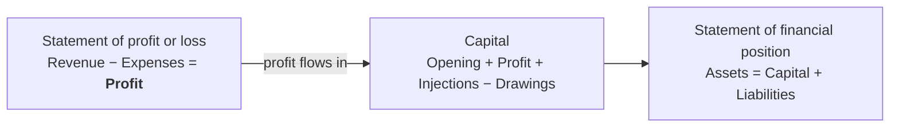

# The Accounting Equation

> [!abstract] Where this sits in the course
> [[01 - Introduction to Accounting]] showed the statement of financial position and noted that total assets always equals total equity and liabilities. **This chapter explains why that identity can never fail** — and turns it into the tool that makes double-entry bookkeeping work. Everything in [[03 - Accounting Transactions and Documents]] and [[04 - Ledger Accounting and Double Entry]] is an application of the one equation derived here.

---

## 📘 Main Knowledge

### 1. Assets, liabilities, and the business entity concept

#### Assets

**Assets are resources a business owns** — they **provide future services or benefits**. Examples: cash, supplies, equipment.

Assets are classified into two types:

| Type | Definition | Examples |
|---|---|---|
| **Non-current assets** | Assets acquired for **on-going, long-term use** in the business | Land and buildings, motor vehicles, plant and machinery |
| **Current assets** | Assets acquired for **resale**, or expected to be **realised within the normal course of trading** | Inventory (stock), receivables (money owed by credit customers), cash |

> [!important] The test is *purpose*, not the item itself
> A motor vehicle is a **non-current asset** to a delivery company that drives it, but **inventory** (a current asset) to a car dealership that sells it. **The same physical object is classified differently depending on why the business holds it.**
>
> This trips up more exam candidates than any other classification question. Always ask: *is this here to be used, or to be sold?*

#### Liabilities

**Liabilities are claims against assets** — debts and obligations owed to **creditors** (the party to whom money is owed). Examples: trade payables, other payables, salaries and wages payable.

| Type | Definition | Examples |
|---|---|---|
| **Non-current liabilities** | Long-term liabilities payable **more than 12 months** after the statement of financial position date | Loan |
| **Current liabilities** | Liabilities payable **within 12 months** of the statement of financial position date | Trade payables (money owed to credit suppliers), overdraft |

#### Capital — the sole trader

**Capital is how much the business owes back to the owner.**

> [!important] Read that sentence again — it is the key to everything
> Under the **business entity concept** ([[01 - Introduction to Accounting]]), the business is a **separate entity from its owner**. So when the owner puts £50,000 into the business, the business now *owes the owner* £50,000. **Capital is a liability of the business to its owner** — it just happens to be a liability that ranks last in a liquidation.
>
> Once you accept this, every confusing feature of capital, drawings and profit becomes obvious. It also explains why the accounting equation balances by construction rather than by coincidence.

**Year-end capital for a sole trader**, as shown on the face of the statement of financial position:

| | £ | |
|---|---|---|
| Balance at start of year | X | |
| Add: net profit for year (deduct a loss) | X | *Profit 'belongs' to the owner of the business* |
| Add: capital injections | X | *Amounts invested in the business in the accounting period by the owner* |
| Less: drawings for year | (X) | *Amounts taken out of the business in the accounting period by the owner* |
| **Balance at end of year** | **X** | |

$$
\boxed{\;C_{\text{closing}} = C_{\text{opening}} + \text{Profit} + \text{Capital injections} - \text{Drawings}\;}
$$

> [!note] Why profit increases capital
> The business earns £30,000 of profit. Who does it belong to? **The owner.** But the owner has not taken it out yet, so the business still holds it — and therefore owes it to the owner. **Capital rises by exactly the profit earned.** A loss works in reverse: the business has destroyed £X of the owner's wealth, so it owes £X less.
>
> **This is the mechanical link between the two financial statements.** Profit from the statement of profit or loss flows straight into capital on the statement of financial position. The statements cannot be prepared independently.

#### Equity — companies

**The capital within a company is shown in a slightly different way**, because there are often many different owners and they invest by **purchasing shares**. We therefore need to show their investment in these shares **separately from the profits earned and retained** by the business.

| Sole trader | Company |
|---|---|
| One "Capital" figure | **Share capital** (what owners paid in) + **Retained earnings** (profits kept in the business) + reserves |
| "Drawings" | **Dividends** |

> [!note] Why companies split it
> A shareholder who bought shares for £100,000 has a different kind of claim from £40,000 of accumulated profits that the directors chose not to distribute. Company law restricts what can be paid out as dividends — broadly, distributable profits only, not share capital — so the two must be kept visibly apart. **A sole trader has no such restriction, so one combined figure suffices.**
>
> This is developed further in **Chapter 9** of the textbook. *(Not covered by the slide decks in this vault — see the index's gap note.)*

---

### 2. The basic accounting equation

$$
\boxed{\;\textbf{Assets} \;=\; \textbf{Liabilities} \;+\; \textbf{Owner's Equity}\;}
$$

**It provides the underlying framework for recording and summarising economic events.**

The logic:

- **Assets are claimed by either creditors or owners.** Everything the business owns was funded by somebody — either people it must repay (creditors) or the owner.
- **If a business is liquidated, claims of creditors must be paid before ownership claims.**

That priority ordering is why liabilities are written first on the right-hand side, and why owner's equity is called **residual equity**: the owner gets whatever is left after everyone else is paid.

$$
\text{Owner's Equity} = \text{Assets} - \text{Liabilities} \qquad \text{(the residual)}
$$

> [!important] The equation is an identity, not a constraint
> It does not *sometimes* hold. It holds **by construction**, because equity is *defined* as the residual. Every transaction has two effects that keep it in balance — that is the content of double-entry bookkeeping in [[04 - Ledger Accounting and Double Entry]].
>
> **If your equation does not balance, you have made an error.** That is the whole point: the equation is a permanent, automatic error check built into the recording system.

#### The three elements

| Element | Definition | Examples |
|---|---|---|
| **Assets** | Resources a business **owns**; provide future services or benefits | Cash, Supplies, Equipment |
| **Liabilities** | **Claims against assets** — debts and obligations owed to creditors | Trade payable, other payable, salaries and wages payable |
| **Owner's Equity** | **Ownership claim on total assets**; the **residual equity** | Investment by owners and revenues (+); drawings and expenses (−) |

---

### 3. The expanded accounting equation

Owner's equity is not a single lump — four distinct things move it.

$$
\boxed{\;\text{Assets} = \text{Liabilities} + \underbrace{\text{Owner's Capital} - \text{Owner's Drawings} + \text{Revenues} - \text{Expenses}}_{\text{Owner's Equity}}\;}
$$

#### Increases in owner's equity

| Item | Definition |
|---|---|
| **Investments by owner** | The assets the owner puts into the business |
| **Revenues** | Result from business activities entered into for the purpose of **earning income**. Common sources: sales, fees, services, commissions, interest, dividends, royalties, rent |

#### Decreases in owner's equity

| Item | Definition |
|---|---|
| **Drawings** | An owner may withdraw cash or other assets **for personal use** |
| **Expenses** | The cost of assets **consumed** or services **used** in the process of earning revenue. Common examples: salaries expense, rent expense, utilities expense, tax expense |

> [!important] Drawings vs expenses — a distinction worth real marks
> Both **reduce** owner's equity, so students often treat them as interchangeable. They are not:
>
> | | Drawings | Expenses |
> |---|---|---|
> | Purpose | Owner's **personal** benefit | Incurred **to earn revenue** |
> | Appears in profit or loss? | **No** | **Yes** |
> | Effect on profit | **None** | Reduces it |
> | Effect on capital | Reduces it | Reduces it *via* reduced profit |
>
> **Both reduce capital, but only expenses reduce profit.** Misclassifying an owner's holiday as an expense understates profit — which is precisely why the tax authority cares. This is the **business entity concept** in action, and it is the most commonly tested application of it.

> [!note] Investments and revenues both increase equity — but differently
> An **investment** is the owner putting in more of their own money; it does not represent the business having performed. **Revenue** is the business earning something. Only revenue appears in the statement of profit or loss. The parallel with drawings vs expenses is exact, in reverse.

---

### 4. How the equation connects the statements

**Companies prepare four financial statements:**

1. Statement of Financial Position
2. Statement of Profit and Loss
3. Statement of Cash Flows
4. Statement of Changes in Equity

Two of them are governed directly by the equation.

#### The statement of financial position

Presents the equation in vertical form:

$$
\underbrace{\text{Non-current assets} + \text{Current assets}}_{\text{Assets}}
= \underbrace{\text{Capital}}_{\text{Equity}} + \underbrace{\text{Non-current liabilities} + \text{Current liabilities}}_{\text{Liabilities}}
$$

Or equivalently, in the **net assets** presentation common in the UK:

$$
\text{Net assets} = \text{Assets} - \text{Liabilities} = \text{Capital}
$$

#### The statement of profit and loss

$$
\text{Gross Profit} = \text{Revenue} - \text{Cost of Sales}
$$
$$
\text{Profit for the year} = \text{Gross profit} - \text{expenses} + \text{non-trading income}
$$

where **cost of sales is the purchase or production cost of the goods sold**.

#### The bridge

> [!important] The two statements are one system
> **Profit is computed in the statement of profit or loss and lands in capital on the statement of financial position.** You cannot prepare one without the other. This is why an error in an expense figure throws out *both* statements, and why the balance sheet balancing is a check on the profit calculation too.

---

## ✏️ Exercises

### Exercise 1 — Classify and state the effect

*(The lecture's own DO IT! exercise.)* Classify each item as investment by owner, owner's drawings, revenue, or expense. Then indicate whether it increases or decreases owner's equity.

1. Rent Expense
2. Service Revenue
3. Drawings
4. Salaries and Wages Expense

> [!example]- Solution
> | Item | Classification | Effect on equity |
> |---|---|---|
> | Rent Expense | **Expense** | **Decrease** |
> | Service Revenue | **Revenue** | **Increase** |
> | Drawings | **Drawings** | **Decrease** |
> | Salaries and Wages Expense | **Expense** | **Decrease** |
>
> **The rule in one line:** revenues and investments **increase** equity; expenses and drawings **decrease** it. Three of the four items here decrease equity — which is normal, since a business has many expense categories and comparatively few revenue lines.
>
> **The distinction that matters:** rent and salaries are **expenses** (incurred to earn revenue, so they appear in profit or loss); drawings are **not** (personal benefit, so they bypass profit or loss entirely and hit capital directly).

---

### Exercise 2 — Rewriting the equation

*(Lecture Question 1.)* Which one of the following can the accounting equation be rewritten as?

**A.** Assets + profit − drawings − liabilities = closing capital
**B.** Assets − liabilities − drawings = opening capital + profit
**C.** Assets − liabilities − opening capital + drawings = profit
**D.** Assets − profit − drawings = closing capital − liabilities

> [!example]- Solution
> **Answer: C.**
>
> **Start from the two facts you know.**
> $$\text{Assets} - \text{Liabilities} = \text{Closing capital} \tag{1}$$
> $$\text{Closing capital} = \text{Opening capital} + \text{Profit} - \text{Drawings} \tag{2}$$
> (ignoring capital injections, which none of the options mention).
>
> **Substitute (2) into (1):**
> $$A - L = C_{\text{open}} + P - D$$
> **Rearrange to isolate profit:**
> $$A - L - C_{\text{open}} + D = P \;\;✓ \quad\text{— which is exactly option C.}$$
>
> **Why the others fail:**
> - **A:** $A + P - D - L = C_{\text{close}}$. But $A - L$ *already equals* $C_{\text{close}}$, so this requires $P - D = 0$. Only true by coincidence.
> - **B:** $A - L - D = C_{\text{open}} + P$. The correct relation is $A - L + D = C_{\text{open}} + P$. **The sign on drawings is wrong** — this is the trap option, and it catches anyone who rearranges carelessly.
> - **D:** $A - P - D = C_{\text{close}} - L$. Substituting $C_{\text{close}} = A - L$ gives $A - P - D = A - 2L$, i.e. $P + D = 2L$. Nonsense.
>
> **Method to use under exam pressure.** Do not manipulate symbols blindly — **plug in numbers.** Take $A = 100$, $L = 40$, $C_{\text{open}} = 50$, $D = 10$; then $C_{\text{close}} = 60$ and $P = 60 - 50 + 10 = 20$. Test each option: C gives $100 - 40 - 50 + 10 = 20 = P$ ✓, while B gives $100-40-10 = 50$ against $50+20 = 70$ ✗. **Thirty seconds, no algebra, no risk of a sign slip.**

---

### Exercise 3 — Closing net assets

*(Lecture Question 2.)* The profit earned by a business in 20X7 was $72,500. The proprietor injected new capital of $8,000 during the year and withdrew goods for his private use which had cost $2,200. If net assets at the beginning of 20X7 were $101,700, what were the closing net assets?

**A.** $35,000 **B.** $39,400 **C.** $168,400 **D.** $180,000

> [!example]- Solution
> **Answer: D — $180,000.**
>
> **Net assets = capital**, so apply the capital movement formula directly:
>
> | | $ |
> |---|---|
> | Opening net assets (= opening capital) | 101,700 |
> | Add: profit for the year | 72,500 |
> | Add: capital injection | 8,000 |
> | Less: drawings | (2,200) |
> | **Closing net assets** | **180,000** |
>
> Check: $101{,}700 + 72{,}500 + 8{,}000 - 2{,}200 = 180{,}000$ ✓
>
> **Two deliberate traps in this question:**
>
> **1. "Withdrew *goods*... which had cost $2,200."** Drawings need not be cash. Taking inventory for personal use is still drawings, measured at **cost** ($2,200), not at selling price. Some candidates hesitate because "goods" does not look like a withdrawal — it is.
>
> **2. The distractors are built from sign errors.** Option C ($168,400) is what you get if you **subtract** the injection instead of adding it *and* mishandle drawings; option B ($39,400) comes from subtracting profit. **The wrong answers are engineered to match specific mistakes**, so getting a number that appears in the options is no confirmation you are right.
>
> **Note that "net assets" and "capital" are interchangeable here** — that identity ($A - L = C$) is exactly what makes the question solvable without knowing any individual asset or liability figure.

---

### Exercise 4 — Which elements change?

*(Lecture Question 3.)* A sole trader borrows $10,000 from a bank. Which elements of the accounting equation will change due to this transaction?

**A.** Assets and liabilities **B.** Assets and capital **C.** Capital and liabilities **D.** Assets only

> [!example]- Solution
> **Answer: A — assets and liabilities.**
>
> The business receives **cash** (an asset, +$10,000) and takes on a **bank loan** (a liability, +$10,000):
> $$\underbrace{A + 10{,}000}_{\text{cash up}} = \underbrace{L + 10{,}000}_{\text{loan up}} + \underbrace{C}_{\text{unchanged}}$$
> Both sides rise by $10,000; the equation still balances. ✓
>
> **Why capital is untouched.** Borrowing is **not income**. The business is no better off — it has $10,000 more cash and owes $10,000 more. **Nothing has been earned, so no profit arises, so capital does not move.**
>
> **The distinction that matters here:** contrast this with the *owner* putting in $10,000. Then cash rises by $10,000 and **capital** rises by $10,000 — option B. The cash flow looks identical; the accounting is completely different, because one creates a debt to an outsider and the other a debt to the owner. **This pair of transactions is the cleanest illustration of the business entity concept there is.**

---

### Exercise 5 — Trace transactions through the equation

Nguyen starts a consulting business. Record the effect of each transaction on Assets, Liabilities and Capital, and show the equation balances after each. Then compute profit for the period.

1. Nguyen invests £60,000 cash to start the business.
2. Buys office equipment for £18,000 cash.
3. Buys supplies on credit for £3,000.
4. Provides consulting services for £24,000 cash.
5. Pays rent of £5,000 cash.
6. Pays £2,000 of the amount owed for supplies.
7. Provides services on credit for £9,000.
8. Nguyen withdraws £4,000 cash for personal use.
9. Supplies costing £1,100 have been used up by the period end.

> [!example]- Solution
> Tracking the expanded equation. All figures £.
>
> | # | Transaction | Assets | = | Liab. | + | Capital | Note |
> |---|---|---|---|---|---|---|---|
> | 1 | Owner invests | Cash **+60,000** | | — | | **+60,000** | Investment |
> | 2 | Buy equipment | Cash −18,000, Equip **+18,000** | | — | | — | **Asset swap** |
> | 3 | Supplies on credit | Supplies **+3,000** | | Payables **+3,000** | | — | |
> | 4 | Services for cash | Cash **+24,000** | | — | | **+24,000** | Revenue |
> | 5 | Pay rent | Cash **−5,000** | | — | | **−5,000** | Expense |
> | 6 | Pay supplier | Cash **−2,000** | | Payables **−2,000** | | — | |
> | 7 | Services on credit | Receivables **+9,000** | | — | | **+9,000** | Revenue |
> | 8 | Drawings | Cash **−4,000** | | — | | **−4,000** | Drawings |
> | 9 | Supplies used | Supplies **−1,100** | | — | | **−1,100** | Expense |
>
> **Closing position:**
>
> | Assets | £ | | Liabilities & capital | £ |
> |---|---|---|---|---|
> | Cash | 55,000 | | Trade payables | 1,000 |
> | Receivables | 9,000 | | Capital | 82,900 |
> | Supplies | 1,900 | | | |
> | Equipment | 18,000 | | | |
> | **Total** | **83,900** | | **Total** | **83,900** ✓ |
>
> *Cash: $60{,}000-18{,}000+24{,}000-5{,}000-2{,}000-4{,}000 = 55{,}000$. Supplies: $3{,}000-1{,}100 = 1{,}900$.*
>
> **Capital reconciliation:**
> $$60{,}000 \;(\text{investment}) + 24{,}000+9{,}000 \;(\text{revenue}) - 5{,}000-1{,}100 \;(\text{expenses}) - 4{,}000 \;(\text{drawings}) = 82{,}900\;✓$$
>
> **Profit for the period:**
> $$\text{Revenue } (24{,}000+9{,}000) - \text{Expenses } (5{,}000+1{,}100) = \mathbf{£26{,}900}$$
>
> And the capital formula confirms it: $C_{\text{close}} = 0 + 26{,}900 + 60{,}000 - 4{,}000 = 82{,}900$ ✓
>
> ---
> **Five things this exercise is designed to teach:**
>
> **1. Transaction 2 is an asset swap.** Cash down, equipment up, by the same amount. **Total assets are unchanged** — buying an asset with cash is not an expense and does not affect profit. Students routinely want to record £18,000 as an expense; it is not, because the equipment is still there.
>
> **2. Transaction 7 is revenue even though no cash moved.** This is the **accruals concept** ([[01 - Introduction to Accounting]]). The service has been performed, so the revenue is earned; the receivable is the promise of cash to come.
>
> **3. Transaction 8 is not an expense.** Drawings reduce capital directly and **never touch profit**. If you had treated it as an expense, profit would show £22,900 — understated by £4,000.
>
> **4. Transaction 9 shows when a purchase becomes an expense.** Supplies were an *asset* when bought (transaction 3) and become an *expense* only as they are **consumed**. This is an **adjusting entry**, and it is the entire subject of [[05 - Adjusting Entries]].
>
> **5. The equation balances after every single line.** That is the property that makes double-entry bookkeeping self-checking — and it is why [[04 - Ledger Accounting and Double Entry]] can rely on a trial balance to catch errors.

---

## 📝 Summary

- **Assets** are resources the business owns that provide future benefits, split into **non-current** (for long-term use) and **current** (for resale or realisation within the normal trading cycle). **The classification depends on purpose, not on the item** — a car is inventory to a dealer and a non-current asset to a courier.
- **Liabilities** are claims against assets, split into **non-current** (payable more than 12 months out) and **current** (within 12 months).
- **Capital is how much the business owes back to the owner** — a direct consequence of the **business entity concept**. For a sole trader:
  $$C_{\text{closing}} = C_{\text{opening}} + \text{Profit} + \text{Injections} - \text{Drawings}$$
- **Companies split capital** into share capital (what owners paid in) and retained earnings (profits kept), because company law restricts what may be distributed.
- **The basic accounting equation** is
  $$\text{Assets} = \text{Liabilities} + \text{Owner's Equity}$$
  Assets are claimed by creditors or owners; **creditors rank ahead of owners in liquidation**, which is why equity is the **residual**.
- **The expanded equation** decomposes equity:
  $$A = L + \text{Capital} - \text{Drawings} + \text{Revenues} - \text{Expenses}$$
- **Revenues and investments increase equity; expenses and drawings decrease it.** But **only revenues and expenses pass through profit** — investments and drawings hit capital directly.
- **The equation is an identity that holds after every transaction**, which is what makes double-entry self-checking. **Profit links the two statements:** it is computed in profit or loss and lands in capital on the statement of financial position.

---

## ⚠️ Important Notes

> [!warning] Drawings are not an expense
> The single most-tested confusion in this chapter. Both reduce capital, but **drawings never appear in the statement of profit or loss.** If drawings were treated as an expense, profit would be understated and the owner would (illegitimately) reduce their tax bill. Watch for drawings disguised as something else: "goods withdrawn for personal use", "the owner's car insurance paid by the business", "wages paid to the proprietor" — **a sole trader cannot pay themselves wages; it is drawings.**

> [!warning] Buying an asset is not an expense
> Paying £18,000 cash for equipment converts one asset into another. **Total assets are unchanged, profit is unaffected.** The cost becomes an expense only gradually, through **depreciation** ([[05 - Adjusting Entries]]). Similarly, paying off a liability reduces cash *and* the liability — it is not an expense either, because the expense was recorded when the obligation arose.

> [!warning] Borrowing is not income
> Cash increases, but so does a liability. **Capital is untouched, no profit arises.** Compare with the owner investing the same amount: identical cash effect, but capital rises. **Where the money came from determines the accounting**, and this contrast is the cleanest test of whether you have understood the business entity concept.

> [!tip] Use numbers, not algebra, on equation-rearrangement questions
> For multiple-choice questions like Exercise 2, invent simple figures ($A=100$, $L=40$, $C_{\text{open}}=50$, $D=10$, hence $P=20$) and test each option. **Faster and far safer than symbolic manipulation**, where one sign slip loses the mark.

> [!tip] "Net assets" and "capital" are the same number
> $A - L = C$. Questions often give you one and ask for the other, or move between them mid-question (as Exercise 3 does). **Recognising them as interchangeable is often the whole trick.**

> [!note] Every transaction has at least two effects
> Because the equation must hold after each transaction, **no transaction can change only one thing.** The possibilities are:
> - One asset up, another asset down (asset swap)
> - Asset up, liability up
> - Asset up, capital up
> - Asset down, liability down
> - Asset down, capital down
> - One liability up, another down
>
> **This "always two effects" property is precisely what double-entry bookkeeping formalises** — [[04 - Ledger Accounting and Double Entry]] gives it names (debit and credit) and a systematic recording method.

> [!warning] Gaps in the source slides
> - **Slides 15, 17 and 19 are image-only** — headed "ASSETS – STATEMENT OF FINANCIAL POSITION", "Liabilities – STATEMENT OF FINANCIAL POSITION", and one untitled slide, with **no extractable text**. Presumably worked layouts or illustrated examples; their content is lost.
> - **Slide 16 ("CAPITAL – EQUITY") is a heading plus two labels** ("Capital (sole trader):" and "Equity (company)") with no content beneath either. The comparison in §1 is reconstructed.
> - **Illustration 1-6 (the expanded accounting equation) is an image** referenced on two slides; its diagram is lost. The equation in §3 is reconstructed from Weygandt Ch. 1.
> - **The company equity treatment is deferred to "chapter 9"**, which **no slide deck in this vault covers** — the decks run ch01–ch08. If share capital, share premium and reserves are examinable, that material must come from Weygandt directly.
> - **The statement of cash flows and statement of changes in equity are listed and never explained**, exactly as in [[01 - Introduction to Accounting]].
> - **Only three exercise questions are given** (the three multiple-choice items reproduced as Exercises 2–4) **and no answers are provided.** All solutions above are my own, with arithmetic verified. Exercise 5 is my own construction — the deck contains **no worked transaction analysis at all**, despite that being the core skill this chapter is meant to build.

---

**Previous:** [[01 - Introduction to Accounting]] · **Next:** [[03 - Accounting Transactions and Documents]] · **Index:** [[00-Index]]

#accounting #accounting-equation #assets #liabilities #capital #business-entity
