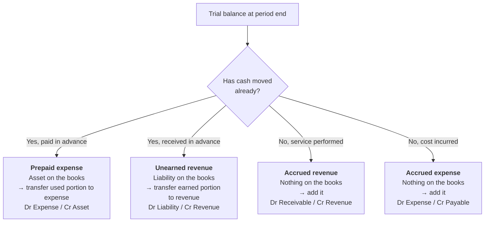

# Adjusting Entries

> [!abstract] Where this sits in the course
> [[04 - Ledger Accounting and Double Entry]] recorded transactions as they happened. **But financial statements are prepared at an arbitrary cut-off date, and reality does not stop at 31 December.** Insurance bought in October covers November. Salaries earned this week are paid next week. Equipment bought last year is still being used up.
>
> **Adjusting entries are what make the accruals concept actually work.** They are the single largest source of exam marks in this subject, and the deck covering them (87 slides) is the largest in the course.

> [!warning] Deck numbering
> The source file is named `ch04 adjusting entry (cont).pptx`, implying it continues chapter 4 — but it is a **separate topic**, corresponding to **Weygandt Chapter 3**. These notes treat it as its own chapter, which means **chapter numbers here run one ahead of the deck filenames from this point on.** See [[00-Index]].

---

## 📘 Main Knowledge

### 1. Why adjusting entries exist

#### The time period assumption

**Accountants divide the economic life of a business into artificial time periods.** Generally a **month, quarter, or year**.

> [!note] Also called the **periodicity assumption**
> A business is a continuous stream of activity — it does not naturally pause on 31 December. Chopping that stream into periods is an artificial act, and **every difficulty in this chapter arises from that artificiality.**

| Term | Meaning |
|---|---|
| **Interim periods** | Monthly and quarterly time periods |
| **Fiscal year** | Accounting time period that is one year in length |
| **Calendar year** | January 1 to December 31 |

**Most large companies must prepare both quarterly and annual financial statements.** Note that a fiscal year need **not** coincide with the calendar year — many retailers end their year in January, after the Christmas trading season and the January sales are complete.

#### Accrual basis versus cash basis

| | **Accrual-basis accounting** | **Cash-basis accounting** |
|---|---|---|
| Timing | Transactions recorded **in the periods in which the events occur** | Recorded when cash moves |
| Revenue | Recognised when the company **performs services** (rather than when it receives cash) | Recognised when **cash is received** |
| Expenses | Recognised **when incurred** (rather than when paid) | Recognised when **cash is paid** |
| GAAP? | ✅ **In accordance with GAAP** | ❌ **Not in accordance with GAAP** |

> [!important] Why cash-basis accounting is not allowed
> Cash timing is manipulable and uninformative. A business could double this year's reported profit by delaying every supplier payment to January, without a single thing about its real performance changing. **Accrual accounting measures performance; cash accounting measures liquidity.** Both matter, which is exactly why there is a separate [[09 - Plant Assets, Natural Resources and Intangible Assets|statement of cash flows]] alongside the profit statement.

#### The two recognition principles

$$
\textbf{REVENUE RECOGNITION PRINCIPLE}
$$
> **Recognise revenue in the accounting period in which the performance obligation is satisfied.**

$$
\textbf{EXPENSE RECOGNITION PRINCIPLE}
$$
> **Match expenses with revenues in the period when the company makes efforts that generate those revenues.**
>
> *"Let the expenses follow the revenues."*

> [!important] The matching principle drives everything below
> Revenue leads; expenses follow. If a sale is recorded in October, the cost of the goods sold, the salesperson's commission, and the shop's October rent must all be recorded in October too — **regardless of when any cash moves.**
>
> **Every adjusting entry in this chapter is an application of one of these two principles.** If you are ever unsure what entry to make, ask: *in which period was the revenue earned or the expense incurred?* The answer determines the entry.

#### What adjusting entries do

**Adjusting entries:**

- **Ensure that the revenue recognition and expense recognition principles are followed.**
- Are **necessary because the trial balance may not contain up-to-date and complete data.**
- Are **required every time a company prepares financial statements.**
- **Will include one income statement account and one balance sheet account.**

> [!important] The structural rule that catches most errors
> **Every adjusting entry touches exactly one profit-or-loss account and exactly one balance-sheet account.**
>
> If your adjusting entry has two balance-sheet accounts (e.g. Dr Cash / Cr Receivable), it is **not** an adjusting entry — it is an ordinary transaction. If it has two profit-or-loss accounts, you have made a mistake.
>
> **Also: no adjusting entry ever touches Cash.** Cash movements are real transactions with real evidence; adjusting entries exist precisely to record things where cash has *not* moved at the right time. **Seeing "Cash" in an adjusting entry is an immediate signal that something is wrong.**

---

### 2. The four types of adjusting entry

$$
\text{Adjusting entries} = \underbrace{\text{Deferrals}}_{\text{cash first, then event}} + \underbrace{\text{Accruals}}_{\text{event first, then cash}}
$$

| Category | Type | Definition |
|---|---|---|
| **Deferrals** | **1. Prepaid expenses** | Expenses **paid in cash before** they are used or consumed |
| | **2. Unearned revenues** | Cash **received before** services are performed |
| **Accruals** | **1. Accrued revenues** | Revenues for services performed but **not yet received in cash or recorded** |
| | **2. Accrued expenses** | Expenses incurred but **not yet paid in cash or recorded** |

> [!important] Deferral vs accrual — one question tells you which
> **Has the cash already moved?**
> - **Yes, cash moved first** → **deferral**. Something is already in the books that must be *split* between periods.
> - **No, the event happened first** → **accrual**. Something is *missing* from the books and must be *added*.
>
> That single question resolves every adjusting-entry problem. The word "defer" means to postpone: the *recognition* is postponed relative to the cash. "Accrue" means to accumulate: the obligation or right builds up before any cash appears.

**The starting point is always the trial balance:** each account is analysed to determine whether it is complete and up to date.

---

### 3. Deferrals

**Deferrals are expenses or revenues that are recognised at a date later than the point when cash was originally exchanged.** Two types: prepaid expenses and unearned revenues.

---

#### 3.1 Prepaid expenses

**Payment of cash that is recorded as an asset to show the service or benefit the company will receive in the future.**

**Prepayments often occur in regard to:** insurance, supplies, advertising, rent, equipment, buildings.

$$
\textbf{Cash Payment} \;\longrightarrow\; \textbf{BEFORE} \;\longrightarrow\; \textbf{Expense Recorded}
$$

Prepaid expenses **expire either with the passage of time or through use.**

> [!important] The adjusting entry
> $$\text{Increase (\textbf{debit}) an expense account} \quad\text{and}\quad \text{Decrease (\textbf{credit}) an asset account}$$
> $$\boxed{\;\text{Dr Expense } X \;/\; \text{Cr Asset } X\;}$$
> where $X$ is the amount **used up** during the period — not the amount remaining.

##### Example — supplies

> **Pioneer Advertising purchased supplies costing $2,500 on October 5.** Pioneer recorded the payment by increasing (debiting) the asset Supplies. This account shows a balance of **$2,500** in the October 31 trial balance. **An inventory count at the close of business on October 31 reveals that $1,000 of supplies are still on hand.**

$$
\text{Supplies used} = 2{,}500 - 1{,}000 = \$1{,}500
$$

**October 31 adjusting entry:**

$$
\text{Dr Supplies Expense } 1{,}500 \;/\; \text{Cr Supplies } 1{,}500
$$

After the entry: Supplies (asset) = $1,000; Supplies Expense = $1,500. Total still $2,500 — **the entry splits the original payment between the balance sheet and the profit statement.**

##### Example — insurance

> **On October 4, Pioneer Advertising paid $600 for a one-year fire insurance policy.** Coverage began on October 1. Pioneer recorded the payment by increasing (debiting) Prepaid Insurance. This account shows a balance of $600 in the October 31 trial balance. **Insurance of $50 ($600 ÷ 12) expires each month.**

**Original entry, 4 October:**
$$
\text{Dr Prepaid Insurance } 600 \;/\; \text{Cr Cash } 600
$$

**October 31 adjusting entry:**
$$
\text{Dr Insurance Expense } 50 \;/\; \text{Cr Prepaid Insurance } 50
$$

Prepaid Insurance now shows $550 — eleven months of cover still owned.

> [!tip] Two ways the question can be phrased — read carefully
> - *"$1,000 of supplies are still **on hand**"* → the **remaining asset** is given; the expense is the difference ($1,500).
> - *"Insurance of $50 **expires** each month"* → the **expense** is given directly.
>
> **Mixing these up is the commonest error in the whole chapter.** Always ask which number you have been handed: what is left, or what has gone?

##### Depreciation

**Buildings, equipment, and motor vehicles** (assets that provide service for many years) are recorded as **assets**, not expenses, on the date acquired.

> **Depreciation is the process of allocating the cost of an asset to expense over its useful life.**

> [!important] Depreciation is an **allocation** concept, not a **valuation** concept
> **Depreciation does not attempt to report the actual change in the value of the asset.** A building might be rising in market value while being depreciated; a computer might become worthless faster than its depreciation schedule.
>
> **Depreciation answers: "how much of this asset's cost belongs to this period?"** — not "what is it worth now?" This is the matching principle applied to long-lived assets, and it is the single most misunderstood idea in introductory accounting.

**Example:** *For Pioneer Advertising, assume that depreciation on the equipment is **$480 a year, or $40 per month**.*

**October 31 adjusting entry:**
$$
\text{Dr Depreciation Expense } 40 \;/\; \text{Cr Accumulated Depreciation } 40
$$

> [!important] Why credit **Accumulated Depreciation** rather than the asset itself
> **Accumulated Depreciation is a contra asset account** — a T-account that *increases with credits* and *decreases with debits*, the opposite of a normal asset.
>
> It **offsets the related asset account on the balance sheet**, so both the original cost and the total depreciation charged remain visible:
>
> $$\boxed{\;\text{Book value} = \text{Cost} - \text{Accumulated depreciation}\;}
> $$
>
> **Book value is the difference between the cost of any depreciable asset and its accumulated depreciation.**
>
> **Statement presentation:**
>
> | | $ |
> |---|---|
> | Equipment | 5,000 |
> | Less: Accumulated depreciation | (40) |
> | **Book value** | **4,960** |
>
> **Why not just credit Equipment directly?** Because then you would lose the original cost. A reader seeing "Equipment 4,960" cannot tell whether it is a nearly-new $5,000 asset or an ancient $50,000 one almost fully depreciated. **The contra account preserves both facts**, and the ratio of accumulated depreciation to cost tells a user how old the asset base is.

##### Summary — prepaid expenses

| | |
|---|---|
| **Reason for adjustment** | Prepaid expenses recorded in asset accounts have been used |
| **Accounts before adjustment** | Assets **overstated**, Expenses **understated** |
| **Adjusting entry** | **Dr Expenses / Cr Assets** |

---

#### 3.2 Unearned revenues

**Receipt of cash that is recorded as a liability because the service has not been performed.**

**Unearned revenues often occur in regard to:** rent, airline tickets, magazine subscriptions, customer deposits.

$$
\textbf{Cash Receipt} \;\longrightarrow\; \textbf{BEFORE} \;\longrightarrow\; \textbf{Revenue Recorded}
$$

> [!important] The adjusting entry
> **Made to record the revenue for services performed during the period and to show the liability that remains at the end of the period.** Results in:
> $$\text{a \textbf{decrease (debit)} to a liability account} \quad\text{and}\quad \text{an \textbf{increase (credit)} to a revenue account}$$
> $$\boxed{\;\text{Dr Unearned Revenue } X \;/\; \text{Cr Revenue } X\;}$$

**Why is cash received in advance a *liability*?** Because the business now **owes a service**. If it fails to deliver, it must refund the cash. **Unearned revenue is an obligation, not income** — which is why airlines carry billions of it on their balance sheets for tickets not yet flown.

##### Example

> **Pioneer Advertising received $1,200 on October 2 from R. Knox for advertising services expected to be completed by December 31.** Unearned Service Revenue shows a balance of $1,200 in the October 31 trial balance. **Analysis reveals that the company performed $400 of services in October.**

**October 31 adjusting entry:**
$$
\text{Dr Unearned Service Revenue } 400 \;/\; \text{Cr Service Revenue } 400
$$

Unearned Service Revenue now shows $800 — the obligation still outstanding.

##### Summary — unearned revenues

| | |
|---|---|
| **Reason for adjustment** | Unearned revenues recorded in liability accounts have been earned |
| **Accounts before adjustment** | Liabilities **overstated**, Revenues **understated** |
| **Adjusting entry** | **Dr Liabilities / Cr Revenues** |

> [!tip] Deferrals are mirror images
> | | Prepaid expense | Unearned revenue |
> |---|---|---|
> | Cash moved | Out, in advance | In, in advance |
> | Recorded initially as | **Asset** | **Liability** |
> | Adjustment | Dr Expense / **Cr Asset** | **Dr Liability** / Cr Revenue |
> | Balance-sheet account | Decreases | Decreases |
>
> **In both cases the balance-sheet account shrinks as the item is used up or earned.**

---

### 4. Accruals

**Accruals are made to record:**

- **Revenues** for services performed but not yet recorded at the statement date
- **Expenses** incurred but not yet paid or recorded at the statement date

---

#### 4.1 Accrued revenues

**Revenues for services performed but not yet received in cash or recorded.** Often occur in regard to: **rent, interest, services.**

$$
\textbf{Revenue Recorded} \;\longrightarrow\; \textbf{BEFORE} \;\longrightarrow\; \textbf{Cash Receipt}
$$

> [!important] The adjusting entry
> **Shows the receivable that exists and records the revenues for services performed.**
> $$\text{\textbf{Increases (debits)} an asset account} \quad\text{and}\quad \text{\textbf{increases (credits)} a revenue account}$$
> $$\boxed{\;\text{Dr Accounts Receivable } X \;/\; \text{Cr Revenue } X\;}$$

##### Example

> **In October Pioneer Advertising performed services worth $200 that were not billed to clients on or before October 31.**

**October 31 adjusting entry:**
$$
\text{Dr Accounts Receivable } 200 \;/\; \text{Cr Service Revenue } 200
$$

**On November 10, Pioneer receives cash of $200 for the services performed:**
$$
\text{Dr Cash } 200 \;/\; \text{Cr Accounts Receivable } 200
$$

> [!note] Note what November's entry does *not* do
> It records **no revenue**. The revenue was recognised in October, when the service was performed. **November merely converts a receivable into cash** — a balance-sheet-only transaction with no effect on profit. This is the accruals concept working exactly as intended.

##### Summary — accrued revenues

| | |
|---|---|
| **Reason for adjustment** | Services performed but not yet received in cash or recorded |
| **Accounts before adjustment** | Assets **understated**, Revenues **understated** |
| **Adjusting entry** | **Dr Assets / Cr Revenues** |

---

#### 4.2 Accrued expenses

**Expenses incurred but not yet paid in cash or recorded.** Often occur in regard to: **rent, interest, taxes, salaries.**

$$
\textbf{Expense Recorded} \;\longrightarrow\; \textbf{BEFORE} \;\longrightarrow\; \textbf{Cash Payment}
$$

> [!important] The adjusting entry
> **Records the obligation and recognises the expense.**
> $$\text{\textbf{Increase (debit)} an expense account} \quad\text{and}\quad \text{\textbf{increase (credit)} a liability account}$$
> $$\boxed{\;\text{Dr Expense } X \;/\; \text{Cr Payable } X\;}$$

##### Example — accrued interest

> **Pioneer Advertising signed a three-month note payable in the amount of $5,000 on October 1. The note requires Pioneer to pay interest at an annual rate of 12%.**

$$
\text{Interest} = \text{Face value} \times \text{Annual rate} \times \text{Time in years}
= 5{,}000 \times 0.12 \times \tfrac{1}{12} = \$50
$$

**October 31 adjusting entry:**
$$
\text{Dr Interest Expense } 50 \;/\; \text{Cr Interest Payable } 50
$$

> [!tip] The interest formula, and the mistake to avoid
> $$\boxed{\;\text{Interest} = \text{Principal} \times \text{Annual rate} \times \frac{\text{Months}}{12}\;}$$
> **The rate given is almost always annual.** Forgetting to scale it to the period charges 12 months of interest for one month — an error of 1,200%. Whenever you see an interest question, **write down the time fraction first.**

##### Example — accrued salaries

> **Pioneer Advertising paid salaries and wages on October 26; the next payment of salaries will not occur until November 9. The employees receive total salaries of $2,000 for a five-day work week, or $400 per day.**

The last payday was 26 October and the next is 9 November, so the **working days from 27 to 31 October** are unpaid at the period end. With a five-day week (Monday–Friday) and 26 October a Friday, the unpaid days are **Monday 29, Tuesday 30 and Wednesday 31 October — three days**:

$$
3 \times \$400 = \$1{,}200
$$

**October 31 adjusting entry:**
$$
\text{Dr Salaries and Wages Expense } 1{,}200 \;/\; \text{Cr Salaries and Wages Payable } 1{,}200
$$

> [!warning] Count **working** days, not calendar days
> 27 and 28 October are the weekend — no work, no salary. Counting calendar days gives 5 days and $2,000, which is wrong by $800. **These questions always turn on the working-day count**, so establish the pattern of the week before doing any arithmetic.

##### Summary — accrued expenses

| | |
|---|---|
| **Reason for adjustment** | Expenses incurred but not yet paid in cash or recorded |
| **Accounts before adjustment** | Expenses **understated**, Liabilities **understated** |
| **Adjusting entry** | **Dr Expenses / Cr Liabilities** |

---

### 5. Summary of basic relationships

| Type | Reason for adjustment | Before adjustment | **Entry** |
|---|---|---|---|
| **Prepaid expenses** | Prepayments recorded as assets have been used | Assets ↑ *overstated* Expenses ↓ *understated* | **Dr Expenses / Cr Assets** |
| **Unearned revenues** | Advance receipts recorded as liabilities have been earned | Liabilities ↑ *overstated* Revenues ↓ *understated* | **Dr Liabilities / Cr Revenues** |
| **Accrued revenues** | Services performed but not recorded | Assets ↓ *understated* Revenues ↓ *understated* | **Dr Assets / Cr Revenues** |
| **Accrued expenses** | Expenses incurred but not recorded | Expenses ↓ *understated* Liabilities ↓ *understated* | **Dr Expenses / Cr Liabilities** |

> [!important] Two patterns worth memorising
> **1. Every entry has exactly one profit-or-loss account and one balance-sheet account.** No exceptions, and **no adjusting entry ever touches Cash.**
>
> **2. Accruals always *understate* both accounts before adjustment** (nothing is in the books yet), while **deferrals *overstate* the balance-sheet account** (too much is in the books). This gives you a free check: after an accrual adjustment both figures rise; after a deferral adjustment the balance-sheet figure falls.

---

### 6. The adjusted trial balance

**Prepared after all adjusting entries are journalised and posted.**

- Its **purpose is to prove the equality of debit balances and credit balances in the ledger.**
- It **is the primary basis for the preparation of financial statements.**

$$
\text{Trial balance} \;\xrightarrow{\text{adjusting entries}}\; \text{Adjusted trial balance} \;\longrightarrow\; \text{Financial statements}
$$

**Financial statements are prepared directly from the adjusted trial balance:**

> [!important] The order is not optional
> **Income statement first** (it produces net income) → **owner's equity statement** (which needs net income) → **balance sheet** (which needs closing capital). Attempting the balance sheet first will fail, because closing capital is not yet known.
>
> **An adjusted trial balance does *not* segregate accounts by assets and liabilities** — it simply lists every account with its balance in debit or credit order. Sorting into statement categories is the next step. This exact point is a lecture question (Exercise 5 below).

---

### 7. Appendix 3A — the alternative treatment of deferrals

**A company may choose to record a prepayment directly in an expense account rather than an asset account, and cash received in advance directly in a revenue account rather than a liability account.** This alternative treatment is **simply more convenient**.

| | Standard treatment | Alternative treatment |
|---|---|---|
| **Prepaid expense — original entry** | Dr **Prepaid Insurance** / Cr Cash | Dr **Insurance Expense** / Cr Cash |
| **Prepaid expense — adjustment** | Dr Expense / Cr Asset (for the amount **used**) | Dr **Asset** / Cr **Expense** (for the amount **remaining**) |
| **Unearned revenue — original entry** | Dr Cash / Cr **Unearned Revenue** | Dr Cash / Cr **Service Revenue** |
| **Unearned revenue — adjustment** | Dr Liability / Cr Revenue (for the amount **earned**) | Dr **Revenue** / Cr **Liability** (for the amount **unearned**) |

> [!important] Same final answer, opposite adjusting entry
> Take the insurance example: $600 paid, $50 used in October.
>
> **Standard:** Dr Prepaid Insurance 600 initially; adjust Dr Insurance Expense 50 / Cr Prepaid Insurance 50. Result: expense 50, asset 550.
>
> **Alternative:** Dr Insurance Expense 600 initially; adjust Dr Prepaid Insurance 550 / Cr Insurance Expense 550. Result: expense 50, asset 550. **Identical.**
>
> **The adjustment is for whatever the initial entry got wrong.** Under the standard method the asset is too big, so move out the used portion. Under the alternative the expense is too big, so move out the *unused* portion. **The amount in the adjusting entry is different, but the final balances always agree** — which is a useful check.

---

### 8. Appendix 3B — financial reporting concepts

This appendix restates the conceptual framework from [[01 - Introduction to Accounting]] §5 in Weygandt's wording.

**Two fundamental qualities: relevance and faithful representation.**

| **Relevance** | **Faithful representation** |
|---|---|
| Makes a difference in a business decision | Accurately depicts what really happened |
| Provides information with **predictive value** and **confirmatory value** | Must be **complete** (nothing important omitted) |
| **Materiality** is a company-specific aspect of relevance — an item is material when its size makes it likely to **influence the decision of an investor or creditor** | **neutral** (not biased toward one position or another) |
| | **free from error** |

**Enhancing qualities:**

| Quality | Definition |
|---|---|
| **Comparability** | Results when **different companies** use the same accounting principles |
| **Consistency** | A company uses the same principles and methods **from year to year** |
| **Verifiability** | Independent observers, using the same methods, obtain similar results |
| **Timeliness** | For information to have relevance, it must be timely |
| **Understandability** | Presented in a clear and concise fashion |

> [!note] Comparability vs consistency
> **Comparability is across companies; consistency is across time within one company.** Both are needed: consistency without comparability lets you track one firm but not benchmark it; comparability without consistency lets you compare firms this year but not see trends.

**Assumptions in financial reporting:**

| Assumption | Statement |
|---|---|
| **Monetary unit** | Only those things that can be **expressed in money** are included in the accounting records |
| **Economic entity** | Every economic entity can be **separately identified and accounted for** |
| **Going concern** | The business will remain in operation for the **foreseeable future** |
| **Time period** | The life of a business can be divided into **artificial time periods** |

> [!note] The monetary unit assumption has a real cost
> Staff skill, customer loyalty and brand reputation are often a company's most valuable resources — and **none appears on the balance sheet**, because none can be reliably expressed in money. This is the standard answer to "why does a company's market value exceed its book value?"

**Principles of financial reporting:**

| Principle | Statement |
|---|---|
| **Historical cost** (cost principle) | Companies record assets at their **cost** |
| **Fair value** | Assets and liabilities should be reported at fair value — **the price received to sell an asset or settle a liability** |
| **Revenue recognition** | Recognise revenue in the period in which the **performance obligation is satisfied** |
| **Expense recognition** | Efforts (expenses) matched with results (revenues) — **expenses follow revenues** |
| **Full disclosure** | Companies **disclose all circumstances and events** that would make a difference to financial statement users |

**Cost constraint:** standard-setters **weigh the cost that companies will incur to provide the information against the benefit that users gain from having it available.**

---

### 9. Appendix — a look at IFRS

**Similarities:**

- Companies applying IFRS **also use accrual-basis accounting**.
- **Cash-basis accounting is not in accordance with IFRS**, just as under GAAP.
- IFRS also divides economic life into artificial time periods — under both GAAP and IFRS this is the **time period assumption**.
- The general **revenue recognition principle** is similar under both.
- **Revenue recognition fraud is a major issue** in US financial reporting, and elsewhere — as evidenced by breakdowns at Dutch software company **Baan NV**, Japanese electronics giant **NEC**, and Dutch grocer **Ahold NV**.

**Differences:**

| Issue | IFRS | GAAP |
|---|---|---|
| **Revaluation** | **Permitted** for items such as land and buildings; **depreciation based on revalued amounts is allowed** | **Not permitted** |
| **"Income"** | Includes both **revenues** (normal operating activities) and **gains** (outside normal sales of goods and services) | "Income" means the **net difference between revenues and expenses** |
| **"Expenses"** | Include **both** costs of normal operations **and losses** not part of normal operations | Defines each **separately** |

**Looking into the future:** the **IASB and FASB are completing a joint project on revenue recognition**, to develop comprehensive guidance on when to recognise revenue, with the aim of more consistent accounting in this area.

> [!note] That project became IFRS 15 / ASC 606
> Published in 2014 and effective from 2018, it introduced the **five-step model** and the "performance obligation" language the slides already use. It is also the source of the settlement-discount treatment in [[04 - Ledger Accounting and Double Entry]] §3.1. **The slides describe it as forthcoming; it has since been in force for years.**

---

## ✏️ Exercises

### Exercise 1 — Timing concepts (lecture questions)

**(a)** The time period assumption states that:
1. revenue should be recognised in the accounting period in which it is earned
2. expenses should be matched with revenues
3. the economic life of a business can be divided into artificial time periods
4. the fiscal year should correspond with the calendar year

**(b)** One of the following statements about the accrual basis of accounting is **false**. Which?
1. Events that change a company's financial statements are recorded in the periods in which the events occur
2. Revenue is recognised in the period in which the performance obligation is satisfied
3. The accrual basis of accounting is in accord with GAAP
4. Revenue is recorded only when cash is received, and expenses are recorded only when cash is paid

**(c)** Adjusting entries are made to ensure that:
1. expenses are recognised in the period in which they are incurred
2. revenues are recorded in the period in which services are performed
3. balance sheet and income statement accounts have correct balances at the end of an accounting period
4. all of the above

**(d)** *Matching:* accrual-basis accounting · calendar year · time period assumption · expense recognition principle — match to: (b) efforts should be matched with results · (c) accountants divide the economic life of a business into artificial time periods · (e) an accounting time period that starts on January 1 and ends on December 31 · (f) companies record transactions in the period in which the events occur.

> [!example]- Solution
> **(a) Answer: 3.** The time period assumption is *only* about dividing economic life into artificial periods. Option 1 is the **revenue recognition** principle and option 2 the **expense recognition** principle — both true statements, but **not what this assumption says**. Option 4 is simply false: a fiscal year need not be a calendar year.
>
> **This is a definition-discrimination question**, and the distractors are the neighbouring principles. Read the *name* of the concept, not just the content of the options.
>
> **(b) Answer: 4 is false.** That is the definition of **cash-basis** accounting, which is explicitly **not** in accordance with GAAP.
>
> **(c) Answer: 4 — all of the above.** Adjusting entries serve all three purposes simultaneously, which is exactly the point of the structural rule that each one touches one income-statement and one balance-sheet account: **fixing the profit figure and fixing the balance sheet are the same operation.**
>
> **(d) Matching:**
>
> | Concept | Description |
> |---|---|
> | Accrual-basis accounting | **(f)** Companies record transactions in the period in which the events occur |
> | Calendar year | **(e)** An accounting time period from January 1 to December 31 |
> | Time period assumption | **(c)** Accountants divide the economic life of a business into artificial time periods |
> | Expense recognition principle | **(b)** Efforts (expenses) should be matched with results (revenues) |
>
> The unused descriptions — "monthly and quarterly time periods" (*interim periods*) and "companies record revenues when they receive cash..." (*cash-basis accounting*) — are deliberate distractors. **More descriptions than concepts is standard in this question format**; do not force a match.

---

### Exercise 2 — Adjusting entries for deferrals (lecture DO IT!)

The ledger of Hammond Company on March 31, 2017 includes these selected accounts **before** adjusting entries:

| | Debit | Credit |
|---|---|---|
| Prepaid Insurance | $3,600 | |
| Supplies | 2,800 | |
| Equipment | 25,000 | |
| Accumulated Depreciation — Equipment | | $5,000 |
| Unearned Service Revenue | | 9,200 |

An analysis of the accounts shows:
1. Insurance expires at the rate of $100 per month.
2. Supplies on hand total $800.
3. The equipment depreciates $200 a month.
4. During March, services were performed for one-half of the unearned service revenue.

Prepare the adjusting entries for the month of March.

> [!example]- Solution
> **1. Insurance** — the *expense* is given directly ($100 per month):
> $$\text{Dr Insurance Expense } 100 \;/\; \text{Cr Prepaid Insurance } 100$$
> Prepaid Insurance falls from 3,600 to **3,500** — 35 months of cover remaining.
>
> **2. Supplies** — the *remaining asset* is given, so compute the expense:
> $$2{,}800 - 800 = \$2{,}000 \text{ used}$$
> $$\text{Dr Supplies Expense } 2{,}000 \;/\; \text{Cr Supplies } 2{,}000$$
>
> **3. Depreciation** — the *expense* is given directly:
> $$\text{Dr Depreciation Expense } 200 \;/\; \text{Cr Accumulated Depreciation — Equipment } 200$$
> Accumulated depreciation rises from 5,000 to **5,200**; book value = $25{,}000 - 5{,}200 = \$19{,}800$.
>
> **4. Unearned service revenue** — half of 9,200 has been earned:
> $$\text{Dr Unearned Service Revenue } 4{,}600 \;/\; \text{Cr Service Revenue } 4{,}600$$
> The liability falls to **4,600** — services still owed.
>
> ---
> **The point of the exercise: items 1 and 2 look identical but are given differently.**
>
> - Item 1 hands you **the expense** ("expires at the rate of $100 per month") — use it directly.
> - Item 2 hands you **the asset remaining** ("supplies on hand total $800") — subtract to get the expense.
>
> **Answering item 2 with $800 is the classic error**, and it understates the expense by $1,200 while overstating assets by the same amount.
>
> **Two further observations:**
> - The existing **Accumulated Depreciation of $5,000** tells you the equipment has been depreciated for $5{,}000/200 = 25$ months already. The prior balance changes nothing about this month's entry — it simply accumulates.
> - **Equipment ($25,000) is never touched** by the adjusting entry. Only the contra account moves, which is exactly why the contra account exists.

---

### Exercise 3 — Adjusting entries for accruals (lecture DO IT!)

Micro Computer Services began operations on August 1, 2017. At the end of August, management prepares monthly financial statements. The following relates to August:

1. At August 31, the company owed its employees **$800** in salaries and wages that will be paid on September 1.
2. On August 1, the company borrowed **$30,000** from a local bank on a 15-year mortgage. The annual interest rate is **10%**.
3. Revenue for services performed but unrecorded for August totalled **$1,100**.

Prepare the adjusting entries needed at August 31, 2017.

> [!example]- Solution
> **1. Accrued salaries** — incurred in August, paid in September:
> $$\text{Dr Salaries and Wages Expense } 800 \;/\; \text{Cr Salaries and Wages Payable } 800$$
>
> **2. Accrued interest** — one month has elapsed since 1 August:
> $$\text{Interest} = 30{,}000 \times 0.10 \times \tfrac{1}{12} = \$250$$
> $$\text{Dr Interest Expense } 250 \;/\; \text{Cr Interest Payable } 250$$
>
> **3. Accrued revenue** — services performed but unrecorded:
> $$\text{Dr Accounts Receivable } 1{,}100 \;/\; \text{Cr Service Revenue } 1{,}100$$
>
> ---
> **Note the two traps in item 2.**
>
> **The "15-year" term is irrelevant.** It tells you the mortgage is a non-current liability, but the *interest accrual* depends only on the principal, the annual rate, and the **one month** elapsed. Candidates sometimes try to use 15 somewhere.
>
> **The rate is annual.** $30{,}000 \times 0.10 = \$3{,}000$ is a full year's interest; dividing by 12 gives $250. **Always write the $\frac{\text{months}}{12}$ factor explicitly.**
>
> **All three entries follow the accrual pattern:** something happened, nothing is in the books, so **add** it — and both the profit-or-loss account and the balance-sheet account increase. Contrast with Exercise 2, where every balance-sheet account *decreased*.
>
> **What happens next month.** On 1 September the salaries are paid: Dr Salaries and Wages Payable 800 / Cr Cash 800 — **no expense**, because it was recognised in August. Same pattern as the accrued-revenue collection in §4.1.

---

### Exercise 4 — All four types in one problem

Delta Consulting prepares annual statements to 31 December 2024. The unadjusted trial balance shows: Prepaid Rent $18,000; Office Supplies $4,700; Equipment $60,000; Accumulated Depreciation $12,000; Unearned Consulting Fees $15,000; Notes Payable $40,000.

At 31 December:
(a) The prepaid rent was paid on 1 September for 12 months' rent.
(b) A count shows $1,300 of office supplies remaining.
(c) Equipment is depreciated at 10% of cost per year.
(d) Two-thirds of the unearned fees have now been earned.
(e) Consulting work of $6,800 has been performed but not billed.
(f) The note payable was taken out on 1 October at 9% annual interest, payable at maturity.
(g) Employees are owed $2,400 for the final week of December.

Prepare all adjusting entries and state the effect of *omitting* them on profit.

> [!example]- Solution
> **(a) Prepaid rent — deferral.** $18,000 for 12 months = $1,500/month. From 1 September to 31 December is **4 months**:
> $$4 \times 1{,}500 = \$6{,}000 \text{ expired}$$
> $$\text{Dr Rent Expense } 6{,}000 \;/\; \text{Cr Prepaid Rent } 6{,}000$$
> Remaining asset: $18{,}000-6{,}000 = \$12{,}000$ (8 months) ✓
>
> **(b) Supplies — deferral.** $4{,}700 - 1{,}300 = \$3{,}400$ used:
> $$\text{Dr Supplies Expense } 3{,}400 \;/\; \text{Cr Office Supplies } 3{,}400$$
>
> **(c) Depreciation — deferral.** $10\% \times 60{,}000 = \$6{,}000$ for the year:
> $$\text{Dr Depreciation Expense } 6{,}000 \;/\; \text{Cr Accumulated Depreciation } 6{,}000$$
> Accumulated depreciation becomes $18,000; book value $= 60{,}000-18{,}000 = \$42{,}000$.
>
> **(d) Unearned fees — deferral.** $\tfrac23 \times 15{,}000 = \$10{,}000$:
> $$\text{Dr Unearned Consulting Fees } 10{,}000 \;/\; \text{Cr Consulting Fees Revenue } 10{,}000$$
>
> **(e) Accrued revenue.**
> $$\text{Dr Accounts Receivable } 6{,}800 \;/\; \text{Cr Consulting Fees Revenue } 6{,}800$$
>
> **(f) Accrued interest.** 1 October to 31 December = **3 months**:
> $$40{,}000 \times 0.09 \times \tfrac{3}{12} = \$900$$
> $$\text{Dr Interest Expense } 900 \;/\; \text{Cr Interest Payable } 900$$
>
> **(g) Accrued salaries.**
> $$\text{Dr Salaries Expense } 2{,}400 \;/\; \text{Cr Salaries Payable } 2{,}400$$
>
> ---
> **Effect on profit if omitted:**
>
> | | Adjustment | Revenue effect | Expense effect | **Profit effect if omitted** |
> |---|---|---|---|---|
> | (a) | Rent | — | +6,000 | **Overstated by 6,000** |
> | (b) | Supplies | — | +3,400 | **Overstated by 3,400** |
> | (c) | Depreciation | — | +6,000 | **Overstated by 6,000** |
> | (d) | Unearned fees | +10,000 | — | **Understated by 10,000** |
> | (e) | Accrued revenue | +6,800 | — | **Understated by 6,800** |
> | (f) | Interest | — | +900 | **Overstated by 900** |
> | (g) | Salaries | — | +2,400 | **Overstated by 2,400** |
> | | **Net** | **+16,800** | **+18,700** | **Overstated by 1,900** |
>
> Omitting **all** adjustments would overstate profit by $18{,}700 - 16{,}800 = \mathbf{\$1{,}900}$.
>
> **Two things this table teaches:**
>
> **1. Expense adjustments and revenue adjustments push profit in opposite directions.** Omitting an expense adjustment *overstates* profit; omitting a revenue adjustment *understates* it. The near-cancellation here ($1,900 net on $35,500 of gross adjustments) is coincidental, but it shows why **you cannot judge the effect of "some missing adjustments" without knowing which ones.**
>
> **2. The balance sheet is wrong by the same amounts.** Every overstated profit is matched by an overstated asset or understated liability. **Adjusting entries fix both statements at once** — which is the whole content of the "one income-statement account, one balance-sheet account" rule.
>
> **Watch the two time fractions:** (a) runs Sept–Dec = 4 months; (f) runs Oct–Dec = 3 months. **Both are given by a start date, not a duration**, and misreading them is the most common source of lost marks in this question type.

---

### Exercise 5 — The adjusted trial balance

*(Lecture question.)* Which of the following statements is **incorrect** concerning the adjusted trial balance?

1. An adjusted trial balance proves the equality of the total debit balances and the total credit balances in the ledger after all adjustments are made.
2. The adjusted trial balance provides the primary basis for the preparation of financial statements.
3. The adjusted trial balance lists the account balances **segregated by assets and liabilities**.
4. The adjusted trial balance is prepared after the adjusting entries have been journalised and posted.

*Then:* explain why the financial statements must be prepared in a particular order.

> [!example]- Solution
> **Answer: 3 is incorrect.**
>
> **A trial balance is not segregated by category.** It is simply a list of every ledger account with its balance placed in a debit or a credit column, typically in ledger order. **Sorting accounts into assets, liabilities, equity, revenue and expenses is the *next* step** — the preparation of the financial statements themselves.
>
> Statements 1, 2 and 4 are all correct and are the three things you should be able to say about an adjusted trial balance.
>
> ---
> **Why the order of preparation matters.**
>
> $$\text{Income Statement} \;\longrightarrow\; \text{Owner's Equity Statement} \;\longrightarrow\; \text{Balance Sheet}$$
>
> Each depends on the output of the one before:
>
> 1. **Income statement** uses only revenue and expense accounts and produces **net income**.
> 2. **Owner's equity statement** needs that net income:
> $$C_{\text{closing}} = C_{\text{opening}} + \text{Net income} - \text{Drawings}$$
> 3. **Balance sheet** needs the **closing capital** figure from step 2, and lists assets, liabilities and equity.
>
> **You cannot start with the balance sheet**, because closing capital is not yet known. This is the same dependency identified in [[02 - The Accounting Equation]] §4 — **profit is computed in one statement and consumed by another**, which is why the two statements form a single system rather than two independent reports.
>
> **A practical consequence:** if the balance sheet does not balance, the error is often *upstream* — in the income statement or the equity statement — not in the balance sheet itself. Check the profit figure first.

---

## 📝 Summary

- **The time period assumption** (periodicity) divides economic life into artificial periods — a month, quarter or year. A **fiscal year** is any 12-month period; a **calendar year** runs 1 January to 31 December; monthly and quarterly periods are **interim periods**.
- **Accrual-basis accounting** records transactions in the periods in which events occur — revenue when the **performance obligation is satisfied**, expenses when **incurred**. **Cash-basis accounting is not in accordance with GAAP** (or IFRS).
- **Revenue recognition principle:** recognise revenue when the performance obligation is satisfied. **Expense recognition principle:** *"let the expenses follow the revenues."*
- **Adjusting entries** are required whenever statements are prepared, and **always include exactly one income-statement account and one balance-sheet account** — and **never Cash**.
- **Four types**, split by whether cash moved first:
  - **Deferrals** (cash first): **prepaid expenses** → Dr Expense / Cr Asset; **unearned revenues** → Dr Liability / Cr Revenue
  - **Accruals** (event first): **accrued revenues** → Dr Asset / Cr Revenue; **accrued expenses** → Dr Expense / Cr Liability
- **Depreciation is allocation, not valuation** — it spreads cost over useful life and does **not** report changes in market value. It is credited to **Accumulated Depreciation**, a **contra asset** account, preserving both cost and cumulative charge, so that
  $$\text{Book value} = \text{Cost} - \text{Accumulated depreciation}$$
- **Accrued interest** $= \text{Principal}\times\text{Annual rate}\times\frac{\text{Months}}{12}$. **Accrued salaries** are counted in *working* days, not calendar days.
- **The adjusted trial balance** is prepared after all adjustments are posted, proves debits equal credits, and is the **primary basis for the financial statements** — which must be prepared in the order **income statement → owner's equity statement → balance sheet**.
- **The alternative treatment** of deferrals records prepayments directly as expenses and advance receipts directly as revenues; the adjusting entry is then for the **unused/unearned** portion, and **final balances are identical**.

---

## ⚠️ Important Notes

> [!warning] "On hand" vs "used up" — read the question twice
> - *"Supplies on hand total $800"* → this is the **asset remaining**; the expense is (opening − 800).
> - *"Insurance expires at $100 per month"* → this is **the expense** directly.
>
> Using the wrong one gets the entry backwards and is worth several marks in every exam. **Underline which number you have been given before writing anything.**

> [!warning] No adjusting entry ever touches Cash
> If Cash appears in your adjusting entry, it is not an adjusting entry. Adjusting entries exist precisely because cash moved at the *wrong* time relative to the event.

> [!warning] Interest rates are annual; salary accruals are in working days
> $$\text{Interest} = P \times r \times \frac{\text{months}}{12}$$
> Forgetting the fraction charges a full year's interest for one month. For salaries, weekends are not working days — count Monday-to-Friday only, and establish which day of the week the last payday fell on.

> [!important] Depreciation is not valuation, and not a cash fund
> Two things depreciation is **not**:
> 1. **An estimate of market value.** The book value of an asset may bear no relation to what it would sell for. Depreciation allocates *cost*.
> 2. **A pot of money set aside.** Accumulated Depreciation is a contra account, not cash. Nothing has been saved for the asset's replacement.
>
> Both misconceptions are common enough that examiners test them directly.

> [!tip] The two-question method for any adjusting entry
> 1. **Did cash move first?** Yes → deferral (something is in the books; split it). No → accrual (nothing is in the books; add it).
> 2. **Is it revenue or expense?** That fixes which two accounts.
>
> Combine the answers with the summary table in §5 and the entry writes itself. **This works even for adjustment types you have never seen**, which is why it beats memorising the four entries.

> [!note] Why omitted adjustments distort *both* statements
> Every adjusting entry has one profit-or-loss leg and one balance-sheet leg, so omitting one **always misstates both** profit and the balance sheet by the same amount. Exercise 4 quantifies this. A question asking "what is the effect on net income *and* total assets?" is asking about the two legs of the same missing entry.

> [!warning] Gaps in the source slides
> This deck is by far the **best** in the course — it is Weygandt's own Chapter 3 slide set, largely complete. The gaps are almost all illustrations.
> - **Fifteen slides are image-only or near-empty:** Illustrations 3-1, 3-3, 3-4, 3-5, 3-6, 3-7, 3-8, 3-9, 3-10, 3-11, 3-12, 3-13, 3-14, 3-15, 3-16, 3-17, 3-18, 3-19, 3-20, 3-21, 3-22, 3-25, 3-26, 3-27, 3A-2, 3A-5, 3A-7. These are the **T-account diagrams and summary tables** that visually show each adjustment. Their *content* is recoverable from the surrounding text (and is reconstructed in the summary tables above), but the diagrams themselves are lost.
> - **The accrued-salaries example (slide 50) gives the facts but not the answer** — Illustration 3-19, which contains the calendar and the $1,200 computation, is an image. The working in §4.2 is my own reconstruction; **verify the day count against the lecturer's version.**
> - **The Skolnick Co. DO IT! (slides 63–66) is entirely image-based.** The trial balance data, the three requirements and all answers are lost — only the question wording survives.
> - **The adjusted trial balance itself (Illustration 3-25) and the statement-preparation illustrations (3-26, 3-27) are images**, so the deck contains **no complete worked example** running from unadjusted trial balance through to finished financial statements. That end-to-end process is the most examinable skill in the chapter and is not demonstrated anywhere.
> - **The alternative treatment of deferrals (Appendix 3A)** is presented as three illustration slides with almost no text; §7 above is reconstructed from standard material.
> - **The revenue recognition project is described as ongoing** — it concluded as IFRS 15 / ASC 606 in 2014, effective 2018. The slides are out of date on this point.

---

**Previous:** [[04 - Ledger Accounting and Double Entry]] · **Next:** [[06 - Accounting for Merchandising Operations]] · **Index:** [[00-Index]]

#accounting #adjusting-entries #accruals #deferrals #depreciation #matching #trial-balance
