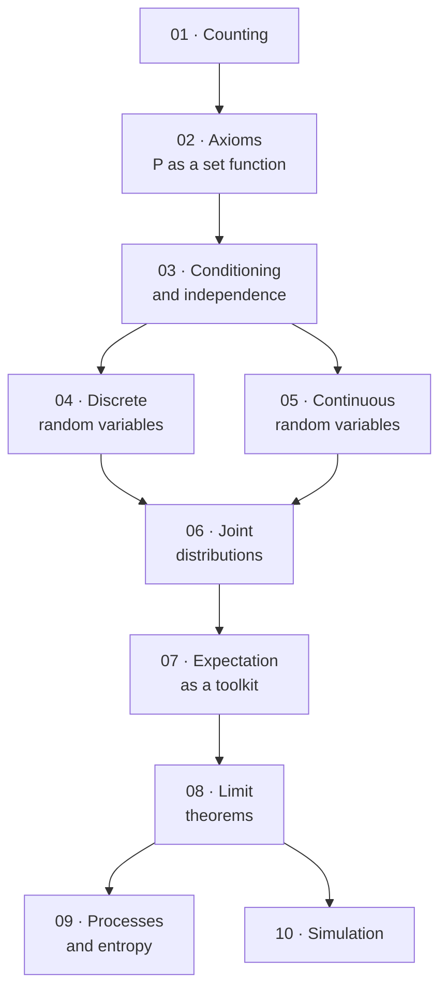

# Probability Theory — Map of Content

> [!warning] Read this first — the scope of these notes is my own editorial decision
> **There are no lecture slides for this subject.** The vault contains only the textbook: **Sheldon Ross, *A First Course in Probability*, 10th edition (Global Edition).** Nothing indicates which chapters the course actually covers.
>
> **I have scoped these notes to all ten chapters.** Chapters **1–8** are the standard one-semester core that every probability course covers. Chapters **9–10** are what Ross himself calls *"some additional topics"* — **I have included them because they are the probability foundations of Markov chains, information theory and Monte Carlo methods, all of which a Data Science degree needs.** If the syllabus stops at chapter 8, treat 9–10 as bonus material rather than exam content.
>
> **Confirm this against the real syllabus.** See §"What is not covered, and why" below.

---

## Chapters

| # | Chapter | Status | One-line description |
|---|---|---|---|
| 01 | [[01 - Combinatorial Analysis]] | ✅ | Counting: the basic principle, permutations, combinations, **Pascal's identity** and the binomial theorem, multinomial coefficients, stars and bars |
| 02 | [[02 - Axioms of Probability]] | ✅ | Sample spaces and set algebra, **the three axioms**, inclusion–exclusion and **Boole's inequality**, equally likely outcomes, continuity of $P$ |
| 03 | [[03 - Conditional Probability and Independence]] | ✅ | $P(E\mid F)$ and the multiplication rule, law of total probability, **Bayes's formula** and the **odds/likelihood-ratio form**, independence, gambler's ruin |
| 04 | [[04 - Random Variables]] | ✅ | pmf and cdf, **expectation and variance**, $\mathbb{E}[g(X)]$; **binomial**, **Poisson** and the Poisson paradigm, geometric, negative binomial, hypergeometric; **indicators + linearity** |
| 05 | [[05 - Continuous Random Variables]] | ✅ | Densities and $P\{X=a\}=0$, **uniform** and Bertrand's paradox, **normal** + the binomial approximation, **exponential** and **memorylessness**, hazard rates, functions of a random variable |
| 06 | [[06 - Jointly Distributed Random Variables]] | ✅ | Joint pmfs and densities, **independence and the factorisation criterion**, **convolution** and which families are closed under it, conditional distributions, the **bivariate normal** (= linear regression), **order statistics**, the **Jacobian**, exchangeability |
| 07 | [[07 - Properties of Expectation]] | ✅ | **Linearity and the indicator trick**, moments of counts, **covariance and correlation**, **conditional expectation** and the law of total variance, **$\mathbb{E}[Y\mid X]$ as the best predictor**, **moment generating functions**, the multivariate normal, and **$\bar X\perp S^2$** |
| 08 | [[08 - Limit Theorems]] | ✅ | Markov and **Chebyshev** inequalities, the **weak and strong laws of large numbers**, the **central limit theorem** and its finite-variance hypothesis, one-sided Chebyshev, **Chernoff bounds**, Jensen, the Poisson coupling error bound, **Lorenz curves and the Gini index** |
| 09 | [[09 - Additional Topics in Probability]] | ✅ | The **Poisson process** and its five defining conditions, **Markov chains**, **stationary distributions** and the spectral gap, surprise and **entropy**, Kraft and the **noiseless coding theorem**, **channel capacity** |
| 10 | [[10 - Simulation]] | ✅ | Random permutations, **inverse transform** and **rejection sampling**, Box–Muller and the polar method, simulating discrete distributions, **variance reduction** (antithetic variables, conditioning, control variates) |

---

## How the subject fits together

**Four phases:**

1. **Machinery (01–03).** Learn to count, then to assign probabilities consistently, then to update them. **Chapter 3 is where the subject stops being combinatorics and starts being probability.**
2. **Random variables (04–06).** Move from events to numbers. Discrete, then continuous, then several at once. **The named distributions are the vocabulary of everything downstream.**
3. **Expectation (07).** The single most useful chapter. **Linearity of expectation solves problems that direct computation cannot touch**, and conditional expectation turns hard problems into easy ones.
4. **Limits and applications (08–10).** What happens as $n\to\infty$ — **the LLN and the CLT are why statistics works at all** — then two chapters of payoff.

---

## The two ideas the subject is really about

> [!important] 1. Conditioning is a computational technique, not just an interpretation
> Most people meet $P(E\mid F)$ as *"the probability of $E$ given that $F$ happened"* — a way to use partial information.
>
> **Ross's emphasis is different and more useful: conditioning is how you compute things when you have no partial information at all.** Split a hard problem into cases, solve each easy case, and reassemble:
>
> $$P(E)=\sum_i P(E\mid F_i)P(F_i) \qquad\qquad \mathbb{E}[X]=\mathbb{E}\big[\mathbb{E}[X\mid Y]\big]$$
>
> **The same trick appears in [[03 - Conditional Probability and Independence|ch. 03]] for probabilities and [[07 - Properties of Expectation|ch. 07]] for expectations.** Recognising when to condition is the single most transferable skill in the course.

> [!important] 2. Linearity of expectation needs no independence
> $$\boxed{\mathbb{E}[X_1+\cdots+X_n]=\mathbb{E}[X_1]+\cdots+\mathbb{E}[X_n]}$$
>
> **This holds however the $X_i$ are related.** Combined with **indicator variables** — write the quantity you want as a sum of 0/1 variables — it turns a large class of intractable counting problems into one-line calculations.
>
> **Contrast with variance**, which does *not* add unless the variables are uncorrelated:
> $$\mathrm{Var}\left(\sum X_i\right)=\sum\mathrm{Var}(X_i)+2\sum_{i<j}\mathrm{Cov}(X_i,X_j)$$
>
> **Knowing exactly which identities need independence and which do not is worth more than memorising any distribution.**

---

## Distribution reference

**Discrete:**

| Distribution | PMF | $\mathbb{E}[X]$ | $\mathrm{Var}(X)$ | Models |
|---|---|---|---|---|
| Bernoulli($p$) | $p^x(1-p)^{1-x}$, $x\in\{0,1\}$ | $p$ | $p(1-p)$ | One trial |
| Binomial($n,p$) | $\binom{n}{k}p^k(1-p)^{n-k}$ | $np$ | $np(1-p)$ | Successes in $n$ trials |
| Poisson($\lambda$) | $e^{-\lambda}\lambda^k/k!$ | $\lambda$ | $\lambda$ | Rare events; limit of Binomial |
| Geometric($p$) | $(1-p)^{k-1}p$ | $1/p$ | $(1-p)/p^2$ | Trials until first success |
| Negative binomial($r,p$) | $\binom{k-1}{r-1}p^r(1-p)^{k-r}$ | $r/p$ | $r(1-p)/p^2$ | Trials until $r$th success |
| Hypergeometric($n,N,m$) | $\binom{m}{k}\binom{N-m}{n-k}\big/\binom{N}{n}$ | $nm/N$ | — | Sampling **without** replacement |

**Continuous:**

| Distribution | Density | $\mathbb{E}[X]$ | $\mathrm{Var}(X)$ |
|---|---|---|---|
| Uniform($a,b$) | $1/(b-a)$ | $(a+b)/2$ | $(b-a)^2/12$ |
| Normal($\mu,\sigma^2$) | $\frac{1}{\sigma\sqrt{2\pi}}e^{-(x-\mu)^2/2\sigma^2}$ | $\mu$ | $\sigma^2$ |
| Exponential($\lambda$) | $\lambda e^{-\lambda x}$ | $1/\lambda$ | $1/\lambda^2$ |
| Gamma($\alpha,\lambda$) | $\frac{\lambda e^{-\lambda x}(\lambda x)^{\alpha-1}}{\Gamma(\alpha)}$ | $\alpha/\lambda$ | $\alpha/\lambda^2$ |
| Beta($a,b$) | $\frac{x^{a-1}(1-x)^{b-1}}{B(a,b)}$ | $\frac{a}{a+b}$ | $\frac{ab}{(a+b)^2(a+b+1)}$ |

*These are filled in and derived chapter by chapter; the table is here as a revision aid.*

---

## Key results

$$P(E\cup F)=P(E)+P(F)-P(EF) \qquad\qquad P(E\mid F)=\frac{P(EF)}{P(F)}$$

$$\boxed{\text{Bayes: } P(F_j\mid E)=\frac{P(E\mid F_j)P(F_j)}{\sum_i P(E\mid F_i)P(F_i)}}$$

$$\mathbb{E}[g(X)]=\sum_x g(x)p(x) \quad\text{or}\quad \int_{-\infty}^{\infty}g(x)f(x)\,dx \qquad \mathrm{Var}(X)=\mathbb{E}[X^2]-(\mathbb{E}[X])^2$$

$$\boxed{\mathbb{E}[X]=\mathbb{E}\big[\mathbb{E}[X\mid Y]\big]} \qquad \mathrm{Var}(X)=\mathbb{E}\big[\mathrm{Var}(X\mid Y)\big]+\mathrm{Var}\big(\mathbb{E}[X\mid Y]\big)$$

$$\text{Markov: } P(X\ge a)\le\frac{\mathbb{E}[X]}{a} \qquad\qquad \text{Chebyshev: } P(|X-\mu|\ge k)\le\frac{\sigma^2}{k^2}$$

$$\boxed{\text{CLT: } \frac{X_1+\cdots+X_n-n\mu}{\sigma\sqrt{n}}\ \xrightarrow{\ d\ }\ N(0,1)}$$

---

## The mistakes that cost the most marks

1. **Confusing $P(E\mid F)$ with $P(F\mid E)$.** The prosecutor's fallacy — and it is worth real money in real courtrooms.
2. **Assuming independence because events "feel unrelated."** Independence is a *numerical* condition, $P(EF)=P(E)P(F)$, not an intuition.
3. **Confusing pairwise independence with mutual independence.** Pairwise is strictly weaker.
4. **Confusing mutually exclusive with independent.** Disjoint events with positive probability are *maximally dependent* — if one occurs, the other cannot.
5. **Adding variances of dependent variables.** Expectation always adds; variance does not.
6. **Sampling with vs without replacement** — binomial vs hypergeometric.
7. **Forgetting the Jacobian** when transforming continuous random variables.
8. **Treating a density value $f(x)$ as a probability.** It can exceed 1.
9. **Applying the CLT to a sum of *dependent* variables**, or with a sample far too small for a badly skewed distribution.
10. **Ignoring the continuity correction** in the normal approximation to the binomial.

---

## What is not covered, and why

**Nothing in the book is excluded** — chapters 1–10 are all covered.

**Deliberately given lighter treatment:**

| Section | Topic | Note |
|---|---|---|
| 4.8.4 | The Zeta (Zipf) distribution | Half a page in Ross; noted, not developed |
| 5.6.3 | The Cauchy distribution | Covered mainly as the standard counterexample — **no mean, so the LLN fails** |
| 7.2.1 | Bounds via the probabilistic method | Elegant but rarely examined |
| 8.6 | Error bounds for the Poisson approximation | Stated, not proved |
| 8.7 | The Lorenz curve | New in the 10th edition; included briefly |
| 7.2.2 | The max–min identity | Reduced to a note; its payoff (unequal-probability coupon collecting) is given in integral form instead |
| 7.9 | Stieltjes integrals | A unification device, not new mathematics; noted only |

**Gaps in Ross himself, flagged rather than filled:** ch. 09 is a preview — Markov chains get six pages with **no recurrence, transience, hitting times or absorption probabilities**, and gambler's ruin appears as an example with no analysis. Ch. 10 has **no error analysis for simulation estimates, no MCMC, and importance sampling only as a problem.** Both chapters name Ross's own *Introduction to Probability Models* and *Simulation* as the intended sequels.

**Also present in the book:** *Answers to Selected Problems* (p. 480) and *Solutions to Self-Test Problems* (p. 482) — **useful for self-checking**, and the source of several exercises here.

---

## Cross-subject links

- [[Mathematical Statistics/contents/00-Index|Mathematical Statistics]] — **the direct sequel.** This subject builds the probability model; that one uses it to infer parameters from data. **Ch. 07's sample mean/variance result and ch. 08's CLT are the foundation of every sampling distribution there.**
- [[Econometrics/contents/00-Index|Econometrics]] — the LLN and CLT of [[08 - Limit Theorems|ch. 08]] are exactly what justifies OLS asymptotics; **Wooldridge's Math Refreshers B and C compress this whole subject into 40 pages**
- [[Machine Learning/contents/00-Index|Machine Learning]] — **Markov chains ([[09 - Additional Topics in Probability|ch. 09]]) are the substrate of MDPs and reinforcement learning**; entropy is the splitting criterion for decision trees and the basis of cross-entropy loss
- [[Time-series Analysis/contents/00-Index|Time-series Analysis]] — stationarity and the Poisson process; **the AR/MA processes there are sums of the random variables built here**
- [[Calculus/contents/00-Index|Calculus]] — [[05 - Continuous Random Variables|ch. 05]] onward is applied integration; **multivariate change of variables and the Jacobian are prerequisites for [[06 - Jointly Distributed Random Variables|ch. 06]]**
- [[Discrete Mathematics/contents/00-Index|Discrete Mathematics]] — [[01 - Combinatorial Analysis|ch. 01]] overlaps almost completely with the counting chapter there

---

## ⚠️ Source-material issues

> [!warning] Textbook only — no slides
> - **There are no lecture slides.** Chapter scope, emphasis and exercise choice are **all my own editorial decisions.**
> - **Every end-of-chapter exercise in these notes is my own construction**, built around results the text establishes. **All arithmetic has been independently verified.**

> [!warning] PDF extraction artefacts
> The text extracts **well** — considerably better than most sources in this vault — but:
> - **All figures are images** — the Venn diagrams of ch. 02, the normal density curves and $\Phi$ tables of ch. 05, the Lorenz curve of ch. 08. Their content is described in the surrounding prose and reconstructed in the notes.
> - **The standard normal table is an image**, so any $\Phi(z)$ value quoted in these notes has been recomputed rather than read off.
> - **Stacked notation flattens:** a binomial coefficient $\binom{n}{r}$ extracts as `( / n / r / )` across four lines, and fractions extract as numerator-newline-denominator. **Every formula in these notes has been reconstructed by hand and checked against its worked example.**
> - **`≤` extracts as `…`** (e.g. `f o rr … n` for "for $r\le n$"). **Every inequality direction has been verified from context.** *(Note this differs from the `<`-eating bug in [[Time-series Analysis/contents/00-Index|Time-series Analysis]] — here `<` and `>` survive intact.)*
> - **Emphasised text loses word spacing** — `t h e r e i s a t o t a l o f` — which is cosmetic but makes searching the extraction unreliable.

> [!warning] Errata — genuine errors found in the textbook
> **Every numeric claim in all ten chapters was independently recomputed.** The great majority check out exactly. These are the defects found, in order of seriousness:
>
> | Where | Defect |
> |---|---|
> | **Ch. 06**, Example 1g | The "no three share a birthday" sum is stated as $\approx.504$ for $n=88$. **The correct value is $.4889**$ (exact log-gamma arithmetic, confirmed by 400,000 simulations giving $.4894$). $.504$ is the answer for $n=87$. |
> | **Ch. 08**, Example 5e | After correctly deriving $e^t+e^{-t}\le2e^{t^2/2}$, the text prints $\mathbb{E}[e^{tX}]\ \mathbf{\ge}\ e^{t^2/2}$. **The sign is wrong** — the Chernoff bound that follows requires $\le$, so the argument as printed is invalid. |
> | **Ch. 09**, Example 2f | Invokes Theorem 2.1 for the Ehrenfest chain, **which is periodic and therefore not ergodic** — $\lim_n P^{(n)}_{ij}$ does not exist. The answer is right, by the long-run-proportion argument Ross gives elsewhere; the citation is not. |
> | **Ch. 07**, chapter Summary | Prints $\mathrm{Var}(\sum X_i)=\sum\mathrm{Var}(X_i)+2\sum_{i<j}\mathrm{Cov}(X_i,\mathbf{Y_j})$ — should be $\mathrm{Cov}(X_i,X_j)$. The body of §7.4 is correct. |
> | **Ch. 10**, Problem 10.9 | Both branches of a piecewise $F$ are printed identically, making the problem unanswerable. |
> | **Ch. 05**, Examples 4g and 4j | Two rounding artefacts: $.16$ used for $.1581$ (understating how good the approximation is), and $\Phi(1.2665)$ printed for $1.26555$. |
> | Various | Small typos: `X + X` for $X+Y$ (6, Ex. 3e); $\sigma^2=\sigma^2$ with subscripts lost (6, Ex. 2e); "positive integer" for "positive constant" (9, Thm 3.1); "stimulate" for *simulate* (10, §2). |
>
> **`log` means $\log_2$ throughout chapter 09** (established in a footnote that is easy to miss) — this changes every entropy figure by a factor of $1.4427$.

#probability #index #moc
