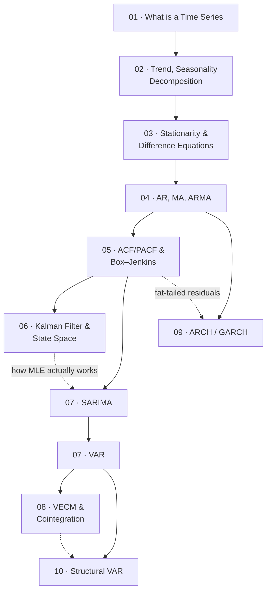

# Time-series Analysis — Map of Content

> [!info] Course information
> **Instructor:** Dr. Tran Thi Ha (`tranha@neu.edu.vn`), Faculty of Mathematical Economics, NEU
> **Assessment:** 10% attendance · 20% individual · 20% group · 50% final exam
> **Textbooks in `documents/`:** Hamilton, *Time Series Analysis* (the theoretical backbone of Lectures 6–10); Peixeiro, *Time Series Forecasting in Python*; Auffarth, *Machine Learning for Time-Series with Python*

---

## Chapters

| # | Chapter | One-line description |
|---|---|---|
| 01 | [[01 - What is a Time Series]] | What makes time-ordered data different: stock vs flow, lags and differences, the four components, and why cross-sectional intuition fails |
| 02 | [[02 - Trend, Seasonality and Decomposition]] | Estimating the components — moving averages, exponential smoothing, additive vs multiplicative decomposition, Holt–Winters and the ETS state-space family |
| 03 | [[03 - Stationarity and Difference Equations]] | The algebraic foundation: stationarity, white noise, the Wold decomposition, the lag operator, and how characteristic roots govern dynamic multipliers |
| 04 | [[04 - AR, MA and ARMA Processes]] | The three model families — their moments, Yule–Walker equations, invertibility, and the Wiener–Kolmogorov forecasting formula |
| 05 | [[05 - ACF, PACF and the Box-Jenkins Methodology]] | Going from data to model: ACF/PACF identification, Ljung–Box, unit-root testing (ADF/PP/KPSS), ARIMA, and AIC/BIC selection |
| 06 | [[06 - The Kalman Filter and State-Space Models]] | The machinery behind "estimate by MLE": prediction–update recursions, latent states, and the prediction-error likelihood |
| 07 | [[07 - SARIMA and Vector Autoregression]] | Two extensions — seasonal ARIMA for one variable at two frequencies, and VAR for many variables at once, with IRFs and Granger causality |
| 08 | [[08 - VECM and Cointegration]] | When $I(1)$ variables share a long-run equilibrium: the error-correction mechanism, the rank of $\Pi$, and Johansen's reduced-rank regression |
| 09 | [[09 - ARCH, GARCH and Extensions]] | Modelling the *variance*: volatility clustering, fat tails, persistence, and the leverage effect |
| 10 | [[10 - Structural Vector Autoregression]] | The identification problem — why the data cannot tell you causation, and what economic theory must supply |

---

## How the subject fits together

**Three threads run through the whole subject:**

1. **Univariate mean** — 01 → 02 → 03 → 04 → 05 → 07 (SARIMA). *Given one series, what will it do next?*
2. **Multivariate** — 07 (VAR) → 08 (VECM) → 10 (SVAR). *Given several series, how do they move together, and what causes what?*
3. **Variance** — 09. *Given a series, how uncertain is the next value?*

[[06 - The Kalman Filter and State-Space Models|Chapter 06]] sits underneath all three: it is the estimation engine, and the state-space framework subsumes ARMA, ETS, VAR and structural models alike.

---

## The five ideas that recur everywhere

> [!important] If you internalise these, the rest is bookkeeping
> **1. Any order-$p$ system is an order-1 system in a bigger space.** The **companion matrix** appears in [[03 - Stationarity and Difference Equations|ch. 03]] (dynamic multipliers), [[04 - AR, MA and ARMA Processes|ch. 04]] (forecast weights), [[06 - The Kalman Filter and State-Space Models|ch. 06]] (state transition), and [[07 - SARIMA and Vector Autoregression|ch. 07]] (VAR stability). Same matrix, four uses.
>
> **2. Stability is always "roots outside / eigenvalues inside the unit circle."** Scalar AR, VAR, VECM — one condition, stated two equivalent ways. Confusing $z$ with $\lambda = 1/z$ is the most common error in the subject.
>
> **3. Every model is a filter applied to white noise.** The **Wold decomposition** ([[03 - Stationarity and Difference Equations|ch. 03]]) guarantees it; the $\psi_j$ weights *are* the impulse response ([[04 - AR, MA and ARMA Processes|ch. 04]], [[07 - SARIMA and Vector Autoregression|ch. 07]], [[10 - Structural Vector Autoregression|ch. 10]]).
>
> **4. Forecasting = replace what you don't know with its expectation.** Wiener–Kolmogorov ([[04 - AR, MA and ARMA Processes|ch. 04]]), the Kalman update ([[06 - The Kalman Filter and State-Space Models|ch. 06]]), GARCH recursion ([[09 - ARCH, GARCH and Extensions|ch. 09]]) — the same principle three times.
>
> **5. Statistics gives dynamics; economics gives causation.** [[10 - Structural Vector Autoregression|Chapter 10]] is the explicit statement, but it is implicit from [[01 - What is a Time Series|ch. 01]]'s warning about spurious regression onward.

---

## Model selection quick reference

**One variable:**

| Situation | Model |
|---|---|
| Stationary, no seasonality | ARMA($p,q$) — [[04 - AR, MA and ARMA Processes\|04]] |
| Unit root | ARIMA($p,d,q$) — [[05 - ACF, PACF and the Box-Jenkins Methodology\|05]] |
| Seasonal | SARIMA($p,d,q$)($P,D,Q$)$_s$ — [[07 - SARIMA and Vector Autoregression\|07]] |
| Latent state / missing data / time-varying parameters | State space + Kalman — [[06 - The Kalman Filter and State-Space Models\|06]] |
| Volatility clustering | GARCH family — [[09 - ARCH, GARCH and Extensions\|09]] |

**Several variables** (test integration order first):

| Situation | Model |
|---|---|
| All $I(0)$ | VAR in levels — [[07 - SARIMA and Vector Autoregression\|07]] |
| All $I(1)$, **not** cointegrated | VAR in differences |
| All $I(1)$, **cointegrated** | VECM — [[08 - VECM and Cointegration\|08]] |
| Any of the above + causal interpretation needed | SVAR — [[10 - Structural Vector Autoregression\|10]] |

---

## Exam-critical formulas

$$
\text{ACF: } \rho_k = \frac{\gamma_k}{\gamma_0}
\qquad
\text{AR(1): } \rho_k = \phi^k,\;\; \gamma_0 = \frac{\sigma^2}{1-\phi^2}
$$
$$
\text{AR(2): } \rho_1 = \frac{\phi_1}{1-\phi_2},\quad \rho_2 = \phi_1\rho_1+\phi_2
\qquad
\text{MA($q$): } \rho_k = 0 \text{ for } k>q
$$
$$
\text{Stability (AR(2)): } \phi_2<1\pm\phi_1,\;\; |\phi_2|<1
\qquad
\text{complex roots: } R=\sqrt{-\phi_2},\;\; T = \frac{2\pi}{\theta}
$$
$$
\text{Ljung–Box: } Q^* = n(n+2)\sum_{k=1}^m\frac{\hat\rho_k^2}{n-k}\sim\chi^2(m-p-q)
\qquad
\text{bands: } \pm\frac{2}{\sqrt n}
$$
$$
\text{Kalman: } K_t = P_{t|t-1}HS_t^{-1},\quad \hat\xi_{t|t} = \hat\xi_{t|t-1}+K_tv_t
\qquad
\ell = -\tfrac12\sum_t\big(\log2\pi+\log S_t+\tfrac{v_t^2}{S_t}\big)
$$
$$
\text{VECM: } \Delta Y_t = \alpha\beta'Y_{t-1}+\sum_{i=1}^{p-1}\Gamma_i\Delta Y_{t-i}+\varepsilon_t,
\qquad
\Pi = \sum_iA_i-I,\;\; \mathrm{rank}(\Pi)=r
$$
$$
\text{GARCH(1,1): } \sigma_t^2 = \alpha_0+\alpha_1\varepsilon_{t-1}^2+\beta_1\sigma_{t-1}^2,
\qquad
\bar\sigma^2 = \frac{\alpha_0}{1-\alpha_1-\beta_1}
$$
$$
\text{SVAR: } \Sigma = P_{sr}P_{sr}',\quad P_{sr}=A^{-1}B,
\qquad
\text{restrictions needed} = \frac{n(n-1)}{2}
$$

---

## ⚠️ Source-material issues — read before relying on these notes

> [!warning] Systematic extraction artefact affecting **every** chapter
> The slides are HTML embedded in Colab notebooks. The extraction pipeline strips HTML tags, and **`<` inside inline LaTeX is parsed as the start of a tag**, silently truncating the rest of the line. So conditions written `\(|\phi| < 1\)` came through as `|\phi|` with the bound missing.
>
> **Every inequality in these notes of the form $|\phi|<1$, $|\lambda_i|<1$, $R<1$, $\sum(\alpha_i+\beta_i)<1$, $\varepsilon_{t-1}<0$, $\gamma<0$ is a reconstruction.** The mathematics is standard and unambiguous, so I am confident in the content — but the exact slide wording is unrecoverable. Each chapter's gap note lists its specific cases.

> [!warning] Missing data files — no applied result can be reproduced
> | Chapter | Missing file(s) |
> |---|---|
> | 02 | `GDP_Trade_Quarterly_Clean.xlsx` |
> | 05 | `CPI_PACF.xlsx`, `gdp_Pacf.xlsx` |
> | 07 | `GDP_week1.xlsx`, the 15-obs VAR data, the Drive-hosted `INDVN`/`Interest_rate` file |
> | 08 | all VECM estimation data |
> | 09 | `returns5.csv`, `byd.csv` (Google Drive paths) |
> | 10 | `lutkepohl2.dta`, `m1gdp.dta` — **these two are fetched from stata-press.com at runtime, so they are reproducible** |
>
> Where slides report numerical estimates, I have **verified their internal consistency** wherever possible (the AR(3) Yule–Walker values, the CPI PACF arithmetic, the Example 7.1 IRFs, the VECM $\Pi=\alpha\beta'$ decompositions, the SVAR structural shocks) and flagged the errors found. **No figures survive anywhere** — every notebook was saved without cell outputs.

> [!warning] Errors found in the slides
> - **Ch. 03** — the stability-triangle figure's colour regions contradict its caption; slides s17/s18 write $\partial y_{t+2}/\sigma_t$ for $\partial y_{t+2}/\partial w_t$ and are exact duplicates.
> - **Ch. 04** — the MA(2) example prints $\gamma_0 = \tfrac{31}{19}$ (correct: $\tfrac{31}{18}$) and roots $z=-2,-3$ (correct: $+2,+3$).
> - **Ch. 05** — Bartlett's variance formula is missing its leading $1$ and factor $2$; the Ljung–Box degrees-of-freedom adjustment for fitted models is never mentioned.
> - **Ch. 06** — $v_t$ denotes both the state disturbance and the innovation; $H$ vs $H'$ used inconsistently.
> - **Ch. 08** — the reported Johansen critical values do not match standard tables.
> - **Ch. 09** — the deck titles itself "Lecture 10", clashing with the SVAR deck.
> - **Ch. 10** — $P_{sr}$ is defined in both directions ($u=P\varepsilon$ and $\varepsilon=Pu$) without warning.

> [!warning] Topics named but never taught
> Worth raising with the lecturer if they may be examinable:
> - **IGARCH and FIGARCH** — on the ch. 09 title slide, never covered.
> - **Structural FEVD** — on the ch. 10 title slide, never derived.
> - **Sign restrictions** — one bullet in ch. 10, no elaboration.
> - **The Kalman smoother** — absent from ch. 06 entirely, despite being the right tool for estimating historical latent series.
> - **Weak exogeneity testing** — absent from ch. 08, despite the worked example displaying a textbook case of it.
> - **Seasonal unit-root tests** (HEGY, OCSB) — absent from ch. 07 despite $D$ being chosen.
> - **Confidence bands for IRFs** — never mentioned in ch. 07, 08 or 10.

> [!note] Syllabus vs. filenames
> From Lecture 6 onward the syllabus titles and the notebook filenames diverge (syllabus: ARIMA/ARCH/ML; files: KalmanFilter/SARIMA-VAR/VECM/ARCH/SVAR). **These notes follow the notebook filenames**, which is what actually exists. There are also **two VECM notebooks** — `lecture08_VECM_DSEB.ipynb` (57 cells, full derivation) and `VECM_lecture_slides.ipynb` (16 cells, overview covering VECM IRFs and the model-choice rule); they are **complementary, not duplicates**, and ch. 08 uses both.
>
> **No exercises are provided in any deck except Lecture 3** (Questions 1–3) **and Lecture 4** (Exercises 3.1–3.2), and none of those come with solutions. Every other exercise in these notes is my own construction, with arithmetic independently verified.

---

## Cross-subject links

- [[Mathematical Statistics/contents/00-Index|Mathematical Statistics]] — estimation, hypothesis testing, and the sampling distributions underlying every test here
- [[Data Preparation and Visualization/contents/00-Index|Data Preparation & Visualization]] — pandas datetime handling, resampling, and the leakage rules that apply doubly to time-ordered data
- [[Machine Learning/contents/00-Index|Machine Learning]] — the bias–variance decomposition that reappears as the MSE decomposition in forecasting
- [[Linear Algebra/contents/00-Index|Linear Algebra]] — eigenvalues, companion and Toeplitz matrices, Cholesky decomposition

#time-series #index #moc
