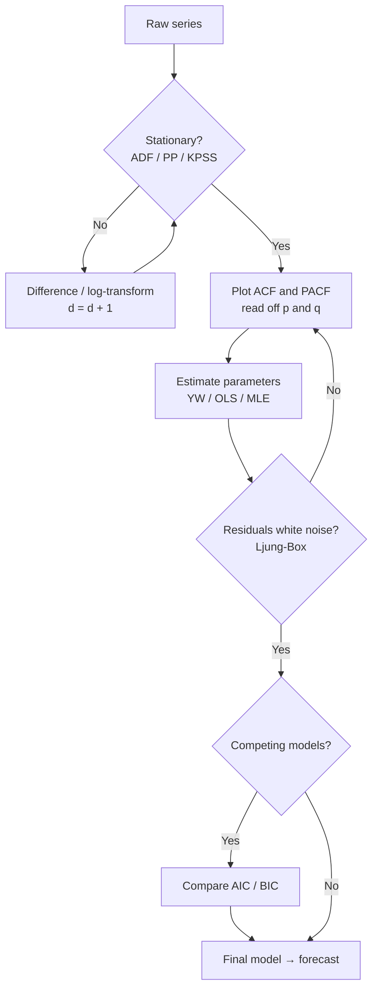

# ACF, PACF and the Box–Jenkins Methodology

> [!abstract] Where this sits in the course
> [[04 - AR, MA and ARMA Processes]] derived the theoretical moments of AR, MA and ARMA models — **given the model, find the ACF**. This chapter inverts the problem: **given data, find the model.** That inversion is the Box–Jenkins methodology, and it rests on two diagnostic tools (ACF and PACF), one pre-condition (stationarity, tested formally here for the first time), and two tie-breakers (AIC/BIC). This is the most *practically* useful chapter in the subject.

---

## 📘 Main Knowledge

### 1. Two functions, two questions

Identifying whether a series follows AR($p$), MA($q$) or ARMA($p,q$) requires determining both the **orders** $p,q$ and the **parameters** $\phi_i,\theta_i$. The orders come first, and they come from two functions.

#### 1.1 The Autocorrelation Function (ACF)

The ACF measures the **overall linear dependence** between two points separated by $k$ periods:

$$
\rho(k) = \frac{\mathrm{Cov}(Y_t, Y_{t-k})}{\mathrm{Var}(Y_t)} = \frac{\gamma(k)}{\gamma(0)}
$$

Crucially, it reflects **both direct and indirect effects**. If $Y_t$ depends on $Y_{t-1}$ and $Y_{t-1}$ depends on $Y_{t-2}$, then $\rho(2) \neq 0$ even if $Y_t$ has no *direct* link to $Y_{t-2}$ at all — the dependence is transmitted through the chain. An ACF that decays slowly signals strong dynamics, a "long memory".

| Process | ACF behaviour |
|---|---|
| MA($q$) | **Cuts off** after lag $q$ |
| AR($p$) | **Tails off** |
| ARMA($p,q$) | **Tails off** |

#### 1.2 The Partial Autocorrelation Function (PACF)

The PACF measures the **direct** linear relationship between $Y_t$ and $Y_{t-k}$ *after removing* the influence of the intermediate lags $Y_{t-1},\ldots,Y_{t-k+1}$:

$$
\mathrm{PACF}(k) = \rho_{kk} = \mathrm{Corr}\big(Y_t,\,Y_{t-k}\;\big|\;Y_{t-1},\ldots,Y_{t-k+1}\big)
$$

| Process | PACF behaviour |
|---|---|
| AR($p$) | **Cuts off** after lag $p$ |
| MA($q$) | **Tails off** |
| ARMA($p,q$) | **Tails off** |

> [!important] The duality — why you need exactly these two functions
> Read the two tables together and the logic falls out:
> - An **AR($p$)** has finite *direct* memory ($p$ lags) but infinite *total* memory (chained through the lags). So the **PACF cuts off**, the ACF tails off.
> - An **MA($q$)** has finite *total* memory (only $q$ shocks) but infinite *direct* memory once you condition. So the **ACF cuts off**, the PACF tails off.
> - An **ARMA** has both infinite — neither cuts off.
>
> This is why exactly one of the two functions cuts off for a pure model, and it is the entire basis of Box–Jenkins identification. The PACF is to the ACF what a **partial regression coefficient** is to a simple correlation — see [[Mathematical Statistics/contents/08 - Inferences on Two Samples|partial vs. marginal association]].

---

### 2. Estimating the ACF

Given a sample $\{Y_1,\ldots,Y_n\}$ with mean $\bar Y = \tfrac1n\sum_t Y_t$:

**Sample autocovariance at lag $k$:**

$$
\hat\gamma_k = \frac{1}{n-k}\sum_{t=k+1}^n (Y_t-\bar Y)(Y_{t-k}-\bar Y)
\qquad\text{or, more commonly,}\qquad
\hat\gamma_k \approx \frac{1}{n}\sum_{t=k+1}^n (Y_t-\bar Y)(Y_{t-k}-\bar Y)
$$

**Sample variance:** $\hat\gamma_0 = \frac1n\sum_{t=1}^n(Y_t-\bar Y)^2$

**Sample ACF (SACF):**

$$
\boxed{\;\hat\rho(k) = \frac{\hat\gamma_k}{\hat\gamma_0}
= \frac{\sum_{t=k+1}^n(Y_t-\bar Y)(Y_{t-k}-\bar Y)}{\sum_{t=1}^n(Y_t-\bar Y)^2}\;}
$$

> [!note] Why divide by $n$ rather than $n-k$?
> The $1/n$ version is biased downward but guarantees the estimated autocovariance matrix is **positive semi-definite** — essential, since a covariance matrix that isn't PSD can produce negative variance estimates and break the Yule–Walker solve. The $1/(n-k)$ version is less biased but can fail this. Every standard package (`statsmodels`, R's `acf`) uses $1/n$. The bias is negligible for small $k$ and large $n$, which is exactly the regime where you read the plot.

**Practical warnings.** $\hat\rho(k)$ is an *estimate*, so it is never exactly zero even when $\rho(k)$ is. For $k$ approaching $n$ the estimate is based on very few overlapping pairs and becomes worthless — a common rule of thumb is to inspect at most $n/4$ lags.

---

### 3. Estimating the PACF — three routes

#### Method 1 — OLS regression (the definition you can compute)

Estimate an AR($k$) model by ordinary least squares:

$$
Y_t = a_{k1}Y_{t-1} + a_{k2}Y_{t-2} + \cdots + a_{kk}Y_{t-k} + u_t
$$

The **PACF at lag $k$ is the coefficient on the furthest lag**:

$$
\boxed{\;\mathrm{PACF}(k) = \rho_{kk} = a_{kk}\;}
$$

Note the double subscript: $a_{kk}$ is "the coefficient on lag $k$ in the regression that includes $k$ lags". Running $k=1,2,3,\ldots$ gives a *different regression each time*, and you keep only the last coefficient from each. Because the other lags are controlled for, $a_{kk}$ isolates the marginal contribution of lag $k$ — hence "partial".

**Identification hint:** if the series is truly AR($p$), then $\rho_{kk}\approx 0$ for $k>p$ — adding a lag beyond $p$ adds nothing, because the true model has no direct dependence there.

#### Method 2 — Yule–Walker in Toeplitz form

Solve for the AR($k$) coefficient vector $\mathbf{a}_k = (a_{k1},\ldots,a_{kk})'$:

$$
\mathbf{P}_k\,\mathbf{a}_k = \boldsymbol{\rho}_k,
\qquad
\mathbf{P}_k = \begin{bmatrix}
1 & \rho_1 & \cdots & \rho_{k-1}\\
\rho_1 & 1 & \cdots & \rho_{k-2}\\
\vdots & \vdots & \ddots & \vdots\\
\rho_{k-1} & \rho_{k-2} & \cdots & 1
\end{bmatrix},
\qquad
\boldsymbol{\rho}_k = \begin{bmatrix}\rho_1\\ \rho_2\\ \vdots\\ \rho_k\end{bmatrix}
$$

Then $\mathrm{PACF}(k) = a_{kk}$, the **last** element of the solution. $\mathbf{P}_k$ is the Toeplitz autocorrelation matrix from [[04 - AR, MA and ARMA Processes]] — the same Yule–Walker system, now read as an estimator rather than a moment identity.

#### Method 3 — Durbin–Levinson recursion (the fast one)

Solving $k$ separate linear systems is wasteful, because $\mathbf{P}_k$ and $\mathbf{P}_{k+1}$ share almost all their entries. The **Durbin–Levinson** recursion exploits the Toeplitz structure to get from lag $k-1$ to lag $k$ in $O(k)$ operations.

**Initialise:**

$$
\rho_{11} = \rho_1
$$

**For $k\ge2$:**

$$
\boxed{\;\rho_{kk} = \frac{\rho_k - \sum_{j=1}^{k-1}\rho_{k-1,j}\,\rho_{k-j}}{1 - \sum_{j=1}^{k-1}\rho_{k-1,j}\,\rho_j}\;}
$$

**Then update the auxiliary coefficients** for $j = 1,\ldots,k-1$:

$$
\rho_{kj} = \rho_{k-1,j} - \rho_{kk}\,\rho_{k-1,\,k-j}
$$

Read the recursion as: *the numerator is the raw lag-$k$ correlation minus what the shorter model already explains; the denominator normalises by the variance still unexplained.* When the shorter model already accounts for everything, the numerator vanishes and $\rho_{kk} = 0$ — precisely the AR cut-off.

**Lag 2, written out.** With $k=2$, the sums have one term, $\rho_{1,1} = \rho_1$:

$$
\boxed{\;\rho_{22} = \frac{\rho_2 - \rho_1^2}{1-\rho_1^2}\;}
$$

A clean interpretation: $\rho_2$ is the total lag-2 correlation; $\rho_1^2$ is the part transmitted *through* lag 1; the difference, rescaled, is the direct part. **If $\rho_2 = \rho_1^2$ exactly — as for an AR(1), where $\rho_k = \phi^k$ — then $\rho_{22} = 0$.** That single line is why an AR(1)'s PACF cuts off at lag 1.

**Lag 3:**

$$
\boxed{\;\rho_{33} = \frac{\rho_3 - (\rho_{21}\rho_2 + \rho_{22}\rho_1)}{1 - (\rho_{21}\rho_1 + \rho_{22}\rho_2)}\;}
$$

with $\rho_{21} = \rho_{11}(1-\rho_{22})$ from the update rule.

**Large-sample distribution.** Under $H_0: \rho_{kk}=0$,

$$
\mathrm{Var}(\hat\rho_{kk}) \approx \frac1n
\qquad\Longrightarrow\qquad
\text{95\% band} \approx \pm\frac{2}{\sqrt n}
$$

This is the origin of the dashed horizontal lines on every PACF plot.

> [!example] Worked example — Vietnam monthly CPI, 1995M01–2007M12
> $n = 156$ observations. The sample autocorrelations are
> $$\hat\rho_1 = 0.338,\qquad \hat\rho_2 = 0.082,\qquad \hat\rho_3 = 0.104$$
>
> **PACF(1)** — by definition equal to the ACF at lag 1:
> $$\hat\rho_{11} = \hat\rho_1 = \mathbf{0.338}$$
>
> **PACF(2)**:
> $$\hat\rho_{22} = \frac{\hat\rho_2 - \hat\rho_{11}\hat\rho_1}{1-\hat\rho_{11}\hat\rho_1}
> = \frac{0.082 - 0.338^2}{1-0.338^2}
> = \frac{0.082 - 0.114244}{0.885756}
> = \frac{-0.032244}{0.885756} = \mathbf{-0.037}$$
> Note $\hat\rho_2 < \hat\rho_1^2$, so the *direct* lag-2 effect is slightly negative: lag 1 alone over-predicts the lag-2 correlation.
>
> **Auxiliary coefficient**, needed for the next step:
> $$\hat\rho_{21} = \hat\rho_{11}(1-\hat\rho_{22}) = 0.338(1+0.037) = \mathbf{0.351}$$
>
> **PACF(3)**:
> $$\hat\rho_{33} = \frac{\hat\rho_3 - \sum_{j=1}^{2}\hat\rho_{2j}\hat\rho_{3-j}}{1-\sum_{j=1}^{2}\hat\rho_{2j}\hat\rho_j}
> = \frac{0.104 - \big(0.351(0.082) + (-0.037)(0.338)\big)}{1 - \big(0.351(0.338)+(-0.037)(0.082)\big)}$$
> $$= \frac{0.104 - (0.028782 - 0.012506)}{1-(0.118638-0.003034)}
> = \frac{0.087724}{0.884396} = \mathbf{0.099}$$
>
> (I recomputed all three from the given $\hat\rho_k$ — **the slide's arithmetic is correct**.)
>
> **Interpretation.** The 95% band is $\pm2/\sqrt{156} = \pm0.160$. So $\hat\rho_{11} = 0.338$ is clearly significant, while $\hat\rho_{22}$ and $\hat\rho_{33}$ are not — which on its own would suggest AR(1). The lecture's conclusion is more cautious: PACF(1) is large and positive (strong short-term dynamics), but the PACF **does not cut off cleanly** at higher lags, so CPI is **not a simple AR($p$)**. A **seasonal (SARIMA)** specification is needed — monthly CPI has an obvious annual cycle that shows up at lags 12, 24, … well beyond the three lags computed here. See [[07 - SARIMA and Vector Autoregression]].

---

### 4. Testing autocorrelations for significance

Theoretical ACFs cut off exactly; **sample** ACFs never do. Identification therefore depends on **statistical significance**, not on visual zeros.

#### 4.1 Bartlett's test — one lag at a time

Under $H_0: \rho_k = 0$ against $H_1: \rho_k \neq 0$, the sample autocorrelation is asymptotically

$$
\hat\rho_k \sim \mathcal{N}\!\left(0,\;\frac1n\right)
\qquad\Longrightarrow\qquad
Z = \frac{\hat\rho_k}{\mathrm{se}(\hat\rho_k)} \sim \mathcal{N}(0,1)
$$

**Rejection region at 5%:**

$$
\boxed{\;|\hat\rho_k| > 1.96\sqrt{\frac1n}\;}
$$

which in practice is drawn as $\pm2/\sqrt n$ — the confidence bands on the ACF plot.

> [!warning] The slides' Bartlett variance formula is incomplete
> The deck prints $\mathrm{Var}(\hat\rho_k) = \frac1n\sum_{i=1}^n\hat\rho_i^2$ for $k>m$. **Bartlett's formula is**
> $$\mathrm{Var}(\hat\rho_k) \approx \frac1n\left(1 + 2\sum_{i=1}^{m}\rho_i^2\right), \qquad k > m$$
> The leading $1$ and the factor $2$ are both missing from the slide, and the summation limits printed on the covariance line ($\sum_{i=-m+s}^{n}$) are garbled. The slide also writes "$Z \sim \mathcal{N}(0,1/n)$" where it means $\hat\rho_k \sim \mathcal{N}(0,1/n)$ — the standardised $Z$ is $\mathcal{N}(0,1)$.
>
> The simple $\pm2/\sqrt n$ band used everywhere in practice is the **$m=0$ special case** (i.e. testing against pure white noise). The wider Bartlett band matters when you are testing lag $k$ in a series already known to be autocorrelated at shorter lags — `statsmodels`' `plot_acf` offers it via the `bartlett_confint` argument, on by default.

#### 4.2 Joint tests — all lags at once

Testing 20 lags individually at 5% guarantees roughly one false positive by chance. Test them **jointly**:

$$
H_0: \rho_1 = \rho_2 = \cdots = \rho_m = 0
$$

**Box–Pierce:**

$$
Q = n\sum_{k=1}^m \hat\rho_k^2 \;\sim\; \chi^2(m)
$$

**Ljung–Box** (the one actually used — a finite-sample correction that weights each term by $\tfrac{n+2}{n-k}$, inflating the contribution of higher lags where $\hat\rho_k$ is estimated from fewer pairs):

$$
\boxed{\;Q^* = n(n+2)\sum_{k=1}^m\frac{\hat\rho_k^2}{n-k} \;\sim\; \chi^2(m)\;}
$$

**Decision:** reject $H_0$ if $Q,Q^* > \chi^2_\alpha(m)$.

> [!important] Ljung–Box is used *twice*, with opposite intentions
> 1. **On the raw series**, to ask "is there any structure worth modelling?" You *want* to reject — otherwise the series is white noise and there is nothing to do.
> 2. **On the residuals of a fitted model**, to ask "has all the structure been captured?" Here you *want to fail to reject* — significant residual autocorrelation means the model is inadequate.
>
> The same statistic, the same distribution, opposite desired outcomes. This is step 3 of Box–Jenkins.
>
> **Degrees-of-freedom caveat:** when applied to residuals from an ARMA($p,q$), the correct null distribution is $\chi^2(m-p-q)$, not $\chi^2(m)$ — you spent $p+q$ degrees of freedom fitting. The slides do not mention this; `statsmodels`' `acorr_ljungbox` requires you to pass `model_df` yourself.

#### 4.3 PACF significance

Under $H_0: \rho_{kk}=0$, for large $n$ and fixed $k$:

$$
\hat\rho_{kk} \sim \mathcal{N}\!\left(0,\frac1n\right)
\qquad\Longrightarrow\qquad
\hat\rho_{kk} \in \left[-\frac{2}{\sqrt n},\; \frac{2}{\sqrt n}\right] \text{ under } H_0
$$

A standard ACF/PACF plot puts lag $k$ on the horizontal axis, $\widehat{\mathrm{SACF}}$ or $\widehat{\mathrm{SPACF}}$ on the vertical, and confidence bands at level $1-\alpha$.

---

### 5. Stationarity and unit-root testing

Everything above assumes stationarity. **This is the first point in the course where that assumption is tested rather than asserted.**

#### 5.1 Recap: what stationarity requires

A series is stationary if its statistical properties do not change over time — it fluctuates around a constant mean, with constant spread, and a lag-dependence structure that is the same everywhere:

$$
\mathbb{E}(Y_t) = \mu,
\qquad
\mathrm{Var}(Y_t) = \sigma^2,
\qquad
\mathrm{Cov}(Y_t,Y_{t-k}) = \gamma_k \;\text{ (function of } k \text{ only)}
$$

**Why it matters:** ARIMA models assume it; non-stationary series produce **spurious regressions** and unreliable forecasts; transforming to stationarity (usually by differencing) is a mandatory first step. See [[03 - Stationarity and Difference Equations]] for the theory and [[01 - What is a Time Series]] for the spurious-regression warning.

#### 5.2 Why test for unit roots

| Problem | Consequence |
|---|---|
| **Spurious regression** | Regressing one non-stationary series on another gives high $R^2$ and significant $t$-statistics *even with no true relationship* |
| **Invalid inference** | Standard econometric theory assumes stationarity; applied to $I(1)$ data, standard errors and test statistics are wrong |
| **Unreliable forecasts** | Parameters are unstable; out-of-sample performance collapses |

#### 5.3 Dickey–Fuller and Augmented Dickey–Fuller

Start from an AR(1):

$$
Y_t = \phi Y_{t-1} + \varepsilon_t, \qquad \varepsilon_t \sim iid
$$

If $\phi = 1$, $Y_t$ is a random walk — non-stationary. **Reparameterise** by subtracting $Y_{t-1}$ from both sides:

$$
\Delta Y_t = \delta Y_{t-1} + \varepsilon_t,
\qquad \delta = \phi - 1
$$

so the hypotheses become

$$
H_0: \phi = 1 \iff H_0: \delta = 0 \quad\text{(unit root)},
\qquad
H_1: \phi < 1 \iff H_1: \delta < 0 \quad\text{(stationary)}
$$

**Test statistic:**

$$
\tau = \frac{\hat\delta}{\mathrm{se}(\hat\delta)}
$$

> [!warning] $\tau$ does **not** follow a Student $t$ distribution
> This is the single most important technical fact about unit-root testing. Under $H_0$ the regressor $Y_{t-1}$ is non-stationary, so standard asymptotics fail. Critical values come from the **Dickey–Fuller distribution**, which is shifted well to the left of the $t$: the 5% critical value is about $-2.86$ (with intercept) rather than $-1.96$. **Using $t$-table critical values will make you reject the unit root far too often.**

**Three regression variants**, chosen by what you believe about the deterministic part:

$$
\begin{aligned}
\text{No constant:} \quad & \Delta Y_t = \delta Y_{t-1}+\varepsilon_t \\
\text{With constant:} \quad & \Delta Y_t = \beta_1 + \delta Y_{t-1}+\varepsilon_t \\
\text{With constant and trend:} \quad & \Delta Y_t = \beta_1 + \beta_2 t + \delta Y_{t-1}+\varepsilon_t
\end{aligned}
$$

**Each variant has its own critical values.** Choosing the wrong one is a common and consequential error: including a trend when there is none costs power; omitting one when the series trends biases the test toward non-rejection.

**Augmented Dickey–Fuller.** The DF test assumes i.i.d. errors. If $\varepsilon_t$ is itself autocorrelated the test is invalid, so add lagged differences to soak it up:

$$
\boxed{\;\Delta Y_t = \beta_1 + \beta_2 t + \delta Y_{t-1} + \sum_{k=1}^{q}\theta_k\,\Delta Y_{t-k} + \varepsilon_t\;}
$$

The lagged $\Delta Y_{t-k}$ terms are **nuisance parameters** — you never interpret them, they exist only to whiten the residuals. Choose $q$ by AIC/BIC or a rule such as $q = \lfloor 12(n/100)^{1/4}\rfloor$.

**Decision rule:**

| Outcome | Conclusion |
|---|---|
| ADF statistic **more negative** than the critical value → reject $H_0$ | Series is **stationary** (or trend-stationary if a trend was included) |
| ADF statistic **less negative** than the critical value → fail to reject | Series has a **unit root**; difference it |

Equivalently: $p < 0.05 \Rightarrow$ reject $H_0 \Rightarrow$ stationary.

#### 5.4 Phillips–Perron

The PP test allows **both autocorrelation and heteroskedasticity** in $\varepsilon_t$, handling them **non-parametrically** — instead of adding lags, it corrects the test statistic directly:

$$
\tilde t = t_\delta\left(\frac{\gamma_0}{f_0}\right)^{1/2} - \frac{n\,(f_0-\gamma_0)\,\mathrm{se}(\hat\delta)}{2 f_0\,\hat\sigma}
$$

where $f_0$ is the **long-run variance** of the residuals (the spectral density at frequency zero, estimated with a Newey–West-type kernel) and $\gamma_0$ a consistent short-run variance estimator. Note that when there is no serial correlation $f_0 = \gamma_0$, the correction term vanishes and $\tilde t = t_\delta$ — PP reduces to plain DF.

Same hypotheses and decision rule as ADF: insignificant → unit root; significant → no unit root. With a trend included, rejection implies **trend stationarity**.

#### 5.5 KPSS — the null is reversed

$$
Y_t = \delta' X_t + \varepsilon_t,
\qquad
X_t = \begin{cases} 1, & \text{level-stationary}\\ [1,t], & \text{trend-stationary}\end{cases}
$$

$$
H_0: Y_t \text{ is stationary (level or trend)}
\qquad\qquad
H_1: Y_t \text{ is a random walk}
$$

**LM statistic**, built on the **cumulative sum of OLS residuals**:

$$
LM = \frac{1}{n f_0}\sum_t S(t)^2,
\qquad
S(t) = \sum_{r=1}^t e_r,
\qquad
e_r = Y_r - X_r'\hat\delta
$$

The logic: if the residuals are stationary, their partial sums $S(t)$ wander like a random walk of bounded scale and $\sum S(t)^2$ stays moderate. If there is a genuine unit root, $S(t)$ behaves like an *integrated* random walk and the sum explodes. Critical values are non-standard (asymptotic).

**Decision:** $p < 0.05 \Rightarrow$ reject $H_0 \Rightarrow$ **non-stationary**. $p \ge 0.05 \Rightarrow$ fail to reject $\Rightarrow$ stationary.

#### 5.6 Comparison and combined use

| Test | $H_0$ | Approach | Reject $H_0$ means |
|---|---|---|---|
| **ADF** | Unit root (non-stationary) | Parametric — adds lagged differences to remove autocorrelation | Stationary |
| **PP** | Unit root (non-stationary) | Non-parametric — corrects the $t$-statistic for serial correlation and heteroskedasticity | Stationary |
| **KPSS** | **Stationary** (around mean or trend) | Tests whether a random-walk component is present | **Non-stationary** |

**When to use which.** ADF and PP are for when you *suspect* non-stationarity and want to detect a unit root — useful for deciding what needs differencing. KPSS is for when you want to *confirm* stationarity, typically after differencing.

> [!important] Use them together — the null hypotheses are complementary
> | ADF/PP | KPSS | Conclusion |
> |---|---|---|
> | Fail to reject (unit root) | Reject (non-stationary) | **Strong evidence of a unit root** — difference the series |
> | Reject (stationary) | Fail to reject (stationary) | **Strong evidence of stationarity** — proceed |
> | Fail to reject | Fail to reject | Inconclusive — the data are uninformative; likely too short |
> | Reject | Reject | Conflicting — investigate (structural break? fractional integration?) |
>
> The reason this works is that ADF's low power makes "fail to reject" weak evidence on its own. Agreement between two tests with **opposite nulls** is much stronger than either alone. This is the single most useful practical tip in this chapter.

> [!warning] Unit-root tests have low power against near-unit roots
> Distinguishing $\phi = 1$ from $\phi = 0.95$ with a couple of hundred observations is close to hopeless — see Exercise 3 of [[04 - AR, MA and ARMA Processes]]. Do not treat a failure to reject as proof of a unit root; combine the tests with economic reasoning and a look at the plot.

---

### 6. ARIMA and integration

**Integration order.** A series is:

- **$I(1)$** if its *first difference* is stationary,
- **$I(d)$** if its *$d$-th difference* is stationary,
- **$I(0)$** if it is already stationary ($d=0$).

If $Y_t$ is $I(d)$, applying an ARMA($p,q$) to the $d$-th differenced series gives the **ARIMA($p,d,q$)** model:

$$
\phi(L)(1-L)^d Y_t = \phi_0 + \theta(L)\varepsilon_t
$$

The "**I**" is *integrated* — the original series is the running sum (integral) of a stationary ARMA process, exactly as a random walk is the running sum of white noise.

**The MA($\infty$) view.** For a mean-zero ARMA($p,q$), $\phi(L)Y_t = \theta(L)\varepsilon_t$ with

$$
\Psi(L) = \frac{\theta(L)}{\phi(L)} = \Psi_0 + \Psi_1L + \Psi_2L^2+\cdots
\qquad\Longrightarrow\qquad
Y_t = \Psi(L)\varepsilon_t
$$

— the Wold representation from [[03 - Stationarity and Difference Equations]], computed in practice by the polynomial-division recursion of [[04 - AR, MA and ARMA Processes]].

> [!tip] Choosing $d$ in practice
> - $d$ is almost never above 2 for economic data. $d=1$ handles a stochastic trend; $d=2$ handles a trending growth rate. $d\ge3$ almost always means something else is wrong.
> - **Do not over-difference.** An over-differenced series has an ACF with a large negative spike at lag 1 (a non-invertible MA unit root) and inflated variance.
> - Consider a **log transform before differencing** when variance grows with level; $\Delta\log Y_t$ is then a growth rate — see [[01 - What is a Time Series]].

---

### 7. The Box–Jenkins methodology

A procedure for building ARIMA models in **three iterated steps**:

1. **Identification** — determine $d$, $p$, $q$.
2. **Estimation** — estimate the parameters.
3. **Diagnostics** — assess adequacy.

**These steps are iterated until a suitable model is obtained.** It is a loop, not a pipeline: failed diagnostics send you back to identification.

#### 7.1 Step 1 — Identification via ACF and PACF

**Box–Jenkins principle:** read the **decay pattern** — cut-off versus tail-off — from the ACF and PACF plots of the *stationary* (differenced) series.

| Model | ACF | PACF |
|---|---|---|
| **AR($p$)** | Exponential or sinusoidal decay | **Cuts off after lag $p$** ($\rho_{kk}=0,\;k>p$) |
| **MA($q$)** | **Cuts off after lag $q$** ($\rho_k = 0,\;k>q$) | Exponential or sinusoidal decay |
| **ARMA($p,q$)** | Exponential or sinusoidal decay | Exponential or sinusoidal decay |

- **"Cut-off"** — coefficients are $\approx0$ (within the confidence band) after a specific lag.
- **"Tail-off"** — coefficients decay gradually, never dropping abruptly to zero.

Extending to ARIMA($p,d,q$) — the pattern is read on the differenced series:

| ARIMA | ACF | PACF |
|---|---|---|
| $(p,d,0)$ | Exponential/sinusoidal decay | $\rho_{kk}=0$ for $k>p$ |
| $(0,d,q)$ | $\rho_k = 0$ for $k>q$ | Exponential/sinusoidal decay |
| $(1,d,1)$ | $\rho_1 \neq 0$, then decay | $\rho_{11}\neq0$, then decay |
| $(1,d,2)$ | $\rho_1,\rho_2\neq0$, then decay | $\rho_{11}\neq0$, then decay |
| $(2,d,1)$ | $\rho_1 \neq 0$, then decay | $\rho_{11},\rho_{22}\neq0$, then decay |
| $(2,d,2)$ | $\rho_1,\rho_2\neq0$, then decay | $\rho_{11},\rho_{22}\neq0$, then decay |

> [!warning] The table is *preliminary* identification only
> The lecture is explicit about this, and it is worth taking seriously: **"there are no rules for perfectly accurate results."** In practice the mixed ARMA rows are nearly unreadable from real plots — the distinction between "$\rho_1,\rho_2 \neq 0$ then decay" and "decay from lag 1" is not something you can reliably see in noisy data. Treat ACF/PACF as generating a *shortlist* of candidate orders, then decide with **residual diagnostics and AIC/BIC**.

#### 7.2 Step 3 — Model selection with AIC and BIC

**Akaike Information Criterion:**

$$
AIC = n\ln(\hat\sigma^2) + 2k
\qquad\text{(OLS)}
\qquad\qquad
AIC = -2\ln(L) + 2k
\qquad\text{(MLE)}
$$

**Schwarz / Bayesian Information Criterion:**

$$
BIC = n\ln(\hat\sigma^2) + k\ln(n)
\qquad\text{(OLS)}
\qquad\qquad
BIC = -2\ln(L) + k\ln(n)
\qquad\text{(MLE)}
$$

where $n$ = number of observations, $\hat\sigma^2 = SSR/n$, $L$ = maximised likelihood, and $k$ = number of parameters (including the intercept and the error variance).

**Lower is better** for both. Each is a fit term plus a **complexity penalty**: adding a parameter always improves fit, so without the penalty you would always choose the largest model.

> [!important] AIC vs BIC — they answer different questions
> Since $\ln(n) > 2$ for $n > 7$, **BIC penalises complexity more heavily and selects smaller models.** Which to prefer:
> - **AIC** targets *predictive accuracy*: it is asymptotically efficient, minimising out-of-sample prediction error, but it is not consistent — it over-selects with positive probability even as $n\to\infty$. Use it when the goal is forecasting.
> - **BIC** targets *the true model*: it is consistent, selecting the correct order with probability $\to1$ if the true model is in the candidate set. Use it when the goal is inference about structure.
>
> When they disagree, BIC's choice is the more parsimonious one. Reporting both is standard.
>
> **Comparability caveat:** AIC/BIC values are only comparable across models fitted to **the same data**. Comparing an ARIMA($p,1,q$) against an ARIMA($p,0,q$) is invalid — differencing changes the number of observations and the dependent variable. Choose $d$ by unit-root testing, *then* compare $p,q$ by information criteria.

#### 7.3 Step 2 — Parameter estimation

Once $d$, $p$ and $q$ are chosen, estimate $\phi$ and $\theta$.

**(a) Yule–Walker.** Applicable when the model is **AR($p$) only**. Solve

$$
\hat\gamma_k = \sum_{i=1}^p \hat\phi_i\,\hat\gamma_{k-i},
\qquad\text{or equivalently}\qquad
\hat\rho_k = \sum_{i=1}^p \hat\phi_i\,\hat\rho_{k-i},
\qquad k=1,\ldots,p
$$

a linear system in $\hat\phi$. For ARMA models it estimates only the AR part; the MA coefficients need other methods. In practice YW supplies **initial values** for a subsequent MLE.

**(b) OLS.** Minimise the sum of squared residuals. For a pure AR this is a linear regression on lagged values and is easy. **Once an MA component is present the problem becomes non-linear**, because the lagged $\varepsilon$'s are unobserved — they depend on the parameters being estimated. Numerical algorithms are then required.

**(c) Method of Moments.** Match theoretical to sample autocovariances. For ARMA(1,1), $Y_t = \phi Y_{t-1}+\varepsilon_t+\theta\varepsilon_{t-1}$:

$$
\gamma(0) = \phi\gamma(1) + \sigma^2(1+\theta^2+2\phi\theta),
\qquad
\gamma(1) = \phi\gamma(0)+\sigma^2\theta
$$
$$
\sigma^2 = \frac{\gamma(0)-\phi\gamma(1)}{1+\theta^2+2\phi\theta}
$$

Given $\hat\gamma(0),\hat\gamma(1)$, solve this **non-linear** system for $\phi,\theta,\sigma^2$. **Limitations:** computationally awkward once $p+q\ge3$, statistically inefficient relative to MLE, and requires numerical methods for the MA part anyway.

**(d) Maximum Likelihood — the default.** Assume $\varepsilon_t \sim iid\;N(0,\sigma^2)$. Given parameters, compute the innovations **recursively**:

$$
\varepsilon_t = Y_t - \phi_0 - \phi_1Y_{t-1}-\cdots-\phi_pY_{t-p} - \theta_1\varepsilon_{t-1}-\cdots-\theta_q\varepsilon_{t-q}
$$

The log-likelihood is then

$$
\ln L(\phi,\theta,\sigma^2) = -\frac n2\ln(2\pi) - \frac n2\ln(\sigma^2) - \frac{1}{2\sigma^2}\sum_{t=1}^n e_t^2
$$

Because only the last term involves $\phi,\theta$, maximising the likelihood is **equivalent to minimising the sum of squared innovations**:

$$
(\hat\phi,\hat\theta) = \arg\min_{\phi,\theta}\sum_{t=1}^n e_t^2(\phi,\theta),
\qquad
\hat\sigma^2 = \frac1n\sum_{t=1}^n e_t^2(\hat\phi,\hat\theta)
$$

**Numerical optimisers used:** Newton–Raphson, Fisher scoring (quasi-Newton), BFGS, Nelder–Mead simplex, and the EM algorithm for latent-state models.

**Practical steps:** choose initial values (YW, OLS, MoM or conditional sum of squares), iterate to convergence, then check residual diagnostics.

> [!note] Why the likelihood surface can be nasty
> The recursion for $\varepsilon_t$ needs starting values $\varepsilon_0,\varepsilon_{-1},\ldots$ that are not observed. **Conditional** MLE sets them to zero (fast, slightly biased); **exact** MLE integrates them out via the Kalman filter, which is what `statsmodels` does by default — the direct connection to [[06 - The Kalman Filter and State-Space Models]]. Near the boundaries of the stationarity/invertibility regions the likelihood is very flat, which is why optimisers sometimes fail to converge on borderline models.

---

## ✏️ Exercises

### Exercise 1 — Reading ACF/PACF plots

For each pattern, name the model. $n = 200$, so the significance band is $\pm2/\sqrt{200} = \pm0.141$.

| | lag 1 | 2 | 3 | 4 | 5 | 6 |
|---|---|---|---|---|---|---|
| **(a)** ACF | 0.72 | 0.51 | 0.37 | 0.26 | 0.19 | 0.13 |
| | PACF | 0.72 | $-0.03$ | 0.05 | $-0.02$ | 0.04 | $-0.01$ |
| **(b)** ACF | 0.45 | $-0.09$ | 0.06 | $-0.02$ | 0.03 | 0.01 |
| | PACF | 0.45 | $-0.36$ | 0.28 | $-0.20$ | 0.15 | $-0.10$ |
| **(c)** ACF | 0.98 | 0.96 | 0.94 | 0.92 | 0.90 | 0.88 |
| | PACF | 0.98 | $-0.02$ | 0.01 | 0.03 | $-0.01$ | 0.02 |

> [!example]- Solution
> **(a) AR(1) with $\phi\approx0.72$.** The PACF cuts off after lag 1 (everything from lag 2 is inside $\pm0.141$), while the ACF tails off geometrically. Check: $0.72^2 = 0.518 \approx 0.51$ ✓, $0.72^3 = 0.373 \approx 0.37$ ✓ — the ACF matches $\rho_k = \phi^k$ almost exactly.
>
> **(b) MA(1) with $\theta\approx0.5$.** The ACF cuts off after lag 1; the PACF tails off with alternating signs. Recover $\theta$ from $\rho_1 = \theta/(1+\theta^2) = 0.45$: solving $0.45\theta^2 - \theta + 0.45 = 0$ gives $\theta = \tfrac{1\pm\sqrt{1-0.81}}{0.9} = \tfrac{1\pm0.436}{0.9} = \{1.596,\;0.627\}$. The **invertible** root is $\theta\approx0.63$. (The two roots are reciprocals — the identification issue from [[04 - AR, MA and ARMA Processes]].) The alternating PACF is the signature of $\theta>0$; the AR($\infty$) form has weights $(-\theta)^k$.
>
> **(c) A unit root — difference it first.** The ACF is near 1 and decays *linearly*, not geometrically; the PACF has one spike of $\approx1$ then nothing. Textbook random walk. **Do not fit an AR(1) with $\phi = 0.98$.** Run ADF, difference, and re-plot the ACF/PACF of $\Delta Y_t$. Note how (a) and (c) both show "PACF cuts off at 1" — the distinguishing feature is the *shape of the ACF decay*, which is why you must always check stationarity before identification.

---

### Exercise 2 — Computing the PACF by hand

A stationary series has $\rho_1 = 0.6$, $\rho_2 = 0.5$, $\rho_3 = 0.3$. Compute $\rho_{11},\rho_{22},\rho_{33}$ using Durbin–Levinson, and comment on the likely model.

> [!example]- Solution
> **Lag 1:** $\rho_{11} = \rho_1 = \mathbf{0.6}$.
>
> **Lag 2:**
> $$\rho_{22} = \frac{\rho_2-\rho_1^2}{1-\rho_1^2} = \frac{0.5-0.36}{1-0.36} = \frac{0.14}{0.64} = \mathbf{0.21875}$$
> Substantially non-zero: lag 1 alone explains only $\rho_1^2 = 0.36$ of the observed $\rho_2 = 0.5$, so there is a genuine direct lag-2 effect.
>
> **Auxiliary:** $\rho_{21} = \rho_{11}(1-\rho_{22}) = 0.6(1-0.21875) = 0.6(0.78125) = 0.46875$.
>
> **Lag 3:**
> $$\rho_{33} = \frac{\rho_3-(\rho_{21}\rho_2+\rho_{22}\rho_1)}{1-(\rho_{21}\rho_1+\rho_{22}\rho_2)}
> = \frac{0.3-\big(0.46875(0.5)+0.21875(0.6)\big)}{1-\big(0.46875(0.6)+0.21875(0.5)\big)}$$
> $$= \frac{0.3-(0.234375+0.13125)}{1-(0.28125+0.109375)}
> = \frac{0.3-0.365625}{1-0.390625}
> = \frac{-0.065625}{0.609375} = \mathbf{-0.10769}$$
>
> **Summary:** PACF $= (0.600,\;0.219,\;-0.108,\ldots)$. With $n = 100$ the band is $\pm0.20$, so $\rho_{11}$ and (marginally) $\rho_{22}$ are significant while $\rho_{33}$ is not → **AR(2)** is the natural candidate.
>
> **Cross-check via Yule–Walker.** If it really is AR(2), then $\phi_1,\phi_2$ solve
> $$\rho_1 = \phi_1 + \phi_2\rho_1, \qquad \rho_2 = \phi_1\rho_1+\phi_2$$
> Substituting: $0.6 = \phi_1 + 0.6\phi_2$ and $0.5 = 0.6\phi_1+\phi_2$. Solving, $\phi_2 = \tfrac{\rho_2-\rho_1^2}{1-\rho_1^2} = 0.21875$ (the same as $\rho_{22}$ — as it must be, since for a true AR($p$), $\rho_{pp} = \phi_p$) and $\phi_1 = 0.6 - 0.6(0.21875) = 0.46875$ (equal to $\rho_{21}$ ✓).
>
> **Verify the implied $\rho_3$:** $\rho_3 = \phi_1\rho_2+\phi_2\rho_1 = 0.46875(0.5)+0.21875(0.6) = 0.365625$. The *observed* $\rho_3 = 0.3$ is a little below this, which is exactly why $\rho_{33}$ came out slightly negative. In a real sample that gap would be noise.
>
> **Stationarity check:** $\phi_1+\phi_2 = 0.6875 < 1$ ✓, $\phi_2-\phi_1 = -0.25 < 1$ ✓, $|\phi_2| = 0.219 < 1$ ✓ — inside the stability triangle. Discriminant $\phi_1^2+4\phi_2 = 0.2197+0.875 > 0$ → real roots, monotone decay.

---

### Exercise 3 — Ljung–Box in both directions

A fitted ARIMA(1,1,1) on $n = 120$ observations gives residual autocorrelations
$$\hat r_1 = 0.05,\quad \hat r_2 = -0.12,\quad \hat r_3 = 0.08,\quad \hat r_4 = 0.21,\quad \hat r_5 = -0.03$$
(a) Test each individually. (b) Compute Ljung–Box at $m=5$ and test correctly. (c) What do you conclude, and what would you do?

> [!example]- Solution
> **(a) Individual tests.** Band: $\pm2/\sqrt{120} = \pm0.183$. Only $\hat r_4 = 0.21$ exceeds it. All others are comfortably inside.
>
> **(b) Ljung–Box.**
> $$Q^* = n(n+2)\sum_{k=1}^5\frac{\hat r_k^2}{n-k} = 120(122)\sum_{k=1}^5\frac{\hat r_k^2}{120-k}$$
>
> | $k$ | $\hat r_k$ | $\hat r_k^2$ | $n-k$ | $\hat r_k^2/(n-k)$ |
> |---|---|---|---|---|
> | 1 | 0.05 | 0.0025 | 119 | 0.0000210 |
> | 2 | $-0.12$ | 0.0144 | 118 | 0.0001220 |
> | 3 | 0.08 | 0.0064 | 117 | 0.0000547 |
> | 4 | 0.21 | 0.0441 | 116 | 0.0003802 |
> | 5 | $-0.03$ | 0.0009 | 115 | 0.0000078 |
> | | | | **sum** | **0.0005857** |
>
> $$Q^* = 14640 \times 0.0005857 = \mathbf{8.575}$$
>
> **Degrees of freedom.** This is the step everyone gets wrong. The residuals come from a model with $p=1$, $q=1$, so
> $$df = m - p - q = 5 - 1 - 1 = 3$$
> Critical value $\chi^2_{0.05}(3) = 7.815$. Since $8.575 > 7.815$, **reject $H_0$** ($p \approx 0.036$).
>
> Had you naively used $\chi^2_{0.05}(5) = 11.070$ you would have failed to reject and declared the model adequate. **The degrees-of-freedom correction flips the conclusion here** — a good illustration of why it matters.
>
> **(c) Conclusion and action.** The residuals are **not** white noise; the model has not captured everything. The evidence points squarely at lag 4, and the data are quarterly-shaped. Next steps, in order:
> 1. Check whether the data are **quarterly** — a spike at exactly lag 4 with quarterly data screams unmodelled **seasonality**. Try a seasonal ARIMA, e.g. $(1,1,1)(0,1,1)_4$ — see [[07 - SARIMA and Vector Autoregression]].
> 2. If not seasonal, try enriching the model (ARIMA(2,1,1) or (1,1,2)) and re-run diagnostics.
> 3. Compare candidates on AIC/BIC, but **only among models that pass the Ljung–Box test** — a model with autocorrelated residuals is misspecified regardless of how good its AIC looks.

---

### Exercise 4 — Reconciling ADF and KPSS

Quarterly Vietnamese real GDP, 2000Q1–2023Q4 ($n = 96$), in logs. Results:

| Test | Specification | Statistic | $p$-value |
|---|---|---|---|
| ADF | constant + trend | $-2.31$ | 0.42 |
| KPSS | trend | 0.19 | $< 0.05$ |
| ADF on $\Delta\log$GDP | constant | $-4.87$ | $<0.01$ |
| KPSS on $\Delta\log$GDP | level | 0.11 | $> 0.10$ |

(a) What is the integration order? (b) Why run both tests? (c) What ARIMA family follows? (d) What would you check before trusting this?

> [!example]- Solution
> **(a) $\log$GDP is $I(1)$.**
> - On the **levels**: ADF fails to reject its null (unit root present), and KPSS *rejects* its null (not trend-stationary). Both point the same way → non-stationary.
> - On the **first differences**: ADF rejects (stationary), KPSS fails to reject (stationary). Both agree again → $\Delta\log$GDP is $I(0)$.
>
> Therefore $\log\text{GDP} \sim I(1)$, i.e. $d = 1$. Since the series is logged, $\Delta\log\text{GDP}$ is the **quarterly growth rate** — a naturally interpretable stationary variable.
>
> **(b) Why both.** ADF has **low power**: failing to reject is weak evidence, since the test often cannot distinguish a unit root from a persistent stationary root in samples this size. KPSS reverses the null, so its rejection is *positive* evidence against stationarity rather than mere absence of evidence for it. Agreement between two tests with opposite nulls (row 1 vs row 2, and row 3 vs row 4) is far stronger than either result alone. Had they conflicted, you would have had to investigate structural breaks or fractional integration.
>
> **(c) ARIMA($p,1,q$) on $\log$GDP**, equivalently ARMA($p,q$) on the growth rate. Choose $p,q$ from the ACF/PACF of $\Delta\log$GDP, then refine with AIC/BIC.
>
> **(d) Before trusting any of it:**
> - **Seasonality.** Quarterly GDP is strongly seasonal. If the ACF of $\Delta\log$GDP spikes at lags 4, 8, 12, you need a **SARIMA** with a seasonal difference, not a plain ARIMA. Unit-root tests applied to unadjusted seasonal data are unreliable.
> - **Structural breaks.** The sample spans **COVID-19** (2020Q1–Q2), a violent level shift. Standard ADF is badly biased toward non-rejection when a break is present — Perron's critique. Plot the series; consider a break-robust test (Zivot–Andrews) or a dummy.
> - **Trend specification.** The ADF was run with a trend; check that the trend coefficient is actually significant, otherwise you have lost power for nothing.
> - **Lag length** in the ADF regression, and whether its residuals are themselves white noise.
>
> > [!note] This exercise is my own construction — the lecture presents the ADF/PP/KPSS theory but works no numerical example.

---

### Exercise 5 — AIC vs BIC disagreement

Four ARIMA models fitted to the same 150 differenced observations:

| Model | $k$ (params) | $\ln L$ |
|---|---|---|
| ARIMA(1,1,0) | 3 | $-210.4$ |
| ARIMA(2,1,0) | 4 | $-206.1$ |
| ARIMA(1,1,1) | 4 | $-205.8$ |
| ARIMA(2,1,2) | 6 | $-203.9$ |

(a) Compute AIC and BIC for each. (b) Which does each criterion select? (c) How do you decide?

> [!example]- Solution
> $AIC = -2\ln L + 2k$ and $BIC = -2\ln L + k\ln n$ with $\ln(150) = 5.011$.
>
> | Model | $k$ | $-2\ln L$ | $2k$ | **AIC** | $k\ln n$ | **BIC** |
> |---|---|---|---|---|---|---|
> | (1,1,0) | 3 | 420.8 | 6 | 426.8 | 15.03 | **435.83** |
> | (2,1,0) | 4 | 412.2 | 8 | 420.2 | 20.04 | 432.24 |
> | (1,1,1) | 4 | 411.6 | 8 | **419.6** | 20.04 | **431.64** |
> | (2,1,2) | 6 | 407.8 | 12 | **419.8** | 30.07 | 437.87 |
>
> **(b)** AIC selects **ARIMA(1,1,1)** at 419.6, with ARIMA(2,1,2) a near-tie at 419.8 (a gap of 0.2 is meaningless — differences under ~2 carry no evidential weight). BIC also selects **ARIMA(1,1,1)** at 431.64, and penalises ARIMA(2,1,2) heavily, pushing it to *worst* in the set.
>
> **(c)** Here the criteria **agree** on ARIMA(1,1,1), which makes the decision easy — and the agreement is itself reassuring. The instructive part is ARIMA(2,1,2): its extra two parameters buy $\Delta(-2\ln L) = 3.8$, which AIC nearly accepts ($2\times2 = 4$ cost) but BIC firmly rejects ($2\times5.011 = 10$ cost). **BIC's stronger penalty is what stops you chasing marginal likelihood gains.**
>
> Before finalising, regardless of the numbers:
> 1. **Ljung–Box on the residuals** of the chosen model. Information criteria only rank models; they never certify adequacy. A model with autocorrelated residuals is wrong no matter how low its AIC.
> 2. **Check parameter significance** — an insignificant $\hat\phi$ or $\hat\theta$ argues for dropping it.
> 3. **Check the roots** lie outside the unit circle (stationarity and invertibility). MLE occasionally lands on the boundary.
> 4. If forecasting is the goal, **hold out the last 10–20% and compare out-of-sample RMSE.** That is the criterion you actually care about, and it sometimes disagrees with both AIC and BIC.
>
> Had they disagreed — say AIC picking (2,1,2) and BIC picking (1,1,1) — the tie-break is purpose: **forecasting → AIC; structural interpretation → BIC**; and if genuinely undecided, prefer the simpler model.

---

## 📝 Summary

- **ACF** $\rho(k) = \gamma(k)/\gamma(0)$ measures **total** (direct + indirect) linear dependence at lag $k$; **PACF** $\rho_{kk}$ measures the **direct** dependence, controlling for intermediate lags. Estimated via $\hat\rho(k) = \hat\gamma_k/\hat\gamma_0$ and (for PACF) OLS on an AR($k$), the Yule–Walker Toeplitz solve, or the Durbin–Levinson recursion.
- **The identification duality:** AR($p$) → PACF cuts off at $p$, ACF tails off. MA($q$) → ACF cuts off at $q$, PACF tails off. ARMA → neither cuts off. Random walk → ACF decays *linearly* and stays near 1.
- **Durbin–Levinson** at lag 2 gives $\rho_{22} = \dfrac{\rho_2-\rho_1^2}{1-\rho_1^2}$: total minus what lag 1 already transmits. For a true AR($p$), $\rho_{pp} = \phi_p$.
- **Significance:** $\hat\rho_k,\hat\rho_{kk} \sim \mathcal{N}(0,1/n)$, giving bands $\pm2/\sqrt n$. Test lags jointly with **Ljung–Box** $Q^* = n(n+2)\sum_k \hat\rho_k^2/(n-k) \sim \chi^2(m-p-q)$ — used on the raw series (hoping to reject) and on residuals (hoping not to).
- **Unit-root tests.** ADF regresses $\Delta Y_t$ on $Y_{t-1}$ plus lagged differences; $H_0:\delta=0$ (unit root); $\tau$ follows the **Dickey–Fuller**, not the $t$, distribution. **PP** corrects non-parametrically for serial correlation and heteroskedasticity. **KPSS reverses the null** ($H_0$: stationary). **Run ADF/PP and KPSS together** — agreement across opposite nulls is far stronger than either alone.
- **ARIMA($p,d,q$)**: a series is $I(d)$ if its $d$-th difference is stationary; apply ARMA($p,q$) to the differenced series. Choose $d$ by unit-root testing, never by AIC.
- **Box–Jenkins** is a three-step **loop**: identify ($d,p,q$ from tests and ACF/PACF) → estimate (YW/OLS/MoM/MLE) → diagnose (Ljung–Box), iterating until the residuals are white noise.
- **Model selection:** $AIC = -2\ln L + 2k$, $BIC = -2\ln L + k\ln n$; lower is better. BIC penalises complexity more and picks smaller models — AIC for forecasting, BIC for identifying the true structure. Neither certifies adequacy; only residual diagnostics do.
- **Estimation:** Yule–Walker is linear but AR-only; OLS becomes non-linear once an MA term appears; MLE (equivalently, minimising $\sum e_t^2$ under normality) is the default, solved by BFGS/Newton–Raphson from YW or CSS starting values.

---

## ⚠️ Important Notes

> [!warning] Check stationarity *before* reading ACF/PACF plots
> The identification table is only valid for a **stationary** series. Applied to a random walk it will mislead you — a unit-root series shows "PACF cuts off at lag 1", which looks exactly like AR(1). The distinguishing feature is that the ACF decays *linearly* and stays near 1 rather than decaying geometrically. **Test first, plot second.**

> [!warning] Never read a cut-off as "the estimate is zero"
> Sample ACFs are never exactly zero. "Cuts off after lag $q$" means "falls inside the $\pm2/\sqrt n$ band from lag $q+1$ onward". With $n=100$ the band is $\pm0.20$ — wide enough that a true $\rho = 0.15$ is invisible. **Small samples make everything look like white noise.**

> [!warning] The Ljung–Box degrees of freedom
> When testing residuals from an ARMA($p,q$), use $\chi^2(m-p-q)$, not $\chi^2(m)$. Exercise 3 shows a case where the correction reverses the conclusion. `statsmodels`' `acorr_ljungbox` defaults to `model_df=0` — you must set it yourself.

> [!warning] AIC/BIC are only comparable across the same data
> Different $d$ means a different dependent variable and a different number of usable observations. **Never compare an ARIMA($p,0,q$) with an ARIMA($p,1,q$) by AIC.** Fix $d$ by unit-root testing first, then use information criteria for $p$ and $q$ only.

> [!tip] Rules of thumb worth memorising
> - Significance band: $\pm 2/\sqrt n$. For $n=100 \to \pm0.20$; $n=400 \to \pm0.10$. **Quadrupling the sample halves the band.**
> - Inspect at most $n/4$ lags — beyond that, estimates rest on too few pairs.
> - A large **negative** spike at lag 1 in the ACF of a differenced series = **over-differencing**. Reduce $d$.
> - A spike at exactly lag $s$ (4 for quarterly, 12 for monthly) = **seasonality**. Go to SARIMA.
> - For a true AR($p$), $\rho_{pp} = \phi_p$ — the last PACF value *is* the last AR coefficient. Handy sanity check on estimation output.

> [!note] Why the PACF's cut-off is the AR signature — the intuition
> For an AR($p$), regressing $Y_t$ on $p$ lags is the *correct* model. Adding a $(p+1)$-th lag adds a regressor that is uncorrelated with the residual, so its coefficient is zero in population — hence $\rho_{kk}=0$ for $k>p$. Meanwhile the ACF stays non-zero forever because dependence propagates through the chain $Y_t \to Y_{t-1}\to Y_{t-2}\to\cdots$ even where no direct link exists. **The PACF asks "is there a direct arrow?"; the ACF asks "is there any path?"**

> [!note] Modern practice: `auto_arima`
> Automated order selection (`pmdarima.auto_arima`, R's `forecast::auto.arima`) grid-searches $(p,d,q)$ by AIC/BIC with unit-root tests choosing $d$. This is standard and usually fine — but it does *not* remove your responsibility to check residual diagnostics, inspect the plots, and confirm the chosen $d$ makes economic sense. **A model that minimises AIC while failing Ljung–Box is still wrong.**

> [!warning] Gaps in the source slides
> - **Both data files are missing.** The CPI example reads `/content/CPI_PACF.xlsx` and the GDP example `/content/gdp_Pacf.xlsx` — Colab paths with no files in the vault. The CPI figures ($\hat\rho_1,\hat\rho_2,\hat\rho_3$) are quoted in the slide text and I verified the derived PACF arithmetic from them, but **the underlying series is unavailable**, so the GDP example (cells s11–s17: `seasonal_decompose`, then PACF by Durbin–Levinson vs. Toeplitz solve) cannot be reproduced.
> - **Bartlett's variance formula is printed incorrectly** — missing the leading $1$ and the factor $2$; the covariance line's summation limits are garbled. Corrected in §4.1 above.
> - **The Ljung–Box degrees-of-freedom adjustment for fitted models is never mentioned.** The slides state $\chi^2(m)$ throughout, which is correct only for testing a raw series, not residuals.
> - **HTML extraction truncated every inline `<`.** Affected statements include the ADF alternative $H_1:\phi < 1$ (printed as "$H_1:\phi$"), the ADF hypothesis $\alpha < 0$, and the KPSS decision rule ("If p-value" with the threshold missing). All reconstructed from context.
> - **The ARIMA identification table (Table 13.1) partially collapsed** in extraction — the HTML table structure was flattened, so the column alignment for the $(1,d,1)$ through $(2,d,2)$ rows had to be reconstructed. The reconstruction is standard Box–Jenkins and I am confident in it, but check against the original slide.
> - **No worked ARIMA fit exists anywhere in the deck.** Estimation is presented entirely theoretically — no example takes a series from raw data through identification, estimation, diagnostics and forecast. Exercises 3–5 above are my own construction to fill that gap.
> - **The Durbin–Levinson slide switches notation mid-way**, ending with "$\mathrm{PACF}(k) = \phi_{kk}$" after using $\rho_{kk}$ throughout. Same object.
> - **One cell heading is in Vietnamese** ("Tính PACF bằng Durbin–Levinson (Yule–Walker)" — *Compute PACF by Durbin–Levinson*).

---

**Previous:** [[04 - AR, MA and ARMA Processes]] · **Next:** [[06 - The Kalman Filter and State-Space Models]] · **Index:** [[00-Index]]

#time-series #acf #pacf #box-jenkins #arima #unit-root #model-selection #ljung-box
