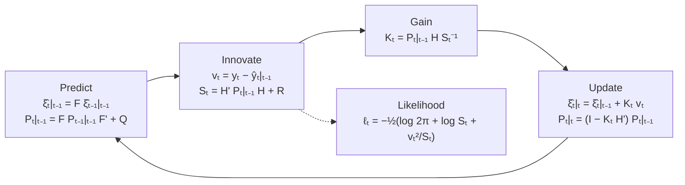

# The Kalman Filter and State-Space Models

> [!abstract] Where this sits in the course
> [[05 - ACF, PACF and the Box-Jenkins Methodology]] ended with "estimate by MLE" and left the mechanics unexplained. **This chapter is that mechanism.** The Kalman filter is what computes the likelihood of an ARMA model, and it is also the general framework that [[07 - SARIMA and Vector Autoregression|SARIMA/VAR]], [[08 - VECM and Cointegration|VECM]] and structural models all live inside. It is the most reusable single idea in the subject.

---

## 📘 Main Knowledge

### 1. Why the Kalman filter

Four distinct jobs, one algorithm:

1. **Estimate latent (unobserved) states** from noisy or partial observations. The "true" inflation trend, the output gap, a satellite's position — none is directly measurable, all are inferable.
2. **Compute optimal one-step-ahead forecasts** in linear-Gaussian models.
3. **Compute the log-likelihood** for MLE — of ARMA, SARIMAX, or linearised DSGE models. *This is why it appears in a time-series course.*
4. **Handle missing data and multivariate systems** naturally, without special-casing.

**Core workflow: Prediction → Update → Likelihood.**

> [!note] One sentence version
> You have a model of how a hidden state evolves, and noisy measurements of it. The filter alternates between *predicting forward using the model* and *correcting using the data*, weighting the two by their relative uncertainty. Everything else is bookkeeping.

---

### 2. State-space representation

Any linear dynamic system can be written as two equations.

#### State (transition) equation

$$
\xi_{t+1} = F\,\xi_t + v_{t+1}
$$

- $\xi_t$ — the **state vector**, possibly unobserved
- $F$ — the **state transition matrix**, describing how the state evolves
- $v_{t+1}$ — the **state disturbance** (process noise)

#### Observation (measurement) equation

$$
y_t = A'x_t + H'\xi_t + w_t
$$

- $y_t$ — the **observed** $n\times1$ vector
- $x_t$ — a $k\times1$ vector of **exogenous or predetermined** variables
- $w_t$ — the **measurement error**

**Dimensions (Hamilton's convention):**

$$
F\in\mathbb{R}^{r\times r},
\qquad
A'\in\mathbb{R}^{n\times k},
\qquad
H'\in\mathbb{R}^{n\times r}
$$
$$
\xi_t\in\mathbb{R}^{r\times1},
\qquad
y_t\in\mathbb{R}^{n\times1},
\qquad
x_t\in\mathbb{R}^{k\times1}
$$

**The goal:** use $\{y_1,\ldots,y_t\}$ to infer $\xi_t$ and to form predictions of $y_{t+h}$.

> [!important] The two equations answer two different questions
> - The **state equation** says how the world evolves — the dynamics, the physics, the economics.
> - The **observation equation** says how the world is *seen* — what we can measure, and how noisily.
>
> Separating them is the whole conceptual contribution. Once separated, the same algorithm handles an AR(3), a seasonal model, a multivariate VAR, and a spacecraft, because all differ only in what you put in $F$, $H'$, $Q$ and $R$.

#### Maintained assumptions

**White-noise covariances:**

$$
\mathbb{E}(v_tv_\tau') = \begin{cases}Q, & t=\tau\\ 0, & t\neq\tau\end{cases}
\qquad\qquad
\mathbb{E}(w_tw_\tau') = \begin{cases}R, & t=\tau\\ 0, & t\neq\tau\end{cases}
$$

with $Q\in\mathbb{R}^{r\times r}$ and $R\in\mathbb{R}^{n\times n}$ covariance matrices.

**No cross-correlation:**

$$
\mathbb{E}(v_tw_\tau') = 0 \qquad\text{for all } t,\tau
$$

State shocks are uncorrelated with measurement errors at all leads and lags. This is what makes the two information sources genuinely independent, and hence optimally combinable.

**$x_t$ predetermined:** it provides no information about future $\xi$ shocks or measurement errors beyond what past $y$'s already contain.

**Implication.** Iterating the state equation, $\xi_t$ is a linear function of the initial state and all past shocks:

$$
\xi_t = v_t + Fv_{t-1} + F^2v_{t-2} + \cdots + F^{t-2}v_2 + F^{t-1}\xi_1
$$

This is exactly the structure the filter exploits: **predict $\xi_t$ from the transition, then update using the new observation $y_t$.**

---

### 3. Putting ARMA models into state-space form

#### 3.1 AR($p$)

$$
y_{t+1}-\mu = \sum_{i=1}^p\phi_i(y_{t+1-i}-\mu)+\varepsilon_{t+1},
\qquad \varepsilon_t\sim WN(0,\sigma^2)
$$

**Stack the lags** into the state vector ($r = p$):

$$
\xi_t = \begin{bmatrix} y_t-\mu \\ y_{t-1}-\mu \\ \vdots \\ y_{t-p+1}-\mu\end{bmatrix}
$$

**State equation** $\xi_{t+1} = F\xi_t+v_{t+1}$ with the **companion matrix**

$$
F = \begin{bmatrix}
\phi_1 & \phi_2 & \cdots & \phi_{p-1} & \phi_p\\
1 & 0 & \cdots & 0 & 0\\
0 & 1 & \cdots & 0 & 0\\
\vdots & \vdots & \ddots & \vdots & \vdots\\
0 & 0 & \cdots & 1 & 0
\end{bmatrix},
\qquad
v_{t+1} = \begin{bmatrix}\varepsilon_{t+1}\\0\\\vdots\\0\end{bmatrix}
$$

The top row carries the AR coefficients; the subdiagonal ones shift each lag down one position.

**Observation equation** — only the first component of the state is $y_t-\mu$:

$$
y_t = \mu + [\,1\;\;0\;\;\cdots\;\;0\,]\,\xi_t
$$

so $H' = [1\;0\;\cdots\;0]$, and there is **no measurement error** ($R=0$) — an AR is observed exactly.

**Process-noise covariance** — only the first state component receives the shock:

$$
Q = \mathrm{Var}(v_{t+1}) = \begin{bmatrix}
\sigma^2 & 0 & \cdots & 0\\
0 & 0 & \cdots & 0\\
\vdots & \vdots & \ddots & \vdots\\
0 & 0 & \cdots & 0
\end{bmatrix}
$$

**Takeaway: an AR($p$) is a first-order Markov system in $p$ dimensions**, hence fully handled by the Kalman machinery. This is the *same* companion matrix from [[03 - Stationarity and Difference Equations]] and [[04 - AR, MA and ARMA Processes]] — a genuinely recurring object, appearing there as the source of impulse responses and forecast weights, and here as the transition matrix of a filter.

#### 3.2 MA(1) — Representation A

$$
y_t = \mu + \varepsilon_t + \theta\varepsilon_{t-1}
$$

Here the **shocks themselves are the hidden state** ($r=2$):

$$
\xi_t = \begin{bmatrix}\varepsilon_t\\\varepsilon_{t-1}\end{bmatrix}
$$

**State equation** — a pure shift register:

$$
\begin{bmatrix}\varepsilon_t\\\varepsilon_{t-1}\end{bmatrix}
= \underbrace{\begin{bmatrix}0&0\\1&0\end{bmatrix}}_{F}
\begin{bmatrix}\varepsilon_{t-1}\\\varepsilon_{t-2}\end{bmatrix}
+ \underbrace{\begin{bmatrix}\varepsilon_t\\0\end{bmatrix}}_{v_t}
$$

**Observation equation:**

$$
y_t = \mu + \underbrace{[\,1\;\;\theta\,]}_{H'}\begin{bmatrix}\varepsilon_t\\\varepsilon_{t-1}\end{bmatrix},
\qquad
w_t = 0 \;\;(R = 0)
$$

$$
Q = \mathrm{Var}(v_t) = \begin{bmatrix}\sigma^2&0\\0&0\end{bmatrix}
$$

> [!important] This is the conceptual heart of the chapter
> For an MA model, **the unobserved shocks $\varepsilon_t$ are the latent state**. This finally answers the question left hanging in [[05 - ACF, PACF and the Box-Jenkins Methodology]]: how do you estimate a model whose regressors you cannot observe? You treat them as a hidden state and let the filter infer them. The ad-hoc recursion $\hat\varepsilon_t = (Y_t-\mu)-\theta\hat\varepsilon_{t-1}$ from [[04 - AR, MA and ARMA Processes]] is the Kalman update in disguise — with a *fixed* gain instead of an optimal one.

#### 3.3 MA(1) — Representation B, and non-uniqueness

**There are many valid state-space representations of the same process.** An alternative state:

$$
\tilde\xi_t = \begin{bmatrix}\varepsilon_t+\theta\varepsilon_{t-1}\\ \theta\varepsilon_t\end{bmatrix}
$$

— a linear transformation of the previous one. Then

$$
\begin{bmatrix}\varepsilon_{t+1}+\theta\varepsilon_t\\ \theta\varepsilon_{t+1}\end{bmatrix}
= \underbrace{\begin{bmatrix}0&1\\0&0\end{bmatrix}}_{\tilde F}
\begin{bmatrix}\varepsilon_t+\theta\varepsilon_{t-1}\\ \theta\varepsilon_t\end{bmatrix}
+ \underbrace{\begin{bmatrix}\varepsilon_{t+1}\\ \theta\varepsilon_{t+1}\end{bmatrix}}_{\tilde v_{t+1}}
\tag{13.1.19}
$$

$$
y_t = \mu + [\,1\;\;0\,]\,\tilde\xi_t
\tag{13.1.20}
$$

Here the observation is simply the first state component plus $\mu$.

> [!important] Both representations describe the **same** MA(1)
> They therefore yield **identical forecasts and identical likelihood values**. Choose whichever is computationally convenient. This non-uniqueness matters practically: the state vector is not itself identified, only the observable implications are. Never interpret a filtered state as economically meaningful unless the representation was chosen to make it so.
>
> Note also that in Representation B the process noise $\tilde v_{t+1} = [\varepsilon_{t+1},\;\theta\varepsilon_{t+1}]'$ is **perfectly correlated across components** — $\tilde Q$ is singular. Singular $Q$ is normal and causes no trouble for the filter.

---

### 4. The Kalman filter recursions

Notation: $\hat\xi_{t|s}$ is the estimate of $\xi_t$ using information through time $s$, and $P_{t|s}$ is the covariance matrix of that estimate's error. $t|t-1$ is a **prior** (before seeing $y_t$); $t|t$ is a **posterior**.

#### Step 1 — Prediction (prior)

$$
\boxed{\;\hat\xi_{t|t-1} = F\hat\xi_{t-1|t-1}\;}
\qquad\qquad
\boxed{\;P_{t|t-1} = FP_{t-1|t-1}F' + Q\;}
$$

Push the state estimate through the dynamics, and push its uncertainty through too. The covariance formula says: **yesterday's uncertainty is propagated by $F$ (hence $FPF'$), and fresh process noise $Q$ is added.** Prediction always *increases* uncertainty.

#### Step 2 — Innovation

$$
\hat y_{t|t-1} = A'x_t + H'\hat\xi_{t|t-1}
\qquad\Longrightarrow\qquad
\boxed{\;v_t = y_t - \hat y_{t|t-1}\;}
$$

$$
\boxed{\;S_t = \mathrm{Var}(v_t) = H'P_{t|t-1}H + R\;}
$$

$v_t$ is the **one-step-ahead forecast error** — the genuinely new information in $y_t$ — and $S_t$ measures how uncertain the prediction of $y_t$ was. Note $S_t$ has two sources: uncertainty about the *state* ($H'P_{t|t-1}H$) plus *measurement* noise ($R$).

#### Step 3 — Update (posterior)

$$
\boxed{\;K_t = P_{t|t-1}H\,S_t^{-1}\;}
$$
$$
\boxed{\;\hat\xi_{t|t} = \hat\xi_{t|t-1} + K_tv_t\;}
\qquad\qquad
\boxed{\;P_{t|t} = (I-K_tH')P_{t|t-1}\;}
$$

**The new estimate is the old estimate plus the gain times the surprise.**

#### Where the gain comes from

$K_t$ is not an arbitrary choice — it is the solution to

$$
K_t = \arg\min_K \;\mathbb{E}\big[(\xi_t-\hat\xi_{t|t})(\xi_t-\hat\xi_{t|t})'\big]
$$

It **minimises the posterior mean squared error**, making $P_{t|t}$ as small as possible. This is why the filter is *optimal* among linear estimators (and, under Gaussian noise, among all estimators).

> [!important] Reading the Kalman gain — the intuition to keep
> $$K_t = \underbrace{P_{t|t-1}H}_{\text{how much the state is in doubt}} \;\underbrace{S_t^{-1}}_{\text{how noisy the measurement is}}$$
> - **Large state uncertainty $P$ → large $K$ → trust the data.** The model doesn't know much; let the observation dominate.
> - **Large measurement noise $R$ (hence large $S_t$) → small $K$ → trust the model.** The observation is unreliable; stick with the prediction.
>
> The filter is a **precision-weighted average** of model and data. Every period it re-weighs the two according to their current relative reliability. This is Bayesian updating for the linear-Gaussian case, made recursive — the prior $N(\hat\xi_{t|t-1},P_{t|t-1})$ meets the likelihood from $y_t$ and produces the posterior $N(\hat\xi_{t|t},P_{t|t})$. Compare [[Mathematical Statistics/contents/05 - Point Estimation|estimation under squared-error loss]].

Note also that $P_{t|t} = (I-K_tH')P_{t|t-1}$ always **shrinks** uncertainty: observing data can never make you less certain.

#### Step 4 — Forecasting one step ahead

Having updated at $t$ and obtained $\hat\xi_{t|t},P_{t|t}$, use the state equation $\xi_{t+1}=F\xi_t+v_{t+1}$:

$$
\hat\xi_{t+1|t} = F\hat\xi_{t|t},
\qquad
P_{t+1|t} = FP_{t|t}F'+Q
$$

Carry today's posterior uncertainty through the dynamics, then add fresh process noise. Then from the observation equation:

$$
\hat y_{t+1|t} = A'x_{t+1}+H'\hat\xi_{t+1|t},
\qquad
v_{t+1} = y_{t+1}-\hat y_{t+1|t},
\qquad
S_{t+1} = H'P_{t+1|t}H + R
$$

$S_{t+1}$ is the **MSE of predicting $y_{t+1}$ using information through $t$** — the quantity you use for forecast intervals.

**The cycle, repeated every period:**



> [!tip] Missing data is free
> If $y_t$ is missing, there is no innovation to compute: simply **skip the update step** and set $\hat\xi_{t|t}=\hat\xi_{t|t-1}$, $P_{t|t}=P_{t|t-1}$. Uncertainty grows (nothing corrected it) and the filter carries on. No interpolation, no special-casing, no dropped observations. This is one of the filter's most useful practical properties, and it is why state-space methods dominate whenever data are irregular — contrast the missing-data machinery of [[Data Preparation and Visualization/contents/06 - Data Cleaning|data cleaning]].

---

### 5. Worked example — the Kalman filter for an MA(1)

#### 5.1 Setup and the meaning of $p_t$ and $S_t$

$$
y_t = \mu+\varepsilon_t+\theta\varepsilon_{t-1},
\qquad
\xi_t = \begin{bmatrix}\varepsilon_t\\\varepsilon_{t-1}\end{bmatrix},
\qquad
F = \begin{bmatrix}0&0\\1&0\end{bmatrix},
\qquad
H' = [1\;\;\theta],
\qquad
Q = \begin{bmatrix}\sigma^2&0\\0&0\end{bmatrix},
\quad R=0
$$

The prediction covariance takes the form

$$
P_{t|t-1} = \begin{bmatrix}\sigma^2 & 0\\ 0 & p_t\end{bmatrix},
\qquad
p_t = \mathbb{E}\big[(\varepsilon_{t-1}-\hat\varepsilon_{t-1|t-1})^2\big]
$$

Reading the two diagonal entries:

- $\sigma^2$ — uncertainty about the **new** shock $\varepsilon_t$. We know nothing about it yet, so it is the full innovation variance. (The $(1,1)$ entry comes entirely from $Q$, since $F$'s first row is zero.)
- $p_t$ — **remaining** uncertainty about the *old* shock $\varepsilon_{t-1}$, after having observed $y_{t-1}$. This is strictly less than $\sigma^2$: seeing $y_{t-1}$ told us something about $\varepsilon_{t-1}$.

**Innovation variance:**

$$
S_t = H'P_{t|t-1}H + R = [1\;\;\theta]\begin{bmatrix}\sigma^2&0\\0&p_t\end{bmatrix}\begin{bmatrix}1\\\theta\end{bmatrix}
= \boxed{\;\sigma^2+\theta^2p_t\;}
$$

**Total forecast uncertainty = new shock variance + propagated old uncertainty.** If we knew $\varepsilon_{t-1}$ exactly ($p_t=0$), then $S_t = \sigma^2$ — the theoretical minimum, matching the one-step MSE of an MA(1) from [[04 - AR, MA and ARMA Processes]].

#### 5.2 Deriving the gain

$$
H = \begin{bmatrix}1\\\theta\end{bmatrix}
\qquad\Longrightarrow\qquad
P_{t|t-1}H = \begin{bmatrix}\sigma^2\\ \theta p_t\end{bmatrix},
\qquad
S_t = \sigma^2+\theta^2p_t
$$

$$
\boxed{\;K_t = \frac{1}{\sigma^2+\theta^2p_t}\begin{bmatrix}\sigma^2\\ \theta p_t\end{bmatrix}\;}
$$

The innovation, written out, is

$$
v_t = y_t-\mu-\hat\varepsilon_{t|t-1}-\theta\hat\varepsilon_{t-1|t-1}
$$

and the updates become

$$
\hat\varepsilon_{t|t} = \hat\varepsilon_{t|t-1} + \frac{\sigma^2}{\sigma^2+\theta^2p_t}\,v_t,
\qquad
\hat\varepsilon_{t-1|t} = \hat\varepsilon_{t-1|t-1} + \frac{\theta p_t}{\sigma^2+\theta^2p_t}\,v_t
$$

**Interpretation.** The surprise $v_t$ is split between the two shocks in proportion to how much each contributes to the forecast variance. The factor $\frac{\sigma^2}{\sigma^2+\theta^2p_t} < 1$ **shrinks** the raw residual toward zero — the filter never attributes the whole surprise to the new shock, because some of it might be leftover error in the old one. Large $S_t$ → small gain → trust the model; small $S_t$ → large gain → trust the data.

Note the second update: **the filter revises its estimate of a *past* shock in light of new data.** That backward-looking revision is precisely what a fixed-gain recursion cannot do, and it is what makes the Kalman filter optimal.

#### 5.3 A fully numerical first step

$$
\mu = 2, \qquad \theta = 0.5, \qquad \sigma^2 = 1, \qquad \varepsilon_t\sim N(0,1)
$$

**Initialisation:**

$$
\hat\xi_{1|0} = \begin{bmatrix}0\\0\end{bmatrix},
\qquad
P_{1|0} = \begin{bmatrix}1&0\\0&1\end{bmatrix}
$$

(Simple initialisation for illustration: we start knowing nothing, with each shock at its unconditional variance.) **Observe $y_1 = 3$.**

**Innovation:**

$$
\hat y_{1|0} = \mu + H'\hat\xi_{1|0} = 2 + 0 = 2
\qquad\Longrightarrow\qquad
v_1 = 3-2 = 1
$$

**Innovation variance:**

$$
S_1 = \sigma^2 + \theta^2p_1 = 1^2 + 0.5^2(1) = 1.25
$$

**Kalman gain:**

$$
K_1 = \frac{1}{1.25}\begin{bmatrix}1\\0.5\end{bmatrix} = \begin{bmatrix}0.8\\0.4\end{bmatrix}
$$

**Update:**

$$
\hat\xi_{1|1} = \begin{bmatrix}0\\0\end{bmatrix}+\begin{bmatrix}0.8\\0.4\end{bmatrix}(1) = \begin{bmatrix}0.8\\0.4\end{bmatrix}
\qquad\Longrightarrow\qquad
\hat\varepsilon_1 \approx 0.8
$$

**Forecast the next state:**

$$
\hat\xi_{2|1} = F\hat\xi_{1|1} = \begin{bmatrix}0&0\\1&0\end{bmatrix}\begin{bmatrix}0.8\\0.4\end{bmatrix} = \begin{bmatrix}0\\0.8\end{bmatrix}
$$

(The new shock $\varepsilon_2$ is unpredictable, so its forecast is 0; $\varepsilon_1$ shifts down into the second slot.)

**Forecast $y_2$:**

$$
\hat y_{2|1} = \mu + [1\;\;0.5]\begin{bmatrix}0\\0.8\end{bmatrix} = 2 + 0.5(0.8) = \mathbf{2.4}
$$

> [!important] **Key insight: the Kalman filter is estimating the hidden shock $\varepsilon_t$.**
> The surprise was $v_1 = 1$, but the filter attributes only $0.8$ of it to $\varepsilon_1$ — because part of the surprise could equally have come from the (also unknown) $\varepsilon_0$ sitting in the second state slot. That splitting is the optimal-inference content of the algorithm. A naive recursion would have set $\hat\varepsilon_1 = 1$ and been wrong.
>
> Notice too that $\hat\varepsilon_{0|1} = 0.4 \neq 0$: the filter has *retrospectively* revised its estimate of the pre-sample shock.

---

### 6. Maximum likelihood via the Kalman filter

#### 6.1 The likelihood of a dependent sample

For i.i.d. data the likelihood is a simple product. **Time-series observations are dependent**, so use the chain rule:

$$
f(y_1,\ldots,y_T) = f(y_1)\prod_{t=2}^{T}f(y_t\mid y_{t-1},\ldots,y_1)
\qquad\Longrightarrow\qquad
\ell = \sum_{t=1}^T \log f(y_t\mid y_{t-1},\ldots,y_1)
$$

This is the **prediction-error decomposition**, and it is the reason the filter is the right tool: the filter's whole job is to produce one-step-ahead conditional distributions.

If the conditional distribution is normal — which it is, in a linear-Gaussian state-space model:

$$
y_t\mid Y_{t-1} \sim N\big(\hat y_{t|t-1},\;S_t\big)
$$

then

$$
\boxed{\;\ell = -\frac12\sum_{t=1}^T\left(\log(2\pi) + \log S_t + \frac{v_t^2}{S_t}\right)\;}
$$

with $v_t = y_t-\hat y_{t|t-1}$ the **prediction error**. (For multivariate $y_t$, $\log S_t \to \log|S_t|$ and $v_t^2/S_t \to v_t'S_t^{-1}v_t$.)

#### 6.2 How the pieces fit together

For a given parameter vector $\theta$ (containing $\phi$'s, $\theta$'s, $\sigma^2$, …), the Kalman filter computes $v_t(\theta)$ and $S_t(\theta)$ for every $t$. Those two sequences are **exactly and only** what the log-likelihood needs:

$$
\ell(\theta) = \sum_{t=1}^T\left[-\tfrac12\log(2\pi) - \tfrac12\log S_t(\theta) - \tfrac12\frac{v_t(\theta)^2}{S_t(\theta)}\right]
$$

> [!warning] The Kalman filter does **not** optimise parameters
> It only **evaluates** the likelihood at a given $\theta$. Optimisation is a separate outer loop. Confusing the two is the most common misunderstanding of the method.

#### 6.3 The optimisation loop

1. Choose initial parameters $\theta^{(0)}$.
2. Run the Kalman filter at $\theta^{(k)}$ to get $v_t(\theta^{(k)})$, $S_t(\theta^{(k)})$.
3. Evaluate $\ell(\theta^{(k)})$.
4. The optimiser proposes $\theta^{(k+1)}$.

$$
\theta \;\longrightarrow\; \text{Kalman filter} \;\longrightarrow\; (v_t,S_t) \;\longrightarrow\; \ell(\theta) \;\longrightarrow\; \text{optimiser} \;\longrightarrow\; \theta_{\text{new}}
$$

Repeat until convergence.

**Optimisation algorithms:**

| Algorithm | Character |
|---|---|
| **BFGS** (Broyden–Fletcher–Goldfarb–Shanno) | Gradient-based; approximates the Hessian; very efficient for likelihood maximisation |
| **L-BFGS** (limited-memory BFGS) | Memory-efficient variant; handles large models; **the default in most time-series packages** |
| **Nelder–Mead** | Derivative-free simplex; useful when the likelihood surface is irregular |

The optimiser repeatedly calls the filter until convergence. A model with a few hundred observations and four parameters may involve **hundreds of complete filter passes** — which is why the $O(T)$ cost of the recursion matters.

#### 6.4 In practice

```python
import numpy as np
from statsmodels.tsa.statespace.sarimax import SARIMAX

y = np.array([1.0, 0.2, -0.1, 0.6, 0.3, -0.2, 0.4, 0.1])

# MA(1): order = (0, 0, 1)
model = SARIMAX(
    y,
    order=(0, 0, 1),
    trend="c",                    # include the constant mu
    enforce_invertibility=True,
    enforce_stationarity=True,
)
res = model.fit(disp=False)       # MLE — the Kalman filter runs inside

print(res.summary())
print("params =", res.params)
print("loglik =", res.llf)
```

The filter's internals are exposed directly:

```python
res.filter_results.filtered_state        # ξ̂_{t|t}
res.filter_results.predicted_state       # ξ̂_{t|t-1}
res.filter_results.forecasts_error       # v_t
res.filter_results.forecasts_error_cov   # S_t
```

And the likelihood can be reassembled by hand from $v_t$ and $S_t$ alone, confirming the formula:

```python
v = np.array([0.75167167, 0.32750734, -0.12999026, 0.25417907,
              0.25501467, -0.23581644, -0.05045634, -0.19247754])
S = np.array([0.13884220, 0.10413168, 0.09256152, 0.08677645,
              0.08330542, 0.08099140, 0.07933853, 0.07809889])

ell_t = -0.5 * (np.log(2*np.pi) + np.log(S) + (v**2)/S)   # per-period
ell_T = np.cumsum(ell_t)                                   # running total
```

> [!note] Watch $S_t$ converge
> In the printed output above, $S_t$ falls from $0.1388$ to $0.0781$ and is still declining. That is the filter **learning**: early on it knows nothing about the pre-sample shocks, so forecasts are uncertain; as data accumulate the uncertainty about the state shrinks toward its steady state. For a time-invariant model, $P_{t|t-1}$ converges to the solution of a **discrete algebraic Riccati equation** and the gain becomes constant — at which point the Kalman filter degenerates into exactly the fixed-gain recursion $\hat\varepsilon_t = (y_t-\mu)-\theta\hat\varepsilon_{t-1}$ used in [[04 - AR, MA and ARMA Processes]]. **The difference between them is entirely a start-up effect** — which is precisely the difference between exact MLE and conditional (CSS) estimation.

---

## ✏️ Exercises

### Exercise 1 — Build a state-space representation

Write $y_t = 0.6y_{t-1} - 0.2y_{t-2} + \varepsilon_t + 0.4\varepsilon_{t-1}$ (an ARMA(2,1) with $\mu=0$, $\sigma^2=1$) in state-space form. Give $F$, $H'$, $Q$, $R$ and state the dimension $r$.

> [!example]- Solution
> An ARMA($p,q$) needs a state of dimension $r = \max(p,\,q+1) = \max(2,2) = \mathbf{2}$. The standard **Harvey form** puts the AR coefficients in the first column of $F$ and the MA coefficients in the state noise loading:
> $$\xi_t = \begin{bmatrix}\xi_{1t}\\\xi_{2t}\end{bmatrix},
> \qquad
> F = \begin{bmatrix}\phi_1 & 1\\ \phi_2 & 0\end{bmatrix} = \begin{bmatrix}0.6 & 1\\ -0.2 & 0\end{bmatrix}$$
> $$v_t = \begin{bmatrix}1\\ \theta_1\end{bmatrix}\varepsilon_t = \begin{bmatrix}1\\ 0.4\end{bmatrix}\varepsilon_t
> \qquad\Longrightarrow\qquad
> Q = \sigma^2\begin{bmatrix}1\\0.4\end{bmatrix}[1\;\;0.4] = \begin{bmatrix}1 & 0.4\\ 0.4 & 0.16\end{bmatrix}$$
> $$H' = [\,1\;\;0\,], \qquad R = 0$$
>
> **Verify** by expanding. The state equations are
> $$\xi_{1t} = 0.6\,\xi_{1,t-1} + \xi_{2,t-1} + \varepsilon_t, \qquad \xi_{2t} = -0.2\,\xi_{1,t-1} + 0.4\varepsilon_t$$
> and $y_t = \xi_{1t}$. Substituting the second into the first, one period lagged:
> $$y_t = 0.6y_{t-1} + \big(-0.2y_{t-2}+0.4\varepsilon_{t-1}\big) + \varepsilon_t = 0.6y_{t-1}-0.2y_{t-2}+\varepsilon_t+0.4\varepsilon_{t-1}\;✓$$
>
> **Note two things.** First, $Q$ is **singular** (rank 1) — a single scalar shock drives a 2-dimensional state. This is completely standard and causes the filter no difficulty. Second, this is *not* the only valid representation; the lecture's MA(1) Representations A and B make the same point. The alternative "stack the lags and shocks separately" form would use $r = p+q = 3$ and work equally well, just less efficiently.

---

### Exercise 2 — Run the filter by hand, two periods

Continue the lecture's MA(1) example ($\mu=2$, $\theta=0.5$, $\sigma^2=1$), which reached $\hat\xi_{1|1} = [0.8,\;0.4]'$ and $\hat y_{2|1} = 2.4$. Now observe $y_2 = 1.5$. Compute $P_{1|1}$, $P_{2|1}$, $S_2$, $K_2$, $\hat\xi_{2|2}$ and $\hat y_{3|2}$.

> [!example]- Solution
> **Step 1 — finish period 1.** $K_1 = [0.8,\;0.4]'$, $H' = [1\;\;0.5]$, $P_{1|0} = I$:
> $$K_1H' = \begin{bmatrix}0.8\\0.4\end{bmatrix}[1\;\;0.5] = \begin{bmatrix}0.8 & 0.4\\ 0.4 & 0.2\end{bmatrix}
> \qquad
> I - K_1H' = \begin{bmatrix}0.2 & -0.4\\ -0.4 & 0.8\end{bmatrix}$$
> $$P_{1|1} = (I-K_1H')P_{1|0} = \begin{bmatrix}0.2 & -0.4\\ -0.4 & 0.8\end{bmatrix}$$
> The variance of $\hat\varepsilon_1$ has fallen from $1$ to $\mathbf{0.2}$ — observing $y_1$ was highly informative about $\varepsilon_1$. The off-diagonal $-0.4$ says the two shock estimates are now negatively correlated: if $\varepsilon_1$ was actually larger than estimated, $\varepsilon_0$ must have been smaller, since together they produced the observed $y_1$.
>
> **Step 2 — predict to period 2.** With $F = \begin{bmatrix}0&0\\1&0\end{bmatrix}$, $FP_{1|1}F'$ picks out the $(1,1)$ entry of $P_{1|1}$ and places it at position $(2,2)$:
> $$FP_{1|1}F' = \begin{bmatrix}0 & 0\\ 0 & 0.2\end{bmatrix}
> \qquad\Longrightarrow\qquad
> P_{2|1} = FP_{1|1}F' + Q = \begin{bmatrix}1 & 0\\ 0 & 0.2\end{bmatrix}$$
> So $p_2 = 0.2$ — exactly the residual uncertainty about $\varepsilon_1$ carried forward, now sitting in the "old shock" slot. The new shock $\varepsilon_2$ is back at full variance $1$.
>
> **Step 3 — innovation.**
> $$\hat y_{2|1} = 2.4 \;(\text{computed previously}), \qquad v_2 = 1.5 - 2.4 = \mathbf{-0.9}$$
> $$S_2 = \sigma^2 + \theta^2p_2 = 1 + 0.25(0.2) = \mathbf{1.05}$$
> Compare $S_1 = 1.25$: the filter is now **more confident**, because it has learned about $\varepsilon_1$. $S_t$ is converging toward its steady state.
>
> **Step 4 — gain and update.**
> $$K_2 = \frac{1}{1.05}\begin{bmatrix}\sigma^2\\ \theta p_2\end{bmatrix} = \frac{1}{1.05}\begin{bmatrix}1\\ 0.1\end{bmatrix} = \begin{bmatrix}0.9524\\ 0.0952\end{bmatrix}$$
> $$\hat\xi_{2|2} = \begin{bmatrix}0\\0.8\end{bmatrix} + \begin{bmatrix}0.9524\\0.0952\end{bmatrix}(-0.9) = \begin{bmatrix}-0.8571\\ 0.7143\end{bmatrix}$$
> So $\hat\varepsilon_2 \approx -0.857$, and $\hat\varepsilon_1$ has been **revised down** from $0.8$ to $0.714$ in light of $y_2$.
>
> **Step 5 — forecast period 3.**
> $$\hat\xi_{3|2} = F\hat\xi_{2|2} = \begin{bmatrix}0\\ -0.8571\end{bmatrix}
> \qquad\Longrightarrow\qquad
> \hat y_{3|2} = 2 + 0.5(-0.8571) = \mathbf{1.571}$$
>
> **What to take from this.** The gain on the new shock rose from $0.80$ to $0.95$ while the gain on the old shock fell from $0.40$ to $0.095$. As the filter becomes confident about the past, it attributes almost all of each new surprise to the new shock — converging on the fixed-gain recursion $\hat\varepsilon_t = (y_t-\mu)-\theta\hat\varepsilon_{t-1}$, which would give $\hat\varepsilon_2 = -0.9 - 0.5(0.8)\cdot 0 = \ldots$ well, exactly $v_2$ scaled by 1. The Kalman filter's advantage is confined to the start-up period.

---

### Exercise 3 — The local level model

The **local level** (random walk plus noise) model is the simplest non-trivial state-space model:
$$\mu_{t+1} = \mu_t + \eta_t, \quad \eta_t\sim N(0,\sigma_\eta^2)
\qquad\qquad
y_t = \mu_t + \varepsilon_t, \quad \varepsilon_t\sim N(0,\sigma_\varepsilon^2)$$
(a) Identify $F,H',Q,R$. (b) Show the steady-state gain depends only on the ratio $q = \sigma_\eta^2/\sigma_\varepsilon^2$. (c) What does the filter reduce to when $q\to0$ and $q\to\infty$?

> [!example]- Solution
> **(a)** Scalars throughout ($r=n=1$):
> $$F = 1, \qquad H' = 1, \qquad Q = \sigma_\eta^2, \qquad R = \sigma_\varepsilon^2$$
> A local *level* — the true level wanders like a random walk, and we see it through measurement noise.
>
> **(b)** Write $P_t \equiv P_{t|t-1}$. The recursions collapse to
> $$S_t = P_t + \sigma_\varepsilon^2, \qquad K_t = \frac{P_t}{P_t+\sigma_\varepsilon^2}, \qquad P_{t|t} = (1-K_t)P_t = \frac{P_t\sigma_\varepsilon^2}{P_t+\sigma_\varepsilon^2}$$
> $$P_{t+1} = P_{t|t} + \sigma_\eta^2 = \frac{P_t\sigma_\varepsilon^2}{P_t+\sigma_\varepsilon^2}+\sigma_\eta^2$$
> At the steady state $P_{t+1}=P_t = \bar P$ (this is the **Riccati equation**):
> $$\bar P(\bar P+\sigma_\varepsilon^2) = \bar P\sigma_\varepsilon^2 + \sigma_\eta^2(\bar P+\sigma_\varepsilon^2)
> \;\Longrightarrow\;
> \bar P^2 - \sigma_\eta^2\bar P - \sigma_\eta^2\sigma_\varepsilon^2 = 0$$
> $$\bar P = \frac{\sigma_\eta^2+\sqrt{\sigma_\eta^4+4\sigma_\eta^2\sigma_\varepsilon^2}}{2}$$
> (taking the positive root, since a variance must be positive). Dividing through by $\sigma_\varepsilon^2$ and writing $q = \sigma_\eta^2/\sigma_\varepsilon^2$, $\bar p = \bar P/\sigma_\varepsilon^2$:
> $$\bar p = \frac{q+\sqrt{q^2+4q}}{2}
> \qquad\Longrightarrow\qquad
> \boxed{\;\bar K = \frac{\bar p}{\bar p+1} = \frac{q+\sqrt{q^2+4q}}{2+q+\sqrt{q^2+4q}}\;}$$
> **The gain depends only on $q$**, the **signal-to-noise ratio** — not on the individual variances. That is the whole content of the model: what matters is how fast the level moves *relative to* how noisily it is measured.
>
> **(c)**
> - **$q\to0$** (level essentially constant, or measurement very noisy): $\bar K\to0$. The filter ignores new data entirely and $\hat\mu_{t|t}\to$ the **sample mean of all history**. Sensible — if the level never moves, average everything.
> - **$q\to\infty$** (level moves wildly, or measurement nearly exact): $\bar K\to1$. Then $\hat\mu_{t|t} = \hat\mu_{t|t-1}+1\cdot(y_t-\hat\mu_{t|t-1}) = y_t$ — trust the latest observation completely and discard history.
>
> **The punchline.** The steady-state local level filter is
> $$\hat\mu_{t|t} = \bar K y_t + (1-\bar K)\hat\mu_{t-1|t-1}$$
> which is **exactly simple exponential smoothing** with $\alpha = \bar K$ — the recursion derived heuristically in [[02 - Trend, Seasonality and Decomposition]]. Exponential smoothing is not a rule of thumb: it is the *optimal* filter for a random walk observed with noise, and the Kalman filter tells you the optimal $\alpha$ from the estimated variances. Extending the state to $[\text{level},\;\text{slope}]'$ recovers Holt's linear trend, and adding seasonal states recovers Holt–Winters. **The entire ETS family is a set of state-space models.**

---

### Exercise 4 — Reconstruct a log-likelihood

Using the $v_t$ and $S_t$ printed in §6.4, compute $\ell$ and verify against `res.llf`. Explain why $S_t$ declines and what it means for the first observation's contribution.

> [!example]- Solution
> $$\ell_t = -\tfrac12\big(\log(2\pi)+\log S_t + v_t^2/S_t\big), \qquad \log(2\pi) = 1.83788$$
>
> | $t$ | $v_t$ | $S_t$ | $\log S_t$ | $v_t^2/S_t$ | $\ell_t$ |
> |---|---|---|---|---|---|
> | 1 | 0.75167 | 0.138842 | $-1.97452$ | 4.0693 | $-1.9663$ |
> | 2 | 0.32751 | 0.104132 | $-2.26206$ | 1.0301 | $-0.3030$ |
> | 3 | $-0.12999$ | 0.092562 | $-2.37988$ | 0.1826 | $+0.1797$ |
> | 4 | 0.25418 | 0.086776 | $-2.44441$ | 0.7445 | $-0.0690$ |
> | 5 | 0.25501 | 0.083305 | $-2.48524$ | 0.7807 | $-0.0666$ |
> | 6 | $-0.23582$ | 0.080991 | $-2.51341$ | 0.6866 | $-0.0055$ |
> | 7 | $-0.05046$ | 0.079339 | $-2.53402$ | 0.0321 | $+0.3320$ |
> | 8 | $-0.19248$ | 0.078099 | $-2.54977$ | 0.4744 | $+0.1188$ |
> | | | | | **total $\ell$** | $\approx\mathbf{-1.780}$ |
>
> **Why $S_t$ declines.** $S_t = \sigma^2+\theta^2p_t$, and $p_t$ — the residual uncertainty about the previous shock — shrinks as data accumulate. At $t=1$ the filter knows nothing about $\varepsilon_0$, so $p_1$ is at its unconditional maximum and $S_1$ is largest. Each observation reduces it, converging to the steady-state $\bar S$ from the Riccati equation. Here $S_t$ has fallen 44% over eight periods and is still drifting down.
>
> **Why the first observation contributes most negatively.** $\ell_1 = -1.966$ is by far the worst term, for two compounding reasons: $\log S_1$ is the largest (most uncertainty), *and* $v_1^2/S_1 = 4.07$ is the largest standardised error — with no history, the filter's initial guess was poor. **The likelihood penalises the start-up period heavily.**
>
> This is exactly the difference between **exact** and **conditional** MLE. Conditional (CSS) estimation discards or fixes the first few terms; exact MLE via the Kalman filter includes them properly, using the correct time-varying $S_t$. For $T=8$ that difference is enormous — $\ell_1$ alone is more than the total. For $T=500$ it is negligible. **Use exact MLE on short samples; on long ones it barely matters.**
>
> Note also that several $\ell_t$ are **positive**. That is fine: for continuous data the log-*density* can exceed zero when $S_t<1$, since densities are not probabilities.

---

### Exercise 5 — Why not just use OLS?

For an AR(1) with a constant, OLS and MLE give nearly identical estimates, and the Kalman filter seems like overkill. Give three situations where it is genuinely necessary, and explain what fails without it.

> [!example]- Solution
> **1. Any MA component.** OLS needs observed regressors. For $y_t = \varepsilon_t+\theta\varepsilon_{t-1}$ the regressor $\varepsilon_{t-1}$ is **never observed** — it must be inferred from the data along with $\theta$. Without a filter you must fall back on the fixed-gain recursion $\hat\varepsilon_t = y_t-\mu-\theta\hat\varepsilon_{t-1}$ with an arbitrary $\hat\varepsilon_0=0$, which is conditional (approximate) likelihood and is biased in short samples — see Exercise 4. The filter handles the initialisation exactly.
>
> **2. Genuinely unobserved components.** The output gap, the natural rate of interest, a firm's "true" underlying demand, the trend/cycle split of GDP — these have **no data column at all**. State-space is the only framework that estimates them, because it treats "unobserved" as a modelling primitive rather than a missing-data problem. Nothing OLS-based can even express the question.
>
> **3. Missing, irregular or mixed-frequency data.** OLS silently drops incomplete rows; interpolating first fabricates data and understates uncertainty. The Kalman filter simply **skips the update step** when $y_t$ is absent, propagating uncertainty correctly through the gap. This also solves **mixed-frequency** problems (monthly indicators, quarterly GDP) by treating the quarterly series as monthly-with-two-thirds-missing — the basis of nowcasting.
>
> **Three more worth knowing:**
> - **Time-varying parameters.** Put the regression coefficients *in the state vector* and they can drift: $\beta_{t+1} = \beta_t+\eta_t$, $y_t = x_t'\beta_t+\varepsilon_t$. OLS assumes constant coefficients by construction.
> - **Multivariate systems with common factors.** Dynamic factor models extract a few latent drivers from hundreds of series.
> - **Correct forecast intervals.** $S_t$ is produced automatically and accounts for both parameter-free state uncertainty and measurement noise, without simulation.
>
> **Where OLS is fine:** a pure AR($p$) with complete data and no latent structure. There the state is observed, the "filter" has nothing to infer, and OLS *is* conditional MLE. The lecture's point is that this is the exception, not the rule — and that the general machinery costs little once you have it.

---

## 📝 Summary

- **State-space form** splits a model into a **state equation** $\xi_{t+1} = F\xi_t+v_{t+1}$ (how the world evolves) and an **observation equation** $y_t = A'x_t+H'\xi_t+w_t$ (how it is seen), with $\mathbb{E}(v_tv_t')=Q$, $\mathbb{E}(w_tw_t')=R$ and no cross-correlation.
- **Any ARMA fits.** AR($p$): stack lags, $F$ = companion matrix, $H'=[1\,0\cdots0]$, $R=0$, $Q$ has $\sigma^2$ in position $(1,1)$. MA(1): the **shocks are the state**, $F$ is a shift register, $H'=[1\;\theta]$. Representations are **not unique** — different $(F,H',Q)$ can give identical forecasts and likelihood.
- **The recursion is Predict → Innovate → Gain → Update.**
  $\hat\xi_{t|t-1} = F\hat\xi_{t-1|t-1}$, $P_{t|t-1}=FP_{t-1|t-1}F'+Q$; $v_t = y_t-\hat y_{t|t-1}$, $S_t = H'P_{t|t-1}H+R$; $K_t = P_{t|t-1}HS_t^{-1}$; $\hat\xi_{t|t}=\hat\xi_{t|t-1}+K_tv_t$, $P_{t|t}=(I-K_tH')P_{t|t-1}$.
- **The gain is a precision weight.** $K_t$ minimises posterior MSE. Large state uncertainty → large $K$ → trust the data; large measurement noise → small $K$ → trust the model. Prediction always inflates uncertainty; updating always shrinks it.
- **For an MA(1),** $P_{t|t-1} = \mathrm{diag}(\sigma^2,p_t)$ and $S_t = \sigma^2+\theta^2p_t$ — new-shock variance plus propagated old uncertainty. The gain $\frac{1}{S_t}[\sigma^2,\;\theta p_t]'$ splits each surprise between the current and previous shock, and **revises past shock estimates** as new data arrive.
- **The likelihood comes free.** By the prediction-error decomposition, $\ell = -\tfrac12\sum_t\big(\log2\pi+\log S_t + v_t^2/S_t\big)$ — built entirely from the filter's $v_t$ and $S_t$. **The filter evaluates the likelihood; it does not optimise it.** An outer loop (BFGS, L-BFGS, Nelder–Mead) proposes parameters until convergence.
- **Missing data is handled by skipping the update step** — uncertainty grows, the recursion continues, no interpolation required.
- **The steady state** of the local level model reproduces **simple exponential smoothing** with $\alpha = \bar K$ determined by the signal-to-noise ratio $q = \sigma_\eta^2/\sigma_\varepsilon^2$ — putting the whole ETS family of [[02 - Trend, Seasonality and Decomposition]] on a rigorous footing.

---

## ⚠️ Important Notes

> [!warning] Notation in the slides is inconsistent — read carefully
> Three issues to watch:
> 1. The state disturbance is called **$u_{t+1}$** on the state-space slide, **$v_t$** in the assumptions slide, and **$w_{t+1}$** in the MA(1) transition — while $w_t$ *also* denotes the measurement error, and $v_t$ *also* denotes the innovation $y_t-\hat y_{t|t-1}$. **The same symbol $v_t$ means two different things in this lecture.** Throughout these notes: $v_{t+1}$ = state disturbance in §2–3, $v_t$ = innovation in §4 onward, following the slides' own dominant usage.
> 2. $S_t$ is written both as $H'P_{t|t-1}H+R$ (general slides) and as $HP_{t|t-1}H'$ (MA(1) slides). In Hamilton's convention the observation matrix is $H'$ (an $n\times r$ object), so the first is right; the MA(1) slides are treating $H = [1\;\theta]$ as a row vector. **Whichever convention you adopt, $S_t$ must come out $n\times n$** — use that as your dimension check.
> 3. The slides write $K_t = P_{t|t-1}HS_t^{-1}$ generally but $K_t = P_{t|t-1}H'S_t^{-1}$ in the MA(1) derivation — same transpose ambiguity.

> [!warning] The state vector is not identified
> Representations A and B of the MA(1) give identical observable behaviour. **Never interpret a filtered state economically unless you deliberately chose a representation that makes it interpretable.** In a local level model $\mu_t$ genuinely is "the level"; in a mechanical ARMA state-space form the components mean nothing.

> [!warning] Initialisation matters — and is chosen, not given
> $\hat\xi_{1|0}$ and $P_{1|0}$ are not implied by the model; you must supply them.
> - **Stationary models:** set them to the unconditional mean and variance (solve $P = FPF'+Q$). This is what exact MLE does.
> - **Non-stationary states** (a random-walk level): the unconditional variance doesn't exist. Use a **diffuse prior** — $P_{1|0} = \kappa I$ with $\kappa$ huge — or the exact diffuse initialisation `statsmodels` implements.
> - The lecture's $P_{1|0}=I$ is described as "simple initialization for illustration" and is **not** what a package would use.
>
> On short samples the choice materially changes the likelihood (Exercise 4).

> [!tip] Dimension-checking is the fastest way to catch errors
> $F$ is $r\times r$; $H'$ is $n\times r$; $Q$ is $r\times r$; $R$ is $n\times n$; $K_t$ is $r\times n$; $S_t$ is $n\times n$. If a matrix product doesn't conform, you have a transpose wrong. For univariate $y$ ($n=1$), $S_t$ is a scalar and $S_t^{-1}$ is ordinary division — which is why the MA(1) example looks so simple.

> [!note] $Q$ singular is normal
> In every ARMA representation $Q$ has rank 1 (or lower) — one scalar shock drives an $r$-dimensional state. This is fine. What must **not** be singular is $S_t$, since it gets inverted. $S_t = H'P_{t|t-1}H+R$ is singular only if the state is perfectly known *and* $R=0$ — a degenerate case signalling a misspecified model.

> [!tip] Why the Kalman filter is everywhere outside economics
> Same equations, different $F$ and $H'$: GPS and inertial navigation, spacecraft tracking (its original 1960s use, Apollo), robot SLAM, sensor fusion in self-driving cars, target tracking in radar, battery state-of-charge estimation. The unifying feature is always *a system whose internal state you cannot see directly, observed through noisy sensors*. Non-linear variants (extended and unscented Kalman filters, particle filters) relax the linear-Gaussian assumption — see [[Machine Learning/contents/00-Index|sequential inference]].

> [!note] Filtering, smoothing, prediction — three different questions
> - **Filtering:** $\hat\xi_{t|t}$ — the state now, given data up to now. *(What this chapter covers.)*
> - **Smoothing:** $\hat\xi_{t|T}$ — the state at time $t$ given **all** data, including the future. Requires a backward pass (the Kalman/RTS smoother). Always more accurate than filtering; use it for historical analysis, never for real-time decisions.
> - **Prediction:** $\hat\xi_{t+h|t}$ — the future state.
>
> The lecture covers filtering and one-step prediction only. **Smoothing is not mentioned at all**, though `res.smoothed_state` exposes it and it is what you want whenever you are estimating a historical latent series such as the output gap.

> [!warning] Gaps in the source slides
> - **The Kalman smoother is entirely absent.** Only filtering and one-step-ahead prediction appear. For any retrospective estimate of a latent variable — the usual macroeconomic application — the smoother is the right tool, and a student working only from these slides would not know it exists.
> - **Initialisation is waved through.** $P_{1|0}=I$ is labelled "simple initialization for illustration" with no discussion of stationary vs. diffuse initialisation, despite that choice materially affecting the likelihood on short samples.
> - **The steady state / Riccati equation is never mentioned**, so the beautiful connection to exponential smoothing (Exercise 3) and to conditional-vs-exact MLE is left implicit.
> - **Notation collides**: $v_t$ denotes both the state disturbance and the innovation; the state disturbance is variously $u$, $v$ and $w$; $H$ vs $H'$ is used inconsistently in $S_t$ and $K_t$. Detailed above.
> - **The `pykalman` code cell is truncated in the notebook** (cell s17 cuts off mid-argument at `initial_state_co…`), and `pykalman` is an unmaintained package that does not install cleanly on current Python. Use `statsmodels.tsa.statespace` instead — as the later cells in fact do.
> - **The `SARIMAX` example's output is not saved**, so the parameter estimates and summary table referenced by the $v_t$/$S_t$ arrays in the last cell cannot be checked. The $v_t$ and $S_t$ values themselves are hard-coded in the notebook and I have used them as given.
> - **Two code cells carry Vietnamese comments** (`dữ liệu` — *data*; `ước lượng MLE (Kalman filter chạy bên trong)` — *MLE estimation (Kalman filter runs inside)*; `dự báo 1 bước trước` — *one-step-ahead forecast*).
> - **No exercises are provided in the deck.** All five above are my own construction.

---

**Previous:** [[05 - ACF, PACF and the Box-Jenkins Methodology]] · **Next:** [[07 - SARIMA and Vector Autoregression]] · **Index:** [[00-Index]]

#time-series #kalman-filter #state-space #mle #latent-variables #hamilton
