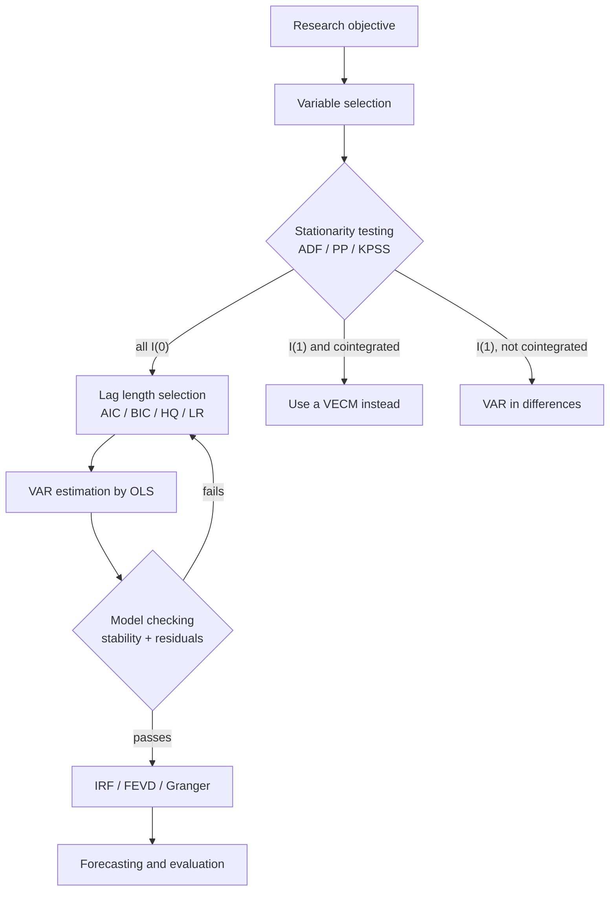

# SARIMA and Vector Autoregression

> [!abstract] Where this sits in the course
> This lecture extends ARIMA in **two orthogonal directions**:
> - **SARIMA** adds a *seasonal* dimension — still one variable, but with dynamics at two frequencies.
> - **VAR** adds a *cross-sectional* dimension — many variables, each depending on the lags of all the others.
>
> VAR is where time-series analysis becomes genuinely *economic*: it introduces impulse responses, Granger causality and variance decomposition, and it raises the identification problem that [[10 - Structural Vector Autoregression]] exists to solve. It also sets up [[08 - VECM and Cointegration]], which handles the case the VAR here explicitly excludes: variables that are individually $I(1)$.

---

# Part I — Seasonal ARIMA

## 📘 Main Knowledge

### 1. The SARIMA model

[[05 - ACF, PACF and the Box-Jenkins Methodology]] kept flagging seasonality as the reason a plain ARIMA failed. SARIMA is the fix: **run the ARIMA machinery twice — once at lag 1, once at lag $s$ — and multiply the two.**

#### General form

$$
\boxed{\;\phi(L)\,\Phi(L^s)\,(1-L)^d\,(1-L^s)^D\,X_t = \theta(L)\,\Theta(L^s)\,\varepsilon_t\;}
$$

with $\varepsilon_t \sim WN(0,\sigma^2)$ and four polynomials:

$$
\begin{aligned}
\phi(L) &= 1-\phi_1L-\cdots-\phi_pL^p && \text{non-seasonal AR} \\
\Phi(L^s) &= 1-\Phi_1L^s-\cdots-\Phi_PL^{Ps} && \text{seasonal AR (SAR)} \\
\theta(L) &= 1+\theta_1L+\cdots+\theta_qL^q && \text{non-seasonal MA} \\
\Theta(L^s) &= 1+\Theta_1L^s+\cdots+\Theta_QL^{Qs} && \text{seasonal MA (SMA)}
\end{aligned}
$$

**Notation:** $(p,d,q)$ are the **non-seasonal** orders; $(P,D,Q)_s$ the **seasonal** orders with period $s$. Lower case = non-seasonal, upper case = seasonal — a convention worth internalising immediately.

Written with each factor labelled:

$$
\underbrace{\phi_p(L)}_{\text{AR}}\;
\underbrace{\Phi_P(L^s)}_{\text{SAR}}\;
\underbrace{(1-L)^d}_{\text{I}}\;
\underbrace{(1-L^s)^D}_{\text{SI}}\; Y_t
=
\underbrace{\theta_q(L)}_{\text{MA}}\;
\underbrace{\Theta_Q(L^s)}_{\text{SMA}}\;\varepsilon_t
$$

Typical values of $s$: **4** (quarterly), **12** (monthly), **7** (daily data with a weekly cycle), **52** (weekly).

#### What each operator does

| Operator | Role |
|---|---|
| $(1-L)^d$ | Removes the **trend** component |
| $(1-L^s)^D$ | Removes the **seasonal** component |
| $(1-L)^d(1-L^s)^D$ | Removes **both simultaneously** |
| $\Phi_P(L^s)$ | Models seasonal *autoregressive* persistence — this January depends on last January |
| $\Theta_Q(L^s)$ | Models and removes remaining **seasonal structure in the noise** $\varepsilon_t$ |

> [!important] Where seasonality lives
> Seasonality can appear in the observed series $Y_t$ **or in the random component $\varepsilon_t$.** If the shocks themselves are seasonal, they are *not white noise* and must be modelled with period $s$ — which is exactly what $\Theta_Q(L^s)$ does. This is why a seasonal *difference* alone often isn't enough: differencing removes a deterministic seasonal pattern, but a stochastic one leaves seasonal structure in the residuals that only an SAR or SMA term can absorb.
>
> **This structure separates non-seasonal from seasonal dynamics in both the deterministic and the random parts** — that separation is the whole design of SARIMA.

#### Seasonal differencing, concretely

$$
(1-L^s)Y_t = Y_t - Y_{t-s}
$$

For monthly data ($s=12$) this is the **year-on-year change** — a genuinely familiar economic quantity. Note that $(1-L^{12})$ is *not* $(1-L)^{12}$; it compares this January to last January, not twelve consecutive months.

---

### 2. Expanding the multiplicative structure

The multiplication is where SARIMA gets its power and its opacity. Two worked expansions.

#### 2.1 SARIMA$(1,1,1)\times(1,1,1)_s$

$$
(1-\phi L)(1-\Phi L^s)(1-L)(1-L^s)X_t = (1+\theta L)(1+\Theta L^s)Z_t
$$

**The differencing part first:**

$$
(1-L)(1-L^s)X_t = X_t - X_{t-1} - X_{t-s} + X_{t-(s+1)}
$$

Four terms from two simple differences — the cross term $X_{t-(s+1)}$ appears because the operators multiply.

**The AR structure**, fully expanded:

$$
\begin{aligned}
X_t = \;& X_{t-1}+X_{t-s}-X_{t-(s+1)} \\
&+ \phi\big(X_{t-2}+X_{t-(s+1)}-X_{t-(s+2)}\big) \\
&+ \Phi\big(X_{t-(s+1)}+X_{t-2s}-X_{t-(2s+1)}\big) \\
&- \phi\Phi\big(X_{t-(s+2)}+X_{t-(2s+1)}-X_{t-(2s+2)}\big)
\end{aligned}
$$

**The MA structure:**

$$
Z_t + \theta Z_{t-1} + \Theta Z_{t-s} + \theta\Theta Z_{t-(s+1)}
$$

**Which lags appear:**

| Type | Lags |
|---|---|
| Regular | $t-1$, $t-2$ |
| Seasonal | $t-s$, $t-2s$ |
| **Cross** | $t-(s+1)$, $t-(s+2)$, $t-(2s+1)$ |

> [!important] SARIMA ≈ a high-order ARMA with a **multiplicative** structure
> A SARIMA$(1,1,1)\times(1,1,1)_{12}$ reaches back to lag 26 but uses only **four** parameters ($\phi,\Phi,\theta,\Theta$). An unrestricted ARMA covering the same lags would need dozens.
>
> **The multiplicative restriction is the whole point.** It says the cross-lag coefficient at $t-(s+1)$ is exactly $\theta\Theta$ — the product of the two individual effects, not a free parameter. This is a strong, testable assumption, and it is what makes seasonal models estimable from a few years of monthly data. The same parsimony argument that motivated ARMA over high-order AR in [[04 - AR, MA and ARMA Processes]], applied a second time.

#### 2.2 ARIMA$(1,1,1)\times(2,2,2)_4$ — the lecture's harder example

$$
(1-\phi_1L)(1-\Phi_1L^4-\Phi_2L^8)(1-L)(1-L^4)^2X_t = (1+\theta_1L)(1+\Theta_1L^4+\Theta_2L^8)\varepsilon_t
$$

**Step 1 — differencing.** With $D=2$ at $s=4$:

$$
(1-L^4)^2 = 1-2L^4+L^8
$$
$$
(1-L)(1-2L^4+L^8) = 1-L-2L^4+2L^5+L^8-L^9
$$

so the differenced series is

$$
Y_t \equiv (1-L)(1-L^4)^2X_t = X_t-X_{t-1}-2X_{t-4}+2X_{t-5}+X_{t-8}-X_{t-9}
$$

**Step 2 — the AR polynomial.**

$$
(1-\phi_1L)(1-\Phi_1L^4-\Phi_2L^8) = 1-\phi_1L-\Phi_1L^4-\Phi_2L^8+\phi_1\Phi_1L^5+\phi_1\Phi_2L^9
$$

Moving everything but the leading 1 to the right-hand side:

$$
\phi_1Y_{t-1}+\Phi_1Y_{t-4}+\Phi_2Y_{t-8}-\phi_1\Phi_1Y_{t-5}-\phi_1\Phi_2Y_{t-9}
$$

> [!note] Watch the signs on the cross terms
> The AR cross terms enter with a **minus** sign in the final equation. Expanding $(1-\phi_1L)(1-\Phi_1L^4)$ gives $+\phi_1\Phi_1L^5$ inside the polynomial; moving it across the equals sign flips it to $-\phi_1\Phi_1Y_{t-5}$. The **MA** cross terms keep their plus signs, because $\theta(L)$ uses $+$ throughout.

**Step 3 — the MA polynomial.**

$$
(1+\theta_1L)(1+\Theta_1L^4+\Theta_2L^8) = 1+\theta_1L+\Theta_1L^4+\Theta_2L^8+\theta_1\Theta_1L^5+\theta_1\Theta_2L^9
$$

**Step 4 — the full model:**

$$
\boxed{
\begin{aligned}
Y_t = \;& \phi_1Y_{t-1}+\Phi_1Y_{t-4}+\Phi_2Y_{t-8}-\phi_1\Phi_1Y_{t-5}-\phi_1\Phi_2Y_{t-9}\\
&+\varepsilon_t+\theta_1\varepsilon_{t-1}+\Theta_1\varepsilon_{t-4}+\Theta_2\varepsilon_{t-8}+\theta_1\Theta_1\varepsilon_{t-5}+\theta_1\Theta_2\varepsilon_{t-9}
\end{aligned}
}
$$

Ten dynamic terms, reaching to lag 9 (on top of a differencing operator reaching to lag 9), from **six** parameters.

---

### 3. Identifying and fitting a SARIMA

The Box–Jenkins loop of [[05 - ACF, PACF and the Box-Jenkins Methodology]] carries over, with one extra layer: read the ACF/PACF **at seasonal lags** as well as at short lags.

| Pattern at lags $s, 2s, 3s,\ldots$ | Suggests |
|---|---|
| ACF spike at lag $s$ only, then cut-off | SMA(1): $Q=1$ |
| ACF decays across $s,2s,3s$ | SAR: $P\ge1$ |
| PACF spike at lag $s$ only | SAR(1): $P=1$ |
| Seasonal ACF near 1 and not decaying | Needs a seasonal difference: $D=1$ |

**Practical rules.** $D$ is almost never above 1 (the lecture's $D=2$ example is illustrative, not typical). $P$ and $Q$ are almost never above 1 or 2. A very common workhorse is the **"airline model"** SARIMA$(0,1,1)\times(0,1,1)_{12}$, which fits a remarkable range of monthly economic series with two parameters.

#### A worked application — quarterly GDP

```python
import pandas as pd
from statsmodels.tsa.statespace.sarimax import SARIMAX
from statsmodels.tsa.stattools import adfuller

df = pd.read_excel("GDP_week1.xlsx")
df["Quaterly"] = pd.to_datetime(df["Quaterly"])
y = df.set_index("Quaterly")["GDP"]

# Step 1: how much differencing?
print(adfuller(y.dropna())[:2])                 # levels
print(adfuller(y.diff().dropna())[:2])          # d = 1
print(adfuller(y.diff().diff().dropna())[:2])   # d = 2

# Step 2: difference regularly AND seasonally, then read ACF/PACF
y_diff = y.diff().diff(4).dropna()              # (1-L)(1-L^4) y

# Step 3: automated order search
from pmdarima import auto_arima
auto_model = auto_arima(y, seasonal=True, m=4,
                        start_p=0, max_p=4, start_q=0, max_q=4,
                        start_P=0, max_P=2, start_Q=0, max_Q=2, trace=True)
```

Note `.diff().diff(4)` — `diff(4)` is the **seasonal** difference $(1-L^4)$, not four regular differences.

**The selected model** (minimum AIC = 1838.244):

$$
\boxed{\text{SARIMA}(1,1,1)\times(1,1,1)_4}
\qquad
(1-\phi L)(1-\Phi L^4)(1-L)(1-L^4)y_t = (1+\theta L)(1+\Theta L^4)\varepsilon_t
$$

**Estimated coefficients and their meaning:**

| Parameter | Estimate | Interpretation |
|---|---|---|
| Non-seasonal AR $\phi$ | $0.4705$ | Current GDP depends significantly on the previous quarter |
| Non-seasonal MA $\theta$ | $-0.9886$ | Short-term shocks are corrected very quickly in the next quarter |
| Seasonal AR $\Phi$ | $0.9581$ | Strong yearly (4-quarter) persistence |
| Seasonal MA $\Theta$ | $-0.4809$ | Shocks from the same quarter last year still matter, but are **partially reversed** rather than repeated |

**Residual diagnostics:**

- **Ljung–Box $p = 0.46$** → no remaining autocorrelation. The model is adequate. ✓
- **Jarque–Bera $p = 0.00$** → residuals are **not** normal (fat tails). Common for GDP data; it does not invalidate the model.

**Conclusion:** the model captures both short-run dynamics and annual seasonality — and quarterly seasonality is a key feature of GDP.

> [!warning] Two estimates deserve scrutiny
> - **$\theta = -0.9886$ is almost exactly $-1$.** An MA root on the unit circle signals **over-differencing** in the non-seasonal direction. The near-cancellation $(1-L)$ against $(1+\theta L)\approx(1-L)$ suggests $d=0$ with a trend might fit as well with fewer parameters. Worth testing.
> - **$\Phi = 0.9581$ is very close to 1**, i.e. a near-seasonal-unit-root *on top of* an already-applied seasonal difference $D=1$. That combination often indicates the seasonal difference was unnecessary, or that a deterministic seasonal (quarterly dummies) would serve better.
>
> Neither is fatal, and the diagnostics pass — but "AIC-minimising" does not mean "well specified". Fitting the simpler alternatives and comparing out-of-sample is the honest next step.

> [!note] Non-normal residuals: when does it matter?
> The Jarque–Bera rejection means the coefficient standard errors and forecast intervals rest on an assumption the data violate. **Point forecasts and coefficient estimates remain consistent** — quasi-MLE is robust that way — but the *intervals* will be too narrow in the tails. If interval accuracy matters, bootstrap them. Note also that fat-tailed residuals are exactly the symptom that motivates [[09 - ARCH, GARCH and Extensions|ARCH/GARCH]].

---

# Part II — Vector Autoregression

## 📘 Main Knowledge

### 4. The VAR model

Let $Y_t = (y_{1t},\ldots,y_{nt})'$ be an $n$-dimensional vector of **endogenous** variables. $Y_t$ follows a **VAR($p$)** if

$$
\boxed{\;Y_t = a_0 + A_1Y_{t-1}+\cdots+A_pY_{t-p}+u_t\;}
\qquad\Longleftrightarrow\qquad
\Phi(L)Y_t = a_0+u_t
$$

with $\Phi(L) = I_n - A_1L-\cdots-A_pL^p$. Here $A_1,\ldots,A_p$ are $n\times n$ coefficient matrices, $a_0$ is an $n\times1$ constant vector, and $u_t$ is an $n\times1$ white-noise vector:

$$
\mathbb{E}(u_t)=0,
\qquad
\mathbb{E}(u_tu_t')=\Omega,
\qquad
\mathbb{E}(u_tu_s')=0 \;\;\text{for } t\neq s
$$

**Parameter count:** $pn^2$ in the $A_i$, $n$ in $a_0$, and $\tfrac{n(n+1)}2$ in $\Omega$.

> [!warning] The parameter count explodes quadratically in $n$
> | $n$ | $p$ | Dynamic parameters $pn^2$ |
> |---|---|---|
> | 2 | 2 | 8 |
> | 3 | 4 | 36 |
> | 5 | 4 | 100 |
> | 8 | 4 | 256 |
>
> With quarterly data, 100 parameters needs decades of history. **This is the binding constraint on VAR modelling in practice** — it is why applied VARs rarely exceed 4–6 variables, and why Bayesian VARs (which shrink coefficients toward zero) exist.

#### The error covariance matrix

$$
\Omega = \begin{pmatrix}
\sigma_{11} & \sigma_{12} & \cdots & \sigma_{1n}\\
\sigma_{21} & \sigma_{22} & \cdots & \sigma_{2n}\\
\vdots & \vdots & \ddots & \vdots\\
\sigma_{n1} & \sigma_{n2} & \cdots & \sigma_{nn}
\end{pmatrix}
$$

- $\sigma_{ii} = \mathrm{Var}(u_{it})$ — the error variance in equation $i$
- $\sigma_{ij} = \mathrm{Cov}(u_{it},u_{jt})$ — **contemporaneous** covariance between equations $i$ and $j$

$\Omega$ is **symmetric and positive definite**.

> [!important] Errors are correlated *across equations*, not *over time*
> $\mathbb{E}(u_tu_s')=0$ for $t\neq s$ (no autocorrelation), but $\sigma_{ij}\neq0$ is expected and normal. Two variables hit by the same underlying event will show correlated residuals in the same period. **Everything difficult about VAR interpretation flows from these off-diagonal terms** — see §8.

#### A concrete VAR(1)

$$
\begin{bmatrix}y_{1t}\\y_{2t}\\y_{3t}\end{bmatrix}
= \begin{bmatrix}c_1\\c_2\\c_3\end{bmatrix}
+ \begin{bmatrix}
\phi_{11}&\phi_{12}&\phi_{13}\\
\phi_{21}&\phi_{22}&\phi_{23}\\
\phi_{31}&\phi_{32}&\phi_{33}
\end{bmatrix}
\begin{bmatrix}y_{1,t-1}\\y_{2,t-1}\\y_{3,t-1}\end{bmatrix}
+ \begin{bmatrix}\varepsilon_{1t}\\\varepsilon_{2t}\\\varepsilon_{3t}\end{bmatrix}
$$

Each **row** of $\Phi$ is one equation, but the model is interpreted as **one system** with a common dynamic structure.

**Why it is a system, not three regressions:**

1. **Cross-responses over time** — each variable responds to the lags of *all* variables.
2. **Vector errors, contemporaneously correlated** through $\Omega$.
3. **System analysis tools** become available: **impulse response functions**, **Granger causality**, and **joint vector forecasting** in one consistent framework.

#### Reducing the parameter count

Two routes, both requiring justification:

**Incomplete VAR** — set some $A_j$ entries to zero. For a two-variable VAR(2):

$$
\text{Full: } A_1 = \begin{pmatrix}a_{11}^{(1)}&a_{12}^{(1)}\\a_{21}^{(1)}&a_{22}^{(1)}\end{pmatrix},\;
A_2 = \begin{pmatrix}a_{11}^{(2)}&a_{12}^{(2)}\\a_{21}^{(2)}&a_{22}^{(2)}\end{pmatrix}
\qquad
2\times2^2 = 8 \text{ parameters}
$$

$$
\text{Restricted: } A_1 = \begin{pmatrix}a_{11}^{(1)}&0\\a_{21}^{(1)}&a_{22}^{(1)}\end{pmatrix},\;
A_2 = \begin{pmatrix}a_{11}^{(2)}&0\\a_{21}^{(2)}&a_{22}^{(2)}\end{pmatrix}
\qquad
2\times3 = 6 \text{ parameters}
$$

(Here $y_2$ never affects $y_1$ — $y_1$ is *exogenous* to $y_2$.)

**Linear restrictions** — for example $a_{11}^{(1)}=a_{11}^{(2)}$ (equal lag effects), $a_{12}^{(1)}+a_{12}^{(2)}=0$ (fixed total effect), or $a_{21}^{(1)}=a_{12}^{(1)}$ (symmetric responses).

> [!important] The VAR's greatest strength is also its greatest weakness
> **Strength:** no questionable *a priori* assumptions are imposed — estimating a VAR lets the data "speak for themselves". This was Sims's (1980) revolt against the incredible identifying restrictions of large simultaneous-equation macro models.
>
> **Weakness:** with **no restrictions on $\Omega$, causal interpretation is very hard to achieve.** You get dynamics, but not causation. §8 and [[10 - Structural Vector Autoregression]] are entirely about buying causality back — and the price is exactly the kind of assumption the VAR was designed to avoid.

---

### 5. Why the reduced form has no causal reading

Consider the reduced-form VAR($p$), $Y_t = A_1Y_{t-1}+\cdots+A_pY_{t-p}+u_t$, with $\mathbb{E}(u_tu_t')=\Omega$.

- $A_1,\ldots,A_p$ capture **dynamic lagged effects**.
- $\Omega$ captures **contemporaneous correlations**.

**If the off-diagonal elements of $\Omega$ are non-zero, shocks are correlated at the same time.** Therefore **reduced-form shocks are mixtures of structural shocks**, and causal effects cannot be identified directly. Asking "what happens if $u_{1t}$ rises by one unit, holding $u_{2t}$ fixed?" is incoherent when the two always move together.

To recover causality we need **orthogonal** shocks:

$$
u_t = P\varepsilon_t,
\qquad
\mathbb{E}(\varepsilon_t\varepsilon_t')=I
$$

Two identification approaches:

- **Cholesky** — recursive ordering (§8).
- **SVAR** — theory-based restrictions ([[10 - Structural Vector Autoregression]]).

**A VAR captures dynamics; causality requires identification.** Keep the two ideas separate.

---

### 6. Stability

Estimation assumes $Y_t$ is **covariance stationary** (second-order stationary). Check via the lag polynomial $\Phi(L) = I_n-A_1L-\cdots-A_pL^p$: $Y_t$ is covariance stationary iff all roots of

$$
\det\big(\Phi(z)\big) = \big|I_n - A_1z-\cdots-A_pz^p\big| = 0,
\qquad z\in\mathbb{C}
\tag{3}
$$

lie **outside the unit circle**.

Note this is a **scalar polynomial in $z$ of degree $np$** — you take a determinant first, then find roots.

- $Y_t$ **has a unit root** if there exists $z_0$ with $|z_0|=1$ solving (3) — one variable is enough.
- $Y_t$ is **integrated of order $d$**, $Y_t\sim I(d)$, if all variables have exactly $d$ unit roots.
- **If $Y_t\sim I(1)$, use a VECM instead** — [[08 - VECM and Cointegration]].

#### The companion form again

A VAR(2), $Y_t = A_1Y_{t-1}+A_2Y_{t-2}+\varepsilon_t$ with $Y_t\in\mathbb{R}^k$, becomes a **VAR(1) in a higher dimension**:

$$
X_t = \begin{pmatrix}Y_t\\Y_{t-1}\end{pmatrix}\in\mathbb{R}^{2k},
\qquad
X_t = \underbrace{\begin{pmatrix}A_1&A_2\\I_k&0\end{pmatrix}}_{F\;(2k\times2k)}X_{t-1}+\begin{pmatrix}\varepsilon_t\\0\end{pmatrix}
$$

**Equivalent stability conditions:**

$$
\text{all eigenvalues } |\lambda_i(F)| < 1
\qquad\Longleftrightarrow\qquad
\text{all roots of }\det(I_k-A_1z-A_2z^2)=0 \text{ have } |z_i|>1
$$

| Condition | Verdict |
|---|---|
| $\|\lambda_i\| < 1$ for all $i$ | **Stable** / covariance stationary |
| $\|\lambda_i\| = 1$ for some $i$ | **Unit root** — non-stationary |
| $\|\lambda_i\| > 1$ for some $i$ | **Explosive** |

> [!note] The same idea for the third time
> Scalar AR($p$) → companion matrix ([[03 - Stationarity and Difference Equations]]); AR($p$) state-space → companion matrix ([[06 - The Kalman Filter and State-Space Models]]); VAR($p$) → block companion matrix. **Any order-$p$ linear system is an order-1 system in a bigger space, and stability is always "eigenvalues inside the unit circle".** If you have internalised that once, you have it for the whole course.

> [!example] Worked stability check — VAR(1)
> $$A_1 = \begin{bmatrix}0.727002 & 45.224458\\ 0.000049 & 0.983537\end{bmatrix}$$
> **Step 1 — the characteristic matrix:**
> $$I - A_1z = \begin{bmatrix}1-0.727002z & -45.224458z\\ -0.000049z & 1-0.983537z\end{bmatrix}$$
> We study the **whole system**, not each equation separately, because the two variables interact dynamically.
>
> **Step 2 — determinant:**
> $$(1-0.727002z)(1-0.983537z) - (-45.224458z)(-0.000049z) = 0$$
> $$1 - 1.710539z + 0.712817z^2 = 0$$
> **Step 3 — roots:** $z_1 \approx 1.0082$, $z_2 \approx 1.3914$. Both satisfy $|z_i|>1$ → the VAR(1) is **stable**.
>
> **But look closely at $z_1 = 1.0082$.** That is barely outside the unit circle — the system is stable by a margin of well under 1%. In a finite sample this is statistically indistinguishable from a unit root, and it is exactly the situation where a **VECM** should be considered instead. The huge off-diagonal coefficient (45.22) alongside a tiny one (0.000049) also suggests the two variables are on wildly different scales, which is worth fixing before drawing conclusions.

---

### 7. Estimating a VAR

#### The compact regression form

Define the regressor vector stacking the constant and all lags:

$$
X_t = \begin{pmatrix}1\\ Y_{t-1}\\ Y_{t-2}\\ \vdots\\ Y_{t-p}\end{pmatrix}
\in\mathbb{R}^{(1+mp)\times1},
\qquad
B = [\,c,\;A_1,\;A_2,\;\ldots,\;A_p\,]\in\mathbb{R}^{m\times(1+mp)}
$$

so each period is $Y_t = BX_t+\varepsilon_t$. Stacking all $T = n-p$ usable observations:

$$
Y = \begin{pmatrix}Y_{p+1}'\\ \vdots\\ Y_n'\end{pmatrix},
\qquad
X = \begin{pmatrix}X_{p+1}'\\ \vdots\\ X_n'\end{pmatrix}
\qquad\Longrightarrow\qquad
Y = XB'+E
$$

> [!example] Building the matrices — a tiny VAR(2)
> Five observations of a two-variable system:
> $$Y_1 = \binom{1}{0},\; Y_2=\binom21,\; Y_3=\binom31,\; Y_4=\binom42,\; Y_5=\binom53$$
> With $p=2$, only $t=3,4,5$ are usable, so $T = 5-2 = 3$. Each row of $X$ is $(1,\;Y_{t-1}',\;Y_{t-2}')$:
> $$Y = \begin{pmatrix}3&1\\4&2\\5&3\end{pmatrix},
> \qquad
> X = \begin{pmatrix}1&2&1&1&0\\ 1&3&1&2&1\\ 1&4&2&3&1\end{pmatrix}$$
> Row 1 ($t=3$): constant, then $Y_2' = (2,1)$, then $Y_1' = (1,0)$ ✓.
> Dimensions: $Y\in\mathbb{R}^{3\times2}$, $X\in\mathbb{R}^{3\times5}$, $B'\in\mathbb{R}^{5\times2}$, $E\in\mathbb{R}^{3\times2}$. Each row is a period, each column of $Y$ a variable.
>
> **Note this system is not estimable:** 5 parameters per equation, 3 observations. $X'X$ is singular. The example is there to fix the *layout*, not to be solved.

#### Estimation is just OLS

$$
\boxed{\;\hat B' = (X'X)^{-1}X'Y\;}
$$

$$
\hat E = Y-X\hat B',
\qquad
\hat\Omega = \frac{1}{(T-p)-(1+mp)}\hat E'\hat E
$$

> [!important] Why equation-by-equation OLS is enough
> Every equation in a VAR has the **same set of regressors** (the constant plus all lags of all variables). Under that condition, system GLS — which would exploit the cross-equation correlation in $\Omega$ — **collapses to equation-by-equation OLS.** This is the classic SUR (seemingly unrelated regressions) result: SUR gains nothing when the regressor matrices are identical.
>
> So despite $\Omega$ being full of non-zero off-diagonals, **you never need to estimate the system jointly.** OLS on each equation is consistent *and* efficient. This is a large part of why VARs became so popular.

**MLE gives the same answer.** Assuming $\varepsilon_t\sim iid\;N(0,\Sigma_\varepsilon)$:

$$
\mathcal{L}(B,\Sigma_\varepsilon) = -\frac{Tm}2\log(2\pi) - \frac T2\log|\Sigma_\varepsilon| - \frac12\operatorname{tr}\!\big[(Y-XB')(Y-XB')'\Sigma_\varepsilon^{-1}\big]
$$

Maximising over $B$ gives $\hat B_{\text{MLE}} = (X'X)^{-1}X'Y$ — **identical to OLS**. The only difference is the variance estimator:

$$
\hat\Sigma_{\varepsilon,\text{MLE}} = \frac1T E'E
\qquad\text{vs}\qquad
\hat\Sigma_{\varepsilon,\text{OLS}} = \frac{1}{T-(1+mp)}E'E
$$

OLS applies a degrees-of-freedom adjustment (unbiased); MLE divides by $T$ (biased, but consistent and asymptotically efficient).

> [!example] A worked VAR(2) fit
> 15 observations, 2 variables, VAR(2) with intercept. Usable observations $T-p = 13$; parameters per equation $1+mp = 1+2\times2 = 5$.
> $$\hat B = \begin{bmatrix}
> 0.3130 & -0.3471\\
> 0.3343 & 0.2892\\
> -0.2632 & -0.2438\\
> -0.3932 & 0.1839\\
> -0.0190 & 0.0901
> \end{bmatrix}
> \qquad\text{(rows: } c,\; y_{1,t-1},\; y_{2,t-1},\; y_{1,t-2},\; y_{2,t-2}\text{)}$$
> reading off as the system
> $$\begin{aligned}
> y_{1t} &= 0.3130 + 0.3343y_{1,t-1} - 0.2632y_{2,t-1} - 0.3932y_{1,t-2} - 0.0190y_{2,t-2}+\varepsilon_{1t}\\
> y_{2t} &= -0.3471 + 0.2892y_{1,t-1} - 0.2438y_{2,t-1} + 0.1839y_{1,t-2} + 0.0901y_{2,t-2}+\varepsilon_{2t}
> \end{aligned}$$
> Residual covariance with $13-5 = 8$ degrees of freedom:
> $$\hat\Omega = \begin{bmatrix}1.8864 & -0.4716\\ -0.4716 & 1.6236\end{bmatrix}$$
> Symmetric and positive definite ⇒ **Cholesky decomposition is possible**, which is what §8 needs. The correlation between the two equations' errors is $-0.4716/\sqrt{1.8864\times1.6236} \approx -0.27$ — modest, but non-zero, so orthogonalisation matters.
>
> **Caveat worth noting:** 13 observations and 5 parameters per equation is far too few for reliable inference. Treat the numbers as an illustration of mechanics, not as an empirical finding.

#### Choosing the lag length

$p$ is not known in advance:

- **$p$ too small** → the model **omits important dynamics** and residuals remain autocorrelated.
- **$p$ too large** → the model becomes **less efficient** and many degrees of freedom are lost.

For each candidate $p$, estimate the VAR and obtain $\Sigma_{E(p)}$, $T=n-p$, and $k = m^2p+m$ parameters:

$$
\mathrm{AIC}(p) = \ln\det(\Sigma_{E(p)}) + \frac{2k}{T}
$$
$$
\mathrm{BIC}(p) = \ln\det(\Sigma_{E(p)}) + \frac{k\log T}{T}
$$
$$
\mathrm{HQ}(p) = \ln\det(\Sigma_{E(p)}) + \frac{2k\log(\log T)}{T}
$$

$$
p^* = \arg\min_{p\in\{0,\ldots,p_{\max}\}}\mathrm{IC}(p)
$$

Note $\ln\det(\Sigma_E)$ replaces $\ln\hat\sigma^2$ from the univariate case — the multivariate generalisation of "residual variance". Since $2 < 2\log\log T < \log T$ for realistic $T$, the three criteria are ordered: **AIC picks the largest $p$, BIC the smallest, HQ in between.**

**In practice, BIC is often preferred** because it selects a more parsimonious and more stable model. **AIC tends to choose a larger lag length**, often more suitable for forecasting. The choice depends on the objective.

#### The likelihood ratio test

Compare VAR($p$) against VAR($p-1$):

$$
\mathrm{LR}(p) = T\big[\ln\det(\Sigma_{E(p-1)}) - \ln\det(\Sigma_{E(p)})\big]
\;\sim\;\chi^2(m^2)
$$

under $H_0$: *lag $p$ is not needed*. The $m^2$ degrees of freedom are the entries of the dropped matrix $A_p$. **Reject** ⇒ keep lag $p$; **fail to reject** ⇒ choose $p-1$. The test extends to comparing any $H_0:p=p_0$ against $H_1:p=p_1$.

---

### 8. Dynamic analysis

#### 8.1 Granger causality

After selecting a VAR($p$), test the **direction of dynamic influence**.

**Main idea:** if past values of one variable help predict another, it may **Granger-cause** it.

> [!warning] Granger causality is *predictive*, not *causal*
> It reflects **statistical predictive ability**. It is **not equivalent to true economic causality**, which requires an underlying mechanism or theoretical explanation. The classic counterexample: Christmas card sales Granger-cause Christmas, because they *precede* it — but nothing is caused. Anticipation, omitted common drivers, and reverse-timing all generate spurious Granger causality.

**Pairwise test.** $H_0$: "$Y_j$ does not Granger-cause $Y_i$". Compare

$$
\text{UR: } Y_{it} = c_i + \sum_{k=1}^p a^i_{ik}Y_{i,t-k} + \sum_{k=1}^p a^j_{jk}Y_{j,t-k} + \sum_{r\neq i,j}\sum_{k=1}^p a^r_{rk}Y_{r,t-k}+\varepsilon_{it}
$$
$$
\text{R: } Y_{it} = \alpha_i + \sum_{k=1}^p\beta_{ik}Y_{i,t-k} + \sum_{r\neq i,j}\sum_{k=1}^p\gamma_{rk}Y_{r,t-k}+u_{it}
$$

$$
H_0: a^j_{j1}=a^j_{j2}=\cdots=a^j_{jp}=0
\qquad\text{vs}\qquad
H_1: \exists\,k \text{ such that } a^j_{jk}\neq0
$$

Under $H_0$, **all** lagged values of $Y_j$ are excluded from the equation for $Y_i$. Note the other variables $Y_r$ stay in both models — this is *conditional* Granger causality.

**Block test.** $H_0$: "all other variables do not jointly Granger-cause $Y_i$" — restrict the equation for $Y_i$ to its own lags only.

**Test statistics:** both are **linear restriction tests** in a system of regressions, so $\chi^2$, $F$ or **Wald** statistics all apply. Reject $H_0$ if the statistic exceeds the critical value (or $p<\alpha$) and conclude Granger causality is present. **In essence, this tests whether the VAR can be validly reduced.**

#### 8.2 Impulse response functions

Assume $Y_t\sim I(0)$, $\varepsilon_t\sim iid$, and the VAR stable/invertible. Then $Y_t$ has an **MA($\infty$)** representation:

$$
Y_t = \mu + \sum_{j=0}^\infty\Psi_j\varepsilon_{t-j}
= \mu + \Psi_0\varepsilon_t+\Psi_1\varepsilon_{t-1}+\Psi_2\varepsilon_{t-2}+\cdots
$$

with

$$
\Psi_0 = I_m,
\qquad
\Psi_j = A_1\Psi_{j-1}+\cdots+A_p\Psi_{j-p}
$$

**The same recursion as the scalar case in [[04 - AR, MA and ARMA Processes]], with matrices.** The $\Psi_j$ describe how a shock at $t-j$ affects the system at $t$.

$$
\mathrm{IRF}_{i,j}(h) = \frac{\partial Y_{i,t+h}}{\partial\varepsilon_{j,t}} = (\Psi_h)_{i,j}
$$

**But this is not yet interpretable.** Since $\varepsilon_t\sim(0,\Sigma_\varepsilon)$ with correlated components, individual shocks $\varepsilon_{j,t}$ **cannot be read as independent structural shocks.** The counterfactual "$\varepsilon_{j,t}$ moves, everything else held constant" is not something the data ever exhibit.

#### 8.3 Orthogonalisation via Cholesky

Since $\Sigma_\varepsilon$ is symmetric positive definite, there exists non-singular $Q$ with

$$
Q\Sigma_\varepsilon Q' = I_m
\qquad\Longrightarrow\qquad
u_t = Q\varepsilon_t,\quad \mathrm{Cov}(u_t)=I_m
$$

The components of $u_t$ are uncorrelated with unit variance. The standard choice takes $L$ = the **Cholesky factor** of $\Sigma_\varepsilon$:

$$
\Sigma_\varepsilon = LL',
\qquad
u_t = L^{-1}\varepsilon_t
$$

**Verification, step by step:**

$$
\mathrm{Cov}(u_t) = \mathbb{E}\big[(L^{-1}\varepsilon_t)(L^{-1}\varepsilon_t)'\big]
= L^{-1}\mathbb{E}(\varepsilon_t\varepsilon_t')(L^{-1})'
= L^{-1}\Sigma_\varepsilon(L^{-1})'
= L^{-1}(LL')(L^{-1})'
= I_m
$$

**Orthogonalised IRF.** Substituting $\varepsilon_{t-s} = Q^{-1}u_{t-s} = Lu_{t-s}$:

$$
Y_t = \mu+\sum_{s=0}^\infty\Psi_sQ^{-1}u_{t-s}
\qquad\Longrightarrow\qquad
\boxed{\;\Phi_s = \Psi_sQ^{-1} = \Psi_sL\;},
\qquad
\mathrm{IRF}_{i,j}(h) = (\Phi_h)_{i,j}
$$

**Cholesky for a $2\times2$ system, derived.** With

$$
\Sigma_\varepsilon = \begin{pmatrix}\sigma_1^2 & \sigma_{12}\\ \sigma_{12} & \sigma_2^2\end{pmatrix},
\qquad
L = \begin{pmatrix}\ell_{11}&0\\ \ell_{21}&\ell_{22}\end{pmatrix}
$$

expanding $LL'$ and matching entries:

$$
\ell_{11}^2 = \sigma_1^2,
\qquad
\ell_{11}\ell_{21} = \sigma_{12},
\qquad
\ell_{21}^2+\ell_{22}^2 = \sigma_2^2
$$

$$
\ell_{11}=\sigma_1,
\qquad
\ell_{21}=\frac{\sigma_{12}}{\sigma_1},
\qquad
\ell_{22}=\sqrt{\sigma_2^2-\left(\frac{\sigma_{12}}{\sigma_1}\right)^2}
$$

> [!important] The **ordering** is an economic assumption, not a computation
> $L$ is **lower triangular**, so $(\Phi_0)_{1,2} = 0$: shock 2 has **no contemporaneous effect on $y_1$**. Shock 1, by contrast, affects both immediately.
>
> **The variable ordered first is assumed contemporaneously exogenous** — nothing else affects it within the period. Reorder the variables and you get different Cholesky factors, different IRFs, and potentially different conclusions. **This is an identifying restriction smuggled in as a matrix factorisation**, and it is the single thing to be most careful about in applied VAR work.
>
> A **recursive VAR** uses Cholesky to orthogonalise; a **structural VAR** uses economic theory to impose sufficient identifying restrictions that need not be recursive — [[10 - Structural Vector Autoregression]]. Standard practice: report IRFs under several orderings and check the conclusions survive.

> [!example] Example 7.1 — orthogonalised IRF end to end
> $$y_t = Ay_{t-1}+\varepsilon_t,
> \qquad
> A = \begin{pmatrix}0.5&0.1\\0.2&0.4\end{pmatrix},
> \qquad
> \Sigma_\varepsilon = \begin{pmatrix}4&2\\2&3\end{pmatrix}$$
>
> **Step 1 — MA($\infty$).** Iterating $y_t = Ay_{t-1}+\varepsilon_t = A^2y_{t-2}+A\varepsilon_{t-1}+\varepsilon_t = \cdots$ gives
> $$y_t = \sum_{h=0}^\infty A^h\varepsilon_{t-h}, \qquad \Psi_h = A^h,\;\; \Psi_0=I$$
>
> **Step 2 — Cholesky.** Matching $LL' = \Sigma_\varepsilon$:
> $$\ell_{11}^2 = 4 \Rightarrow \ell_{11}=2;\quad
> \ell_{11}\ell_{21}=2\Rightarrow\ell_{21}=1;\quad
> \ell_{21}^2+\ell_{22}^2=3\Rightarrow\ell_{22}=\sqrt2$$
> $$L = \begin{pmatrix}2&0\\1&\sqrt2\end{pmatrix}$$
>
> **Step 3 — IRFs.**
> $$\Phi_0 = \Psi_0L = L = \begin{pmatrix}2&0\\1&1.414\end{pmatrix}$$
> $$\Phi_1 = AL = \begin{pmatrix}0.5&0.1\\0.2&0.4\end{pmatrix}\begin{pmatrix}2&0\\1&1.414\end{pmatrix} = \begin{pmatrix}1.10&0.141\\0.80&0.566\end{pmatrix}$$
> (I recomputed this product — it matches the slide.)
>
> **Reading the numbers:**
>
> *Structural shock 1:*
> - $\mathrm{IRF}_{1,1}(0)=2$ — a strong immediate rise in $y_1$.
> - $\mathrm{IRF}_{2,1}(0)=1$ — the same shock also moves $y_2$ **contemporaneously**, through the system's interdependence.
> - $\mathrm{IRF}_{i,1}(h)$ declines in $h$ ($2\to1.10$; $1\to0.80$) — **the effect is not permanent**, confirming stability.
>
> *Structural shock 2:*
> - $\mathrm{IRF}_{2,2}(0)=1.414$ — strongest and most direct on $y_2$ itself.
> - $\mathrm{IRF}_{1,2}(0)=\mathbf{0}$ — **by construction**, the Cholesky ordering forbids any contemporaneous effect on $y_1$.
> - $\mathrm{IRF}_{1,2}(1)=0.141$ — the effect appears with **a one-period delay**, through the VAR dynamics.
>
> That zero in the top-right corner of $\Phi_0$ is the identifying assumption made visible. **It is not an empirical finding.**

#### 8.4 Forecast error variance decomposition

From the orthogonalised representation $Y_t = \mu+\sum_{s\ge0}\Phi_su_{t-s}$ with $\mathrm{Cov}(u_t)=I_m$, the $h$-step forecast error is

$$
Y_{t+h}-\hat Y_{t+h|t} = \Phi_0u_{t+h}+\Phi_1u_{t+h-1}+\cdots+\Phi_{h-1}u_{t+1}
$$

$$
\mathrm{MSE}(\hat Y_{t+h|t}) = \sum_{s=0}^{h-1}\Phi_s\Phi_s'
$$

**Because the $u$'s are orthogonal with unit variance, the total variance splits cleanly into per-shock contributions:**

$$
\boxed{\;\mathrm{FEVD}_{i,j}(h) = \frac{\sum_{s=0}^{h-1}\big[(\Phi_s)_{i,j}\big]^2}{\sum_{k=1}^m\sum_{s=0}^{h-1}\big[(\Phi_s)_{i,k}\big]^2}\;}
$$

The numerator is shock $j$'s contribution to the forecast error variance of variable $i$; the denominator is the total. FEVD reports the **percentage contribution of each orthogonalised shock at each horizon**, and rows sum to 100%.

> [!example] FEVD for Example 7.1 at $h=2$
> Use **row 1** of $\Phi_0$ and $\Phi_1$ (variable $Y_1$):
> $$\text{shock 1: } 2^2+1.10^2 = 4+1.21 = 5.21
> \qquad
> \text{shock 2: } 0^2+0.141^2 \approx 0.0199$$
> $$\text{total} = 5.2299$$
> $$\mathrm{FEVD}_{1,1}(2) = \frac{5.21}{5.2299} \approx \mathbf{99.62\%},
> \qquad
> \mathrm{FEVD}_{1,2}(2) = \frac{0.0199}{5.2299}\approx\mathbf{0.38\%}$$
> At $h=2$, almost all of $Y_1$'s forecast uncertainty comes from **its own structural shock**; shock 2 contributes very little.
>
> **But notice how much of that is baked in.** The Cholesky ordering forces $(\Phi_0)_{1,2}=0$, so shock 2 can only enter from $h=1$ onward. At short horizons the first-ordered variable *must* look self-driven. Reverse the ordering and this table would change substantially. **FEVD at short horizons is largely a restatement of the ordering assumption; only at longer horizons does it convey much about the data.**

---

### 9. The VAR workflow

| Step | Action |
|---|---|
| **1. Objective** | Analyse interactions, evaluate policy effects, or forecast |
| **2. Variable selection** | Choose variables consistent with the objective; **all should be $I(0)$** |
| **3. Lag length** | Preliminary $p=p_0$; estimate; select optimal $p=p_1$ by AIC/BIC/HQ or LR |
| **4. Estimation** | Estimate VAR($p_1$) by OLS; check adequacy (stability, residual diagnostics) |
| **5. Dynamic analysis** | Impulse responses, FEVD, Granger causality |
| **6. Forecasting** | Point and interval forecasts; evaluate accuracy |



> [!example] An applied VAR — income and interest rates
> **Variables:** `INDVN` (proxy for income / economic activity) and `Interest_rate`.
>
> **Stationarity.** ADF gives $-2.68$ ($p=0.078$) for INDVN — stationary at the **10%** level — and $-3.37$ ($p=0.012$) for the interest rate — clearly stationary at **5%**. Both treated as $I(0)$, so **the VAR is estimated in levels, without differencing**. BIC selects **VAR(1)**: parsimonious, stable, appropriate.
>
> **IRFs** (Cholesky-identified):
> 1. **INDVN → INDVN.** A positive income shock raises income immediately; the effect gradually declines to zero. *A demand or production shock has only a temporary effect — it does not raise income permanently.*
> 2. **Interest_rate → INDVN.** Affects income **with a lag**: small initial response, peaking after a few periods, then fading. Channels: investment, cost of capital, aggregate demand. *Moderate and somewhat uncertain.*
> 3. **INDVN → Interest_rate.** A positive income shock slightly raises rates, weakening gradually. *When the economy expands, money demand and inflationary pressure rise, so the central bank may tighten.*
>
> **Overall:** shocks in this VAR are mostly **temporary** and propagate gradually.
>
> > [!warning] The INDVN stationarity verdict is shaky
> > $p = 0.078$ means you **fail to reject** the unit-root null at conventional 5%. Calling it "stationary at 10%" is a generous reading, and it sits uncomfortably beside the near-unit root $z_1 = 1.0082$ found in the stability check. The honest conclusion is *ambiguous* — which is precisely when you run KPSS as a cross-check (§5.6 of [[05 - ACF, PACF and the Box-Jenkins Methodology]]) and consider whether a **VECM** is the right model.

```python
from statsmodels.tsa.api import VAR

model = VAR(data)
lag_order = model.select_order(maxlags=12)     # AIC, BIC, HQ, FPE table
p = lag_order.selected_orders['bic']
var_res = model.fit(p)

# Stability: roots of the characteristic polynomial
print(var_res.roots, abs(var_res.roots))
print("stable:", all(abs(r) > 1 for r in var_res.roots))

var_res.irf(24).plot(orth=True)                # orthogonalised IRFs
print(var_res.fevd(10).summary())              # variance decomposition
var_res.test_causality(caused='INDVN',
                       causing=['Interest_rate'], kind='f')
```

> [!warning] `statsmodels` reports the roots $z$, not the eigenvalues $\lambda$
> `var_res.roots` returns the roots of the characteristic polynomial, so **stability means $|r| > 1$** — as the snippet above checks. If you are used to eigenvalue-based conventions where stability means $<1$, this will trip you. Read the docs before asserting stability.

---

## ✏️ Exercises

### Exercise 1 — Expand a SARIMA

Write out SARIMA$(0,1,1)\times(0,1,1)_{12}$ — the "airline model" — in fully expanded form. Which lags of $\varepsilon$ appear, and how many parameters are there?

> [!example]- Solution
> $$(1-L)(1-L^{12})X_t = (1+\theta L)(1+\Theta L^{12})\varepsilon_t$$
>
> **Left side:**
> $$(1-L)(1-L^{12}) = 1-L-L^{12}+L^{13}$$
> $$\Longrightarrow\quad W_t \equiv X_t-X_{t-1}-X_{t-12}+X_{t-13}$$
> Read it as a **difference of differences**: $(X_t-X_{t-1}) - (X_{t-12}-X_{t-13})$, i.e. *this month's monthly change minus the same month-pair's change a year ago*. Both trend and seasonality are removed.
>
> **Right side:**
> $$(1+\theta L)(1+\Theta L^{12}) = 1+\theta L+\Theta L^{12}+\theta\Theta L^{13}$$
> $$\Longrightarrow\quad W_t = \varepsilon_t+\theta\varepsilon_{t-1}+\Theta\varepsilon_{t-12}+\theta\Theta\varepsilon_{t-13}$$
>
> **Lags of $\varepsilon$ present:** $0,\;1,\;12,\;13$. **Parameters: two** ($\theta$ and $\Theta$), plus $\sigma^2$.
>
> **Why this model is famous.** Named for Box and Jenkins's airline-passenger data, it fits a huge range of monthly economic series. Two parameters reach back 13 months because the multiplicative structure *derives* the lag-13 coefficient as $\theta\Theta$ rather than estimating it. An unrestricted MA(13) would need 13 parameters to span the same lags — and with, say, 10 years of monthly data (120 observations), that difference is the difference between a usable model and an overfitted one.
>
> **Sanity check on the ACF.** The theoretical ACF of $W_t$ is non-zero only at lags 1, 11, 12, 13 — and the lags 11 and 13 spikes are the "seasonal shoulders" you look for in a real ACF plot to confirm this specification.

---

### Exercise 2 — Diagnose a seasonal ACF

Monthly retail sales, $n=144$, have been differenced once ($d=1$). The ACF of $\Delta Y_t$ shows: a significant negative spike at lag 1 ($-0.42$); values near zero at lags 2–11; a large positive spike at lag 12 ($0.68$); another at lag 24 ($0.51$); another at lag 36 ($0.39$). The PACF shows a spike at lag 1 and one at lag 12, then nothing. What model, and what would you do next?

> [!example]- Solution
> **Reading the seasonal lags.** The ACF at $12,24,36$ is $0.68,\;0.51,\;0.39$ — **decaying slowly, not cutting off**. Ratios: $0.51/0.68 = 0.75$, $0.39/0.51 = 0.76$. Consistent geometric decay at rate $\approx0.75$ across seasonal lags. That is the signature of a **seasonal AR**, not a seasonal MA, and the PACF's single spike at lag 12 confirms $P=1$.
>
> **But 0.68 at lag 12 is large and decaying slowly.** With the band at $\pm2/\sqrt{144} = \pm0.167$, all three seasonal ACFs are significant. Persistent seasonal autocorrelation at this level normally calls for a **seasonal difference** first: set $D=1$ and re-examine. If after $(1-L^{12})$ the seasonal ACF collapses, $D=1$ was right; if the seasonal ACF then shows a single negative spike at lag 12, you have over-differenced seasonally and want $P=1,D=0$ instead.
>
> **Reading the non-seasonal lags.** A significant **negative** spike at lag 1 ($-0.42$) with nothing at lags 2–11 is a clean MA(1) signature — and a *negative* lag-1 ACF after differencing is the classic mark of $q=1$ (often, of mild over-differencing).
>
> **Candidate models to fit and compare:**
> $$\text{SARIMA}(0,1,1)\times(1,1,0)_{12}
> \qquad
> \text{SARIMA}(0,1,1)\times(0,1,1)_{12}
> \qquad
> \text{SARIMA}(0,1,1)\times(1,0,0)_{12}$$
>
> **Procedure:**
> 1. Apply $(1-L^{12})$ and re-plot the ACF/PACF of $(1-L)(1-L^{12})Y_t$.
> 2. Fit the shortlist; compare AIC/BIC (**only among models with the same $d$ and $D$** — see [[05 - ACF, PACF and the Box-Jenkins Methodology]]).
> 3. **Ljung–Box at $m=24$** on the residuals — for monthly data, always test past two full seasons, or you will miss residual seasonality entirely.
> 4. Check the roots: if $\hat\Theta$ or $\hat\theta$ comes out near $-1$, suspect over-differencing.
> 5. Hold out the last 12–24 months and compare out-of-sample RMSE.

---

### Exercise 3 — Cholesky ordering changes the answer

For Example 7.1 ($A = \begin{pmatrix}0.5&0.1\\0.2&0.4\end{pmatrix}$, $\Sigma_\varepsilon=\begin{pmatrix}4&2\\2&3\end{pmatrix}$), redo the orthogonalisation with the **variables in the reverse order** ($y_2$ first). Compute the new $\Phi_0$ and $\Phi_1$ in the original variable labelling, and compare $\mathrm{FEVD}_{1,\cdot}(2)$.

> [!example]- Solution
> **Step 1 — permute.** Let $P = \begin{pmatrix}0&1\\1&0\end{pmatrix}$. In the reordered system $\tilde y = Py$, the covariance is
> $$\tilde\Sigma = P\Sigma_\varepsilon P' = \begin{pmatrix}3&2\\2&4\end{pmatrix}$$
>
> **Step 2 — Cholesky of $\tilde\Sigma$.** $\tilde\ell_{11}=\sqrt3 = 1.7321$; $\tilde\ell_{21} = 2/\sqrt3 = 1.1547$; $\tilde\ell_{22} = \sqrt{4-4/3} = \sqrt{8/3} = 1.6330$.
> $$\tilde L = \begin{pmatrix}1.7321&0\\1.1547&1.6330\end{pmatrix}$$
>
> **Step 3 — back to original labels.** $L^{\text{alt}} = P'\tilde LP$… more directly, in original ordering the impact matrix becomes **upper** triangular:
> $$L^{\text{alt}} = \begin{pmatrix}1.6330 & 1.1547\\ 0 & 1.7321\end{pmatrix}$$
> (columns reordered so that column 1 is still "shock to $y_1$", column 2 "shock to $y_2$"; check: $L^{\text{alt}}(L^{\text{alt}})' = \begin{pmatrix}1.6330^2+1.1547^2 & 1.1547(1.7321)\\ \cdot & 1.7321^2\end{pmatrix} = \begin{pmatrix}4&2\\2&3\end{pmatrix}$ ✓)
>
> **Step 4 — IRFs.**
> $$\Phi_0^{\text{alt}} = L^{\text{alt}} = \begin{pmatrix}1.633&1.155\\ 0&1.732\end{pmatrix}$$
> $$\Phi_1^{\text{alt}} = AL^{\text{alt}} = \begin{pmatrix}0.5&0.1\\0.2&0.4\end{pmatrix}\begin{pmatrix}1.633&1.155\\0&1.732\end{pmatrix} = \begin{pmatrix}0.8165&0.7506\\ 0.3266&0.9238\end{pmatrix}$$
>
> **Step 5 — FEVD for $Y_1$ at $h=2$.**
> $$\text{shock 1: } 1.633^2+0.8165^2 = 2.667+0.667 = 3.334$$
> $$\text{shock 2: } 1.155^2+0.7506^2 = 1.333+0.563 = 1.896$$
> $$\text{total} = 5.230 \quad(\text{same as before — as it must be; the total MSE is ordering-invariant})$$
> $$\mathrm{FEVD}_{1,1}(2) = 3.334/5.230 = \mathbf{63.7\%},
> \qquad
> \mathrm{FEVD}_{1,2}(2) = 1.896/5.230 = \mathbf{36.3\%}$$
>
> **Compare with the original ordering: 99.62% / 0.38%.**
>
> | Ordering | $\mathrm{FEVD}_{1,1}(2)$ | $\mathrm{FEVD}_{1,2}(2)$ |
> |---|---|---|
> | $y_1$ first | 99.6% | 0.4% |
> | $y_2$ first | 63.7% | 36.3% |
>
> **The conclusion flips completely.** Under one ordering, $y_1$ is essentially self-driven; under the other, more than a third of its short-horizon uncertainty comes from $y_2$. Nothing about the data changed — only the assumption about which variable reacts within the period.
>
> **Two things are invariant** and worth noting: the total forecast MSE (5.230), and the **non-orthogonalised** IRFs $\Psi_h = A^h$. Everything ordering-dependent lives in the factorisation of $\Sigma_\varepsilon$, and the culprit is the correlation $\rho = 2/\sqrt{12} = 0.577$ — large. Had $\Sigma_\varepsilon$ been diagonal, ordering would not matter at all.
>
> **Practical rule:** always report robustness to ordering. If your headline result depends on it, you have not identified anything — you have assumed it. This is exactly the motivation for [[10 - Structural Vector Autoregression]].

---

### Exercise 4 — Granger causality by hand

A bivariate VAR(2) on $T-p = 100$ observations. The equation for $y_1$ has $SSR_{UR} = 42.5$ with 5 parameters. Dropping both lags of $y_2$ gives $SSR_R = 47.8$ with 3 parameters. (a) Test whether $y_2$ Granger-causes $y_1$ at 5%. (b) Interpret. (c) What would the reverse test require?

> [!example]- Solution
> **(a) $F$ test of the two zero restrictions.**
> $$F = \frac{(SSR_R - SSR_{UR})/q}{SSR_{UR}/(T-k)}
> = \frac{(47.8-42.5)/2}{42.5/(100-5)}
> = \frac{5.3/2}{42.5/95}
> = \frac{2.65}{0.4474} = \mathbf{5.924}$$
> Critical value $F_{0.05}(2,95)\approx 3.09$. Since $5.924 > 3.09$, **reject $H_0$** ($p\approx0.004$).
>
> Equivalently, as a Wald/$\chi^2$ statistic: $qF = 2(5.924) = 11.85$ against $\chi^2_{0.05}(2)=5.99$ — same conclusion. (The $F$ version has better finite-sample properties; `statsmodels` offers both via `kind='f'` or `kind='wald'`.)
>
> **(b) Interpretation.** $y_2$ **Granger-causes** $y_1$: past values of $y_2$ significantly improve the prediction of $y_1$ beyond $y_1$'s own history. The restricted model's SSR is 12.5% higher, so the improvement is substantive as well as significant.
>
> **What this does *not* establish:** that $y_2$ economically causes $y_1$. Three standard alternatives remain live — (i) a third variable drives both with different lags; (ii) $y_2$ is forward-looking and merely *anticipates* $y_1$ (asset prices do this constantly); (iii) the timing is an artefact of data frequency, with the true effect being contemporaneous. Granger causality is a statement about **predictive content**, nothing more.
>
> **(c) The reverse test** requires the equation for $y_2$: fit it unrestricted, then drop both lags of $y_1$, and apply the same $F$ test to *that* pair of SSRs. The two tests are logically independent — all four outcomes are possible:
>
> | | $y_2 \to y_1$ | $y_1 \to y_2$ | Reading |
> |---|---|---|---|
> | (i) | reject | fail | Unidirectional: $y_2$ leads $y_1$ |
> | (ii) | fail | reject | Unidirectional: $y_1$ leads $y_2$ |
> | (iii) | reject | reject | **Feedback** — bidirectional |
> | (iv) | fail | fail | No dynamic link (though they may still be contemporaneously correlated via $\Omega$) |
>
> Note case (iv): the absence of Granger causality does **not** mean the variables are unrelated — it only rules out *lagged* predictive content. A large $\sigma_{12}$ would still tie them together within the period, which is precisely what the IRF/Cholesky machinery is for.

---

### Exercise 5 — Choose a lag length

A three-variable VAR on $n = 120$ quarterly observations. For each $p$, $\ln\det(\Sigma_{E(p)})$ is:

| $p$ | 1 | 2 | 3 | 4 |
|---|---|---|---|---|
| $\ln\det\Sigma_E$ | $-2.410$ | $-2.598$ | $-2.641$ | $-2.679$ |

(a) Compute AIC, BIC and HQ for each ($m=3$, $k = m^2p+m$, $T = n-p$). (b) Which does each select? (c) Apply the LR test sequentially. (d) Decide.

> [!example]- Solution
> $k = 9p+3$; $T = 120-p$. Note $\log T\approx4.78$ and $\log(\log T)\approx1.565$.
>
> | $p$ | $k$ | $T$ | $2k/T$ | **AIC** | $k\log T/T$ | **BIC** | $2k\log\log T/T$ | **HQ** |
> |---|---|---|---|---|---|---|---|---|
> | 1 | 12 | 119 | 0.2017 | $-2.208$ | 0.4819 | $-1.928$ | 0.3155 | $-2.095$ |
> | 2 | 21 | 118 | 0.3559 | $-2.242$ | 0.8490 | $-1.749$ | 0.5561 | $-2.042$ |
> | 3 | 30 | 117 | 0.5128 | $-2.128$ | 1.2211 | $-1.420$ | 0.8003 | $-1.841$ |
> | 4 | 39 | 116 | 0.6724 | $-2.007$ | 1.5982 | $-1.081$ | 1.0482 | $-1.631$ |
>
> **(b)** **AIC selects $p=2$** ($-2.242$). **BIC selects $p=1$** ($-1.928$). **HQ selects $p=1$** ($-2.095$, narrowly over $p=2$'s $-2.042$).
>
> Note how brutally the penalty grows: going from $p=1$ to $p=4$ triples $k$ from 12 to 39, and BIC's penalty more than triples from 0.48 to 1.61 — swamping the $0.269$ improvement in fit. **With three variables, each extra lag costs nine parameters per equation-set.** This is the parameter explosion of §4 made concrete.
>
> **(c) LR tests.** $\mathrm{LR}(p) = T[\ln\det\Sigma_{E(p-1)}-\ln\det\Sigma_{E(p)}] \sim \chi^2(m^2)=\chi^2(9)$, critical value $16.92$ at 5%.
>
> | Test | $T$ | $\Delta\ln\det$ | LR | vs 16.92 | Verdict |
> |---|---|---|---|---|---|
> | $p=2$ vs $p=1$ | 118 | 0.188 | 22.18 | $>$ | **Reject** — keep lag 2 |
> | $p=3$ vs $p=2$ | 117 | 0.043 | 5.03 | $<$ | Fail to reject — stop at 2 |
> | $p=4$ vs $p=3$ | 116 | 0.038 | 4.41 | $<$ | Fail to reject |
>
> **The sequential LR procedure selects $p=2$**, agreeing with AIC.
>
> **(d) Decision.** Two of four criteria (AIC, LR) say 2; two (BIC, HQ) say 1. The gap between $p=1$ and $p=2$ is narrow for HQ ($-2.094$ vs $-2.041$) but wide for BIC.
>
> **I would take $p=2$**, for three reasons:
> 1. The **LR test is a genuine hypothesis test** and rejects $p=1$ decisively.
> 2. The fit improvement from 1→2 ($0.188$) is four times that from 2→3 ($0.043$) — a clear elbow.
> 3. **Quarterly data with $p=1$ imposes that all dynamics complete within one quarter**, which is economically implausible for most macro variables.
>
> **Then verify empirically:** check residual autocorrelation (a VAR(1) with omitted dynamics will show it), check stability (all roots outside the unit circle), and if IRFs are the goal, confirm they are not sensitive to the choice — if VAR(1) and VAR(2) give the same qualitative IRFs, the decision does not matter much. **Under-fitting is the more dangerous error**: omitted lags leave autocorrelated residuals, which invalidates the standard errors underlying every test you subsequently run.

---

## 📝 Summary

**SARIMA**

- $\phi(L)\Phi(L^s)(1-L)^d(1-L^s)^DX_t = \theta(L)\Theta(L^s)\varepsilon_t$, notated SARIMA$(p,d,q)(P,D,Q)_s$ — lower case non-seasonal, upper case seasonal.
- $(1-L)^d$ removes trend, $(1-L^s)^D$ removes seasonality; $\Phi_P(L^s)$ and $\Theta_Q(L^s)$ model seasonal persistence in the series and in the noise.
- Multiplying the polynomials generates **cross lags** at $t-(s+1)$, $t-(s+2)$, $t-(2s+1)$ with coefficients that are *products* ($\theta\Theta$, $-\phi_1\Phi_1$) rather than free parameters. **SARIMA ≈ high-order ARMA with a multiplicative restriction**, and that restriction is what makes it estimable.
- Identify by reading ACF/PACF at **both** short and seasonal lags; fit and diagnose with the usual Box–Jenkins loop, testing Ljung–Box past two full seasons.

**VAR**

- $Y_t = a_0+A_1Y_{t-1}+\cdots+A_pY_{t-p}+u_t$ with $\mathbb{E}(u_tu_t')=\Omega$ — errors **contemporaneously correlated across equations**, uncorrelated over time. Parameter count $pn^2$ grows quadratically, which is the practical binding constraint.
- **Stability:** all roots of $\det(I_n-A_1z-\cdots-A_pz^p)=0$ outside the unit circle, equivalently all eigenvalues of the block companion matrix inside it. $I(1)$ variables call for a [[08 - VECM and Cointegration|VECM]] instead.
- **Estimation is equation-by-equation OLS** — identical regressors across equations make system GLS redundant, and MLE gives the same $\hat B$ (differing only in the divisor for $\hat\Sigma$).
- **Lag length** by AIC / BIC / HQ (BIC most parsimonious, AIC largest, HQ between) or by sequential LR tests, $\mathrm{LR}(p)\sim\chi^2(m^2)$.
- **Granger causality** tests whether a block of lag coefficients is jointly zero — **predictive ability, not economic causation**.
- **IRFs** come from the MA($\infty$) form $\Psi_j = A_1\Psi_{j-1}+\cdots+A_p\Psi_{j-p}$, but raw $\Psi_h$ are uninterpretable because reduced-form shocks are mixtures. **Cholesky** $\Sigma_\varepsilon = LL'$, $u_t = L^{-1}\varepsilon_t$ yields orthogonal unit-variance shocks and $\Phi_s = \Psi_sL$.
- **The Cholesky ordering is an identifying assumption**: lower-triangular $L$ means the first-ordered variable is contemporaneously exogenous. Reordering changes the IRFs and the FEVD, sometimes dramatically. Always check robustness.
- **FEVD** splits $\mathrm{MSE}(\hat Y_{t+h|t}) = \sum_{s<h}\Phi_s\Phi_s'$ into per-shock percentage contributions — but at short horizons it largely echoes the ordering.

---

## ⚠️ Important Notes

> [!warning] The single most important caveat in this chapter
> **Cholesky ordering is an economic assumption disguised as a matrix factorisation.** The zero in the top-right of $\Phi_0$ is not a finding — it is imposed. Exercise 3 shows the same data yielding 99.6% vs 63.7% for the same quantity under two orderings. Report robustness to ordering, or acknowledge that you have assumed your conclusion.

> [!warning] All VAR variables must be $I(0)$
> The lecture is explicit ("all variables should be $I(0)$"). If the variables are $I(1)$:
> - **and cointegrated** → use a [[08 - VECM and Cointegration|VECM]]. A VAR in differences would discard the long-run relationship.
> - **and not cointegrated** → a VAR in first differences is fine.
> - **A VAR in levels on $I(1)$ data** produces spurious relationships and invalid inference.
>
> Test every series before building the system. The applied example's borderline $p=0.078$ and near-unit root $z_1=1.0082$ show how easily this gets fudged in practice.

> [!warning] `statsmodels` root convention
> `var_res.roots` gives the roots of the characteristic polynomial, so **stable means $|r|>1$**. Some other packages report inverse roots (stable $<1$). Check before asserting stability — this is the same $z$-vs-$\lambda$ trap flagged in [[03 - Stationarity and Difference Equations]], now in code.

> [!tip] Lag conventions in pandas
> `.diff()` is $(1-L)$; `.diff(4)` is the **seasonal** difference $(1-L^4) = Y_t-Y_{t-4}$; `.diff().diff()` is $(1-L)^2$. So `.diff().diff(4)` gives $(1-L)(1-L^4)$ — the standard SARIMA pre-processing. Confusing `.diff(4)` with `.diff()` four times is a common and silent error.

> [!note] Granger causality: three ways it misleads
> 1. **Anticipation.** Forward-looking variables (asset prices, surveys) predict outcomes without causing them.
> 2. **Omitted variables.** A third variable driving both with different lags creates spurious Granger causality between them. Adding it to the VAR can make the effect vanish.
> 3. **Temporal aggregation.** A truly contemporaneous relationship can appear as lagged causality at coarser data frequencies — and can appear to run in *either* direction depending on sampling.

> [!tip] Reading a VAR's parameter budget before you start
> Total dynamic parameters $= pn^2$; per equation $= 1+np$. With $T$ usable observations you want at least ~10 observations per parameter per equation. So $T \ge 10(1+np)$. For quarterly data over 25 years ($T\approx100$), that allows $1+np \le 10$, i.e. $n=3,p=3$ or $n=4,p=2$. **Do this arithmetic before choosing your variable list**, not after the estimates come out unstable.

> [!note] Why SARIMA and VAR sit in one lecture
> They share nothing structurally — one adds a frequency dimension, the other a cross-sectional one — but both illustrate the same principle: **extend the ARMA framework by adding structure, and pay for it with either a restriction (SARIMA's multiplicativity) or a parameter explosion (VAR's $pn^2$).** The rest of the course is variations on that trade: [[08 - VECM and Cointegration|VECM]] adds a long-run restriction to a VAR, [[10 - Structural Vector Autoregression|SVAR]] adds theory-based restrictions, and [[09 - ARCH, GARCH and Extensions|GARCH]] adds structure to the variance instead of the mean.

> [!warning] Gaps in the source slides
> - **Every data file is missing.** `GDP_week1.xlsx`, the 15-observation VAR dataset, and the Google-Drive-hosted `INDVN`/`Interest_rate` file are all absent from the vault. **None of the applied results — the SARIMA estimates, $\hat B$, $\hat\Omega$, the ADF statistics, the IRFs, the FEVD — can be reproduced or checked.** The Example 7.1 IRF/FEVD arithmetic and the VAR(1) stability determinant I did verify independently; they are correct.
> - **All figures are absent** (no saved cell outputs): the GDP series plot, the ACF/PACF of the differenced GDP, the 24-period IRF panel, and the FEVD chart. The IRF discussion in §9 is reconstructed entirely from the slides' verbal description.
> - **The SARIMA identification step is skipped.** The deck goes from "plot ACF/PACF of `y.diff().diff(4)`" straight to `auto_arima`. **No slide explains how to read seasonal lags** — the single most useful practical skill for SARIMA. §3's table is my own reconstruction from standard Box–Jenkins practice.
> - **Seasonal unit-root testing (HEGY, OCSB, Canova–Hansen) is never mentioned**, despite $D$ being chosen implicitly. `pmdarima` uses OCSB internally; a student would not know this from the slides.
> - **A typo on the reduced-form VAR slide** writes the error vector as $(u_{1t},\nu_{2t},\ldots,\nu_{nt})'$ — mixing $u$ and $\nu$. It is meant to be all $u$.
> - **HTML extraction truncated every inline `<`.** Affected: the VAR(2) stability condition ("If there exists $|z_i|$ → explosive system" is missing "$<1$"), the companion-matrix eigenvalue condition ($|\lambda_i| < 1$), and several ADF-related statements.
> - **The interpretation of $\Theta = -0.4809$ on the SARIMA results slide begins "sindicates"** — a typo for "indicates".
> - **The VAR(2) worked example with 15 observations is not statistically meaningful** (13 observations, 5 parameters per equation) and the tiny 5-observation example is not estimable at all. Both illustrate matrix layout only, which the slides do not say.
> - **FEVD is presented only at $h=2$ for one variable**; the full decomposition table and its evolution across horizons — the part that actually gets reported in papers — is absent.
> - **Several code cells carry Vietnamese comments**: `Đọc dữ liệu` (*read data*), `Chuyển cột date sang datetime` (*convert date column*), `Sai phân bậc 2` (*second-order differencing*), `Ước lượng VAR` (*estimate VAR*), `Chọn độ trễ` (*select lag*), `Số kỳ muốn phân rã phương sai dự báo` (*number of periods for the variance decomposition*), `VAR với INDVN tăng trưởng log` (*VAR with log-growth INDVN*).

---

**Previous:** [[06 - The Kalman Filter and State-Space Models]] · **Next:** [[08 - VECM and Cointegration]] · **Index:** [[00-Index]]

#time-series #sarima #var #irf #granger-causality #cholesky #fevd #seasonality
