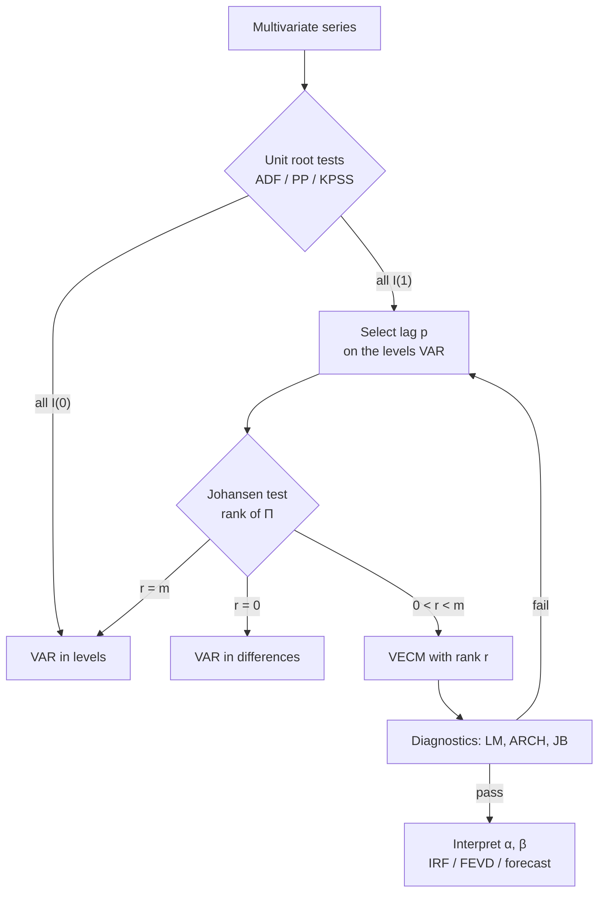

# VECM and Cointegration

> [!abstract] Where this sits in the course
> [[07 - SARIMA and Vector Autoregression]] insisted that every VAR variable be $I(0)$, and pointed here for the case they are not. **This chapter is that case.** If variables are individually non-stationary but move together in the long run, neither a VAR in levels (spurious) nor a VAR in differences (throws away the long-run relationship) is right. The VECM keeps both.
>
> **The central idea:** $I(1)$ variables can be tied together by a stationary linear combination. That combination *is* the long-run equilibrium, and deviations from it drive the short-run dynamics.

> [!note] Two source decks
> This lecture exists as two notebooks: `lecture08_VECM_DSEB.ipynb` (57 cells — the full derivation, Johansen algebra, and applied results) and `VECM_lecture_slides.ipynb` (16 cells — a shorter overview covering VECM IRFs and the model-choice rule, which the long deck omits). **They are complementary, not duplicates**, and both are used here.

---

## 📘 Main Knowledge

### 1. Motivation — why differencing is not enough

Start with a long-run relationship between two variables:

$$
Y_t = \beta_0+\beta_1X_t+\varepsilon_t
$$

If both are $I(1)$, regressing levels on levels risks spurious regression ([[01 - What is a Time Series]]). The obvious fix is to difference:

$$
\Delta Y_t = \beta_1\Delta X_t+v_t,
\qquad
v_t = \varepsilon_t-\varepsilon_{t-1}
$$

**Three things go wrong:**

1. $v_t$ is **serially correlated** by construction — it is a differenced error, hence an MA(1) with a unit root.
2. The model captures **only the short-run effect** of $\Delta X_t$.
3. **No mechanism enforces the equilibrium condition** — the model has no memory of the level relationship at all.

Define the equilibrium level $Y_t^* = \beta_0+\beta_1X_{t-1}$. At $t-1$ there are three possibilities:

$$
\text{(a) } Y_t = \beta_0+\beta_1X_{t-1}
\qquad
\text{(b) } Y_t < \beta_0+\beta_1X_{t-1}
\qquad
\text{(c) } Y_t > \beta_0+\beta_1X_{t-1}
$$

In cases (b) and (c) the system is *out of equilibrium*. **A mechanism is needed to correct the deviation** — and the differenced model has none.

#### The Error Correction Model

$$
\boxed{\;\Delta Y_t = \alpha_1\Delta X_t + \gamma\,EC_{t-1}+\varepsilon_t\;},
\qquad
EC_{t-1} = Y_{t-1}-\beta_0-\beta_1X_{t-1}
$$

| Term | Meaning |
|---|---|
| $\alpha_1$ | **Short-run** effect of $\Delta X_t$ |
| $\gamma$ | **Adjustment speed** — how fast the system returns to equilibrium |
| $EC_{t-1}$ | Last period's **deviation** from equilibrium |

**Expected sign: $\gamma < 0$.** The logic is worth stating carefully because it is the heart of the whole chapter: if $EC_{t-1}>0$, then $Y$ was **too high** relative to equilibrium; a negative $\gamma$ makes $\Delta Y_t<0$, pulling $Y$ back down. If $EC_{t-1}<0$, $Y$ was too low and $\Delta Y_t>0$ pushes it up. **Either way, the term pulls the system toward equilibrium.**

> [!important] The ECM's key idea
> **Short-run dynamics + long-run equilibrium, in one equation.** The differenced terms handle period-to-period fluctuation; the error-correction term handles the level relationship. Neither alone is enough. Everything below is the multivariate generalisation of this single equation.

---

### 2. Cointegration

Consider $m$ variables $Y_i\sim I(1)$, $i=1,\ldots,m$, and a linear combination

$$
\delta_t = \sum_{i=1}^m\beta_iY_{it} = \beta'Y_t
$$

**If $\delta_t\sim I(0)$, the variables are cointegrated.** Even though each variable individually wanders without bound, **a particular linear combination of them is stationary.**

> [!important] The intuition
> Two drunks leaving a bar each follow a random walk — neither position is predictable. But if they are walking a dog on a leash, the *distance between them* is bounded and stationary even though each position is $I(1)$. Cointegration is the leash.
>
> **Economically:** the variables share a **common long-run equilibrium relationship**. Short-run and long-run interest rates, consumption and income, spot and futures prices, prices of the same good in two markets — each pair wanders, but the spread does not.
>
> **Modelling implication:** the model must include **both** short-run dynamics **and** a mechanism that pulls the system back to equilibrium.

#### Cointegrating vectors

Following Johansen (1988):

- The vector $\beta$ has **at least two non-zero elements** (a single variable being $I(0)$ is not cointegration).
- **Scale is irrelevant:** for any $a\neq0$, $a\delta_t$ is also stationary.
- There may exist $r$ **linearly independent** cointegrating vectors, with $0 < r \le m-1$.

$$
\beta = \begin{bmatrix}
\beta_{11}&\beta_{12}&\cdots&\beta_{1r}\\
\beta_{21}&\beta_{22}&\cdots&\beta_{2r}\\
\vdots&\vdots&\ddots&\vdots\\
\beta_{m1}&\beta_{m2}&\cdots&\beta_{mr}
\end{bmatrix}
$$

The **columns** of $\beta$ are the cointegrating vectors; each column is one long-run equilibrium relation. **$r$ cointegrating vectors ⇒ $r$ long-run equilibrium relations**, and correspondingly $m-r$ independent **stochastic trends** driving the system.

---

### 3. From VAR to VECM

#### The derivation

Start from a VAR($p$) in $m$ variables:

$$
Y_t = A_1Y_{t-1}+A_2Y_{t-2}+\cdots+A_pY_{t-p}+\varepsilon_t,
\qquad \varepsilon_t\sim N(0,\Sigma)
$$

- If $Y_t$ is stationary, a standard VAR in levels is appropriate.
- If $Y_t\sim I(1)$, rewrite the system so short-run and long-run effects are **separated**.

Subtract $Y_{t-1}$ from both sides and reorganise (add and subtract successive partial sums of the $A_i$):

$$
\begin{aligned}
\Delta Y_t = \;& (A_1+A_2+\cdots+A_p-I)\,Y_{t-1}\\
&-(A_2+\cdots+A_p)\,\Delta Y_{t-1}\\
&-(A_3+\cdots+A_p)\,\Delta Y_{t-2}-\cdots\\
&-A_p\,\Delta Y_{t-p+1}+\varepsilon_t
\end{aligned}
$$

> [!important] Why this transformation is the whole trick
> The left side $\Delta Y_t$ is stationary (since $Y_t\sim I(1)$), and every $\Delta Y_{t-i}$ on the right is stationary too. **But the level term $Y_{t-1}$ is preserved.** That single non-stationary term is where all the long-run information lives — and it is exactly what a VAR in first differences would have thrown away.
>
> This is the crucial reason a VECM is more appropriate than a differenced VAR when the variables are cointegrated.

#### Compact form

$$
\boxed{\;\Delta Y_t = \Pi Y_{t-1}+\sum_{i=1}^{p-1}\Gamma_i\Delta Y_{t-i}+\varepsilon_t\;}
$$

with

$$
\Pi = -\Big(I-\sum_{i=1}^pA_i\Big) = \sum_{i=1}^pA_i - I,
\qquad
\Gamma_i = -\sum_{j=i+1}^pA_j,\quad i=1,\ldots,p-1
$$

| Matrix | Role |
|---|---|
| $\Pi$ | **Long-run** coefficient matrix — carries the equilibrium relationships |
| $\Gamma_i$ | **Short-run** coefficient matrices — how past changes affect current changes |
| $\varepsilon_t$ | Innovation vector |

**A VECM is a VAR in differences plus an error-correction term.** In lag-operator form:

$$
\Gamma(L)\Delta Y_t = \alpha\beta'Y_{t-1}+\varepsilon_t,
\qquad
\Gamma(L) = I-\sum_{i=1}^{p-1}\Gamma_iL^i
$$

#### The rank of $\Pi$ decides everything

$\Pi$ has rank $r$ and factorises as

$$
\boxed{\;\Pi = \alpha\beta'\;}
$$

where $\beta$ ($m\times r$) holds the **cointegrating vectors** and $\alpha$ ($m\times r$) the **adjustment speeds**.

| Rank | Meaning | Correct model |
|---|---|---|
| $r=0$ | $\Pi = 0$; **no cointegration** | VAR in **differences** |
| $0<r<m$ | $r$ cointegrating relations, $m-r$ stochastic trends | **VECM** |
| $r=m$ | $\Pi$ full rank ⇒ all variables **stationary** | VAR in **levels** |

> [!important] The rank *is* the number of long-run relationships
> This is the single most important idea in the chapter. Testing for cointegration reduces to **determining the rank of a matrix** — and since rank equals the number of non-zero eigenvalues, that reduces to an eigenvalue problem (§5). The whole Johansen apparatus exists to count non-zero eigenvalues carefully.

#### Reading the error-correction term

$$
\Delta Y_t = \underbrace{\alpha\beta'Y_{t-1}}_{\text{error correction}}+\sum_{i=1}^{p-1}\Gamma_i\Delta Y_{t-i}+\varepsilon_t
$$

**$\beta'Y_{t-1}$** measures the size of last period's deviation from equilibrium:

$$
\beta'Y_t = \begin{bmatrix}EC_{1t}\\\vdots\\EC_{rt}\end{bmatrix},
\qquad
EC_{jt} = \sum_{i=1}^m\beta_{ij}y_{it}
$$

$EC_{jt}=0$ means the system is *at* long-run equilibrium on relation $j$; $EC_{jt}\neq0$ is a deviation. In the two-variable case this reads simply as $\beta'Y_t = y_t-\beta x_t$. **Because $\beta'Y_t\sim I(0)$, it anchors the system** — it cannot wander off.

**$\alpha$ determines how each variable reacts.** With $\Delta Y_t = \alpha\cdot EC_{t-1}$ and $\alpha<0$:

- $EC_{t-1}>0$ ⇒ $\Delta Y_t<0$ — the system moves down.
- $EC_{t-1}<0$ ⇒ $\Delta Y_t>0$ — the system moves up.

**The magnitude $|\alpha|$ is the speed of adjustment:** large $|\alpha|$ ⇒ fast correction; small $|\alpha|$ ⇒ slow. An $\alpha$ of $-0.3$ means roughly 30% of any disequilibrium is corrected each period, implying a half-life of about $\ln(0.5)/\ln(0.7)\approx1.9$ periods.

> [!warning] The sign of $\alpha$ depends on the sign convention for $\beta$
> "Negative $\alpha$" is only meaningful once $\beta$ is normalised. If you flip the sign of $\beta$, $\alpha$ flips too and $\Pi = \alpha\beta'$ is unchanged. **What matters is that $\alpha$ and $\beta$ jointly produce restoring force**, not the sign of either alone. In a multi-variable system, some elements of $\alpha$ will be positive and some negative — see the worked example in §6, where $y_1$ adjusts down ($-0.3423$) and $y_2$ adjusts up ($+0.2580$) toward the same equilibrium.

#### Generalised form

$$
\Gamma(L)\Delta Y_t = \alpha\beta'Y_{t-1}+\Theta(L)\varepsilon_t
$$
$$
\Gamma(L) = I-\Gamma_1L-\cdots-\Gamma_{p-1}L^{p-1},
\qquad
\Theta(L) = I+\Theta_1L+\Theta_2L^2+\cdots
$$

The disturbance need not be white noise — it can follow a moving-average process, giving a vector ARMA structure.

---

### 4. $\alpha$ and $\beta$ are not unique

Let $\gamma$ be any non-singular $r\times r$ matrix. Then

$$
\alpha\beta' = \alpha\gamma\gamma^{-1}\beta' = (\alpha\gamma)(\gamma^{-1}\beta')
$$

so defining $\alpha^*=\alpha\gamma$ and $\beta^{*\prime}=\gamma^{-1}\beta'$ gives an identical model. **Replacing the $r$ columns of $\alpha$ and $\beta$ by independent linear combinations changes nothing observable.**

$$
\boxed{\;\text{Only the } \textbf{space spanned} \text{ by } \beta \text{ is identified, not the specific vectors.}\;}
$$

> [!example] Numerical illustration
> **Original:** $\beta = \begin{bmatrix}1\\-1\end{bmatrix}$, so $\beta'Y_t = y_t-x_t$ and the equilibrium condition is $y_t-x_t = 0$.
>
> **Transformed:** $\beta^* = \begin{bmatrix}2\\-2\end{bmatrix}$, so $\beta^{*\prime}Y_t = 2y_t-2x_t$. Dividing by 2: $y_t - x_t = 0$.
>
> **Different vectors, same relation, same direction — the same one-dimensional space.** Cointegration is defined up to a linear transformation.

**Practical consequence: normalisation.** Since only the space matters, software imposes a convention — typically setting the first element of each column to 1, so $\beta = [1,\;-1.0087]'$ rather than $[2,\;-2.0174]'$. This makes the relation readable as "$y_1 = 1.0087\,y_2$ in the long run", but **the choice of which variable to normalise on is arbitrary** and carries no economic content. Different software may normalise differently and report apparently different $\beta$'s for the same model.

For $r\ge2$ the non-uniqueness bites harder: **individual columns of $\beta$ are not separately interpretable** unless you impose economic restrictions to pin them down. Reporting "the" cointegrating vector when $r=2$ is a category error.

---

### 5. Estimating a VECM

#### 5.1 Unrestricted OLS — possible but poor

Park and Phillips (1980) and Sims, Stock and Watson (1990) showed that estimating the VECM as an **unrestricted VAR**, *without* imposing a rank restriction on $\Pi$, still yields **consistent** estimates.

The procedure: write $\mathbf{Y} = \mathbf{Z}\mathbf{A}'+\varepsilon$ with $\mathbf{Z}$ the matrix of lagged levels, estimate

$$
\hat{\mathbf{A}} = \mathbf{Y}\mathbf{Z}'(\mathbf{Z}\mathbf{Z}')^{-1}
$$

then recover

$$
\hat\Pi = -\big(I-\hat A_1-\cdots-\hat A_p\big),
\qquad
\hat\Gamma_i = -\sum_{j=i+1}^p\hat A_j
$$

determine the rank $r$ of $\hat\Pi$, and if $r\neq0$ decompose $\hat\Pi = \hat\alpha\hat\beta'$.

**Weaknesses:**

- **Many computational steps** — several algebraic transformations required.
- **Low reliability** — $\hat\alpha$ and $\hat\beta$ are obtained only *indirectly*, after the fact.
- **Difficult inference** — testing cointegration relations is not straightforward. In particular, $\hat\Pi$ estimated freely will essentially never have *exactly* reduced rank, so "determine the rank of $\hat\Pi$" is not a well-posed operation on a sample estimate.

OLS may be used when the cointegrating relations are **already known**. In general it is not sufficiently reliable.

#### 5.2 Johansen's Reduced Rank Regression

MLE overcomes these limits by estimating the VECM parameters **directly under a rank restriction on $\Pi$**. Johansen (1991) proposed **Reduced Rank Regression** (RRR), which estimates efficiently while imposing the cointegration structure.

**Key idea: remove short-run effects first, then estimate the long-run relations.**

**Step 1 — auxiliary regressions.** Two OLS regressions, both on the same lagged differences:

$$
\Delta Y_t = B_1\Delta Y_{t-1}+\cdots+B_{p-1}\Delta Y_{t-p+1}+R_{0t}
$$
$$
Y_{t-1} = C_1\Delta Y_{t-1}+\cdots+C_{p-1}\Delta Y_{t-p+1}+R_{1t}
$$

| Residual | What it contains |
|---|---|
| $R_{0t}$ — the "**cleaned change**" | The part of $\Delta Y_t$ **not** explained by short-run dynamics: (i) long-run effects, (ii) random shocks, (iii) other unexplained components |
| $R_{1t}$ — the "**cleaned level**" | The part of $Y_{t-1}$ **not** explained by short-run dynamics: (i) trend, (ii) deviation from long-run equilibrium, (iii) other persistent effects |

This **isolates the long-run signal from short-run noise** — it is the Frisch–Waugh–Lovell theorem applied to partial out the $\Gamma_i$ terms.

**Step 2 — the concentrated model.**

$$
R_{0t} = \alpha\beta'R_{1t}+\varepsilon_t
$$

The concentrated log-likelihood is

$$
\mathrm{CLF}(\alpha,\beta) = k-\frac T2\ln\big|(R_0-R_1(\alpha\beta')')'(R_0-R_1(\alpha\beta')')\big|,
\qquad
k = -\frac{mT}2\ln(2\pi)
$$

Define the moment matrices

$$
S_{00} = \frac1T\sum_t R_{0t}R_{0t}',
\qquad
S_{11} = \frac1T\sum_t R_{1t}R_{1t}',
\qquad
S_{01} = \frac1T\sum_t R_{0t}R_{1t}'
$$

so that

$$
\mathrm{CLF}(\alpha,\beta) = k-\frac T2\ln\big|S_{00}-\alpha\beta'S_{10}-S_{01}\beta\alpha'+\alpha\beta'S_{11}\beta\alpha'\big|
$$

To obtain a unique solution with $r(\alpha)=r(\beta)=r$, **normalise** $\beta'S_{11}\beta = I_r$ — legitimate precisely because §4 showed only the space is identified. Under this constraint,

$$
\mathrm{CLF}(\alpha,\beta) = k-\frac T2\ln\big|S_{00}-S_{01}\beta\alpha'-\alpha\beta'S_{10}+\alpha\alpha'\big|
$$

**Step 3 — concentrate out $\alpha$.** Fixing $\beta$ and setting $\partial\mathrm{CLF}/\partial\alpha=0$ gives the first-order condition $S_{01}\beta-\alpha=0$, i.e.

$$
\alpha = S_{01}\beta
$$

**$\alpha$ is a function of $\beta$** — a multivariate regression of the cleaned changes on the cointegrating combinations of the cleaned levels. Substituting back:

$$
\mathrm{CLF}(\beta) = k-\frac T2\ln\big|S_{00}-S_{01}\beta\beta'S_{10}\big|
$$

**Only $\beta$ remains to be optimised.**

**Step 4 — the eigenvalue problem.** Minimise the determinant subject to the normalisation:

$$
\min_\beta \big|S_{00}-S_{01}\beta\beta'S_{10}\big|
\qquad\text{s.t.}\qquad
\beta'S_{11}\beta = I_r
$$

Using the determinant identity $|S_{00}-S_{01}\beta\beta'S_{10}| = |S_{00}|\cdot|I-\beta'S_{10}S_{00}^{-1}S_{01}\beta|$, this becomes

$$
\min_\beta\big|I-\beta'S_{10}S_{00}^{-1}S_{01}\beta\big|
\qquad\text{s.t.}\qquad
\beta'S_{11}\beta=I_r
$$

Forming the Lagrangian with $A = S_{10}S_{00}^{-1}S_{01}$:

$$
\mathcal{L} = |I-\beta'A\beta|+\lambda(\beta'S_{11}\beta-I)
$$

the first-order condition is $A\beta = \lambda S_{11}\beta$, i.e.

$$
S_{11}^{-1}A\beta = \lambda\beta
\qquad\Longleftrightarrow\qquad
\boxed{\;\big|\lambda S_{11}-S_{10}S_{00}^{-1}S_{01}\big| = 0\;}
$$

**a generalised eigenvalue problem.** $\beta$ = eigenvectors of $S_{11}^{-1}S_{10}S_{00}^{-1}S_{01}$; $\lambda$ = eigenvalues; $\mathrm{rank}(\Pi)$ = number of *significant* $\lambda$. **We are finding the directions that maximise long-run relationships.**

> [!important] What the eigenvalues actually are
> $\hat\lambda_i$ are **squared canonical correlations** between the cleaned changes $R_{0t}$ and the cleaned levels $R_{1t}$. Each measures how much of the change in the system is explained by the corresponding linear combination of levels.
>
> - $\hat\lambda_i \approx 0$ ⇒ that direction of $Y_{t-1}$ has **no** predictive power for $\Delta Y_t$ ⇒ no cointegrating relation there.
> - $\hat\lambda_i$ large ⇒ deviations along that direction **do** drive subsequent changes ⇒ a genuine error-correcting relation.
>
> Counting cointegrating relations = counting eigenvalues significantly above zero. **Johansen's test is a hypothesis test about eigenvalues**, and this is why the algebra of §5 was worth following.

**Step 5 — recover everything.** Solve the eigenvalue problem for $\hat\lambda_1>\hat\lambda_2>\cdots>\hat\lambda_m$, then

$$
\hat\beta = [\hat\beta_1,\ldots,\hat\beta_r]
\quad\text{(eigenvectors for the } r \text{ largest eigenvalues)}
$$
$$
\hat\alpha = S_{01}\hat\beta(\hat\beta'S_{11}\hat\beta)^{-1},
\qquad
\hat\Gamma_i = B_i-\hat\alpha\hat\beta'C_i
$$

**All parameters are recovered from the eigenvectors.** Note the $\hat\Gamma_i$ formula: the auxiliary-regression coefficients $B_i$ are corrected by the long-run structure that was partialled out.

---

### 6. The Johansen tests

#### Preliminary diagnostics

Before testing rank, do everything you would for a VAR ([[07 - SARIMA and Vector Autoregression]]):

| Check | Tools |
|---|---|
| Lag selection | AIC, BIC, HQ |
| Autocorrelation | LM test, Ljung–Box |
| Heteroskedasticity | ARCH test, White test |
| Normality | Jarque–Bera |

**For a VECM, the key additional issue is determining the cointegration rank $r$.**

#### Deterministic terms

Variables $Y_{it}$ may have non-zero means and may contain trends, so the cointegrating equation may include an intercept and possibly a trend. Five standard cases:

| Case | Specification |
|---|---|
| 1. No trend in $Y$, no intercept in the CE | $\Pi Y_{t-1} = \alpha\beta'Y_{t-1}$ |
| 2. No trend in $Y$, intercept in the CE | $\Pi Y_{t-1} = \alpha(\beta'Y_{t-1}+\mu_0)$ |
| 3. Trend in $Y$, intercept in the CE | $\Pi Y_{t-1} = \alpha(\beta'Y_{t-1}+\mu_0)+\theta\gamma_0$ |
| 4. Trend in both | $\Pi Y_{t-1} = \alpha(\beta'Y_{t-1}+\mu_0+\mu_1t)+\theta\gamma_0$ |
| 5. Quadratic trend in $Y$ | $\Pi Y_{t-1} = \alpha(\beta'Y_{t-1}+\mu_0+\mu_1t)+\theta(\gamma_0+\gamma_1t)$ |

The $\theta$-terms are deterministic components **outside** the cointegrating relation. When deterministic terms appear both inside and outside they are **not uniquely identified**, so the restriction

$$
\alpha'\theta = 0
$$

is imposed to ensure identification. Deterministic terms may include dummy variables $D\in\{0,1\}$ affecting the mean and trend; **use centred seasonal dummies to handle seasonality** (centred so they do not shift the mean).

> [!warning] The deterministic case changes the critical values
> The Johansen critical values depend on which of the five cases you choose — not just on $m$ and $r$. Choosing case 4 when case 2 is correct, or vice versa, changes the test outcome. In `statsmodels`' `coint_johansen`, this is the `det_order` argument; in `VECM`, `deterministic='ci'`, `'co'`, `'li'`, `'lo'` etc. **Choose it from a plot of the data and economic reasoning, before running the test.**

#### The two tests

**Trace test** — tests the *cumulative* number of relations:

$$
H_0:\ \text{at most } r \text{ cointegrating relations}
\qquad
H_1:\ \text{more than } r
$$
$$
\boxed{\;\lambda_{\text{trace}}(r) = -T\sum_{i=r+1}^m\ln(1-\hat\lambda_i)\;}
$$

**Maximum eigenvalue test** — tests for exactly *one more*:

$$
H_0:\ r
\qquad
H_1:\ r+1
$$
$$
\boxed{\;\lambda_{\max}(r,r+1) = -T\ln(1-\hat\lambda_{r+1})\;}
$$

Note the structure: each term $-T\ln(1-\hat\lambda_i)$ is large when $\hat\lambda_i$ is far from zero, and $\to 0$ as $\hat\lambda_i\to0$. The trace statistic sums all the terms *beyond* $r$; the max-eigenvalue statistic takes only the next one.

**Distribution.** Neither follows a standard distribution. Both belong to complicated **non-standard** distributions depending on:

- the number of variables in the system,
- the deterministic specification,
- the number of cointegrating relations being tested.

**In practice:** econometric software computes the correct critical values automatically; you compare the statistic to the reported critical value and **reject $H_0$ when the statistic exceeds it.**

**Procedure — test sequentially, starting from $r=0$.** Test $r=0$; if rejected, test $r=1$; continue until you fail to reject. The first non-rejection gives $\hat r$.

> [!example] Johansen test on a three-variable system
> Max-eigenvalue statistics and 5% critical values:
> $$\lambda_{\max} = [\,145.5,\;71.4,\;0.74\,],
> \qquad
> \text{critical} = [\,17.8,\;11.2,\;4.13\,]$$
>
> | Test | Statistic | Critical | Decision |
> |---|---|---|---|
> | $r=0$ | 145.5 | 17.8 | $145.5>17.8$ ⇒ **Reject** — at least 1 relation |
> | $r=1$ | 71.4 | 11.2 | $71.4>11.2$ ⇒ **Reject** — at least 2 relations |
> | $r=2$ | 0.74 | 4.13 | $0.74<4.13$ ⇒ **Fail to reject** — stop |
>
> **Conclusion: rank $= 2$.** Two long-run relations among three variables, hence $3-2 = 1$ **stochastic trend** driving the system.
>
> Note how decisive this is: the first two statistics exceed their critical values by factors of 8 and 6, while the third is a fifth of its critical value. Real applications are rarely this clean — borderline cases where trace and max-eigenvalue disagree are common, and the usual advice is to prefer the **trace** test (it has better power against some alternatives) while checking that the resulting $\hat\beta$ is economically sensible.
>
> > [!warning] These critical values look non-standard
> > For a 3-variable system the commonly tabulated 5% max-eigenvalue critical values are roughly $21.1,\;14.3,\;3.8$ (Johansen–Juselius, case 2). The slide's $17.8,\;11.2,\;4.13$ do not match any standard table I can identify, and the underlying data file is missing so I cannot check what deterministic specification produced them. The *conclusion* (rank 2) is unaffected — the statistics are nowhere near any plausible critical value — but treat the specific numbers with caution.

---

### 7. Worked examples

#### 7.1 From VAR(2) to VECM, by hand

$$
Y_t = A_1Y_{t-1}+A_2Y_{t-2}+\varepsilon_t,
\qquad
A_1 = \begin{bmatrix}0.5&0.3\\0.2&0.7\end{bmatrix},
\qquad
A_2 = \begin{bmatrix}0.1&0.1\\0&0.1\end{bmatrix}
$$

**Step 1 — the long-run matrix.**

$$
A_1+A_2 = \begin{bmatrix}0.6&0.4\\0.2&0.8\end{bmatrix}
\qquad\Longrightarrow\qquad
\Pi = A_1+A_2-I = \begin{bmatrix}-0.4&0.4\\0.2&-0.2\end{bmatrix}
$$

**Step 2 — the rank.** The second row is $-0.5\times$ the first row, so the rows are linearly dependent:

$$
\mathrm{rank}(\Pi) = 1
$$

**Rank 1 ⇒ one cointegrating relation.** (Equivalently, $\det\Pi = (-0.4)(-0.2)-(0.4)(0.2) = 0.08-0.08 = 0$ — singular but non-zero, so rank exactly 1.)

**Step 3 — decompose.**

$$
\Pi = \alpha\beta',
\qquad
\beta' = [\,1,\;-1\,],
\qquad
\alpha = \begin{bmatrix}-0.4\\0.2\end{bmatrix}
$$

Check: $\alpha\beta' = \begin{bmatrix}-0.4\\0.2\end{bmatrix}[1\;\;-1] = \begin{bmatrix}-0.4&0.4\\0.2&-0.2\end{bmatrix}$ ✓

**Step 4 — short-run matrix.** With $p=2$, $\Gamma_1 = -A_2$:

$$
\Gamma_1 = \begin{bmatrix}-0.1&-0.1\\0&-0.1\end{bmatrix}
$$

**Step 5 — the VECM.**

$$
\Delta Y_t = \begin{bmatrix}-0.4&0.4\\0.2&-0.2\end{bmatrix}Y_{t-1}+\begin{bmatrix}-0.1&-0.1\\0&-0.1\end{bmatrix}\Delta Y_{t-1}+\varepsilon_t
$$

**Equation by equation**, with $\beta'Y_{t-1} = y_{t-1}-x_{t-1}$:

$$
\Delta y_t = -0.4(y_{t-1}-x_{t-1})-0.1\Delta y_{t-1}-0.1\Delta x_{t-1}+\varepsilon_{1t}
$$
$$
\Delta x_t = \phantom{-}0.2(y_{t-1}-x_{t-1})\phantom{-0.1\Delta y_{t-1}}-0.1\Delta x_{t-1}+\varepsilon_{2t}
$$

**Economic reading.** The long-run equilibrium is $y = x$. If $y > x$ (the system is above equilibrium):

- $\Delta y_t < 0$ — $y$ adjusts **downward** at speed $0.4$;
- $\Delta x_t > 0$ — $x$ adjusts **upward** at speed $0.2$.

**Both variables move toward each other; the system converges.** This is the multivariate version of the ECM logic from §1, and note that *both* variables error-correct — neither is "exogenous". $y$ does about two-thirds of the adjusting.

#### 7.2 A two-variable estimated VECM

| Object | Estimate | Reading |
|---|---|---|
| $\beta$ | $\begin{bmatrix}1\\-1.0087\end{bmatrix}$ | Long-run relation $y_1 - 1.0087\,y_2\approx0$ — the two variables move together |
| $\alpha$ | $\begin{bmatrix}-0.3423\\0.2580\end{bmatrix}$ | $y_1$ adjusts **down** when above equilibrium; $y_2$ adjusts **up** when below |
| $\Pi = \alpha\beta'$ | $\begin{bmatrix}-0.3423&0.3453\\0.2580&-0.2602\end{bmatrix}$ | $\mathrm{rank}=1$ — confirms one cointegrating relation |
| $\Gamma$ | $\begin{bmatrix}0.2543&-0.0064\\0.0042&0.1849\end{bmatrix}$ | Short-run: each variable's own past change matters ($0.25$, $0.18$); cross-effects negligible |
| $\Sigma_u$ | $\begin{bmatrix}1.0757&0.3786\\0.3786&0.8580\end{bmatrix}$ | Shocks are contemporaneously correlated ($\rho\approx0.39$) |

**Interpretation.** $\beta\approx[1,-1]$ means the equilibrium is essentially $y_1 = y_2$ — the coefficient $1.0087$ is within a whisker of 1, and one would naturally test $H_0:\beta = [1,-1]'$ formally (a restriction test on $\beta$, which Johansen's framework supports via a likelihood ratio test with $\chi^2$ distribution — one of the few places in this literature where the asymptotics *are* standard).

**Adjustment.** $|\alpha_1| = 0.3423$ against $|\alpha_2| = 0.2580$: $y_1$ carries slightly more of the adjustment burden. Together they close roughly 60% of any disequilibrium each period — fast. **Note the opposite signs**, which is exactly what restoring force requires when $\beta = [1,-1]$: if $y_1-y_2>0$, $y_1$ must fall and $y_2$ must rise.

**Short-run.** $\Gamma$ is nearly diagonal ($-0.0064$ and $0.0042$ are negligible), so the cross-variable short-run dynamics are weak. **The system's interaction is almost entirely through the error-correction term** — which is the substantive finding: these variables are linked by their long-run relationship, not by short-run spillovers.

#### 7.3 A three-variable VECM with rank 2

$$
Y_t = \begin{bmatrix}y_{1t}\\y_{2t}\\y_{3t}\end{bmatrix},
\qquad
\beta = \begin{bmatrix}1&0\\0&1\\-1.0504&-1.0212\end{bmatrix}
$$

The normalisation puts an identity block on top, giving **two error-correction terms**:

$$
\beta'Y_{t-1} = \begin{bmatrix}y_{1,t-1}-1.0504\,y_{3,t-1}\\ y_{2,t-1}-1.0212\,y_{3,t-1}\end{bmatrix}
$$

Each of $y_1$ and $y_2$ has its own long-run relationship with $y_3$. With $m=3$ and $r=2$, there is **one common stochastic trend** — plausibly $y_3$ itself — and the other two variables are tied to it.

**The long-run matrix:**

$$
\Pi = \alpha\beta' = \begin{bmatrix}
-0.3092&0.3566&-0.0394\\
0.1812&-0.3696&0.1871\\
0.1118&0.0964&-0.2159
\end{bmatrix}
$$

From which the adjustment matrix reads off as the first two columns:

$$
\alpha = \begin{bmatrix}-0.3092&0.3566\\ 0.1812&-0.3696\\ 0.1118&0.0964\end{bmatrix}
$$

(Check the third column: row 1 gives $-0.3092(-1.0504)+0.3566(-1.0212) = 0.3248-0.3642 = -0.0394$ ✓. Rows 2 and 3 check out identically — the reported $\Pi$ is internally consistent with $\alpha$ and $\beta$.)

**Short-run dynamics:**

$$
\Gamma = \begin{bmatrix}
0.1346&0.0418&-0.0189\\
0.0204&0.0669&0.0375\\
0.0647&0.0111&0.0308
\end{bmatrix}
$$

Each row is one equation; each column is the effect of one lagged $\Delta y$.

**The full expanded system:**

$$
\begin{aligned}
\Delta y_{1t} = \;& -0.3092(y_{1,t-1}-1.0504y_{3,t-1}) + 0.3566(y_{2,t-1}-1.0212y_{3,t-1})\\
&+0.1346\Delta y_{1,t-1}+0.0418\Delta y_{2,t-1}-0.0189\Delta y_{3,t-1}+\varepsilon_{1t}
\end{aligned}
$$
$$
\begin{aligned}
\Delta y_{2t} = \;& \phantom{-}0.1812(y_{1,t-1}-1.0504y_{3,t-1}) - 0.3696(y_{2,t-1}-1.0212y_{3,t-1})\\
&+0.0204\Delta y_{1,t-1}+0.0669\Delta y_{2,t-1}+0.0375\Delta y_{3,t-1}+\varepsilon_{2t}
\end{aligned}
$$
$$
\begin{aligned}
\Delta y_{3t} = \;& \phantom{-}0.1118(y_{1,t-1}-1.0504y_{3,t-1}) + 0.0964(y_{2,t-1}-1.0212y_{3,t-1})\\
&+0.0647\Delta y_{1,t-1}+0.0111\Delta y_{2,t-1}+0.0308\Delta y_{3,t-1}+\varepsilon_{3t}
\end{aligned}
$$

> [!tip] Reading guide for any VECM output
> - **Terms in parentheses** = long-run disequilibrium ($ECT$s).
> - **Coefficients in front of them** = adjustment speeds ($\alpha$).
> - **Difference terms** = short-run propagation ($\Gamma$).
>
> Reading the diagonal of $\alpha$ here: $-0.3092$ for $y_1$ on its own $ECT_1$ and $-0.3696$ for $y_2$ on $ECT_2$ — both negative, both substantial, so each variable corrects its own disequilibrium at roughly 30–37% per period. The third row ($0.1118,\;0.0964$) is small and positive: **$y_3$ barely error-corrects**, consistent with it being the common stochastic trend that the others adjust toward. **Weak exogeneity** of $y_3$ ($\alpha_{3\cdot}=0$) would be the formal hypothesis to test here.

---

### 8. Impulse responses in a VECM, and model choice

#### IRFs

IRFs can be computed from a VECM, and their interpretation differs from a stationary VAR's:

- **Short-run dynamics** come from the differenced terms $\Gamma_i$.
- **Long-run behaviour** is shaped by the error-correction mechanism.
- Responses eventually **reflect the cointegration structure**.

> [!important] The key difference from a stationary VAR
> In a stable VAR, every impulse response decays to zero — all shocks are temporary ([[07 - SARIMA and Vector Autoregression]]). **In a VECM, responses do not all die out.** Because there are $m-r$ stochastic trends, some shocks have **permanent** effects on the *levels* of the variables. What *does* die out is the response of the cointegrating combinations $\beta'Y_t$ — the system returns to its equilibrium *relations*, but not to any particular level.
>
> In a VECM, impulse responses are not just about lagged changes; they also reflect the system's tendency to return to equilibrium. **VECM-based IRFs are often more economically meaningful** when the variables are cointegrated, because they distinguish permanent from transitory shocks — which is precisely the distinction a differenced VAR destroys.

#### The model-choice rule

| Situation | Correct model |
|---|---|
| Variables are $I(0)$ | **VAR in levels** |
| Variables are $I(1)$ but **not** cointegrated | **VAR in differences** |
| Variables are $I(1)$ **and** cointegrated | **VECM** |

**The choice depends on two things:** the order of integration, and whether a stable long-run relation exists.



**Bottom line: a VECM is the natural framework for multivariate time series with both non-stationarity and long-run equilibrium.**

```python
from statsmodels.tsa.vector_ar.vecm import coint_johansen, VECM, select_order

# 1. Lag length on the LEVELS VAR (VECM uses p-1 lagged differences)
lag = select_order(data, maxlags=8, deterministic="ci").bic

# 2. Johansen rank test
jres = coint_johansen(data, det_order=0, k_ar_diff=lag)
print(jres.lr1, jres.cvt)   # trace statistics and critical values
print(jres.lr2, jres.cvm)   # max-eigenvalue statistics and critical values

# 3. Fit the VECM at the chosen rank
model = VECM(data, k_ar_diff=lag, coint_rank=2, deterministic="ci")
res = model.fit()
print(res.summary())
print(res.beta)      # cointegrating vectors (normalised)
print(res.alpha)     # adjustment speeds
print(res.gamma)     # short-run matrices
res.irf(24).plot()
```

> [!warning] `k_ar_diff` is $p-1$, not $p$
> `statsmodels`' `VECM` takes the number of **lagged differences**, which is one less than the VAR lag order. `select_order(...).bic` already returns it in that convention, but if you pick $p$ from a levels VAR yourself, pass $p-1$. Off-by-one here silently changes the model.

---

## ✏️ Exercises

### Exercise 1 — VAR to VECM by hand

For the VAR(2)
$$A_1 = \begin{bmatrix}0.6&0.2\\0.3&0.5\end{bmatrix},\qquad A_2 = \begin{bmatrix}0.2&0.1\\0.1&0.2\end{bmatrix}$$
compute $\Pi$ and $\Gamma_1$, determine the rank, and if cointegrated find $\alpha$ and $\beta$ and write out both equations.

> [!example]- Solution
> **Step 1 — $\Pi$.**
> $$A_1+A_2 = \begin{bmatrix}0.8&0.3\\0.4&0.7\end{bmatrix}
> \qquad\Longrightarrow\qquad
> \Pi = A_1+A_2-I = \begin{bmatrix}-0.2&0.3\\0.4&-0.3\end{bmatrix}$$
>
> **Step 2 — rank.**
> $$\det\Pi = (-0.2)(-0.3)-(0.3)(0.4) = 0.06-0.12 = -0.06 \neq 0$$
> **$\Pi$ has full rank ($r = m = 2$).**
>
> **Step 3 — first conclusion.** Full rank means $\Pi$ is invertible, so $\Phi(1) = -\Pi$ is invertible and **$z=1$ is not a root**: the system has **no unit root**, hence **no cointegration and no VECM.** ($\Gamma_1 = -A_2 = \begin{bmatrix}-0.2&-0.1\\-0.1&-0.2\end{bmatrix}$ would be the short-run matrix, but there is nothing to correct toward.)
>
> **Step 4 — but do not stop there.** "No unit root" is *not* the same as "stationary". Check the VAR stability condition properly, $\det(I-A_1z-A_2z^2)=0$:
> $$\det\begin{bmatrix}1-0.6z-0.2z^2 & -0.2z-0.1z^2\\ -0.3z-0.1z^2 & 1-0.5z-0.2z^2\end{bmatrix}=0$$
> $$(1-0.6z-0.2z^2)(1-0.5z-0.2z^2)-(0.2z+0.1z^2)(0.3z+0.1z^2)=0$$
> Expanding term by term:
> $$1 - 1.1z - 0.16z^2 + 0.17z^3 + 0.03z^4 = 0$$
> The four roots are
> $$z \approx 0.9274,\qquad 2,\qquad -3.594,\qquad -5$$
> **The smallest root has modulus $0.9274 < 1$ — inside the unit circle.** Equivalently, the block companion matrix $F = \begin{pmatrix}A_1&A_2\\I&0\end{pmatrix}$ has an eigenvalue $\lambda = 1/0.9274 = 1.0782 > 1$.
>
> **Correct conclusion: the system is explosive.** It is neither stationary nor $I(1)$ — it diverges. There is no valid VAR in levels, no VAR in differences, and no VECM. This is not a data-generating process you would ever fit.
>
> **The lesson — and it is the point of the exercise.** A full-rank $\Pi$ rules out unit roots, but it does **not** by itself certify stationarity. The complete diagnostic is:
>
> | $\Pi$ | Roots of $\det\Phi(z)$ | Verdict |
> |---|---|---|
> | Full rank | all $\|z\|>1$ | Stationary → VAR in levels |
> | Full rank | some $\|z\|<1$ | **Explosive** — no valid model |
> | Rank $0<r<m$ | $m-r$ roots at $z=1$, rest outside | Cointegrated → **VECM** |
> | Rank 0 | $m$ roots at $z=1$ | $I(1)$, not cointegrated → VAR in differences |
>
> **Always check the roots, not just the rank.** In practice `statsmodels` will happily estimate this VAR and report finite coefficients; only `var_res.roots` reveals the problem.

---

### Exercise 2 — Interpret a VECM

A VECM on log consumption ($c$), log income ($y$) and the real interest rate ($r$), quarterly, gives $r=1$ with
$$\beta = \begin{bmatrix}1\\-0.92\\0.04\end{bmatrix},
\qquad
\alpha = \begin{bmatrix}-0.28\\ 0.05\\ -0.01\end{bmatrix}$$
with only $\alpha_1$ statistically significant. Interpret, compute the half-life of adjustment, and say what you would test next.

> [!example]- Solution
> **The long-run relation.** $\beta'Y_t = c_t - 0.92y_t + 0.04r_t$, stationary. Rearranged:
> $$c_t = 0.92\,y_t - 0.04\,r_t + \text{stationary noise}$$
> In logs, $0.92$ is a **long-run elasticity of consumption with respect to income** — a 1% permanent rise in income raises consumption by 0.92% in the long run. The interest-rate coefficient $-0.04$ says higher real rates depress long-run consumption slightly (the substitution effect), though it is small.
>
> **Testable restriction.** $0.92$ is close to 1, which would be the permanent-income hypothesis in its sharpest form (consumption proportional to income, constant long-run saving rate). $H_0:\beta_y = -1$ is a linear restriction on $\beta$ and is testable by likelihood ratio with a **standard $\chi^2(1)$** distribution — one of the few standard asymptotics in this literature. Worth doing.
>
> **Adjustment.** $\alpha_1 = -0.28$ and significant: **consumption does the error-correcting**, closing 28% of any disequilibrium each quarter. The sign is right — if $c$ is above its long-run relation with $y$, consumption falls.
>
> **Half-life.** With 28% closed per quarter, the remaining gap follows $0.72^k$:
> $$0.72^k = 0.5 \;\Longrightarrow\; k = \frac{\ln 0.5}{\ln 0.72} = \frac{-0.693}{-0.329} = \mathbf{2.11 \text{ quarters}}$$
> About **six and a half months** to close half of any deviation. That is fast, and plausible for consumption.
>
> **The insignificant $\alpha$'s are the interesting finding.** $\alpha_2 = 0.05$ and $\alpha_3 = -0.01$ are not significant, meaning **income and interest rates do not respond to consumption disequilibrium** — they are **weakly exogenous** for the long-run parameters. Economically: income and rates drive consumption, not the reverse. All the adjustment burden falls on $c$.
>
> **What to test next:**
> 1. **Weak exogeneity formally:** $H_0: \alpha_2 = \alpha_3 = 0$, a likelihood-ratio test with $\chi^2(2)$. If it holds, you can validly estimate a **single-equation conditional ECM** for consumption alone, which is far more efficient and is the classic Davidson–Hendry–Srba–Yeo setup.
> 2. **$H_0:\beta_y = -1$** as above.
> 3. **Joint test** of both restrictions.
> 4. **Diagnostics** — LM test for residual autocorrelation, ARCH, Jarque–Bera, and a check for structural breaks (a consumption relation estimated across a financial crisis is a prime suspect).
> 5. **Whether $r$ belongs in the relation at all** — $\beta_r = 0.04$ is small; $H_0:\beta_r=0$ would reduce the system to a bivariate consumption–income relation.

---

### Exercise 3 — Sequential Johansen testing

A four-variable system yields eigenvalues $\hat\lambda = (0.41,\;0.22,\;0.09,\;0.02)$ with $T=150$. Trace critical values at 5% are $47.9,\;29.8,\;15.5,\;3.84$. (a) Compute the trace statistics. (b) Determine $r$. (c) Compute the max-eigenvalue statistics and check for agreement. (d) Interpret.

> [!example]- Solution
> **(a) Trace statistics**, $\lambda_{\text{trace}}(r) = -T\sum_{i=r+1}^4\ln(1-\hat\lambda_i)$.
>
> First the individual terms $-150\ln(1-\hat\lambda_i)$:
>
> | $i$ | $\hat\lambda_i$ | $\ln(1-\hat\lambda_i)$ | $-150\ln(1-\hat\lambda_i)$ |
> |---|---|---|---|
> | 1 | 0.41 | $-0.5276$ | 79.14 |
> | 2 | 0.22 | $-0.2485$ | 37.27 |
> | 3 | 0.09 | $-0.0943$ | 14.15 |
> | 4 | 0.02 | $-0.0202$ | 3.03 |
>
> Cumulating from the bottom:
>
> | $H_0$ | $\lambda_{\text{trace}}$ | Critical | Decision |
> |---|---|---|---|
> | $r=0$ | $79.14+37.27+14.15+3.03 = 133.59$ | 47.9 | **Reject** |
> | $r\le1$ | $37.27+14.15+3.03 = 54.45$ | 29.8 | **Reject** |
> | $r\le2$ | $14.15+3.03 = 17.18$ | 15.5 | **Reject** (narrowly) |
> | $r\le3$ | $3.03$ | 3.84 | Fail to reject — **stop** |
>
> **(b) $\hat r = 3$** by the trace test.
>
> **(c) Max-eigenvalue statistics**, $\lambda_{\max}(r,r+1) = -T\ln(1-\hat\lambda_{r+1})$ — these are exactly the individual terms computed above: $79.14,\;37.27,\;14.15,\;3.03$. Approximate 5% critical values for $m=4$ are $27.6,\;21.1,\;14.3,\;3.8$:
>
> | $H_0$ | $\lambda_{\max}$ | Critical | Decision |
> |---|---|---|---|
> | $r=0$ vs 1 | 79.14 | 27.6 | Reject |
> | $r=1$ vs 2 | 37.27 | 21.1 | Reject |
> | $r=2$ vs 3 | 14.15 | 14.3 | **Fail to reject** (just) |
>
> **The two tests disagree.** Trace says $r=3$ ($17.18 > 15.5$); max-eigenvalue says $r=2$ ($14.15 < 14.3$). Both third-stage decisions are within a hair of their critical values.
>
> **(d) Interpretation and what to do.**
>
> The system has **either 2 or 3** cointegrating relations, hence **1 or 2** stochastic trends. The first two relations are unambiguous — the statistics exceed critical values by wide margins. The third is genuinely borderline, and no amount of staring at these numbers will settle it.
>
> **How to resolve it:**
> 1. **Prefer the trace test** as a default — it tests against a more general alternative and generally has better power. That gives $r=3$.
> 2. **But check economic sense.** Does a third long-run relation correspond to anything interpretable? If the estimated $\hat\beta_3$ is not readable as an economic relationship, it is probably noise.
> 3. **Check $\hat\alpha_3$.** If no variable adjusts significantly to the third $ECT$, the relation does not error-correct and is likely spurious.
> 4. **Check the stationarity of $\hat\beta_3'Y_t$** directly with an ADF test — a genuine cointegrating combination should be visibly stationary.
> 5. **Test the sensitivity** to lag length and deterministic specification. Borderline cases often flip when you change $p$ by one, which itself tells you the evidence is weak.
> 6. **Prefer the smaller $r$ if unsure.** Over-specifying $r$ imposes false restrictions and distorts the IRFs; under-specifying merely loses some efficiency. With $\hat\lambda_3 = 0.09$ — small — I would lean toward $r=2$ here and note the ambiguity.
>
> **Sanity note:** $\hat\lambda_4 = 0.02$ giving $3.03 < 3.84$ is a clean non-rejection, so the system is definitely not fully stationary. At least one stochastic trend exists.

---

### Exercise 4 — Why not just difference everything?

Two $I(1)$ series are cointegrated with $\beta = [1,-1]'$ and $\alpha = [-0.4,\;0.1]'$. A colleague proposes fitting a VAR(1) to $(\Delta y_t,\Delta x_t)$ instead. (a) What is lost? (b) What happens to the residuals? (c) When would the colleague be right?

> [!example]- Solution
> **(a) What is lost — the error-correction term.** The true model is
> $$\Delta y_t = -0.4(y_{t-1}-x_{t-1})+\cdots+\varepsilon_{1t}$$
> $$\Delta x_t = \phantom{-}0.1(y_{t-1}-x_{t-1})+\cdots+\varepsilon_{2t}$$
> A differenced VAR **omits $(y_{t-1}-x_{t-1})$ entirely.** This is an **omitted variable** problem, and the omitted variable is stationary and correlated with the included regressors — so the estimates of the short-run coefficients are **biased and inconsistent**.
>
> **Three concrete losses:**
> 1. **The long-run relationship disappears.** You can no longer say "$y$ and $x$ are equal in the long run" or estimate the speed of adjustment. The economically interesting parameter is gone.
> 2. **Forecasts deteriorate, and increasingly so with horizon.** Differenced-VAR forecasts let the two series drift apart without limit; the true system pulls them together. At a 1-step horizon the loss is modest; at 12 steps it can be severe. This is the classic Engle–Granger result — a differenced VAR is *misspecified*, and the misspecification compounds.
> 3. **Long-run IRFs are wrong.** The differenced model cannot represent the equilibrium-restoring dynamics; permanent and transitory shocks become indistinguishable.
>
> **(b) The residuals.** The omitted $ECT_{t-1}$ is a **persistent, autocorrelated** stationary variable (in a cointegrated system it typically behaves like a fairly persistent AR(1)). Pushing it into the error term leaves residuals with **significant autocorrelation** — detectable by an LM or Ljung–Box test. The usual reaction is to add more lags of $\Delta y$ and $\Delta x$; this *mops up* some of the autocorrelation and can make the diagnostics look acceptable, which is why the misspecification often goes unnoticed. But no finite number of differenced lags can reproduce the level term — you get an increasingly baroque model that still forecasts badly at long horizons.
>
> **(c) When the colleague is right.** Three cases:
> 1. **$r=0$** — the series are $I(1)$ but genuinely **not** cointegrated. Then there *is* no error-correction term and a differenced VAR is exactly correct. **This is why you run the Johansen test first**, rather than assuming either way.
> 2. **Very short forecast horizons only.** At $h=1$ the ECT contributes little, and a differenced VAR can be competitive — sometimes even better, because it avoids estimating $\alpha$ and $\beta$ from a short sample.
> 3. **Genuine uncertainty about cointegration with a short sample.** Imposing a false cointegrating restriction is also costly. If the Johansen evidence is weak (as in Exercise 3's third relation), the differenced VAR is the more robust choice — a real bias–variance trade-off, not a matter of one model being universally right.
>
> **The asymmetry worth remembering:** with $\alpha_1 = -0.4$, the error correction is strong, so ignoring it here is a serious error. If $\alpha$ had been $-0.02$ — barely any adjustment — the two models would forecast almost identically and the choice would hardly matter.

---

### Exercise 5 — Derive the VECM transformation

Show algebraically that a VAR(2), $Y_t = A_1Y_{t-1}+A_2Y_{t-2}+\varepsilon_t$, can be written as $\Delta Y_t = \Pi Y_{t-1}+\Gamma_1\Delta Y_{t-1}+\varepsilon_t$ with $\Pi = A_1+A_2-I$ and $\Gamma_1 = -A_2$.

> [!example]- Solution
> **Start:**
> $$Y_t = A_1Y_{t-1}+A_2Y_{t-2}+\varepsilon_t$$
>
> **Step 1 — subtract $Y_{t-1}$ from both sides:**
> $$\Delta Y_t = (A_1-I)Y_{t-1}+A_2Y_{t-2}+\varepsilon_t$$
>
> **Step 2 — the trick: add and subtract $A_2Y_{t-1}$** on the right:
> $$\Delta Y_t = (A_1-I)Y_{t-1}+A_2Y_{t-1}-A_2Y_{t-1}+A_2Y_{t-2}+\varepsilon_t$$
>
> **Step 3 — group.** Combine the first two level terms, and note the last two form a difference:
> $$\Delta Y_t = (A_1+A_2-I)Y_{t-1}-A_2\underbrace{(Y_{t-1}-Y_{t-2})}_{\Delta Y_{t-1}}+\varepsilon_t$$
>
> **Step 4 — read off:**
> $$\boxed{\;\Delta Y_t = \underbrace{(A_1+A_2-I)}_{\Pi}Y_{t-1}+\underbrace{(-A_2)}_{\Gamma_1}\Delta Y_{t-1}+\varepsilon_t\;}$$
>
> ✓ Matches $\Pi = -\big(I-\sum_iA_i\big)$ and $\Gamma_1 = -\sum_{j=2}^2A_j = -A_2$.
>
> **Generalising to VAR($p$).** The same add-and-subtract trick is applied repeatedly, working from the deepest lag upward. Adding and subtracting $A_pY_{t-p+1}$ turns $A_pY_{t-p}$ into $-A_p\Delta Y_{t-p+1}$ and leaves $A_pY_{t-p+1}$ to combine with $A_{p-1}Y_{t-p+1}$; then repeat with $(A_{p-1}+A_p)$, and so on. Each pass converts one level term into a difference term and accumulates a partial sum, giving
> $$\Pi = \sum_{i=1}^pA_i-I,
> \qquad
> \Gamma_i = -\sum_{j=i+1}^pA_j$$
>
> **Two sanity checks worth internalising:**
> - **Set $z=1$ in the lag polynomial.** $\Phi(1) = I-\sum_iA_i = -\Pi$. So $\Pi$ singular ⇔ $\Phi(1)$ singular ⇔ **$z=1$ is a root** ⇔ the system has a unit root. **The rank of $\Pi$ is exactly a statement about how many unit roots the system has** — $m-r$ of them. This is the algebraic bridge between "rank of $\Pi$" and "number of stochastic trends", and it is the single most illuminating fact in the chapter.
> - **Count the terms.** A VAR($p$) has $p$ level terms; the VECM has 1 level term and $p-1$ difference terms. Same total, same information — **it is a reparameterisation, not an approximation.** No information is created or lost; the VECM merely arranges it so that the non-stationary part is confined to a single term.

---

## 📝 Summary

- **The ECM idea:** $\Delta Y_t = \alpha_1\Delta X_t+\gamma EC_{t-1}+\varepsilon_t$ with $EC_{t-1} = Y_{t-1}-\beta_0-\beta_1X_{t-1}$. Differencing alone gives serially correlated errors, only short-run effects, and no equilibrium mechanism. **$\gamma<0$ is what pulls the system back.**
- **Cointegration:** $m$ variables $\sim I(1)$ are cointegrated if some $\beta'Y_t\sim I(0)$. Scale is irrelevant; there may be $r$ independent cointegrating vectors with $0<r\le m-1$, each column of $\beta$ being one long-run relation.
- **VAR → VECM** by algebra: $\Delta Y_t = \Pi Y_{t-1}+\sum_{i=1}^{p-1}\Gamma_i\Delta Y_{t-i}+\varepsilon_t$ with $\Pi = \sum_iA_i-I$ and $\Gamma_i = -\sum_{j>i}A_j$. **The level term $Y_{t-1}$ is preserved** — that is the whole point.
- **Rank decides the model:** $\Pi = \alpha\beta'$ with $\mathrm{rank}(\Pi)=r$. $r=0$ ⇒ VAR in differences; $0<r<m$ ⇒ VECM with $m-r$ stochastic trends; $r=m$ ⇒ VAR in levels. Equivalently, $\Pi$ singular ⇔ $\Phi(1)$ singular ⇔ unit roots present.
- **$\beta'Y_{t-1}$** measures disequilibrium; **$\alpha$** is the speed of adjustment (large $|\alpha|$ ⇒ fast correction). **Only the space spanned by $\beta$ is identified** — $\alpha\gamma$ and $\gamma^{-1}\beta'$ give the same model, so normalisation is a convention with no economic content.
- **Johansen RRR:** partial out short-run dynamics via auxiliary regressions ($R_{0t}$, $R_{1t}$), form the concentrated likelihood, concentrate out $\alpha = S_{01}\beta$, and reduce to the generalised eigenvalue problem $|\lambda S_{11}-S_{10}S_{00}^{-1}S_{01}|=0$. **$\beta$ = eigenvectors, $\lambda$ = squared canonical correlations, rank = number of significant $\lambda$.**
- **Two tests:** trace $\lambda_{\text{trace}}(r) = -T\sum_{i>r}\ln(1-\hat\lambda_i)$ ($H_0$: at most $r$) and max-eigenvalue $\lambda_{\max} = -T\ln(1-\hat\lambda_{r+1})$ ($H_0$: exactly $r$). Both have **non-standard** distributions depending on $m$, the deterministic specification, and $r$. Test sequentially from $r=0$.
- **Deterministic terms** come in five standard cases (intercept/trend, inside/outside the cointegrating relation), with $\alpha'\theta=0$ imposed for identification and centred seasonal dummies for seasonality. **The choice changes the critical values.**
- **VECM IRFs** reflect equilibrium correction: some shocks are **permanent** on levels (there are $m-r$ stochastic trends), while the cointegrating combinations always revert.

---

## ⚠️ Important Notes

> [!warning] Run the tests in the right order
> 1. **Unit-root tests on each series** — all must be $I(1)$ for a VECM. A mix of $I(0)$ and $I(1)$ needs care (an $I(0)$ variable trivially "cointegrates" with anything).
> 2. **Lag length on the levels VAR** — and remember `k_ar_diff` $= p-1$.
> 3. **Johansen rank test** — with the deterministic case chosen *beforehand*.
> 4. **Fit the VECM at rank $\hat r$**, then diagnose.
>
> Skipping straight to `VECM(...)` with a guessed rank is the most common practical error.

> [!warning] Cointegration is not correlation, and it is not causation
> A stationary $\beta'Y_t$ says the variables *cannot drift apart permanently*. It says nothing about direction of causation — that requires the $\alpha$ pattern (weak exogeneity) plus economic reasoning. And two series can be highly correlated without being cointegrated (both trending, spuriously), or cointegrated with low correlation in differences.

> [!warning] Spurious cointegration is real
> The Johansen test **over-rejects** in small samples, especially with many variables or long lags. A system with $m=6$ and $T=80$ will routinely "find" cointegrating relations that are noise. Guard against it: check that $\hat\beta'Y_t$ *looks* stationary when plotted; check that some $\hat\alpha$ is significant; check robustness to lag length; and prefer the smaller $r$ when uncertain.

> [!tip] Half-life of adjustment
> If $\alpha = -a$ on a normalised relation, the disequilibrium decays as $(1-a)^k$, so
> $$\text{half-life} = \frac{\ln 0.5}{\ln(1-a)}$$
> $a=0.1$ → 6.6 periods; $a=0.28$ → 2.1; $a=0.5$ → 1. **This single number is usually the most communicable result of a VECM** — far more so than the coefficient table.

> [!note] Weak exogeneity is the most useful hypothesis test in this framework
> If a row of $\alpha$ is zero, that variable does **not** adjust to disequilibrium — it is **weakly exogenous** for the long-run parameters. Two consequences: (i) you may validly estimate a single-equation conditional ECM for the adjusting variables, gaining efficiency; (ii) economically, the exogenous variable is the *driver* and the others follow. The test is a likelihood ratio with a **standard $\chi^2$** distribution — a rare piece of standard asymptotics here. The three-variable example in §7.3, where $y_3$ barely adjusts, is exactly this pattern.

> [!note] Why the non-standard distributions
> Under $H_0$ the regressor $Y_{t-1}$ is $I(1)$, so the usual central limit theorem does not apply. The limiting distributions are functionals of **Brownian motion** (Dickey–Fuller distributions and their multivariate generalisations), which is also why ADF critical values are non-standard ([[05 - ACF, PACF and the Box-Jenkins Methodology]]). Same root cause, same consequence: **never use $t$ or $\chi^2$ tables for tests involving levels of $I(1)$ variables.** The exception — worth remembering — is that tests of restrictions *on $\beta$*, conditional on $r$, **are** standard $\chi^2$, because $\hat\beta$ converges super-consistently.

> [!tip] Engle–Granger vs Johansen
> The two-step **Engle–Granger** procedure (regress $y$ on $x$ in levels; ADF-test the residuals; if stationary, use $\hat u_{t-1}$ as the ECT in a differenced regression) is simpler and is what many textbooks teach first. It is fine for **two** variables with **one** relation, but it cannot handle $r>1$, its first-stage normalisation is arbitrary (regressing $y$ on $x$ vs $x$ on $y$ can give different answers in finite samples), and it offers no proper test of $r$. **Johansen supersedes it.** This lecture goes straight to Johansen, which is the right choice.

> [!warning] Gaps in the source slides
> - **Every data file is missing.** The applied results — the two-variable VECM ($\beta = [1,-1.0087]'$ etc.), the three-variable rank-2 system, and the Johansen statistics — cannot be reproduced. I verified their **internal consistency** ($\Pi = \alpha\beta'$ checks out to reported precision in both examples, and the VAR(2)→VECM numerical example is exact), but the estimates themselves cannot be checked against data.
> - **The reported Johansen critical values ($17.8,\;11.2,\;4.13$) do not match standard tables** for a 3-variable max-eigenvalue test, which are closer to $21.1,\;14.3,\;3.8$. Without the data or the deterministic specification I cannot determine which case produced them. The rank-2 conclusion is robust to this, but flag it.
> - **Slide 47's $\alpha$ matrix shows only the third row numerically**, leaving $\alpha_{11}$ through $\alpha_{22}$ as symbols. I recovered them from the reported $\Pi$ on slide 53 — they are $\begin{bmatrix}-0.3092&0.3566\\0.1812&-0.3696\end{bmatrix}$ — and verified the third column of $\Pi$ reproduces exactly. The slides never state them.
> - **All figures are absent** (no saved cell outputs): the cointegration plots, the $ECT$ series, and the VECM impulse responses.
> - **VECM IRFs are described only qualitatively** in the short deck, with no formulas, no permanent-vs-transitory decomposition, and no worked example. §8's account of what distinguishes VECM IRFs from VAR IRFs is my own reconstruction from standard theory.
> - **Weak exogeneity testing is never mentioned**, despite being the most practically useful restriction test in the framework and despite the three-variable example displaying an almost textbook case of it.
> - **Engle–Granger is never mentioned**, so a student would not connect this material to the two-step procedure they may meet in an econometrics course.
> - **The generalised VECM with $\Theta(L)$** (slide 19) is stated and then never used, estimated, or referred to again.
> - **HTML extraction truncated every inline `<`.** Affected: the expected ECM sign ("$\gamma$" should read "$\gamma < 0$"), the disequilibrium logic ("If $EC_{t-1}>0$ ⇒ $Y$ too high → $\Delta Y_t$" is missing "$<0$"), the VECM economic interpretation ("If $y>x$: $\Delta y_t$" missing "$<0$, $\Delta x_t>0$"), and the Johansen sequential decision ("$r=2$: $0.74$" missing "$<4.13$"). All reconstructed from context.
> - **No exercises are provided in either deck.** All five above are my own construction.

---

**Previous:** [[07 - SARIMA and Vector Autoregression]] · **Next:** [[09 - ARCH, GARCH and Extensions]] · **Index:** [[00-Index]]

#time-series #vecm #cointegration #johansen #error-correction #var
